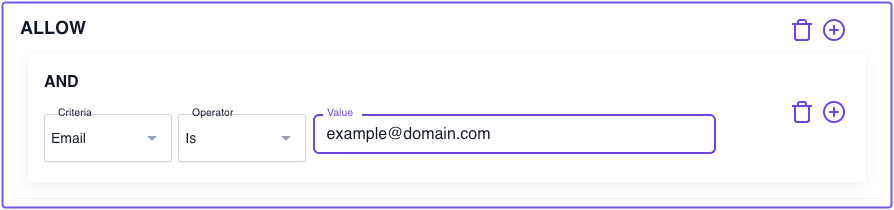
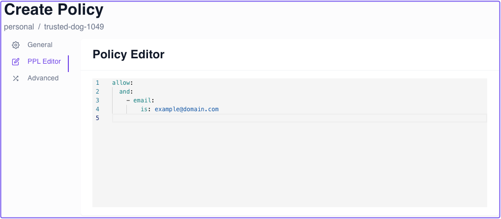
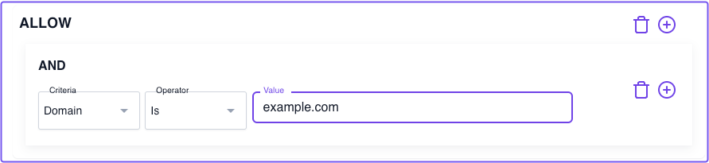

# Zero Fundamentals: Build Policies

<iframe
  width="100%"
  height="500"
  src="https://www.youtube.com/embed/lRpkd20psbk"
  frameborder="0"
  webkitallowfullscreen="true"
  mozallowfullscreen="true"
  allowfullscreen="true"></iframe>

This guide shows you how to build **Authorization Policies** in Pomerium Zero. Watch the Policies video below for a high-level walkthrough of how to build policies in the Zero PPL builder, or read the guide for more in-depth instructions and examples.

:::note Before you start

Make sure you've completed the following guides:

- [**Quickstart**](/docs/get-started/quickstart)
- [**Build Routes**](/docs/get-started/fundamentals/zero/zero-build-routes)

Each guide builds on the same configuration files. In this guide, you'll build a simple policy to protect access to your route.

:::

## What is an Authorization Policy?

An **Authorization Policy** defines what resources a user (or group of users) can access within a cluster. It’s the logic that tells Pomerium, “this HR employee isn’t authorized to access the engineering staging app.”

As you might imagine, managing policies can get complicated as you add more members to your organization, or as you add more routes to your cluster.

To ease you into building policies with Pomerium, you should first learn about **Pomerium Policy Language** (PPL).

After that, you’ll check out some PPL examples and write your own policies for your routes.

Let’s get started!

### What is Pomerium Policy Language (PPL)?

PPL is a proprietary, YAML-based declarative language that enables you to create fine-grained, secure, and performant policies to protect your services.

PPL is designed to be intuitive and simple. See the [**Policy Language**](/docs/capabilities/ppl) page for examples and in-depth explanations of the following core concepts in PPL:

- **Rules**
- **Actions**
- **Logical Operators**
- **Criteria**
- **Matchers**

We will cover each of these concepts in the examples below.

### PPL examples

Now that you’ve had a chance to learn about PPL, let’s jump into some simple examples:

**Example 1**: Allow access if the user's email address matches the `email` criterion value

This example instructs Pomerium to only grant a user access if their email address matches the one defined it the **Value** field.

    

Let's quickly review this example as it would look in a YAML configuration file:

```yaml
policy: # Policy object starts here
  allow: # At least one action
    and: # Logical operator
      - email: # Criterion
        is: example@domain.com # Value
```

:::tip

You can view a policy formatted in YAML using the **PPL Editor** tab:



:::

**Example 2**: Allow access based on the domain criterion

Requiring an exact email address is one way to secure an app, but it won't let anyone else in without that specific email address. This obviously won't scale for an organization where multiple members may require access to the same service.

Instead of specifying the entire email address, you can write a policy that allows access if a user has the required `domain` in their email address (the part after `@`).

The example below instructs Pomerium to only grant a user access if their email address matches the **domain** criterion’s value.

    

Again, the domain criterion checks for the domain portion of the user’s email address. Using the example above:

- If your email is `bob@gmail.com`, Pomerium will deny you access
- If your email is `bob@example.com`, Pomerium will grant you access

**Example 3**: TODO - Currently, `user` criterion isn't an option in Zero. Wait until Custom IdP is implemented to use "Groups" claim

Now that we’ve covered some examples, it’s time to attach a policy to a route.

## Build a policy

By now, your Pomerium Zero cluster should have routes for the following services:

- Verify
- SSH
- Grafana

Currently, these routes secure access with the `Allow <user>@pomerium.com ` setting.

That’s a great setting to test a route with, but we want to secure these routes with policies now.

**Learning Opportunity**:

In the last section, one of the example policies you built grants access to users with a matching domain name in their email address. This is a great policy to start with for organizations of any size because you can immediately limit access to users within your organization.

**Your task**:

1. Create a policy in the Zero PPL builder that grants access to users with a matching domain in their email address.
1. Once you've created the policy, attach it to the Grafana or Verify routes and test it out

If you built your policy correctly, Pomerium should only grant you access if you have the matching domain name in your email address.

## Up Next: Identify verification and Single Sign-on

Next, you'll learn how to secure your upstream service by verifying the user's identity with a JWT. This adds another layer of security to your application.

Go to [**Single Sign-on**](/docs/get-started/fundamentals/zero/zero-single-sign-on).
