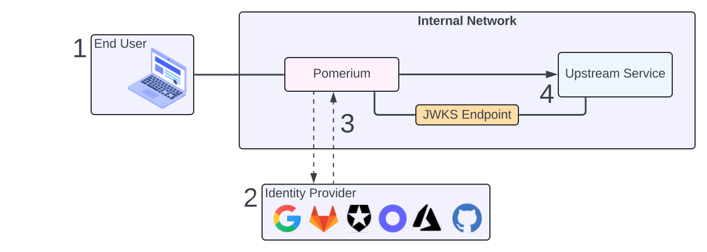
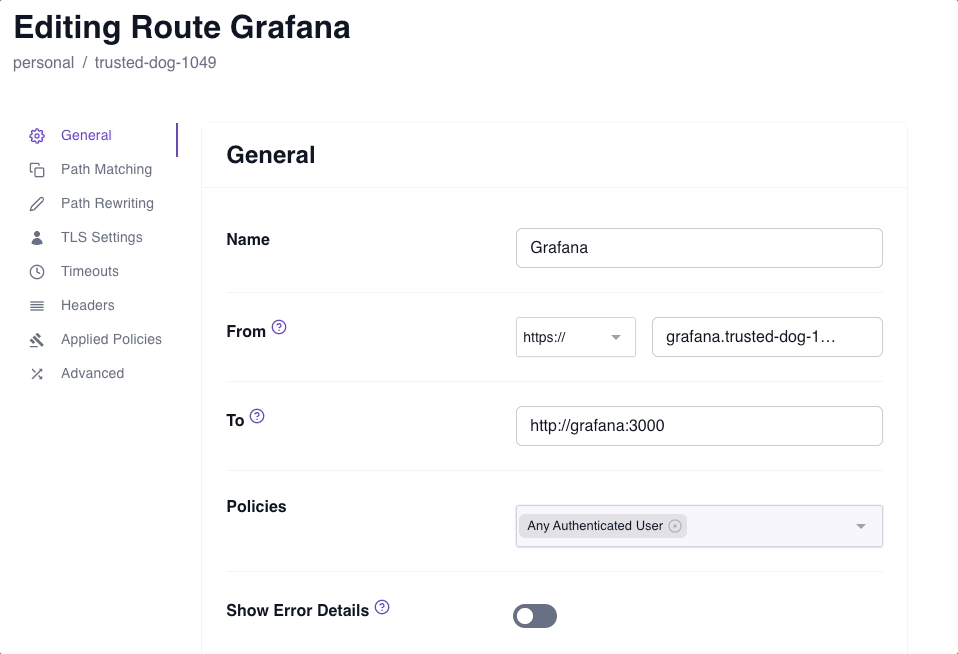
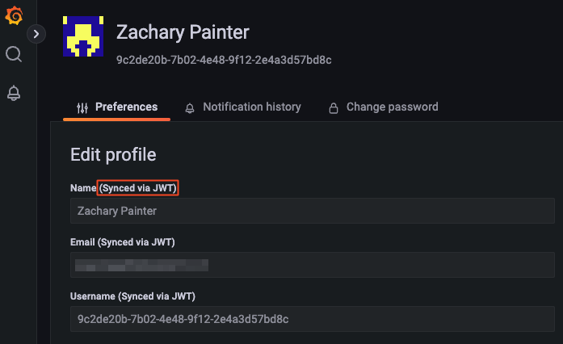

---
# cSpell:ignore webkitallowfullscreen, mozallowfullscreen

id: zero-single-sign-on
title: Single Sign On
sidebar_label: 3. Single Sign-on with JWTs
sidebar_position: 3
---

# Zero Fundamentals: Single Sign-on with JWTs

<iframe
  src="https://www.youtube.com/embed/kpTcbu5s-xU"
  frameborder="0"
  width="100%"
  height="500"
  webkitallowfullscreen
  mozallowfullscreen
  allowfullscreen></iframe>

This guide shows you how to set up Pomerium to achieve single sign-on (SSO). You'll configure Pomerium to forward JWTs as identity headers to an upstream service called Grafana. You'll configure Grafana to support JWT authentication.

Watch the video for a quick walkthrough or read the guide below for step-by-step instructions.

:::note **Before you start**

Make sure you've completed the following guides:

- [**Build Routes**](/docs/get-started/fundamentals/zero/zero-build-routes)
- [**Build Policies**](/docs/get-started/fundamentals/zero/zero-build-policies)

Each guide builds on the same configuration files. In this guide, you'll add JWT settings to your Grafana instance.

:::

## What is a JWT?

If you’re unfamiliar with JWTs, here’s a quick definition sourced from [JWT.io](https://jwt.io/):

> JSON Web Tokens are an open, industry standard [RFC 7519](https://tools.ietf.org/html/rfc7519) method for representing **claims** securely between two parties.

The claims within a JWT represent data encoded into a JSON object, known as the **Payload**. Because JWTs can be cryptographically signed and verified with public and private key pairs, they are often used for authentication and authorization in applications.

When JWTs are used for authentication and authorization, they often contain claims with identifying user data, like the user's email address, full name, and username. However, claims also contain other standard data, known as [Registered Claim Names](https://www.iana.org/assignments/jwt/jwt.xhtml).

For example:

```json title="JSON Payload Example"
{
  "aud": "verify.trusted-dog-1049.pomerium.app",
  "email": "user@example.com",
  "exp": 1713474536,
  "groups": [],
  "iat": 1713474228,
  "iss": "verify.trusted-dog-1049.pomerium.app",
  "jti": "9d1da135-223a-4f6c-8524-cfb1e4fe0452",
  "name": "John Doe",
  "sid": "9d1da135-223a-4f6c-8524-cfb1e4fe0452",
  "sub": "9c2de20b-7b02-4e48-9f12-2e4a3d57bd8c",
  "user": "9c2de20b-7b02-4e48-9f12-2e4a3d57bd8c"
}
```

## How SSO works with Pomerium

Providing identity verification on the application level as a core capability typically falls outside of the realm of support for most reverse proxies.

With Pomerium, the ability to mint, sign, and forward a JWT as an HTTP request header is native to the product – and, it's as simple as making one configuration change in the Zero Console.

Now, let's see how SSO with JWTs works with Pomerium:



1. End-user accesses the upstream service

1. Pomerium authenticates the end-user against an identity provider and creates a Pomerium JWT

1. Pomerium authorizes the user, then signs and forwards the JWT Assertion Header to the upstream service

1. Upstream service fetches the public key from the JWKS endpoint, validates the signature, and grants the end-user access

In this way, the upstream application is secured on the protocol layer with an encrypted TLS connection, and on the application layer with JWT authentication. The user is also subject to the rules of the authorization policy.

Now, let's configure Pomerium to forward the JWT.

## Configure SSO

### Apply Pass Identity Headers

In **Routes**:

1. Select your Grafana route
1. Select the **Headers** tab
1. Apply the **Pass Identity Headers** setting

   

:::info

The [**Pass Identity Headers**](/docs/reference/routes/pass-identity-headers-per-route) setting instructs Pomerium to forward the signed `x-pomerium-jwt-assertion` HTTP header to the upstream application.

:::

### Add Grafana JWT settings

In your Docker Compose file, add the following environment variables to your Grafana service:

```yaml title="docker-compose.yaml" {8-15} showLineNumbers
grafana:
  image: grafana/grafana:latest
  ports:
    - 3000:3000
  networks:
    main: {}
  environment:
    - GF_AUTH_SIGNOUT_REDIRECT_URL=https://grafana.<CLUSTER_SUBDOMAIN>.pomerium.app/.pomerium/sign_out
    - GF_AUTH_JWT_ENABLED=true
    - GF_AUTH_JWT_HEADER_NAME=X-Pomerium-Jwt-Assertion
    - GF_AUTH_JWT_EMAIL_CLAIM=email
    - GF_AUTH_JWT_USERNAME_CLAIM=sub
    - GF_AUTH_JWT_JWK_SET_URL=https://authenticate.<CLUSTER_SUBDOMAIN>.pomerium.app/.well-known/pomerium/jwks.json
    - GF_AUTH_JWT_CACHE_TTL=60m
    - GF_AUTH_JWT_AUTO_SIGN_UP=true
  volumes:
    - ./grafana-storage:/var/lib/grafana
```

> See Grafana's [Configure JWT authentication](https://grafana.com/docs/grafana/latest/setup-grafana/configure-security/configure-authentication/jwt/) docs for more information about these settings.

:::note

In lines `8` and `13`, replace `CLUSTER_SUBDOMAIN` with your cluster subdomain.

For example, if your starter domain is `curious-cat-9999.pomerium.app`, your cluster subdomain would be `curious-cat-9999`.

:::

You also need to add another alias for the Pomerium Authenticate service:

```yaml title="docker-compose"
  pomerium:
    image: pomerium/pomerium:latest
    ports:
      - 443:443
    restart: always
    environment:
      POMERIUM_ZERO_TOKEN: <CLUSTER_TOKEN>
      XDG_CACHE_HOME: /var/cache
    volumes:
      - pomerium-cache:/var/cache
    networks:
      main:
        aliases:
        - verify.<CLUSTER_SUBDOMAIN>.pomerium.app
        // highlight-start
        - authenticate.<CLUSTER_SUBDOMAIN>.pomerium.app
        // highlight-end
```

Adding the alias to your `pomerium` service makes it possible for the Grafana and Pomerium containers to communicate over the Docker network. Without it, Grafana won't be able to reach the public JWKS endpoint.

## Test the connection

Now, run your containers:

```bash
docker compose up
```

Access your Grafana route. You'll notice it signs you in without prompting you to enter a username or password.



:::info JWTs and SDKs

Read the following documentation to learn more about identity verification in Pomerium:

- [**Identity verification**](/docs/capabilities/getting-users-identity)
- [**Manually verifying the JWT**](/docs/capabilities/getting-users-identity#manual-verification)

We also provide SDKs for JWT verification in the following languages:

- [**Go**](https://github.com/pomerium/sdk-go)
- [**Node.js and Express**](https://github.com/pomerium/js-sdk/tree/main/examples/express)
- [**JavaScript**](https://github.com/pomerium/js-sdk)

:::

## Up Next: Build Advanced Policies

Great job! You successfully configured SSO in Pomerium. Next, you'll learn how to build more advanced policies.

Go to [**Build Advanced Policies**](/docs/get-started/fundamentals/zero/zero-advanced-policies).

#### Configuration file state

At this point, your Docker Compose file should look like this:

```yaml title="docker-compose.yaml"
services:
  pomerium:
    image: pomerium.com/pomerium/pomerium:latest
    ports:
      - 443:443
    restart: always
    environment:
      POMERIUM_ZERO_TOKEN: <CLUSTER_TOKEN>
      XDG_CACHE_HOME: /var/cache
    volumes:
      - pomerium-cache:/var/cache
    networks:
      main:
        aliases:
          - verify.<CLUSTER_SUBDOMAIN>.pomerium.app
          - authenticate.<CLUSTER_SUBDOMAIN>.pomerium.app
  verify:
    image: pomerium.com/pomerium/verify:latest
    networks:
      main:
        aliases:
          - verify
  grafana:
    image: grafana/grafana:latest
    ports:
      - 3000:3000
    networks:
      main: {}
    environment:
      - GF_AUTH_SIGNOUT_REDIRECT_URL=https://grafana.<CLUSTER_SUBDOMAIN>.pomerium.app/.pomerium/sign_out
      - GF_AUTH_JWT_ENABLED=true
      - GF_AUTH_JWT_HEADER_NAME=X-Pomerium-Jwt-Assertion
      - GF_AUTH_JWT_EMAIL_CLAIM=email
      - GF_AUTH_JWT_USERNAME_CLAIM=sub
      - GF_AUTH_JWT_JWK_SET_URL=https://authenticate.<CLUSTER_SUBDOMAIN>.pomerium.app/.well-known/pomerium/jwks.json
      - GF_AUTH_JWT_CACHE_TTL=60m
      - GF_AUTH_JWT_AUTO_SIGN_UP=true
    volumes:
      - ./grafana-storage:/var/lib/grafana

networks:
  main: {}

volumes:
  pomerium-cache:
```
