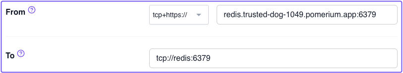
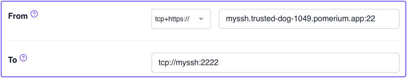

---
# cSpell:ignore myssh, linuxkit, aarch, epoll, atomicvar,

id: zero-tcp-routes
title: TCP Routes
sidebar_label: 6. TCP Routes
sidebar_position: 6
---

# Zero Fundamentals: Secure TCP and SSH Connections

Now that you’ve built several routes, you'll learn how to proxy TCP and SSH connections with Pomerium Zero.

:::note **Before You Start**

Make sure you’ve completed the following tutorials:

- [**Build a Simple Route**](/docs/courses/fundamentals/zero/zero-build-routes)
- [**Build a Simple Policy**](/docs/courses/fundamentals/zero/zero-build-policies)
- [**Single Sign-on with JWTs**](/docs/courses/fundamentals/zero/zero-single-sign-on)
- [**Build Advanced Policies**](/docs/courses/fundamentals/zero/zero-advanced-policies)
- [**Build Advanced Routes**](/docs/courses/fundamentals/zero/zero-advanced-routes)

Each tutorial builds on the same configuration files. In this guide, you'll proxy TCP connections to a Redis database and a remote OpenSSH server.

:::

## Background

When replacing a traditional VPN, there are often non-HTTP based applications you still need to reach. Pomerium can provide the same type of protection to these services with [Pomerium CLI](/docs/clients/pomerium-cli), a client-side application to proxy TCP connections.

In this guide, you'll proxy TCP connections to a Redis database and an OpenSSH server.

Pomerium’s CLI client comes with a `tcp` command that you can use to secure these connections.

## Prerequisites

To complete this guide, you need:

- [Pomerium CLI](/docs/clients/pomerium-cli) to proxy TCP connections between end-users and services behind Pomerium

:::note

This guide assumes you've installed the Pomerium CLI client to your system.

:::

## Test Pomerium CLI installation

Test the installation:

```shell-session
$ pomerium-cli
Usage:
  pomerium-cli [command]

Available Commands:
  cache       commands for working with the cache
  completion  Generate the autocompletion script for the specified shell
  help        Help about any command
  k8s         commands for the kubernetes credential plugin
  tcp         creates a TCP tunnel through Pomerium
  version     version

Flags:
  -h, --help      help for pomerium-cli
  -v, --version   version for pomerium-cli

Use "pomerium-cli [command] --help" for more information about a command.
```

## Add Redis and OpenSSH services

Add the Redis and OpenSSH server configurations to your Docker Compose file:

```yaml
redis:
  image: redis:latest
  networks:
    main: {}
  expose:
    - 6379

myssh:
  image: linuxserver/openssh-server:latest
  networks:
    main: {}
  expose:
    - 2222
  environment:
    PASSWORD_ACCESS: 'true'
    USER_PASSWORD: supersecret
    USER_NAME: user
```

## Add routes in Pomerium Zero

Create a Redis route:

1. Create a new route for your Redis database
1. In **From**, select **tcp+https://** in the protocol dropdown menu
1. Enter your external route and append `:6379` to it
   1. For example, `redis.super-hero-7645.pomerium.app:6379`
1. In **To**, enter `tcp://redis:6379`
1. In **Policies**, select `Any Authenticated User`

   

Create an OpenSSH route:

1. Create a new route for the OpenSSH server
1. In **From**, select **tcp+https://** in the protocol dropdown menu
1. Enter your external route and append `:22` to it
   1. For example, `myssh.super-hero-7645.pomerium.app:22`
1. In **To**, enter `tcp://myssh:2222`

   

Save your changes and apply them.

## Connect to Redis

In a terminal, run the following command:

```shell-session
$ pomerium-cli tcp redis.<CLUSTER_SUBDOMAIN>.pomerium.app:6379 --listen localhost:6379
```

In a separate terminal window, run the `redis-cli info` command. If set up correctly, this action will prompt Pomerium to authenticate you in your browser, which will establish a TCP connection.

You should see a similar output in your terminal:

```bash
$  redis-cli info
# Server
redis_version:7.0.5
redis_git_sha1:00000000
redis_git_dirty:0
redis_build_id:d9291579292e26e3
redis_mode:standalone
os:Linux 6.3.13-linuxkit aarch64
arch_bits:64
monotonic_clock:POSIX clock_gettime
multiplexing_api:epoll
atomicvar_api:c11-builtin
gcc_version:10.2.1
process_id:1
process_supervised:no
run_id:bc1b8bcd39f1e51d615f5739158e6ae964f7e724
tcp_port:6379
server_time_usec:1713989553900448
uptime_in_seconds:64
uptime_in_days:0
hz:10
configured_hz:10
lru_clock:2713521
executable:/data/redis-server
config_file:
io_threads_active:0
```

We truncated the Redis response above for the sake of brevity, but it demonstrates that you successfully proxied a TCP connection to the Redis service.

## Connect to SSH server

In a terminal, run the following command:

```shell-session
$ pomerium-cli tcp myssh.<CLUSTER_SUBDOMAIN>.pomerium.app:22 --listen :2222
```

In a separate terminal window, run:

```bash
ssh user@localhost -p 2222
```

If set up correctly, Pomerium will open your browser to authenticate you. This will establish a TCP connection.

The SSH server will request a password, which you can find in the Docker Compose file:

- **USER_PASSWORD:** supersecret
- **USER_NAME:** user

After authenticating, you should see a greeting from OpenSSH, like:

```shell-session
$ user@myssh.<CLUSTER_SUBDOMAIN>.pomerium.app's password:
Welcome to OpenSSH Server

f157ed9f7a38:~$
```

Awesome! You successfully configured two services that take advantage of Pomerium's TCP capabilities to proxy requests.

## Next Steps:

- Add your own [**Custom Identity Provider**](/docs/courses/fundamentals/zero/zero-custom-idp)
