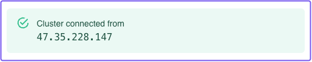
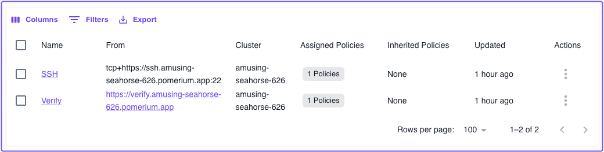
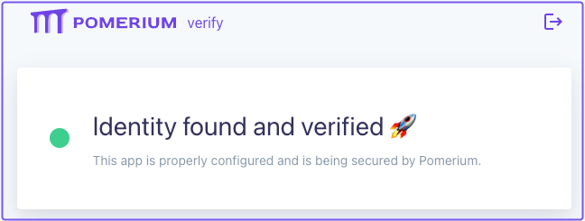
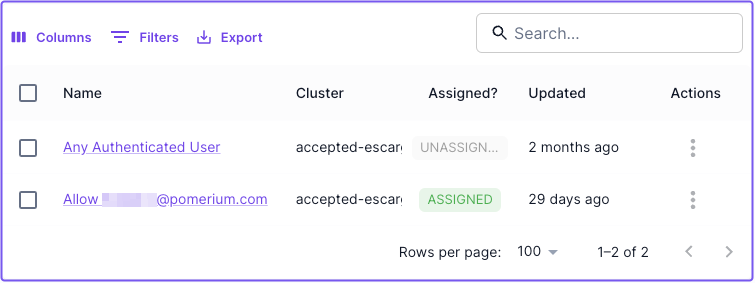
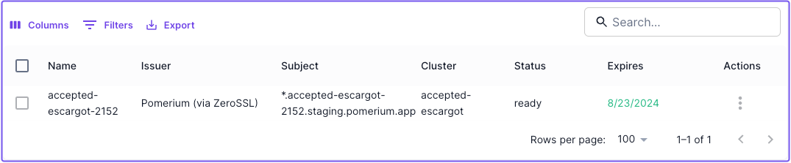

import Tabs from '@theme/Tabs';
import TabItem from '@theme/TabItem';

# Pomerium Quickstart

Get started with Pomerium using either our cloud-hosted Zero solution or self-hosted Core.

<Tabs queryString="type">
<TabItem value="zero" label="Pomerium Zero" default>

Pomerium Zero is our cloud-hosted solution that simplifies deployment and management.

## Before you start

- Install [Docker](https://docs.docker.com/install/) and [Docker Compose](https://docs.docker.com/compose/install/)
- Create a (free) [**Pomerium Zero account**](https://console.pomerium.app/create-account)

## Get Pomerium Zero configuration

After you create an account, you'll be directed to the Zero onboarding screen. In the onboarding screen, select the **Docker** tab and copy the Docker Compose configuration.

:::note Import an existing Pomerium Core configuration

If you are using Pomerium Zero for the first time, but have an existing Pomerium Core configuration, you can import it into Pomerium Zero by following the prompts in the Zero onboarding flow.

See [**Import Core Config to Zero**](/docs/deploy/cloud/import#how-to-import-your-core-configuration) for more information.

:::

(If you selected **Finish** before copying the Docker configuration, we've provided a copy below.)

Paste the configuration in a `compose.yaml` file:

```yaml title="compose.yaml" {8,15} showLineNumbers
services:
  pomerium:
    image: pomerium/pomerium:latest
    ports:
      - 443:443
    restart: always
    environment:
      POMERIUM_ZERO_TOKEN: <CLUSTER_TOKEN>
      XDG_CACHE_HOME: /var/cache
    volumes:
      - pomerium-cache:/var/cache
    networks:
      main:
        aliases:
          - verify.<CLUSTER_STARTER_SUBDOMAIN>.pomerium.app
  verify:
    image: pomerium/verify:latest
    networks:
      main:
        aliases:
          - verify

networks:
  main: {}

volumes:
  pomerium-cache:
```

Replace the following values:

- **Line 8**: Replace `CLUSTER_TOKEN` with the cluster token generated for you in the onboarding config
- **Line 15**: Replace `CLUSTER_STARTER_SUBDOMAIN` with your generated starter subdomain

:::info Where's my **Starter Domain?**

You can find your **Starter Domain** at the top of the Zero Console navigation bar:


:::

## Connect to Pomerium Zero

Next, deploy Pomerium with the following command:

```bash
docker compose up -d
```

Pomerium will deploy and run in a special "Zero-managed" mode. In Zero-managed mode, Pomerium connects to the Pomerium Zero cloud service, a remote control plane where you can manage your deployments and configuration.

If your Pomerium deployment connects to the cloud successfully, Pomerium Zero will notify you in the onboarding screen:



Once you've connected, select **Finish**. You'll be directed to the Zero Console.

:::tip Troubleshoot connection issues

If you can't connect to Pomerium Zero, check out these pages for help:

- [**Configure port 443 to allow inbound access**](/docs/internals/troubleshooting#configure-port-443-to-allow-inbound-access)
- [**Override IP address**](/docs/internals/clusters#detected-and-override-ip-address)

:::

## Connect to upstream services

In the Zero Console, we've provisioned two starter routes, **SSH** and **Verify**, that come with their own DNS records and TLS certificates:



### Connect to Verify

The first service you'll access is the **Verify** app. This hosted demo app is designed to verify a user's identity, but it also serves as a way to validate that Pomerium is up and running as expected.

In the Zero Console, select the **From** URL for the Verify app.

You should land on the Verify page:



:::info Build your own route

Check out [**Pomerium Fundamentals: Build Routes**](/docs/get-started/fundamentals/zero/zero-build-routes) to learn how to create a route to your own service behind Pomerium.

:::

### Connect to SSH

The demo SSH route connects to a remote server that you can use to test SSH connections in Pomerium Zero. This example uses **tunneled SSH**. For production deployments, consider [**Native SSH Access**](/docs/capabilities/native-ssh-access) which provides OAuth authentication with ephemeral certificates.

:::note Install Pomerium CLI

You need the Pomerium CLI client to connect to services like **SSH** over a TCP connection. See the [**Pomerium CLI**](/docs/deploy/clients) page for installation instructions.

:::

In a terminal, enter the following command and replace `CLUSTER_STARTER_DOMAIN` with your own:

```bash
pomerium-cli tcp ssh.<CLUSTER_STARTER_DOMAIN>.app:22
```

Initiate the SSH connection:

```bash
ssh ssh-demo.pomerium.com -p 22
```

A successful request results in a response similar to the one below:

```bash
Warning: Permanently added 'ssh-demo.pomerium.com' (ED25519) to the list of known hosts.
This is an SSH honeypot. Everything is logged and monitored.
```

## Review starter policy and certificates

Select the **Policies** tab. In the policies table, you'll notice a default policy that only grants access if the user's email matches the one associated with your Pomerium Zero account:



:::info Update policy

This **Starter Policy** is assigned to both of the demo routes. You can remove this policy and create your own at any time.

- Go to the [**PPL page**](/docs/internals/ppl) to learn about Pomerium Policy Language
- Go to [**Build Policies**](/docs/get-started/fundamentals/zero/zero-build-policies) to learn how to create and assign policies using the Zero PPL builder

:::

Pomerium automatically provisions and manages TLS certificates issued by ZeroSSL to secure the starter routes in your cluster, and any routes you may build that use your cluster's starter domain.

To see certificates in your cluster, go to the **Certificates** tab:



## Next Steps

- [Build your First Route](/docs/get-started/fundamentals/zero/zero-build-routes)
- [Add a Custom Domain](/docs/capabilities/custom-domains)

</TabItem>
<TabItem value="core" label="Pomerium Core">

Pomerium Core is our open-source, self-hosted identity-aware reverse proxy.

:::tip Just want to try Pomerium as quickly as possible?

With Pomerium Core, you're assembling the pieces yourself. This quickstart assumes you have a publicly accessible domain with DNS you control.

If you don't have those prerequisites ready, **[Pomerium Zero](https://console.pomerium.app/create-account)** provides a managed experience with automatic certificates and DNS. You can always migrate to self-hosted Core later.

:::

## Before you start

- A **publicly accessible server** with ports 443 and 80 available
- A **domain** with DNS pointing to your server (e.g., `*.pomerium.yourdomain.com`)
- [Docker](https://docs.docker.com/install/) and [Docker Compose](https://docs.docker.com/compose/install/) installed

:::note Other deployment methods

This quickstart uses Docker, but Pomerium Core also supports [binaries, OS packages, and building from source](/docs/deploy/core).

:::

## Set up your project

Create a new directory for your Pomerium setup:

```bash
mkdir pomerium_quickstart
cd pomerium_quickstart
```

Your project will contain:

- `config.yaml` - Pomerium configuration
- `docker-compose.yaml` - Docker services configuration

## Configure Pomerium Core

Create a `config.yaml` file with your Pomerium configuration:

```yaml title="config.yaml"
# Pomerium will automatically obtain certificates from Let's Encrypt
autocert: true

# Routes
routes:
  - from: https://verify.pomerium.yourdomain.com
    to: http://verify:8000
    pass_identity_headers: true
    policy:
      - allow:
          or:
            - email:
                is: user@example.com
```

Replace:

- `yourdomain.com` with your domain
- `user@example.com` with your email address

## Create Docker Compose configuration

Create a `docker-compose.yaml` file:

```yaml title="docker-compose.yaml"
services:
  pomerium:
    image: pomerium/pomerium:latest
    volumes:
      - ./config.yaml:/pomerium/config.yaml:ro
      - pomerium-certs:/data/autocert
    ports:
      - '443:443'
      - '80:80'

  verify:
    image: pomerium/verify:latest

volumes:
  pomerium-certs:
```

The `pomerium-certs` volume stores Let's Encrypt certificates so they persist across container restarts.

## Deploy Pomerium Core

Start your Pomerium deployment:

```bash
docker compose up -d
```

## Test your setup

1. Navigate to `https://verify.pomerium.yourdomain.com` (using your actual domain).
2. You'll be prompted to sign in with the Pomerium [hosted authenticate service](/docs/capabilities/authentication#hosted-authenticate-service).
3. After authentication, you should see the Pomerium Verify page displaying your identity details.

## Next Steps

- [Learn Core Fundamentals](/docs/get-started/fundamentals/core/get-started)
- [Configure Advanced Policies](/docs/get-started/fundamentals/core/build-policies)

</TabItem>
</Tabs>
