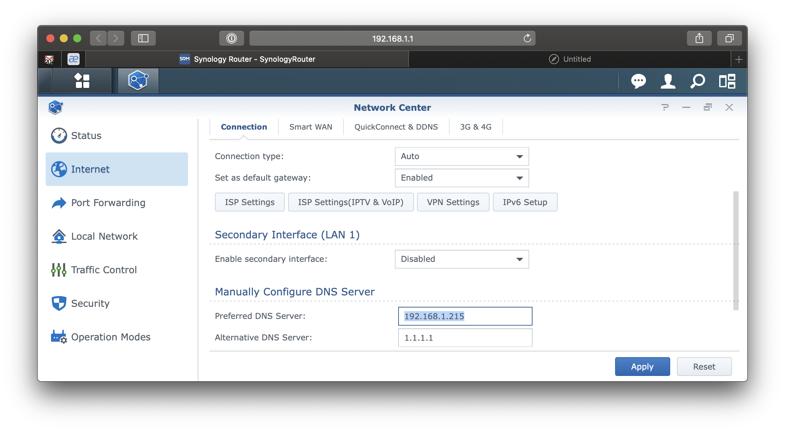
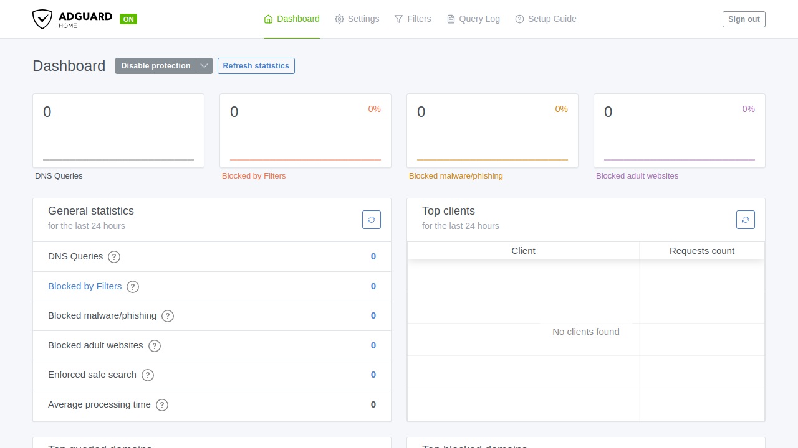

import TabItem from '@theme/TabItem';
import Tabs from '@theme/Tabs';

import Config from '/content/examples/guides/ad-guard/config.yaml.md';
import Compose from '/content/examples/guides/ad-guard/docker-compose.yaml.md';

# Secure AdGuard Home with Pomerium

## What this guide does

[AdGuard Home](https://adguard.com/en/adguard-home/overview.html) is a network-wide DNS server that blocks ads and trackers, much like [Pi-hole](https://pi-hole.net). Its web dashboard has no single sign-on and no user directory: the only access control it offers is a single set of [HTTP basic-auth](https://en.wikipedia.org/wiki/Basic_access_authentication) credentials.

You'll put AdGuard behind Pomerium so that Pomerium handles single sign-on and per-route authorization, then injects AdGuard's basic-auth credential on every upstream request. AdGuard auto-authenticates from that header, so your users sign in once through Pomerium and never see AdGuard's own login prompt.

## When to use this guide

Use it when you want one front door for AdGuard with your existing identity, instead of sharing a single basic-auth password with everyone who needs the dashboard. This is the general pattern for any app whose only built-in auth is a static credential: Pomerium does the real authentication, then forwards the shared secret so the upstream stays happy.

## Prerequisites

This guide assumes you've completed the [Quickstart](/docs/get-started/quickstart), so you already have Pomerium running and signing users in through the hosted authenticate service.

You also need:

- [Docker](https://docs.docker.com/install/) and [Docker Compose](https://docs.docker.com/compose/install/)
- A domain you control for the AdGuard route (this guide uses `adguard.yourdomain.com`)

:::tip Prefer to self-host the identity provider?

This guide uses the hosted authenticate service so you don't have to run an IdP. To run your own instead, follow [Keycloak + Pomerium](/docs/integrations/user-identity/oidc) and swap the `authenticate_service_url` / `idp_*` settings into the config below.

:::

## Configure Pomerium

The key piece is `set_request_headers`. AdGuard expects an `Authorization: Basic <base64>` header; Pomerium adds it to every request after the user authenticates. Without it, AdGuard would prompt for its own basic-auth login on each visit. Choose the AdGuard admin password now (you'll set the same one in AdGuard's install wizard below), then generate the value from that admin user and password:

```bash
printf 'admin:YOUR_ADGUARD_PASSWORD' | base64
```

<Tabs queryString="type">
<TabItem value="zero" label="Pomerium Zero" default>

In the [Zero Console](https://console.pomerium.app):

1. Create a **Route**. In **From**, enter `https://adguard.<your-starter-domain>`; in **To**, enter `http://adguard:3000`.
2. Set the policy to **Any Authenticated User** (or scope it to a group).
3. On the **Headers** tab, add a request header `Authorization` with the value `Basic <base64>` from the command above, and enable **Allow WebSockets**.

Zero manages the route's TLS certificate behind your starter domain, so there's nothing else to configure on the Pomerium side.

</TabItem>
<TabItem value="core" label="Pomerium Core">

Create a `config.yaml`. It routes `adguard.yourdomain.com` to the AdGuard container and injects the basic-auth header on every upstream request.

<Config />

Replace `adguard.yourdomain.com` with your domain, `you@example.com` with your email, and the `Authorization` value with the base64 string from the command above.

</TabItem>
</Tabs>

## Configure AdGuard

Run AdGuard once and complete its first-run setup wizard, choosing an admin username and password. This writes an `AdGuardHome.yaml` config (with the password stored as a bcrypt hash) into the mounted `conf` volume, and from then on AdGuard enforces basic auth on its web interface and control API.

The username and password you pick here are exactly the credentials you base64-encode into the Pomerium `Authorization` header above. Keep that pair secret, since anyone who can present it to AdGuard is an administrator.

## Run the stack

The Compose file runs Pomerium Core and AdGuard together. Pomerium publishes ports 80 and 443 for the protected route, and AdGuard publishes only port 53 for DNS; the AdGuard web UI on port 3000 stays on the internal network so it's reachable only through Pomerium. For Zero, drop the `pomerium` service and use the `compose.yaml` from the Quickstart with your `POMERIUM_ZERO_TOKEN`, keeping the `adguard` service below.

<Compose />

Start it:

```bash
docker compose up -d
```

Then set your router (or each device) to use this host as its primary DNS server.



## Verify the setup

1. **The route requires authentication.** In a fresh browser, open `https://adguard.yourdomain.com`. You should be redirected to sign in, not straight into AdGuard.
2. **An allowed user gets in.** Sign in through Pomerium. You land on the AdGuard dashboard.
3. **No second login.** AdGuard never shows its own basic-auth prompt, because Pomerium injected the `Authorization` header for you.



## Common failure modes

- **AdGuard prompts for a basic-auth login after you sign in to Pomerium.** The injected header is missing or wrong. Confirm `set_request_headers` is present on the route and that the base64 value decodes to exactly `admin:password` for a user AdGuard knows.
- **AdGuard returns 401 Unauthorized through Pomerium.** The credential doesn't match. Re-run the install wizard or reset the password, then regenerate the base64 string from the new username and password.
- **AdGuard shows its install wizard instead of the dashboard.** Its config volume was wiped or never persisted. Make sure the `conf` and `work` volumes are mounted so `AdGuardHome.yaml` survives restarts.
- **Redirect loop or certificate errors.** Make sure DNS for `adguard.yourdomain.com` points at Pomerium and that Pomerium can obtain a TLS certificate. On the Core path, `autocert` needs ports 80 and 443 reachable for Let's Encrypt; Zero manages certificates for you.

## Security considerations

AdGuard trusts the basic-auth credential, not the user. Any client that can present that header to AdGuard directly is an administrator, so the whole model depends on Pomerium being the only path to it:

- **Network isolation is the real boundary.** Keep AdGuard off published ports and on an internal-only Docker network shared with Pomerium alone, as the Compose file does. Only Pomerium should reach `adguard:3000`. If AdGuard is reachable on its own port, an attacker who knows (or brute-forces) the basic-auth password bypasses Pomerium entirely. A request that reaches AdGuard without the injected credential is rejected with a `401`, but that only helps if AdGuard cannot be reached at all except through Pomerium.
- **The basic-auth secret lives in Pomerium's config.** Treat `config.yaml` (or the Zero route's header value) as a secret, since it carries the AdGuard admin credential. Anyone who can read it gets admin access to AdGuard.
- **Scope the route policy** (group or domain) to who should administer AdGuard. Every user your policy allows is signed in as that one shared AdGuard admin.

## Next steps

- [Build policies](/docs/get-started/fundamentals/zero/zero-build-policies)
- [Set request headers](/docs/reference/routes/headers#set-request-headers)
- [Custom domains](/docs/capabilities/custom-domains)
