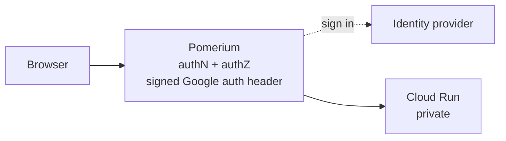

---
# cSpell:ignore serverless
title: Secure Cloud Run with Pomerium
sidebar_label: Cloud Run
lang: en-US
keywords:
  [
    pomerium,
    cloud run,
    cloudrun,
    gcp,
    google,
    iap,
    serverless,
    sso,
    oidc,
    identity aware proxy,
  ]
description: Put Pomerium in front of a Cloud Run service as a standard upstream route, with signed authorization headers for GCP serverless authentication.
---

# Secure Cloud Run with Pomerium

Protect an existing [Cloud Run](https://cloud.google.com/run) service by putting a standard Pomerium route in front of it. A Cloud Run service is just an HTTPS endpoint, so you secure it like any other upstream: point a route's `to` at the service URL and let Pomerium handle login and authorization. Where you can, keep the service private and let Pomerium send the signed Google authorization header Cloud Run expects.



## Prerequisites

- A running Pomerium cluster. See the [quickstart](/docs/get-started/quickstart) if you do not have one yet.
- A deployed Cloud Run service. Note its `*.run.app` URL, which is the address Google assigns to the service.
- `gcloud` or IAM access to grant `roles/run.invoker` on that service.

## Recommended: lock the service to Pomerium with serverless authentication

The most robust option is to keep the Cloud Run service private and have Pomerium send a signed Google [authorization header](https://cloud.google.com/run/docs/authenticating/service-to-service) on each request. Keep `roles/run.invoker` off `allUsers`, grant it to the service account Pomerium runs as, then enable serverless authentication on the route:

```yaml
routes:
  - from: https://hello.your-domain.example
    to: https://hello-abcdef-uc.a.run.app
    enable_google_cloud_serverless_authentication: true
    policy:
      - allow:
          and:
            - domain:
                is: your-company.example
```

The `from` value is the hostname users visit; the `to` value is the Cloud Run service's `*.run.app` URL. With the service private, only Pomerium's service account can invoke it, so requests cannot bypass Pomerium's policy.

When Pomerium runs in GCP it picks up the ambient service account credentials automatically. To supply credentials explicitly, set the [Google Cloud Serverless Authentication Service Account](/docs/reference/google-cloud-serverless-authentication-service-account). See the [Enable Google Cloud Serverless Authentication](/docs/reference/routes/enable-google-cloud-serverless-authentication) route reference for details.

This pattern also works for other GCP serverless products that accept the same authorization header, such as Cloud Functions and App Engine.

:::note

`enable_google_cloud_serverless_authentication` is a Core and Enterprise route setting. The Kubernetes Ingress Controller does not support it.

:::

## Alternative: a service that allows unauthenticated invocations

If the Cloud Run service already permits unauthenticated invocations, point a route at it like any other HTTPS upstream:

```yaml
routes:
  - from: https://hello.your-domain.example
    to: https://hello-abcdef-uc.a.run.app
    policy:
      - allow:
          and:
            - domain:
                is: your-company.example
```

See the [`from`](/docs/reference/routes/from) and [`to`](/docs/reference/routes/to) route references for the full set of options.

:::warning

A Cloud Run service open to `allUsers` stays reachable on its public `*.run.app` URL, so anyone who learns that URL can bypass Pomerium's policy entirely. Prefer the serverless authentication approach above, or otherwise ensure the service is only reachable through Pomerium.

:::

## Verify the setup

Browse to your `from` hostname, for example `https://hello.your-domain.example`. You should be sent through your identity provider's login and then land on the Cloud Run service. Requesting the `*.run.app` URL directly should fail when the service is private. To confirm the deny path, sign in as a user your policy excludes and open the `from` hostname. Pomerium should deny access, so no authorization header is signed and the request never reaches Cloud Run.

## Common failure modes

- **`403 Forbidden` from Cloud Run after you sign in through Pomerium.** Pomerium reached the service but Google rejected the call. Confirm the route has `enable_google_cloud_serverless_authentication: true` and that the service account Pomerium runs as holds `roles/run.invoker` on that service. IAM grants can take a few minutes to propagate, so give a fresh grant time before retrying.
- **Direct `*.run.app` requests still succeed.** The service still allows unauthenticated invocations, so the public Cloud Run URL bypasses Pomerium. Remove `run.invoker` from `allUsers` and rely on the serverless authentication route above.
- **`could not find default credentials` or a similar auth error in Pomerium's logs.** Pomerium isn't running on GCP and has no ambient service account. Set the [Google Cloud Serverless Authentication Service Account](/docs/reference/google-cloud-serverless-authentication-service-account) explicitly.

## Security considerations

- **Keep the service private.** The strongest control is removing `run.invoker` from `allUsers` and granting it only to Pomerium's service account, so the `*.run.app` URL cannot be invoked around Pomerium's policy.
- **Grant least privilege.** Give Pomerium's service account only `roles/run.invoker` on the specific services it fronts, not a broader project-wide role.
- **Scope the route policy.** Cloud Run authorizes Pomerium's service account; Pomerium policy decides which signed-in users can use the route.

## Pass identity to your application

If your service is not on GCP, or you want it to read the end user's identity rather than rely on the GCP authorization header, enable [pass identity headers](/docs/reference/routes/pass-identity-headers-per-route) on the route. Pomerium then forwards the authenticated user's identity to the upstream. See [getting the user's identity](/docs/capabilities/getting-users-identity) for how to consume it.

## Next steps

- [Routes reference](/docs/reference/routes/from) for the full route configuration surface.
- [Quickstart](/docs/get-started/quickstart) to stand up Pomerium if you have not already.
- [Getting the user's identity](/docs/capabilities/getting-users-identity) to consume identity in your application.
