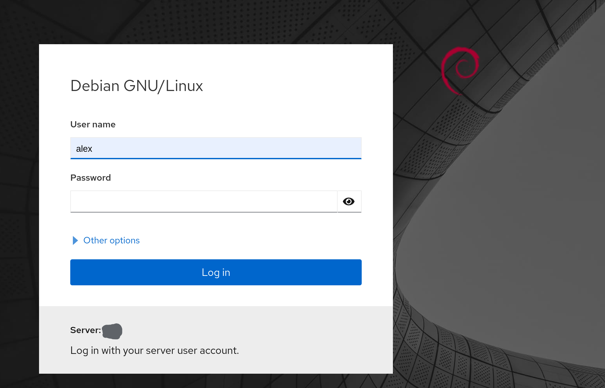

[Cockpit](https://cockpit-project.org/) is "a web-based graphical interface for servers, intended for everyone". It provides a method of managing many administrative server tasks that would normally require command line access.

## Before You Begin

This guide assumes you already have Pomerium installed and connected to your [IdP](/docs/overview/glossary#identity-provider). If not, follow the instructions in the following articles before continuing:

- Install Pomerium
  - [Binaries](/docs/install/binary) if installing Pomerium as a system-level service.
  - [Pomerium using Docker](/docs/install/quickstart) if installing Pomerium as a Docker container
  - [Install Pomerium using Kubernetes](/docs/k8s/quickstart) for Kubernetes environments.
- Connect to an IdP - See [Identity Provider Configuration](/docs/identity-providers) and find the article for your identity provider.

## Install & Configure Cockpit

1. Cockpit provides detailed instructions on installation for many popular Linux distributions. See [Running Cockpit](https://cockpit-project.org/running.html) to find the steps to match your server.

1. Once installed, create or edit `/etc/cockpit/cockpit.conf` to prepare it to accept proxied connections:

   ```ini
   [WebService]
   Origins = https://cockpit.localhost.pomerium.io wss://cockpit.localhost.pomerium.io
   ProtocolHeader = X-Forwarded-Proto
   ```

   - Adjust `cockpit.localhost.pomerium.io` to match the URL Cockpit will be accessible from.

1. Restart the Cockpit service to apply the changes:

   ```bash
   sudo systemctl restart cockpit.service
   ```

## Pomerium Route

1. A Pomerium route for Cockpit can follow the basic [route examples](/docs/reference/routes), but requires websockets to load the dashboard after initial login:

   ```yaml
   - from: https://cockpit.localhost.pomerium.io
     to: http://localhost:9090
     allow_websockets: true
     policy:
       - allow:
           or:
             - email:
                 is: alice@example.com
             - email:
                 is: bob@example.com
   ```

   - This example assumes that Pomerium is running as a system service on the same server as Cockpit. Adust the `to` value to match the path to the Cockpit service if running on another server.
   - Adjust `cockpit.localhost.pomerium.io` to match the URL Cockpit will be accessible from.

1. If Pomerium is running as a system service the route will be updated automatically. Docker may not notify Pomerium of file changes, so the Pomerium container may need to be restarted.

1. Navigate to the new route to confirm access:

   

## Authentication

Cockpit uses PAM authentication by default. The project documentation includes a [Single Sign On](https://cockpit-project.org/guide/latest/sso.html) page that covers authentication to the software using Kerberos. As of this page's last update, there's no known way to provide user authentication from Pomerium using JWT or HTTP Headers.

:::tip

 Prove Us Wrong! Have you configured Cockpit to accept authentication from Pomerium? Let us know on [GitHub](https://github.com/pomerium/pomerium), or post in the [Community Showcase](https://discuss.pomerium.com/c/community-showcase/14) on our forums.

:::

