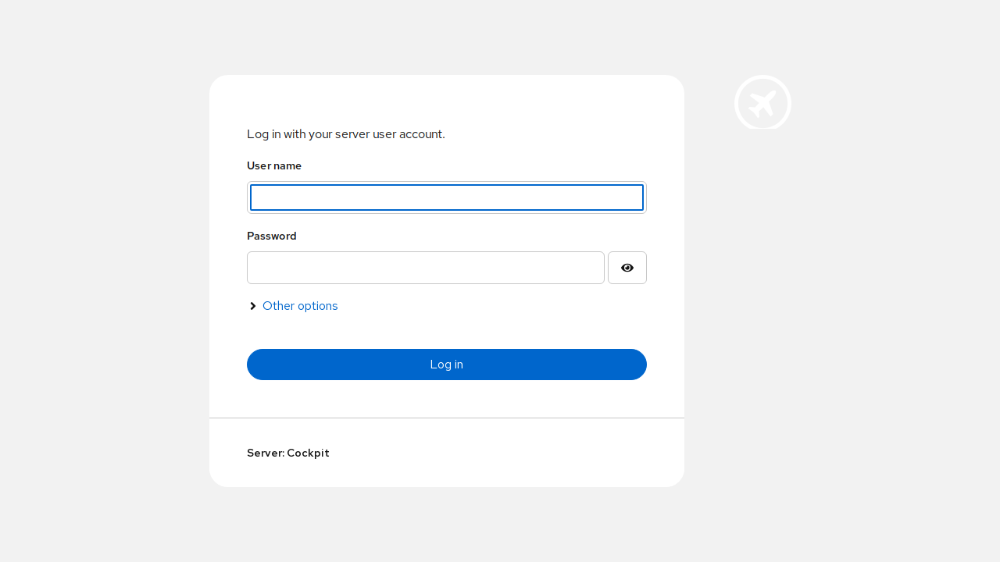

import TabItem from '@theme/TabItem';
import Tabs from '@theme/Tabs';

import Config from '/content/examples/guides/cockpit/config.yaml.md';
import Compose from '/content/examples/guides/cockpit/docker-compose.yaml.md';

# Secure Cockpit with Pomerium

## What this guide does

[Cockpit](https://cockpit-project.org/) is a web-based graphical interface for Linux servers. You'll put it behind Pomerium so that Pomerium handles single sign-on and per-route authorization before any request reaches Cockpit. Cockpit keeps its own login screen, which authenticates you to the host itself (over PAM or SSH), so the result is two layers: Pomerium decides who may reach Cockpit at all, and Cockpit then logs that person into the server.

## When to use this guide

Use it when you want a single front door for Cockpit backed by your existing identity provider, instead of exposing Cockpit's port directly to the network. Pomerium does not replace Cockpit's host login; there's no supported way to hand Cockpit a Pomerium JWT or identity header, so Cockpit still prompts for host credentials. If you only need to reach Cockpit over a private network without browser SSO, a plain [TCP route](/docs/capabilities/non-http) is a better fit.

## Prerequisites

This guide assumes you've completed the [Quickstart](/docs/get-started/quickstart), so you already have Pomerium running and signing users in through the hosted authenticate service.

You also need:

- [Docker](https://docs.docker.com/install/) and [Docker Compose](https://docs.docker.com/compose/install/)
- A domain you control for the Cockpit route (this guide uses `cockpit.yourdomain.com`)

:::tip Prefer to self-host the identity provider?

This guide uses the hosted authenticate service so you don't have to run an identity provider (IdP). To run your own instead, follow [Keycloak + Pomerium](/docs/integrations/user-identity/oidc) and swap the `authenticate_service_url` / `idp_*` settings into the config below.

:::

## Configure Pomerium

<Tabs queryString="type">
<TabItem value="zero" label="Pomerium Zero" default>

In the [Zero Console](https://console.pomerium.app):

1. Create a **Route**. In **From**, enter `https://cockpit.<your-starter-domain>`; in **To**, enter `http://cockpit:9090`.
2. Set the policy to **Any Authenticated User** (or scope it to the group that should manage the server).
3. On the route's settings, enable **Allow WebSockets** so Cockpit's live terminal and metrics work, and enable **Preserve Host Header** so Cockpit sees the public hostname it expects.

</TabItem>
<TabItem value="core" label="Pomerium Core">

Create a `config.yaml`. It routes `cockpit.yourdomain.com` to the Cockpit container, allows the WebSocket upgrade Cockpit needs, and preserves the host header so Cockpit's origin check passes.

<Config />

Replace `cockpit.yourdomain.com` with your domain and `you@example.com` with your email.

</TabItem>
</Tabs>

## Configure Cockpit

Cockpit verifies the `Origin` and `Host` of incoming requests, so it has to be told which public URL it's served from when it sits behind a reverse proxy. Create a `cockpit.conf`:

```ini title="cockpit.conf"
[WebService]
Origins = https://cockpit.yourdomain.com wss://cockpit.yourdomain.com
ProtocolHeader = X-Forwarded-Proto
LoginTitle = Cockpit
```

- `Origins` lists the exact public URLs Pomerium serves Cockpit from. Cockpit rejects WebSocket upgrades whose `Origin` doesn't match, so include both the `https` and `wss` form. Adjust the hostname to match your route.
- `ProtocolHeader = X-Forwarded-Proto` tells Cockpit to trust Pomerium's header for the original scheme, so it knows the request arrived over HTTPS even though Pomerium reaches the container over plain HTTP.

On a Linux host running Cockpit as a system service, this file lives at `/etc/cockpit/cockpit.conf`; edit it and run `sudo systemctl restart cockpit.service`. The Compose file below mounts the same file into the container.

## Run the stack

The Compose file runs Pomerium Core and Cockpit together. Cockpit runs in plain-HTTP "bastion" mode (`--no-tls`) because Pomerium terminates TLS in front of it (for Zero, drop the `pomerium` service and use the `compose.yaml` from the Quickstart with your `POMERIUM_ZERO_TOKEN`, keeping the `cockpit` service below):

<Compose />

Put the `cockpit.conf` from the previous section next to the Compose file, then start it:

```bash
docker compose up -d
```

## Verify the setup

1. **The route requires authentication.** In a fresh browser, open `https://cockpit.yourdomain.com`. You should be redirected to your identity provider to sign in, not straight into Cockpit.
2. **An allowed user reaches Cockpit.** Sign in. Pomerium redirects you back and Cockpit's own login screen loads.

   

3. **Log in to the host.** Enter your server credentials on Cockpit's screen to reach the dashboard. This second step is Cockpit authenticating you to the host, which Pomerium does not replace.

Steps 1 and 2 are the boundary Pomerium owns: it gates the route and hands an authorized request to Cockpit. Cockpit's host login in step 3 is separate, so Pomerium signing you in does not sign you into Cockpit.

## Common failure modes

- **Cockpit shows "Cannot connect" or the page never finishes loading.** The WebSocket upgrade was blocked. Make sure the route has `allow_websockets: true` and that your `cockpit.conf` `Origins` lists the exact public URL (including the `wss://` form).
- **"Received invalid origin" in Cockpit logs.** The `Host` or `Origin` Cockpit saw didn't match `Origins`. Confirm the route uses `preserve_host_header: true` and that the hostname in `Origins` matches your route exactly.
- **Cockpit redirects to HTTPS in a loop.** Cockpit thinks the request was plain HTTP. Set `ProtocolHeader = X-Forwarded-Proto` in `cockpit.conf` so it trusts Pomerium's scheme header, and keep Cockpit itself in `--no-tls` mode.

## Security considerations

- Only Pomerium should reach `cockpit:9090`. Keep Cockpit off published host ports and on the internal Docker network, or bind it to localhost on a bare-metal host. If the port is reachable directly, anyone on the network gets Cockpit's host login screen and bypasses your Pomerium policy entirely.
- Pomerium gates who can reach Cockpit, but it does not log anyone into the server. Cockpit still enforces host credentials (PAM or SSH), so scope the Pomerium route policy to the people who should administer the machine and keep host accounts locked down independently.
- Cockpit's origin check is a defense against cross-site WebSocket abuse, not a substitute for the proxy. Keep `Origins` tight to the real public URL rather than widening it to make a misconfigured route work.

## Next steps

- [Build policies](/docs/get-started/fundamentals/zero/zero-build-policies)
- [Allow WebSockets per route](/docs/reference/routes)
- [Custom domains](/docs/capabilities/custom-domains)
