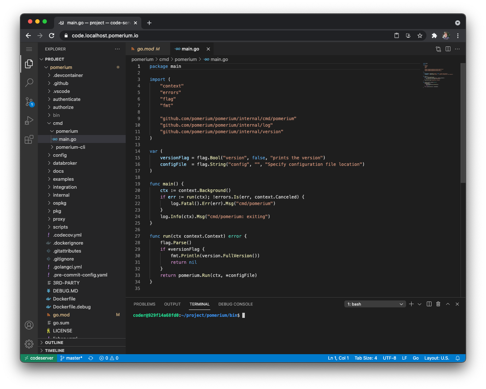
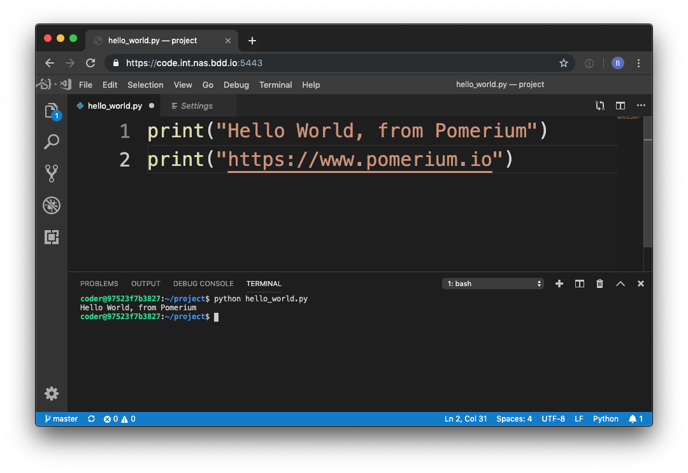
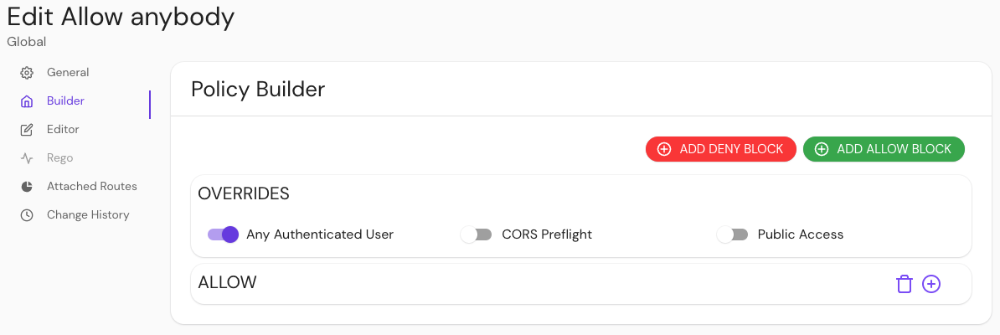

import Tabs from '@theme/Tabs';
import TabItem from '@theme/TabItem';

# Code-server

Use Pomerium to add authentication and authorization to a hosted, online instance of Visual Studio Code using code-server.

## What is code-server?

[Code-server](https://github.com/coder/code-server) is an open-source project that allows you to run [Visual Studio Code](https://code.visualstudio.com/) (VSCode) on a **remote server** through the browser.

VSCode is an open-source code editor by Microsoft that offers features like IntelliSense, Git integration, and plugins, while staying relatively lightweight.

## Integrate Pomerium with code-server

This guide shows you how to secure code-server with Pomerium.

By the end, you will be able to write code using VSCode in your browser:



### Set up your environment

This guide uses the `config.yaml` and `docker-compose.yaml` files defined in the [Pomerium quickstart](https://www.pomerium.com/docs/install/quickstart) to deploy code-server.

To complete this guide, you need:

- [Docker](https://www.docker.com/) and [Docker Compose](https://docs.docker.com/compose/install/)
- A preconfigured [identity provider (IdP)](https://www.pomerium.com/docs/identity-providers)

:::tip **Note**

This guide uses [GitHub](https://www.pomerium.com/docs/identity-providers/github) as the preconfigured IdP.

:::

### Configure Pomerium

<Tabs>

<TabItem value="Core" label="Core">

In your `config.yaml` file, add the following route:

```yaml
# routes:
#   - from: https://verify.localhost.pomerium.io
#     to: http://verify:8000
#     policy:
#       - allow:
#           or:
#             - email:
#                 is: user@example.com
#     pass_identity_headers: true
---
- from: https://code.localhost.pomerium.io
  to: http://codeserver:8080
  policy:
    - allow:
        or:
          - email:
              is: user@example.com
  allow_any_authenticated_user: true
  allow_websockets: true
```

:::tip **Note**

In this example route, `code.localhost.pomerium.io` is the publicly accessible route. `codeserver` is the local hostname for the server or container running code-server.

:::


### Configure Docker Compose

In the `services` section of your `docker-compose.yaml` file, add a block for code-server:

```yaml
services:
  codeserver:
    image: codercom/code-server:latest
    restart: always
    ports:
      - 8080:8080
    volumes:
      - ./code-server:/home/coder/project
    command: --auth none --disable-telemetry /home/coder/project
```

### Run Docker Compose

To see if you configured your routes correctly:

1. Run `docker-compose up`
2. Navigate to `https://code.localhost.pomerium.io`
3. Authorize Pomerium to access the account associated with your IdP

You will be redirected to the route defined in `config.yaml`:



</TabItem>

<TabItem value="Enterprise" label="Enterprise">

In your Console, create a [policy](/docs/concepts/policies) that allows any authenticated user to access the route:

1. Select **New Policy**
2. Enter a **Name** for your policy (e.g. 'Allow anybody')
3. Select **Builder**
4. Select **Any Authenticated User**
5. Save your policy



In your Console, build a route:

1. Select **Routes** and enter a **Name**
2. In the **From** field, enter the publicly accessible route (e.g. `code.localhost.pomerium.io`)
3. In the **To** field, enter the local hostname for the server running code-server (e.g. `http://codeserver:8080`)

Allow your route to create a WebSocket connection:
1. Select **Timeouts**
2. Select **Allow Websockets**

Lastly, add a policy and allow your route to pass identity headers:
1. Under **General** > **Policies**, select **Allow anybody**
2. Select **Pass identity headers to upstream applications**
3. Save your route


</TabItem>

</Tabs>

## Build a project in code-server

Test out code-server by building a quick front-end project.

1. Create an `index.html` file and add the following code:

```html
<!DOCTYPE html>
<html lang="en">
  <head>
    <meta charset="UTF-8" />
    <meta http-equiv="X-UA-Compatible" content="IE=edge" />
    <meta name="viewport" content="width=device-width, initial-scale=1.0" />
    <title>Code-Server Sample</title>
  </head>
  <body>
    <h1 style="color:blueviolet">Check out more from Pomerium:</h1>
    <ul style="font-size: 20px;">
      <li><a href="https://www.pomerium.com/docs/guides">Guides</a></li>
      <li><a href="https://www.pomerium.com/blog/">Blog</a></li>
      <li><a href="https://www.pomerium.com/docs">Documentation</a></li>
    </ul>
    <h2 style="color:blueviolet">Happy coding!</h2>
  </body>
</html>
```

3. Go to **Extensions** and install [Live Server](https://marketplace.visualstudio.com/items?itemName=ritwickdey.LiveServer)
4. Right-click `index.html` and select **Open with Live Server**
5. Select any of the links to learn more about Pomerium

Great job! You successfully deployed code-server.

:::tip

When the code-server container is rebuilt, any files outside of `/home/coder/project` are reset, removing any dependencies (such as go and make). In a real remote development workflow, you could mount additional volumes, or [use a custom code-server container](https://github.com/cdr/deploy-code-server/tree/main/deploy-container) with these dependencies installed.

:::

[path]: https://en.wikipedia.org/wiki/PATH_(variable)
[install]: /docs/deploying/
[synology nas]: /docs/guides/synology.md
[visual studio code]: https://code.visualstudio.com/
[code-server]: https://github.com/cdr/code-server
