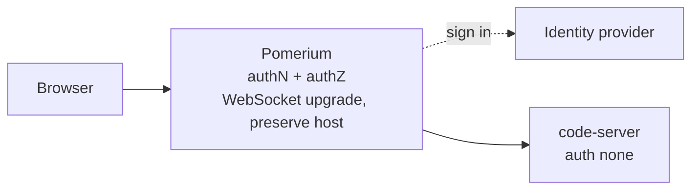
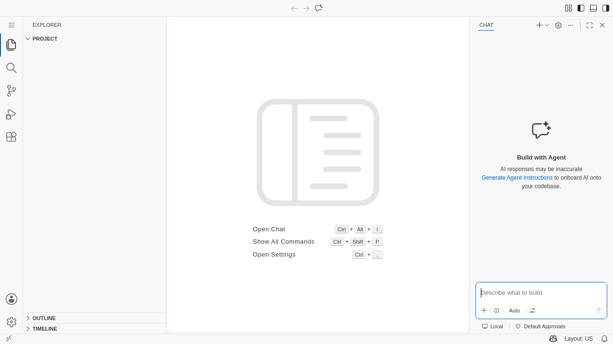
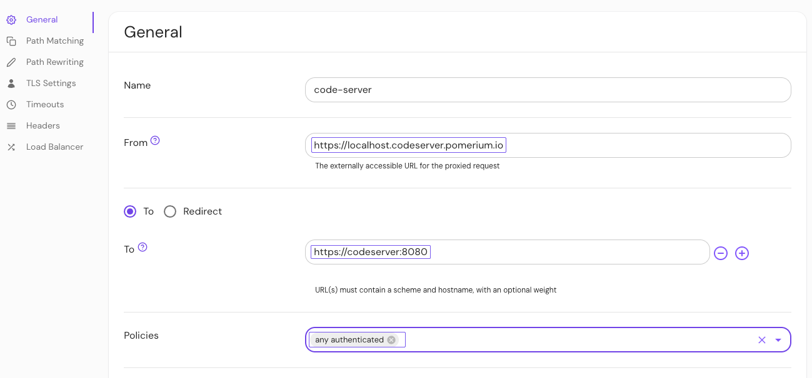

import TabItem from '@theme/TabItem';
import Tabs from '@theme/Tabs';

import Config from '/content/examples/guides/code-server/config.yaml.md';
import Compose from '/content/examples/guides/code-server/docker-compose.yaml.md';

# Secure code-server with Pomerium

[code-server](https://github.com/coder/code-server) runs [Visual Studio Code](https://code.visualstudio.com/) on a remote machine and serves the full editor in your browser. It is handy when you want VS Code from any device, work across several machines, or keep your development environment off your laptop. Because that browser session has a shell, your files, and your extensions, it needs to be locked down before it ever faces the internet.

## What this guide does

This guide puts code-server behind Pomerium so that every request is authenticated and authorized before it reaches the editor. code-server itself runs with its own password disabled (`--auth none`); Pomerium becomes the single front door, applying your identity provider's login and your access policy. The result is VS Code in the browser that only the people you name can open.


```mermaid
flowchart LR
    Browser --> Pomerium["Pomerium<br/>authN + authZ<br/>WebSocket upgrade, preserve host"]
    Pomerium -.->|"sign in"| IdP[Identity provider]
    Pomerium --> CodeServer["code-server<br/>auth none"]
```



## When to use this guide

Reach for this setup when you run code-server for yourself or a team and want centralized SSO and access control instead of a shared static password. It fits any HTTP application that simply needs protecting: Pomerium handles the login and policy, and code-server stays unaware that anything is in front of it.

## Prerequisites

- A working Pomerium deployment. If you don't have one, start with the [quickstart](/docs/get-started/quickstart).
- [Docker](https://docs.docker.com/install/) and [Docker Compose](https://docs.docker.com/compose/install/).
- A domain you control, with a DNS record pointing at the host that runs Pomerium.

## How the request flows

A browser request reaches Pomerium first. Pomerium terminates TLS, runs authentication and authorization, and upgrades the WebSocket connection the editor needs. Only after a request is allowed does it forward to code-server on the internal Docker network at `code-server:8080`. code-server's own port is never published to the host, so there is no way to reach the editor except through the proxy.

## Configure Pomerium

Add a route for code-server. The route requires an authenticated user, sends traffic to the code-server container, and enables WebSockets, which code-server needs for the live editor connection.

<Tabs queryString="type">
<TabItem value="zero" label="Pomerium Zero" default>

In the [Zero Console](https://console.pomerium.app):

1. Create a **Policy** that allows the identities you want. A common starting point is an **Allow** block that matches your email domain (the part after `@`).
2. Create a **Route**:
   - **From**: the external URL for code-server, for example `https://code-server.yourdomain.com`.
   - **To**: the internal address of the container, `http://code-server:8080`.
   - Attach the policy you created.
   - On the **Timeouts** tab, enable **Allow Websockets**.
   - On the **Headers** tab, enable **Preserve HTTP Host Header**. code-server checks the editor's WebSocket against the original host, so it must see the external hostname.
3. Save the route.



Pomerium Zero uses the hosted authenticate service, so there is nothing else to wire up for login.

</TabItem>
<TabItem value="core" label="Pomerium Core">

Add the route below to your Pomerium `config.yaml`. It uses the hosted authenticate service, so you don't run a separate identity provider, and it requests TLS certificates automatically from Let's Encrypt.

<Config />

Replace `code-server.yourdomain.com` with your own external hostname and `you@example.com` with the email that should be allowed in. `allow_websockets: true` keeps the editor's live connection working through the proxy, and `preserve_host_header: true` forwards the original host so code-server accepts that WebSocket; it checks the connection's origin against the host and rejects it otherwise.

:::tip

To self-host your identity provider instead of using the hosted authenticate service, see the [Keycloak / OIDC fallback](/docs/integrations/user-identity/oidc).

:::

</TabItem>
</Tabs>

## Configure code-server

Run code-server with authentication turned off so Pomerium is the only gate. The container listens on port `8080`, which is the address the Pomerium route points at. Your project files and the editor's configuration live in named volumes so they survive container restarts.

If you prefer not to disable code-server's own login, you can instead set `PASSWORD` or `HASHED_PASSWORD`, but with Pomerium in front the extra prompt is redundant.

## Run the stack

The Compose file runs Pomerium and code-server together on a shared network; the `To` address `http://code-server:8080` works because both containers share it.

<Compose />

Wire up Pomerium for your deployment, then bring the stack up:

<Tabs queryString="type">
<TabItem value="zero" label="Pomerium Zero" default>

Replace the mounted `config.yaml` on the `pomerium` service with a `POMERIUM_ZERO_TOKEN` environment variable holding your cluster token.

</TabItem>
<TabItem value="core" label="Pomerium Core">

Place the `config.yaml` from the previous step next to this `docker-compose.yaml`.

</TabItem>
</Tabs>

```bash
docker compose up -d
```

When you are done, tear the stack down with `docker compose down -v`. The `-v` flag also removes the named volumes, which wipes your project files and editor configuration, so omit it if you want to keep them.

## Verify the setup

1. Open `https://code-server.yourdomain.com` in a fresh browser session. Pomerium should redirect you to your identity provider to sign in.
2. Sign in as an allowed user. Pomerium redirects you back and the VS Code interface loads.
3. Confirm the editor is fully interactive: open a file, type in it, and use the terminal. A working editor means the WebSocket upgrade is passing through the route.
4. **A disallowed user is blocked.** Sign in as a user your policy excludes and open `https://code-server.yourdomain.com`. Pomerium should deny access, so you never reach the editor.

## Common failure modes

- **The editor loads but stays blank or shows "failed to connect to the server."** The editor's WebSocket isn't getting through. Make sure the route has both `allow_websockets: true` and `preserve_host_header: true` (Core), or **Allow Websockets** and **Preserve HTTP Host Header** enabled (Zero). code-server rejects the WebSocket when the host it sees doesn't match the address in your browser.
- **You see code-server's own password screen instead of your identity provider.** code-server still has authentication enabled. Start it with `--auth none` (or remove the `PASSWORD` you set) so Pomerium is the sole gate.
- **Pomerium returns a 502 or upstream error.** The route's **To** address doesn't match the container. It should be `http://code-server:8080` on the shared Compose network.

## Security considerations

A code-server session is a remote shell with access to your files. Treat the upstream as sensitive:

- **Never expose port `8080` directly.** Don't publish the code-server container's port to the host or the internet. It must only be reachable from Pomerium on the internal Docker network, so the policy can't be bypassed.
- **Disable code-server's password instead of leaving a second weak gate.** With `--auth none`, identity and access control live entirely in Pomerium, where you can manage them centrally and audit them.
- **Scope the policy tightly.** Start from a specific email or group rather than a broad domain match, since the editor grants a lot of capability to anyone who gets in.

## Next steps

- Tighten access with [authorization policy](/docs/capabilities/authorization).
- Review [routing options](/docs/capabilities/routing) for timeouts and headers.
- Mount additional volumes or build a custom code-server image if your workflow needs language toolchains preinstalled, since anything outside `/home/coder/project` resets when the container is rebuilt.
