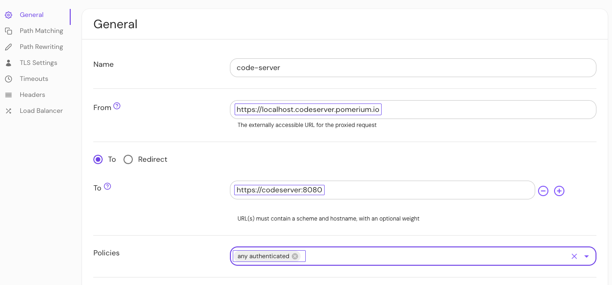

---
# cSpell:ignore codercom codeserver

title: Secure Browser Access to code-server VSCode
sidebar_label: Code-server
lang: en-US
keywords:
  [
    pomerium,
    identity access proxy,
    visual studio code,
    authentication,
    authorization,
    code server,
    vscode,
    coder,
    codercom,
  ]
description: In this guide, you’ll run code-server VSCode in a Docker container and secure browser access to your project behind Pomerium.
---

import Tabs from '@theme/Tabs';
import TabItem from '@theme/TabItem';

# Secure Browser Access to code-server VSCode Behind Pomerium

In this guide, you'll run code-server's Visual Studio Code (VSCode) in a Docker container, and secure browser access to your project with Pomerium.

## What is code-server?

[Code-server](https://github.com/coder/code-server) is an open-source project that allows you to run [VSCode](https://code.visualstudio.com/) on a **remote server** through the browser. VSCode is an open-source code editor by Microsoft that offers features like IntelliSense, Git integration, and plugins, while staying relatively lightweight.

This setup essentially turns VS Code into a cloud-based IDE, providing flexibility and accessibility advantages by offering the full power of VS Code in a cloud-based environment. This is advantageous for those who work on multiple machines, need to access their development environment remotely, or have limited local resources.

## How to secure code-server with Pomerium

Code-server requires [password authentication](https://coder.com/docs/code-server/latest/guide#expose-code-server) by default. By securing code-server behind Pomerium, you can remove code-server’s password requirement and configure Pomerium to add [authentication](/docs/capabilities/authentication) and [authorization](/docs/capabilities/authorization) to an online instance of VSCode.

This guide shows you how to secure code-server with Pomerium. Here are the steps you’ll follow:

1. Install code-server and run it in a Docker container

1. Access your code-server project in the browser listening on `localhost`

1. Configure Pomerium to safely expose your code-server instance

By the end, you will have a minimal, real-world code-server instance that allows developer teams to write code using VSCode in the browser.


### Before you start

<Tabs>

<TabItem value="Core" label="Core">

If you completed our [Quickstart guide](/docs/quickstart), you should have a working Pomerium project with the following YAML files:

- `config.yaml`
- `docker-compose.yaml`

If you haven't completed the Quickstart:

- Install [Docker](https://www.docker.com/) and [Docker Compose](https://docs.docker.com/compose/install/)
- Create a `config.yaml` file for your Pomerium configuration
- Create a `docker-compose.yaml` file for your Docker configuration

### Set up Pomerium

In your `config.yaml` file, add our hosted [authenticate service URL](/docs/reference/authenticate-service-url):

```yaml title="config.yaml"
authenticate_service_url: https://authenticate.pomerium.app
```

Add the following route:

```yaml title="config.yaml"
- from: https://code.localhost.pomerium.io
  to: http://codeserver:8080
  policy:
    - allow:
        or:
          - email:
              is: user@example.com
  allow_any_authenticated_user: true
  allow_websockets: true
```

:::note

In this example route, `code.localhost.pomerium.io` is the publicly accessible route. `codeserver` is the local hostname for the server or container running code-server.

:::

### Set up Docker Compose

In your `docker-compose.yaml` file, add the code-server and Pomerium services:

```yaml
version: '3'
services:
  pomerium:
    image: pomerium/pomerium:latest
    volumes:
      - ./config.yaml:/pomerium/config.yaml:ro
    ports:
      - 443:443
  codeserver:
    image: codercom/code-server:latest
    ports:
      - 8080:8080
    volumes:
      - ./code-server:/home/coder/project
      - ./code-server-config/.config:/home/coder/.config
```

### Access code-server on localhost

Run `docker compose up`. In your browser, go to `localhost:8080`.

Code-server will prompt you to enter a password:


You can find a pre-generated password in `code-server-config/.config/code-server/config.yaml`. If you enter it, you gain access to your code-server project.

However, remembering passwords is tedious. Let's disable the password requirement and use Pomerium to enforce authentication and authorization instead.

### Access code-server behind Pomerium

In `docker-compose.yaml`, add the following `command` to your code-server container:

```yaml title="docker-compose.yaml"
codeserver:
  image: codercom/code-server:latest
  ports:
    - 8080:8080
  volumes:
    - ./code-server:/home/coder/project
    - ./code-server-config/.config:/home/coder/.config
  command: --auth none --disable-telemetry /home/coder/project
```

This will disable the password prompt (and prevent code-server from collecting telemetry data from your project). Now, restart Docker Compose and access code-server using the route defined in `config.yaml`:

`https://code.localhost.pomerium.io`

</TabItem>

<TabItem value="Enterprise" label="Enterprise">

This guide shows you how to deploy code-server using Pomerium Enterprise.

To complete this guide, you need:

- [Pomerium Core](/docs/deploy/core)
- [Pomerium Enterprise](/docs/deploy/enterprise/quickstart#install-pomerium-enterprise)

### Configure Pomerium

In your Console, create a [policy](/docs/concepts/policies) that allows any authenticated user to access the route:

1. Select **New Policy**
2. Enter a **Name** for your policy, like `any authenticated`
3. Select **Builder**
4. Select **Any Authenticated User**
5. Save your policy


Build a route:

1. Select **Routes** and enter a **Name**
1. In the **From** field, enter the publicly accessible route (for example, `code.localhost.pomerium.io`)
1. In the **To** field, enter the local hostname for the server running code-server (for example, `http://codeserver:8080`)

Allow your route to create [Websocket connections](/docs/reference/routes/timeouts#websocket-connections):

1. Select **Timeouts**
1. Select **Allow Websockets**

Add a policy and save it:

1. Under **General** > **Policies**, select **any authenticated**
1. Save your route



### Test your routes

To see if your routes are configured correctly, navigate to the externally accessible route you defined in the **From** field:

`https://code.localhost.pomerium.io`

</TabItem>

</Tabs>

After authenticating against the Cognito identity provider, you will be redirected to the code-server route.


## Build a project in code-server

Now that you can access VSCode in your browser, test out code-server by building a quick HTML project.

1. Create an `index.html` file and add the following code:

```html
<!DOCTYPE html>
<html lang="en">
  <head>
    <meta charset="UTF-8" />
    <meta http-equiv="X-UA-Compatible" content="IE=edge" />
    <meta name="viewport" content="width=device-width, initial-scale=1.0" />
    <title>Code-Server Sample</title>
  </head>
  <body>
    <h1 style="color:blueviolet">Check out more from Pomerium:</h1>
    <ul style="font-size: 20px;">
      <li><a href="https://www.pomerium.com/docs/guides">Guides</a></li>
      <li><a href="https://www.pomerium.com/blog/">Blog</a></li>
      <li><a href="https://www.pomerium.com/docs">Documentation</a></li>
    </ul>
    <h2 style="color:blueviolet">Happy coding!</h2>
  </body>
</html>
```

2. Go to **Extensions** and install [Live Server](https://marketplace.visualstudio.com/items?itemName=ritwickdey.LiveServer)
3. Right-click `index.html` and select **Open with Live Server**
4. Select any of the links to learn more about Pomerium

Great job! You successfully deployed code-server.

:::note

When the code-server container is rebuilt, any files outside of `/home/coder/project` are reset, removing any dependencies (such as go and make). In a real remote development workflow, you could mount additional volumes, or [use a custom code-server container](https://github.com/cdr/deploy-code-server/tree/main/deploy-container) with these dependencies installed.

:::

[path]: https://en.wikipedia.org/wiki/PATH_(variable)
[install]: /docs/deploy/
[synology nas]: /docs/guides/synology.md
[visual studio code]: https://code.visualstudio.com/
[code-server]: https://github.com/cdr/code-server
