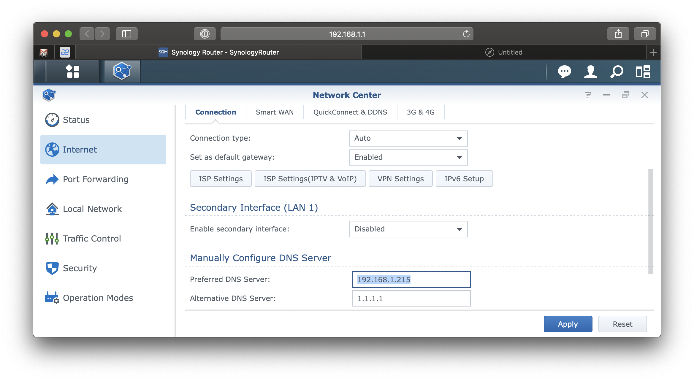
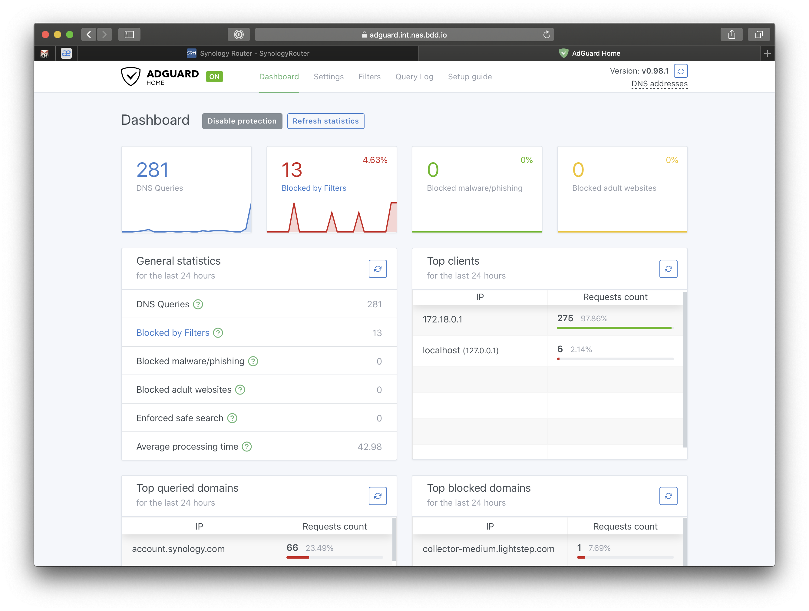

---
# cSpell:ignore piehole dXNlcjpwYXNzd29yZA workdir first-route confdir
<!--- I have no idea what this is for --->

title: Tour First Pomerium Route
sidebar_label: First Route
lang: en-US
keywords: [pomerium, identity access proxy, context aware proxy]
description: This guide covers how to set up your first route in Pomerium.
---

<!---I'm going to sort of draft what I think is useful but acnkowledge this is your territory, zach. Also, this is purely for setting up a route - we still need to add in the bit where certs are set up so this would work.--->

This guide covers how to add a route to your Pomerium configuration. The goals are:
 - Understand how routes and their policies are set
 - Create a route with a policy
 - Test that route!

## Pre-requisites

This guide assumes you have already completed our [quick start] guide and have a working instance of Pomerium up and running. For purpose of this guide, I'm going to use docker-compose, though any other deployment method would work equally well.

## Configure

### Pomerium Config

If you finished quick start, you should have a `config.yaml` file in your Pomerium directory. This is the file we use to add, delete, or modify Pomerium routes. Luckily, you already have one! Navigate to that file, open it up, and you should see the default route of Pomerium.

<ConfigDocker />

This is actually a route! It routes access from one address to another, following the policies that are set. Just in case, let's go through each of these settings one by one:
- `from`: This is the public address you are redirecting. When the user types in this address, Pomerium processes all of the policies you set before allowing them to reach their destination.
- `to`: This is where the traffic is routed to. In many cases, Pomerium is used to route to an internal web application, so this is where you'd input that address.
- `policy`: You guessed it -- this is where the policy can begin to be set. For more information about policies, please refer to the guide on [Policy Language](/content/docs/capabilities/ppl.mdx)


## Create a Route!

Let's do a simple route to test out how you can set one up. For the purpose of this guide, we'll write an internal route to `https://www.wikipedia.org/`. Go to Wikipedia first to make sure the site is up; if they are not, you may have five minutes to mourn the loss of Wikipedia. Then, replace all instances of `https://www.wikipedia.org/` in the rest of this guide with a public address you know works.


```yaml
# config.yaml
- from: https://wikipedia.localhost.pomerium.io
  to: https://www.wikipedia.org/
  policy:
    - allow:
        or:
          - email:
              is: user@example.com
```

Remember to replace the email with your own! It is the email you are telling Pomerium to `allow` to pass. If you forget, Pomerium will go "YOU SHALL NOT PASS!" (doing its job).

### Docker-compose

```yaml
# docker-compose.yaml
adguard:
  image: adguard/adguardhome:latest
  volumes:
    - adguard/workdir:/opt/adguardhome/work:rw
    - adguard/confdir:/opt/adguardhome/conf:rw
  ports:
    - 53:53/udp
  expose:
    - 67
    - 68
    - 80
    - 443
    - 853
    - 3000
  restart: always
```

### Router



Set your router to use your new host as the primary DNS server.

### That's it!

Simply navigate to your new adguard instance (e.g. `https://adguard.domain.example`) and behold all of the malware you and your family are no longer subjected to.



[quick start]: /docs/quickstart
