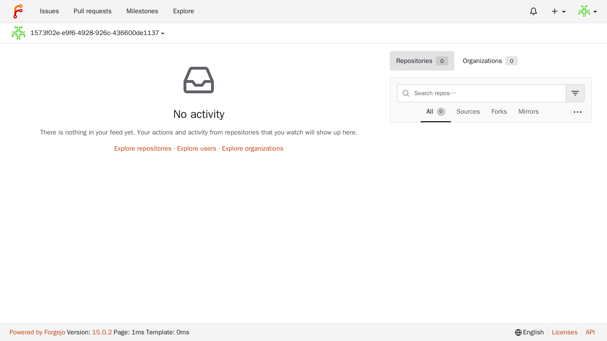

---
# cSpell:ignore automations forgejo gitea WEBAUTH
title: Secure Forgejo with Pomerium
sidebar_label: Forgejo
lang: en-US
keywords:
  [
    pomerium,
    forgejo,
    gitea,
    git,
    sso,
    oidc,
    identity aware proxy,
    reverse proxy authentication,
    identity headers,
  ]
description: Put a Forgejo instance behind Pomerium and use reverse-proxy header authentication so users sign in once and are auto-provisioned from their Pomerium identity.
---

import TabItem from '@theme/TabItem';
import Tabs from '@theme/Tabs';

import Config from '/content/examples/guides/forgejo/config.yaml.md';
import Compose from '/content/examples/guides/forgejo/docker-compose.yaml.md';

# Secure Forgejo with Pomerium

## What this guide does

You'll put [Forgejo](https://forgejo.org/), a self-hosted Git service, behind Pomerium so that Pomerium handles single sign-on and authorization, then forwards the user's identity to Forgejo as request headers. Forgejo trusts those headers ([reverse-proxy authentication](https://forgejo.org/docs/latest/admin/setup/reverse-proxy/)), signs the user in, and can auto-create the account on first visit. The result is single sign-on for the Forgejo web UI with no second password. The same setup also works with [Gitea](https://about.gitea.com/).

:::caution This guide configures web UI sign-in only

It leaves Forgejo's API reverse-proxy authentication disabled. Git operations, API clients, automations, and SSH access still need Forgejo [access tokens](https://forgejo.org/docs/latest/user/api-usage/) or SSH keys.

:::

## When to use this guide

Use it when you want one front door for Forgejo with your existing identity, and you want Forgejo to provision and sign users in from Pomerium instead of maintaining its own password directory. Forgejo does not support Pomerium's signed-JWT login mode, so this guide relies on header-based reverse-proxy authentication; read the [Security considerations](#security-considerations) before you deploy, because that mode trusts the identity header from any peer that can reach Forgejo.

## Prerequisites

This guide assumes you've completed the [Quickstart](/docs/get-started/quickstart), so you already have Pomerium running and signing users in through the hosted authenticate service.

You also need:

- [Docker](https://docs.docker.com/install/) and [Docker Compose](https://docs.docker.com/compose/install/)
- A domain you control for the Forgejo route (this guide uses `forgejo.yourdomain.com`)

:::tip Prefer to self-host the identity provider?

This guide uses the hosted authenticate service so you don't have to run an identity provider (IdP). To run your own instead, follow [Keycloak + Pomerium](/docs/integrations/user-identity/oidc) and swap the `authenticate_service_url` / `idp_*` settings into the config below.

:::

## Configure Pomerium

Pomerium forwards the user's `sub`, `email`, and `name` claims as request headers. Forgejo usernames can't contain every character that's valid in an email address, so this uses the stable OIDC `sub` claim for the username and carries the real address in `X-Pomerium-Claim-Email`.

<Tabs queryString="type">
<TabItem value="zero" label="Pomerium Zero" default>

In the [Zero Console](https://console.pomerium.app):

1. Create a **Route**. In **From**, enter `https://forgejo.<your-starter-domain>`; in **To**, enter `http://forgejo:3000`.
2. Set the policy to the user or domain that should reach Forgejo. Reverse-proxy auth trusts the forwarded header, so this policy is your real access gate; keep it tight.
3. On the **Headers** tab, enable **Pass Identity Headers**, then add these **JWT Claim Headers** so the claims arrive under the names Forgejo expects below: `X-Pomerium-Sub` from `sub`, `X-Pomerium-Claim-Email` from `email`, and `X-Pomerium-Claim-Name` from `name`. Save.

</TabItem>
<TabItem value="core" label="Pomerium Core">

Create a `config.yaml`. It routes `forgejo.yourdomain.com` to the Forgejo container, forwards the identity claims as headers, and removes the total request timeout so long Git smart-HTTP transfers aren't cut off.

<Config />

Replace `forgejo.yourdomain.com` with your domain and `you@example.com` with your user or domain. A few notes:

- [`jwt_claims_headers`](/docs/reference/jwt-claim-headers) forwards each claim as a request header; [`pass_identity_headers`](/docs/reference/routes/pass-identity-headers-per-route) sends them to Forgejo.
- If your identity provider's `sub` claim isn't a valid Forgejo username, use another stable claim that's unique and already sanitized for Forgejo.
- The policy authorizes who can reach Forgejo. Reverse-proxy auth trusts the header, so this policy is your real access gate.

</TabItem>
</Tabs>

## Configure Forgejo

Configure Forgejo to trust and consume the headers. These map to `app.ini` settings, supplied as `FORGEJO__<section>__<KEY>` environment variables in the Compose file below. The key settings:

- `ENABLE_REVERSE_PROXY_AUTHENTICATION` makes Forgejo read the identity header.
- `ENABLE_REVERSE_PROXY_AUTO_REGISTRATION` creates the account on first visit; `..._EMAIL` and `..._FULL_NAME` populate it from the other headers.
- `REVERSE_PROXY_AUTHENTICATION_USER` / `_EMAIL` / `_FULL_NAME` must match the header names Pomerium emits (Forgejo's defaults are `X-WEBAUTH-USER` / `-EMAIL` / `-FULLNAME`).
- `DISABLE_REGISTRATION: false` allows trusted external provisioning, while `ALLOW_ONLY_EXTERNAL_REGISTRATION: true` and `SHOW_REGISTRATION_BUTTON: false` keep the local sign-up form closed.

`REVERSE_PROXY_TRUSTED_PROXIES` only tells Forgejo how to derive the real client IP from `X-Forwarded-For` for its logs and rate limiting. It does **not** restrict which peer the identity header is trusted from; see [Security considerations](#security-considerations).

## Run the stack

The Compose file runs Pomerium Core and Forgejo together (for Zero, drop the `pomerium` service and use the `compose.yaml` from the Quickstart with your `POMERIUM_ZERO_TOKEN`, keeping the `forgejo` service and its network below):

<Compose />

Start it:

```bash
docker compose up -d
```

The Compose file pins Forgejo and Pomerium by image digest so the stack is reproducible; the digest comment notes the Forgejo version (`v15`). Bump the pins when you upgrade, and re-test sign-in afterward. To tear the stack down and delete the Forgejo data volume (all repositories and state), run `docker compose down -v`.

## Verify the setup

1. **The route requires authentication.** In a fresh browser, open `https://forgejo.yourdomain.com`. You should be redirected to sign in, not straight into Forgejo.
2. **An allowed user gets in.** Sign in. Pomerium redirects you back to Forgejo.
3. **SSO and auto-provisioning work.** Forgejo signs you in and creates your account from the headers, with no Forgejo password. The account carries your real email; its username comes from the configured username claim, and its full name is populated only if your identity provider supplies a `name` claim. You land on the authenticated Forgejo dashboard, signed in as your Pomerium identity:

   

The first account Forgejo provisions becomes the instance administrator, so sign in through Pomerium first with the identity that should own Forgejo.

## Common failure modes

- **Pomerium returns `403`.** The route policy still allows only the example user. Replace it with your user or domain.
- **You reach Forgejo but aren't signed in or auto-provisioned.** The header names in Pomerium (`jwt_claims_headers`) and in Forgejo (`REVERSE_PROXY_AUTHENTICATION_USER` / `_EMAIL` / `_FULL_NAME`) must match exactly, and `pass_identity_headers` must be set on the route.
- **Sign-in fails on the username.** Forgejo rejects usernames containing characters such as `@`. Use a stable, already-valid claim for the username (this guide uses `sub`).
- **A direct request to the backend signs in.** Expected: reverse-proxy auth trusts the header from any peer. It's why Forgejo must stay reachable only through Pomerium.

## Security considerations

Reverse-proxy authentication means **Forgejo trusts the identity header from any peer that can reach it.** Forgejo does not verify Pomerium's signed `X-Pomerium-Jwt-Assertion` for login, and `REVERSE_PROXY_TRUSTED_PROXIES` does not gate which peer the header is trusted from. So **network isolation is the only trust boundary**: Forgejo must be reachable **only** through Pomerium.

Two properties make this safe, and only these two:

- **Through Pomerium, a forged header is overwritten.** For each claim it forwards, Pomerium sets the header from the real authenticated user, so a client that forges `X-Pomerium-Sub` or `X-Pomerium-Claim-Email` _through_ Pomerium is still signed in as its own identity, never the forged one. The username (`sub`) and email are always present, so they pin the account. The only soft spot is an optional claim Pomerium doesn't emit for a given user (for example `name`, when the token carries none): a forged `X-Pomerium-Claim-Name` could pass through, but the worst case is a wrong display name, not a different account.
- **Direct access must be impossible.** The risk is a client that bypasses Pomerium and talks to Forgejo directly: it can set those headers itself and impersonate anyone (the first such account would even become admin). Keep Forgejo on a network where only Pomerium can reach it.

To hold up that boundary:

- **Don't publish Forgejo's port.** In Docker Compose, keep only Pomerium on Forgejo's network and never map `3000` to the host. Confirm the only containers on the network are Pomerium and Forgejo: `docker network inspect forgejo-pomerium --format '{{range .Containers}}{{.Name}} {{end}}'`.
- **In Kubernetes, a `ClusterIP` service alone isn't enough** if arbitrary pods can connect to Forgejo. Use a policy-enforcing CNI and a `NetworkPolicy` (or another network control) to admit only Pomerium to the backend.
- **`REVERSE_PROXY_TRUSTED_PROXIES` is not a security control for this.** It only affects `X-Forwarded-For` parsing, not which peer the identity header is trusted from. Set it to Pomerium's IP/CIDR (never a hostname) for correct client-IP logging, but treat network isolation as the real boundary.
- **Keep a break-glass admin.** Because the local sign-up form is closed and every request arrives pre-authenticated, create a recovery admin out of band: `docker compose exec -u git forgejo forgejo admin user create --username recovery-admin --email recovery-admin@example.com --random-password --admin`. To use it, reach Forgejo without Pomerium's injected header (a trusted network, or temporarily setting `ENABLE_REVERSE_PROXY_AUTHENTICATION` to `false`).

## Next steps

- [Build policies](/docs/get-started/fundamentals/zero/zero-build-policies)
- [Pass identity headers](/docs/reference/routes/pass-identity-headers-per-route)
- [Mirror repositories](https://forgejo.org/docs/latest/user/repo-mirror/) into a Pomerium-gated warm standby
