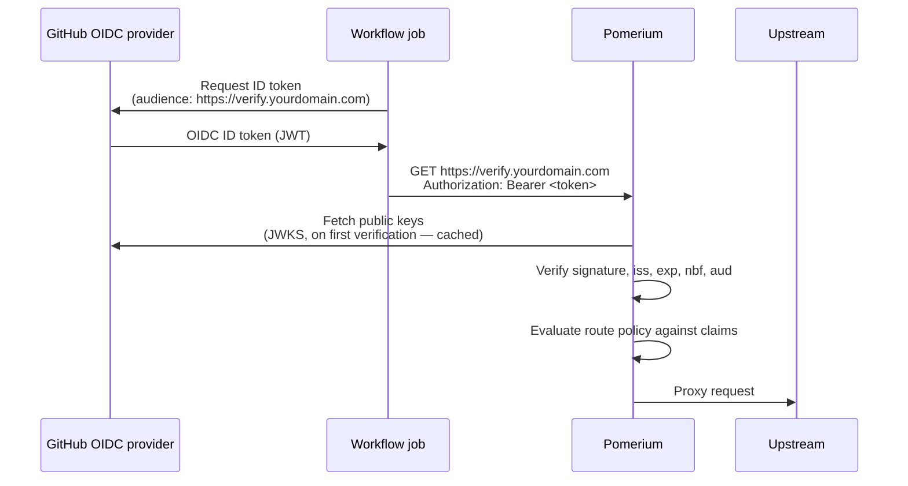

---
# cSpell:ignore githubusercontent algs pasteable

title: Authenticate GitHub Actions with Pomerium
sidebar_label: GitHub Actions
lang: en-US
keywords:
  [
    pomerium,
    github actions,
    oidc,
    jwt,
    bearer token,
    machine to machine,
    m2m,
    ci,
    workflow identity,
    identity providers,
    no secrets,
  ]
description: Let a GitHub Actions workflow call a Pomerium-protected route with the OIDC token GitHub issues to the job, verified against a trusted issuer and authorized on its claims, with no stored secrets.
---

# Authenticate GitHub Actions with Pomerium

## What this guide does

You'll let a GitHub Actions workflow call a service behind Pomerium using the OIDC token GitHub mints for every job, instead of a client secret stored in the repository. Pomerium verifies the token against GitHub's public signing keys on a route with [`bearer_token_format: jwt`](/docs/reference/bearer-token-format), then authorizes the request on the token's claims, so access is scoped to one repository (and optionally one branch) with nothing to provision, rotate, or leak. It's written for platform and DevOps engineers who run self-hosted Pomerium Core and want CI jobs to reach protected services.

When you're done, a workflow run calls your route and prints `HTTP 200` from the upstream, anonymous requests are denied, and Pomerium's authorize log attributes each allowed request to the identity `github-actions/` followed by the token's `sub` claim. Nothing about interactive sign-in changes: the trusted issuer you add here is _additional_ and is used only to verify bearer tokens, while your sign-in identity provider stays as it is.

:::note Example values

Every value below is a placeholder. Substitute your own wherever they appear, and note that two of them carry weight: the route URL must be a domain you control that GitHub-hosted runners can reach, and the policy matches on the repository name, so nothing authorizes until you replace it with your repository's real owner and name.

- `https://verify.yourdomain.com` — the Pomerium route the workflow calls, also used as the token audience
- `http://verify:8000` — the upstream behind the route, here a service named `verify` that Pomerium reaches by name on a shared container network; any plain HTTP service works, addressed however your deployment reaches it
- `your-org/your-repo` — the GitHub repository that runs the workflow

:::

## When to use this guide

Use it when a GitHub Actions workflow needs to call a service behind Pomerium — a deploy step hitting an internal API, a smoke test against a protected environment, a job flushing a cache — and you don't want to store a long-lived credential in GitHub. The workflow proves its identity with a token GitHub already issues to every job, and your route policy decides which repository and branch may pass.

Don't use it when the caller is a person in a browser — that's a normal Pomerium route with interactive sign-in. If the caller is a different non-interactive workload, such as a Kubernetes pod, the mechanism is identical with a different trusted issuer; see [Machine-to-Machine Access with Bearer Tokens](/docs/capabilities/bearer-token-access). Also note the trade-off baked into this pattern: the route must be reachable from GitHub-hosted runners over the public internet, so it doesn't fit services that must stay unreachable from outside your network.

## Prerequisites

- A running [Pomerium Core](/docs/deploy/core) deployment that you administer through its `config.yaml` file. If you don't have one, follow the [Quickstart](/docs/get-started/quickstart) first. Any host works, as long as the route below is reachable from the public internet.
- A route domain with public DNS and a publicly trusted TLS certificate, reachable from GitHub-hosted runners. This guide writes it as `https://verify.yourdomain.com`.
- Access to edit Pomerium's `config.yaml` and read its logs.
- A GitHub repository with GitHub Actions enabled and permission to add a workflow file (this guide calls it `your-org/your-repo`).
- An HTTP service for the route to protect. The examples below use the [Pomerium Verify](https://verify.pomerium.com) demo app, reached at `http://verify:8000`; substitute whatever address your own upstream listens on.

## How it works

A GitHub Actions job can request an OIDC ID token from GitHub's token service at `https://token.actions.githubusercontent.com`. The token is a JWT signed by GitHub whose claims describe the run: the repository, the git ref, the triggering event, and more. You declare that issuer as a trusted [JWT identity provider](/docs/reference/identity-providers) in Pomerium, and the workflow presents the token on its request. To verify it, Pomerium fetches GitHub's public keys — a JSON Web Key Set (JWKS) found through OIDC discovery — on the first verification and caches them; every token is then checked locally (signature, `iss`, `exp`, `nbf`, `aud`) and the route's policy is evaluated against the verified claims. No identity provider is called per request, and no secret is stored on either side.



One fact decides your security posture here: **every GitHub repository — anyone's — can mint a token from this same issuer.** A verified token proves only that _some_ GitHub Actions workflow, somewhere, requested it. The route's claims policy is therefore the entire authorization boundary, which is why the policy below always pins at least the `repository` claim. For the verification model and per-provider settings, see [JWT Identity Providers](/docs/reference/identity-providers).

## Configure Pomerium

Add two things to `config.yaml`: a global `identity_providers` entry that trusts GitHub's token service, and a route that accepts JWT bearer tokens and authorizes on their claims.

```yaml title="config.yaml"
identity_providers:
  github-actions:
    issuer: https://token.actions.githubusercontent.com
    audiences:
      - https://verify.yourdomain.com

routes:
  - from: https://verify.yourdomain.com
    to: http://verify:8000
    bearer_token_format: jwt
    identity_providers: [github-actions]
    policy:
      - allow:
          and:
            - claim/repository: your-org/your-repo
```

What each piece does:

- **`identity_providers` (global)** declares the trusted issuer under a name you choose — here `github-actions`. The name must be lowercase, and it prefixes the caller's identity in logs. Because the issuer URL is publicly reachable, Pomerium discovers the signing keys itself and no `jwks_url` is needed; GitHub's discovery document advertises `RS256` signatures, which the default `supported_algs` already accepts. See [JWT Identity Providers](/docs/reference/identity-providers) for every field.
- **`audiences`** lists the values accepted in the token's `aud` claim; the workflow below requests exactly this audience. Any agreed-upon string works, but the route's own URL is a good convention because it ties the token to this service and nothing else.
- **`bearer_token_format: jwt`** tells Pomerium to treat the route's `Authorization: Bearer` header as a JWT from a trusted issuer. See [Bearer Token Format](/docs/reference/bearer-token-format).
- **`identity_providers` (on the route)** is an optional allowlist naming which trusted providers this route accepts — useful once you declare more than one. See [Identity Providers (per route)](/docs/reference/routes/identity-providers-per-route).
- **The policy** authorizes on the verified `repository` claim, so only workflows in `your-org/your-repo` get through.

To also pin the branch, match the `ref` claim — the git ref that triggered the run:

```yaml
policy:
  - allow:
      and:
        - claim/repository: your-org/your-repo
        - claim/ref: refs/heads/main
```

This admits pushes and manual runs on `main` and denies every other branch, tag, and pull-request run. You can pin the exact `sub` claim instead, but its format varies by trigger (a branch run carries `repo:OWNER/REPO:ref:refs/heads/BRANCH`, a pull-request run carries `repo:OWNER/REPO:pull_request`), and repositories created after July 15, 2026 get an immutable `sub` that embeds numeric owner and repository IDs (`repo:OWNER@OWNER-ID/REPO@REPO-ID:…`) rather than the plain path. Pinning `repository` plus `ref` sidesteps all of that. See [GitHub's OIDC reference](https://docs.github.com/en/actions/reference/security/oidc) for the claim list and `sub` formats, and [Pomerium Policy Language (PPL)](/docs/internals/ppl#criteria) for the `claim` criterion.

Save the file. Pomerium watches its configuration and applies changes automatically (hot reload is on by default); restart the service if you've disabled that. If the new configuration is invalid, a running Pomerium logs `config: error updating config` and keeps the previous configuration, and a fresh start refuses to boot — the [Troubleshooting](#troubleshooting) table lists the common causes.

**Checkpoint — the route is live and fails closed.** Send an anonymous request as an API client:

```bash
curl -sS -o /dev/null -w '%{http_code}\n' -H 'Accept: application/json' https://verify.yourdomain.com
```

Expected output: `401`. On a bearer route a missing token is a denial, not a sign-in prompt (the `Accept` header marks the request as a machine client rather than a browser; see [Bearer Token Format](/docs/reference/bearer-token-format)).

## Add the workflow

Stripped to essentials, the job does two things: ask GitHub for a token whose audience matches the route, then present that token to the route.

```bash
token=$(curl -sS -H "Authorization: bearer $ACTIONS_ID_TOKEN_REQUEST_TOKEN" \
  "$ACTIONS_ID_TOKEN_REQUEST_URL&audience=https://verify.yourdomain.com" | jq -r '.value')

curl -H "Authorization: Bearer $token" https://verify.yourdomain.com/
```

The runner injects `ACTIONS_ID_TOKEN_REQUEST_URL` and `ACTIONS_ID_TOKEN_REQUEST_TOKEN` into any job that requests the `id-token: write` permission, so these two calls only work inside GitHub Actions; there is no way to mint one of these tokens from a laptop.

The workflow below is that same pair of calls, with the error handling and log masking a real job needs. In your repository, create the workflow file:

```yaml title=".github/workflows/call-pomerium.yaml"
name: Call a Pomerium-protected route

on:
  workflow_dispatch:
  push:
    branches: [main]

permissions:
  id-token: write

jobs:
  call-route:
    runs-on: ubuntu-latest
    steps:
      - name: Request an OIDC token and call the route
        run: |
          response=$(curl --fail -sS \
            -H "Authorization: bearer $ACTIONS_ID_TOKEN_REQUEST_TOKEN" \
            "$ACTIONS_ID_TOKEN_REQUEST_URL&audience=https://verify.yourdomain.com")
          token=$(printf '%s' "$response" | jq -r '.value')
          echo "::add-mask::$token"

          curl --fail -sS -o /dev/null -w 'Pomerium answered: HTTP %{http_code}\n' \
            -H "Authorization: Bearer $token" \
            -H 'Accept: application/json' \
            https://verify.yourdomain.com/
```

How the workflow works:

- **`permissions: id-token: write`** is what allows the job to request an OIDC token; without it the token cannot be requested at all. Specifying any explicit permission sets every unspecified one to `none` — this workflow needs nothing else, but if you add a step that checks out code, also grant `contents: read`.
- **The first `curl`** calls GitHub's token endpoint using the two environment variables the runner injects (`ACTIONS_ID_TOKEN_REQUEST_URL` and `ACTIONS_ID_TOKEN_REQUEST_TOKEN`), appending `audience=` so the token's `aud` claim matches what Pomerium expects. Without an explicit audience, GitHub defaults `aud` to the repository owner's URL, which this route would reject. The response is JSON and the token is in its `.value` field.
- **`::add-mask::`** registers the token as a masked value before anything else can print it — this repository is public, so its Actions logs are public too.
- **The second `curl`** presents the token as a bearer token on the protected route. `--fail` makes the step fail on any HTTP error response (status `400` and above), and `-w` prints the status code as the step's verdict. A `3xx` would slip past `--fail`, so the request also sends `Accept: application/json`, marking it as a machine client: a denial then arrives as a `401` or `403` instead of a `302` sign-in redirect that would leave the step green.

Commit the file to `main`, then run it from the **Actions** tab: select **Call a Pomerium-protected route** and press **Run workflow** (the `workflow_dispatch` trigger). Any push to `main` triggers it as well.

## Verify the setup

1. **The workflow reaches the upstream.** The run is green and the step log ends with `Pomerium answered: HTTP 200` — Pomerium verified the token, the policy matched its claims, and the upstream responded.
2. **Pomerium attributes the request to the workflow.** In Pomerium's logs, find the `authorize check` entry for the request:

   ```json
   {
     "level": "info",
     "service": "authorize",
     "method": "GET",
     "path": "/",
     "host": "verify.yourdomain.com",
     "user": "github-actions/repo:…",
     "allow": true,
     "allow-why-true": ["claim-ok"],
     "deny": false,
     "message": "authorize check"
   }
   ```

   The `user` field is the provider name, a slash, and the token's `sub` claim, so every allowed and denied call is attributable to a specific repository and trigger. (The exact `sub` suffix depends on the trigger and repository age; see the `sub` formats linked above.)

3. **A request with no token is denied.** The `401` checkpoint from [Configure Pomerium](#configure-pomerium) — run it again now if you skipped it.
4. **A request with a bogus token is denied.** From any machine:

   ```bash
   curl -sS -o /dev/null -w '%{http_code}\n' -H 'Authorization: Bearer not-a-jwt' https://verify.yourdomain.com
   ```

   Expected output: `403`. Pomerium's log explains why in an `error creating session from incoming request` line.

5. **The wrong repository is denied (optional, strongest check).** Add the same workflow file to any other repository and run it: the token verifies (same issuer, same audience) but the `repository` claim doesn't match, so the call fails with HTTP `403` and the authorize log shows `"allow":false` with reason `claim-unauthorized`.

**Definition of done:** the workflow run is green with `Pomerium answered: HTTP 200`, the no-token and bogus-token requests return `401` and `403`, and the authorize log shows `"user":"github-actions/repo:…"` with `"allow":true` for the workflow's request.

## Troubleshooting

| Symptom | Likely Cause | What to Check | Fix |
| --- | --- | --- | --- |
| The token-request step fails and `ACTIONS_ID_TOKEN_REQUEST_URL` is empty | The job lacks the `id-token: write` permission, so no token can be requested | The `permissions` block in the workflow (workflow level or job level) | Add `permissions: id-token: write`; remember that specifying any permission sets all unspecified ones to `none` |
| The route call fails with HTTP `403`; Pomerium logs `token audience does not match any allowed audience` | The `audience=` requested by the workflow doesn't match the provider's `audiences` | The `audience=` query parameter in the workflow versus `identity_providers.github-actions.audiences` in `config.yaml` | Make the two values identical (this guide uses the route URL for both) |
| HTTP `403`; Pomerium logs `no identity provider matches the token's iss claim` | No configured provider has the issuer GitHub's tokens carry | The `error creating session from incoming request` log line, and the `issuer` in `config.yaml` | Set `issuer: https://token.actions.githubusercontent.com` exactly |
| HTTP `403`; Pomerium logs `identity provider "github-actions" is not allowed on this route` | The route's `identity_providers` allowlist omits the provider that matched the token | The route's `identity_providers` list | Add `github-actions` to the route's allowlist, or remove the allowlist to accept all configured providers |
| HTTP `403` and the authorize log shows `"allow":false` with `claim-unauthorized` | The token verified but its claims don't match the policy: wrong repository, or a trigger with different claims (a pull-request run carries `sub` = `repo:OWNER/REPO:pull_request`, not your branch ref) | The `authorize check` log entry: the `user` field and `allow-why-false` | Correct the `claim/…` values, or run the workflow from the repository and branch the policy pins |
| Pomerium refuses to start, or logs `config: error updating config` after a reload | Invalid configuration: an uppercase provider name, a provider without `audiences`, `identity_providers` set on a route that isn't `bearer_token_format: jwt`, or a `jwt` route with no providers declared | The startup or reload error message, which names the failing key | Lowercase the provider name, add at least one audience, or move the allowlist onto a `jwt` route |
| HTTP `400 Bad Request` when testing by hand | The request carried both a Pomerium session cookie and a bearer token, which are mutually exclusive on a `jwt` route | Whether your HTTP client sends a cookie jar alongside the `Authorization` header | Send only the `Authorization: Bearer` header |

## Security considerations

- **The claims policy is the entire authorization boundary.** Any repository on GitHub can obtain a token from this issuer, for any audience it likes. Always pin at least `claim/repository`; pin `claim/ref` too when only one branch should have access. A route policy that merely accepts a verified token from this issuer is open to every GitHub user.
- **Public repository, public logs.** Anyone can read the Actions logs of a public repository. Never echo the token; keep the `::add-mask::` line before any use of the token, and avoid writing the token to files, step outputs, or environment files.
- **A leaked token works until it expires.** Pomerium enforces `exp` but does not observe revocation, so a captured token is usable until its expiry (Pomerium also caps the derived session lifetime; see [JWT Identity Providers](/docs/reference/identity-providers)). GitHub's tokens are short-lived, which bounds the exposure, but treat any token that reached a log or an artifact as compromised.
- **Audience binding stops replay.** Because the token's `aud` must match the provider's `audiences`, a token minted for another service can't be replayed against this route, and this route's tokens can't be replayed elsewhere — provided each service uses a distinct audience value. Don't share one audience string across services.

## Next steps

- [Machine-to-Machine Access with Bearer Tokens](/docs/capabilities/bearer-token-access) — the capability overview, including the Kubernetes service account flow
- [JWT Identity Providers](/docs/reference/identity-providers) — every provider field and the verification model
- [Bearer Token Format](/docs/reference/bearer-token-format) — how the four bearer formats differ
- [Identity Providers (per route)](/docs/reference/routes/identity-providers-per-route) — scoping providers per route
- [Pomerium Policy Language](/docs/internals/ppl) — the full policy grammar
