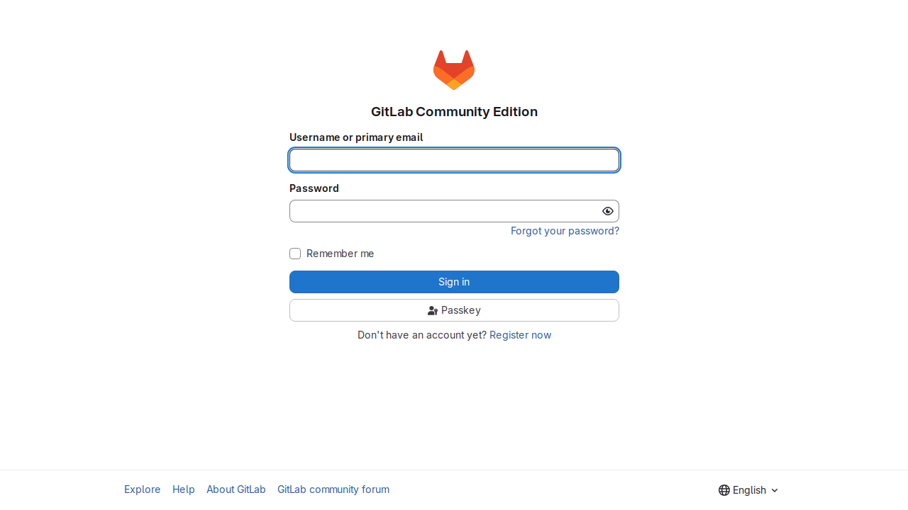
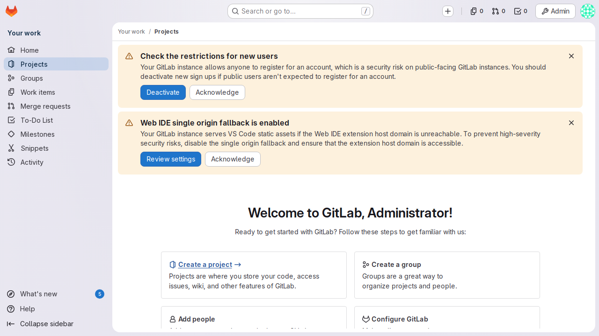

---
# cSpell:ignore omniauth
title: Secure GitLab with Pomerium
sidebar_label: GitLab
lang: en-US
keywords: [pomerium, gitlab, sso, oidc, identity aware proxy, self-hosted]
description: Put self-hosted GitLab behind Pomerium so every request is authenticated and authorized at the front door before it reaches GitLab.
---

import TabItem from '@theme/TabItem';
import Tabs from '@theme/Tabs';

import Config from '/content/examples/guides/gitlab/config.yaml.md';
import Compose from '/content/examples/guides/gitlab/docker-compose.yaml.md';

# Secure GitLab with Pomerium

## What this guide does

You'll put a self-hosted [GitLab](https://gitlab.com/) instance behind Pomerium so that Pomerium becomes the single front door: every request is authenticated against your identity provider and checked against your policy before it ever reaches GitLab. GitLab keeps running its own login and authorization on top, so Pomerium acts as an additional gate rather than replacing GitLab's accounts.

## When to use this guide

Use it when you run self-hosted GitLab and want to make sure only people from your organization can even reach it, without exposing GitLab's web interface directly to the internet. Pomerium handles the network-level access decision; GitLab continues to manage projects, permissions, and its own user sessions behind that gate.

If you instead want to reach GitLab over a private network without a browser SSO flow (for example, plain Git over SSH), a [TCP route](/docs/capabilities/non-http) is a better fit.

## Prerequisites

This guide assumes you've completed the [Quickstart](/docs/get-started/quickstart), so you already have Pomerium running and signing users in through the hosted authenticate service.

You also need:

- [Docker](https://docs.docker.com/install/) and [Docker Compose](https://docs.docker.com/compose/install/)
- A domain you control for the GitLab route (this guide uses `gitlab.yourdomain.com`)

:::caution Don't use GitLab as both your IdP and a protected service

Pomerium can use self-hosted GitLab [as an identity provider](/docs/integrations/user-identity/gitlab), but do not do that while also running GitLab behind Pomerium. You risk locking yourself out of every route if the IdP becomes unreachable, and it's best practice to keep your identity provider separate from the services it protects, especially one holding source code.

:::

:::tip Prefer to self-host the identity provider?

This guide uses the hosted authenticate service so you don't have to run an IdP. To run your own instead, follow [Keycloak + Pomerium](/docs/integrations/user-identity/oidc) and swap the `authenticate_service_url` / `idp_*` settings into the config below.

:::

## Configure Pomerium

<Tabs queryString="type">
<TabItem value="zero" label="Pomerium Zero" default>

In the [Zero Console](https://console.pomerium.app):

1. Create a **Route**. In **From**, enter `https://gitlab.<your-starter-domain>`; in **To**, enter `http://gitlab:80`.
2. On the route's settings, enable **Preserve Host Header**. GitLab builds its redirect URLs from its own `external_url`, so the original host must reach GitLab unchanged.
3. Set the policy to scope access to who should reach GitLab (for example, **Any Authenticated User** or a specific group or domain).

</TabItem>
<TabItem value="core" label="Pomerium Core">

Create a `config.yaml`. It routes `gitlab.yourdomain.com` to the GitLab container and preserves the host header so GitLab's redirects stay correct.

<Config />

Replace `gitlab.yourdomain.com` with your domain and `you@example.com` with the email (or switch to a group or domain match) that should be allowed through.

</TabItem>
</Tabs>

## Configure GitLab

GitLab's Omnibus configuration only needs to know its public URL and to serve plain HTTP on the internal Docker network, since Pomerium terminates TLS at the front door. The key settings in the Compose file below:

- `external_url 'https://gitlab.yourdomain.com'` — GitLab generates links and redirects from this value, so it must match the public route host, not the container name.
- `nginx['listen_port'] = 80` and `nginx['listen_https'] = false` — GitLab listens on plain HTTP inside the network; Pomerium handles HTTPS for users.
- `letsencrypt['enable'] = false` — Pomerium, not GitLab, manages the public certificate.

GitLab keeps its own login. The first time you reach it, sign in as `root` with the initial password, which GitLab writes to a file inside the container:

```bash
docker compose exec gitlab grep 'Password:' /etc/gitlab/initial_root_password
```

## Run the stack

The Compose file runs Pomerium Core and GitLab together (for Zero, drop the `pomerium` service and use the `compose.yaml` from the Quickstart with your `POMERIUM_ZERO_TOKEN`, keeping the `gitlab` service below):

<Compose />

Start it:

```bash
docker compose up -d
```

GitLab is heavy and slow to initialize. The container can take several minutes before it answers requests; watch `docker compose ps` until its status changes from `health: starting` to `healthy`, or follow `docker compose logs -f gitlab`.

## Verify the setup

1. **The route requires authentication.** In a fresh browser, open `https://gitlab.yourdomain.com`. You should be redirected to sign in through Pomerium, not straight to GitLab.
2. **An allowed user reaches GitLab.** Sign in with a user your policy allows. Pomerium redirects you back and GitLab's own sign-in page loads behind the gate.



3. **Sign in to GitLab.** Use the `root` account and the initial password from the previous section. GitLab authenticates you and lands you on its dashboard, served through Pomerium.



Pomerium gates the route; GitLab runs its own login on top. GitLab's root login and first-run setup are GitLab's concern, not Pomerium's.

## Common failure modes

- **Redirects send you to the container name or the wrong host.** GitLab's `external_url` doesn't match the public route, or `preserve_host_header` isn't set. Make both agree on `gitlab.yourdomain.com`.
- **`502` or `503` right after `docker compose up`.** GitLab hasn't finished booting. Wait for the container to report `healthy`; first boot routinely takes several minutes and a couple of GB of RAM.
- **Mixed-content or TLS errors.** Make sure GitLab serves plain HTTP internally (`nginx['listen_https'] = false`) and that Pomerium is the only service terminating TLS for the public hostname.

## Security considerations

- GitLab runs its own authentication, so Pomerium here is a front-door gate, not a header-trust integration. Even so, **don't expose GitLab directly** — only Pomerium should reach `gitlab:80`. Keep GitLab off published host ports and on the internal Docker network so the policy can't be bypassed.
- Scope the route policy (group or domain) to who should have any access to GitLab at all. GitLab's project-level permissions still apply on top of that.
- Do not point Pomerium's identity provider at this same GitLab instance. Keeping the IdP separate avoids a circular dependency that can lock you out of every route at once.

## Next steps

- [Build policies](/docs/get-started/fundamentals/zero/zero-build-policies)
- [Non-HTTP (TCP) routes](/docs/capabilities/non-http)
- [Custom domains](/docs/capabilities/custom-domains)
