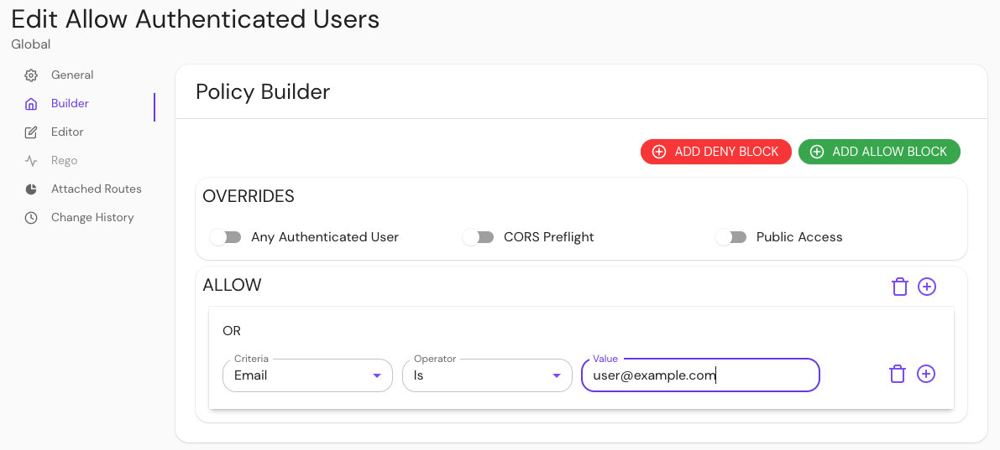
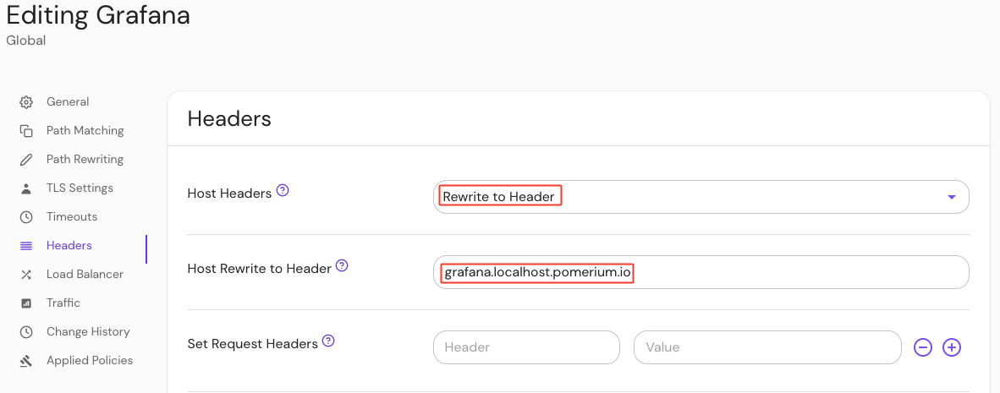
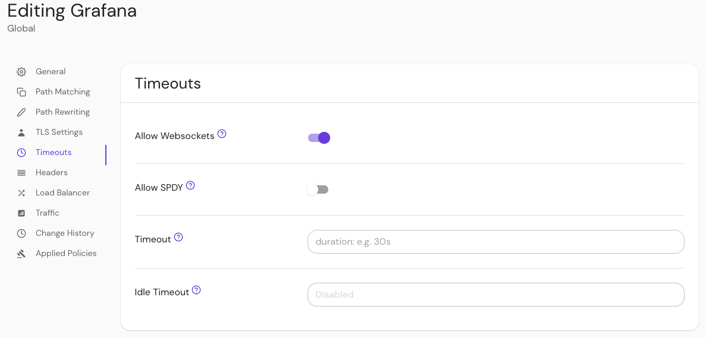
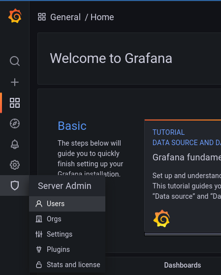

import Tabs from '@theme/Tabs';
import TabItem from '@theme/TabItem';

# Grafana

Learn how to use Pomerium to authenticate and authorize users of Grafana.

## What is Grafana?

[Grafana](https://grafana.com/) is an open-source analytics visualization and monitoring tool. It provides many user-contributed [Dashboards](https://grafana.com/grafana/dashboards/) that make it popular for enthusiasts as well as professionals.

This guide will demonstrate how to secure an instance of Grafana behind Pomerium, and provide users with a seamless login to Grafana using your identity provider.

## Configure Pomerium

<Tabs>

<TabItem value="Core" label="Core">

To complete this guide, you need:

- [Docker](https://www.docker.com/) and [Docker Compose](https://docs.docker.com/compose/install/)
- A preconfigured [identity provider](/docs/identity-providers) (IdP)

See the Pomerium [quick-start] guide to run Pomerium in a containerized Docker environment.

:::tip **Note**

This guide uses [GitHub](/docs/identity-providers/github) as the preconfigured IdP, but you can use any supported IdP.

:::

### Build a Grafana route

In your `config.yaml` file, add the following Grafana route:

```yaml title="config.yaml"
- from: https://grafana.localhost.pomerium.io
  to: http://grafana:3000
  host_rewrite_header: true
  policy:
    - allow:
        or:
          - email:
              is: user@example.com
```

In the code above:

- [`host_rewrite_header`](/docs/reference/routes/host-rewrite) rewrites the `Host:` header to match an incoming header value. Without this option enabled, Grafana will throw a `403: Origin not allowed` error after login when you attempt to add users.

This behavior is due to a CSRF check added in Grafana v8.3.5 (this guide uses v9.2.4) that requires the [Origin request header](https://developer.mozilla.org/en-US/docs/Web/HTTP/Headers/Origin) to match the server origin.

See this [GitHub issue](https://github.com/grafana/grafana/issues/45117#issuecomment-1033842787) for more information.

### Configure Grafana to use JWT authentication

Configuring Grafana to use JWT authentication makes it possible for Grafana to accept identity claims sent upstream by Pomerium.

Since you're not using a `grafana.ini` file to configure your Grafana instance, you can override Grafana's configuration using environment variables. See the [Grafana docs](https://grafana.com/docs/grafana/latest/setup-grafana/configure-grafana/#override-configuration-with-environment-variables) for more information.

In your `docker-compose.yaml` file, add the Grafana Docker image as a service:

```yaml title="docker-compose.yaml"
grafana:
  image: grafana/grafana:latest
  ports:
    - 3000:3000
  environment:
    - GF_AUTH_SIGNOUT_REDIRECT_URL=https://grafana.localhost.pomerium.io/.pomerium/sign_out
    - GF_AUTH_JWT_ENABLED=true
    - GF_AUTH_JWT_HEADER_NAME=X_POMERIUM_JWT_ASSERTION
    - GF_AUTH_JWT_EMAIL_CLAIM=email
    - GF_AUTH_JWT_JWK_SET_URL=https://authenticate.localhost.pomerium.io/.well-known/pomerium/jwks.json
    - GF_AUTH_JWT_CACHE_TTL=60m
  volumes:
    - ./grafana-storage:/var/lib/grafana
```

Here's what the environment variables do:

- `GF_AUTH_SIGNOUT_REDIRECT_URL`: signs users out of Pomerium when they sign out of Grafana
- `GF_AUTH_JWT_ENABLED`: enables JWT authentication (Grafana disables it by default)
- `GF_AUTH_JWT_HEADER_NAME`: tells Grafana which HTTP header to look at for the JWT (see [Identity Verification] for more information)
- `GF_AUTH_JWT_EMAIL_CLAIM`: associates the `email_claim` in the JWT with the email of the Grafana user
- `GF_AUTH_JWT_JWK_SET_URL`: defines the URL with the signing key to validate the JWT
- `GF_AUTH_JWT_CACHE_TTL`: sets a 60-minute cache time for the token

Run `docker-compose up` and navigate to `https://grafana.localhost.pomerium.io`.

</TabItem>
<TabItem value="Enterprise" label="Enterprise">


To complete this guide, you need:
   :::caution

   This is distinct from the **Users** option under the cog wheel (**Configuration**), which will only finalize a new user when they accept an invite via email or link.

   :::

- [Pomerium Core](https://www.pomerium.com/docs/releases/core)
- [Pomerium Enterprise](https://www.pomerium.com/docs/releases/enterprise/install/quickstart#install-pomerium-enterprise)

### Configure Pomerium Enterprise
=======
   :::tip

   You can access the special endpoint `/.pomerium` from any Pomerium route to view the data provided by Pomerium in the JWT.

   :::

In your Console, create a policy:

1. Enter a **Name** (e.g. 'Allow Authenticated Users')
2. Select **Builder**, **ADD ALLOW BLOCK**
3. Select **+** and add an **OR** operator
4. Under the **Criteria** dropdown, select **Email**
5. In the **Value** field, enter **user@example.com**

Save your policy.



Build a route:

1. Enter a **Name** (e.g. 'Grafana')
2. In the **From** field, enter the externally accessible URL (e.g. `https://grafana.localhost.pomerium.io`)
3. In the **To** field, enter the host name (e.g. `http://grafana:3000`)
4. Under **Policies**, select **Allow Authenticated Users**
5. Select **Pass Identity Headers**

Configure your route to [rewrite the `Host:`](/docs/reference/routes/host-rewrite) header:

1. Under the **Create route** sidebar, select **Headers**
2. In the **Host Header** field, select **Rewrite to Header** from the dropdown menu
3. In the **Host Rewrite to Header** field, enter `grafana.localhost.pomerium.io`



This **Host Rewrite** option rewrites the `Host:` header to match an incoming header value. Without this option enabled, Grafana will throw a `403: Origin not allowed` error after login when you attempt to add users.

This behavior is due to a CSRF check added in Grafana v8.3.5 (this guide uses v9.2.4) that requires the [Origin request header](https://developer.mozilla.org/en-US/docs/Web/HTTP/Headers/Origin) to match the server origin.

See this [GitHub issue](https://github.com/grafana/grafana/issues/45117#issuecomment-1033842787) for more information.

Configure your route to [allow websockets](/docs/reference/routes/websocket-connections):

1. Under the route sidebar, select **Timeouts**
2. Select **Allow Websockets**



Save your route.

### Configure Grafana to use JWT authentication

You need to configure Grafana to enable JWT authentication. This makes it possible for Grafana to accept identity claims sent upstream by Pomerium.

In your `grafana.ini` file, make the following changes:

```yaml title="grafana.ini"
[auth]
signout_redirect_url = https://grafana.localhost.pomerium.io/.pomerium/sign_out
[auth.jwt]
enabled = true
header_name = X-Pomerium-Jwt-Assertion
email_claim = email
jwk_set_url = https://authenticate.localhost.pomerium.io/.well-known/pomerium/jwks.json
cache_ttl = 60m
```

Under `[auth]`:

- `signout_redirect_url`: signs users out of Pomerium when they sign out of grafana
- `signout_redirect_url`: signs users out of Pomerium when they sign out of Grafana

Under `[auth.jwt]`:

- `enabled = true`: enables JWT authentication (Grafana disables it by default)
- `header_name = X-Pomerium-Jwt-Assertion`: tells Grafana which HTTP header to look for the JWT (see [Identity Verification] for more infor mation) `header_name = X-Pomerium-Jwt-Assertion`: tells Grafana which HTTP header to look at for the JWT (see [Identity Verification] for more in formation)
- `email_claim`: associates the `email_claim` in the JWT with the email of the Grafana user
- `jwk_set_url`: defines the URL with the signing key to validate the JWT
- `cache_ttl`: sets a 60-minute cache time for the token

See the [Grafana docs](https://grafana.com/docs/grafana/latest/setup-grafana/configure-grafana/) for more information on custom and default configurations.

</TabItem>

</Tabs>

### Add users to Grafana

At this stage, Grafana is configured to use the `email` claim in the JWT to associate an incoming connection with a user (you will configure Pomerium to include identity information via the JWT in the next section).

But, the user first must exist in Grafana to be associated. Otherwise, you will see the following error in the browser after authenticating:

```json
{"message": "User not found"}
```

To avoid this error, create a user with administrator privileges. (If you plan on administering Grafana through a direct connection to the service, skip this section.)

To add users without requiring them to accept an invitation:

1. Log in to Grafana directly as an admin user at `https://grafana.localhost.pomerium.io` (if this is your first time signing up for Grafana, `admin` is the [default username and password](https://grafana.com/docs/grafana/v9.0/setup-grafana/configure-grafana/#security))

1. Select **Server Admin**, **Users**

   

   :::caution

   This is distinct from the **Users** option under the **Configuration** cog wheel, which will only finalize a new user when they accept an invite via email or link.

   :::

1. Select **New user** to create a new user. Make sure that the email address matches the one provided by Pomerium via your IdP.

   :::tip

   You can access the special endpoint `/.pomerium` from any Pomerium route to view the data provided by Pomerium in the JWT.

   :::

After creating a new user in Grafana, that user should be logged in automatically when they access Grafana from the Pomerium route (after first authenticating with your IdP, of course).

### Manage access at scale

:::tip Note

Ensure that Grafana is up to date to take advantage of `auto_sign_up`, as it is only available for JWT as of version 8.4.0.

:::

The steps outlined above work to confirm the configuration for small teams, but adding users individually and manually does not scale for larger organizations. To add users to Grafana at scale, you can use the Grafana's `auto_sign_up`configuration to auto-signup users as they log in:

```ini
[auth]
signout_redirect_url = https://grafana.localhost.pomerium.io/.pomerium/sign_out
[auth.jwt]
enabled = true
header_name = X-Pomerium-Jwt-Assertion
email_claim = email
jwk_set_url = https://auth.localhost.pomerium.io/.well-known/pomerium/jwks.json
cache_ttl = 60m
username_claim = sub ;sets the username to the value of the "sub" claim
auto_sign_up = true ;sets the login to automatically create a new user if one doesn't exist
[users]
auto_assign_org = true ;auto assigns the user to the existing default organization
auto_assign_org_role = Editor ;auto assigns the user the "Editor" role
```

Note that the value of `auto_assign_org_role` could also be "Admin" or "Viewer".

This will automatically create a user with their email and username populated. To have the "Name" field populated for users, you can set the `jwt_claims_headers` option in Pomerium to include `name` in the JWT payload:

<Tabs>
<TabItem value="config.yaml" label="config.yaml">

```yaml
jwt_claims_headers: name
```

</TabItem>
<TabItem value="Environment Variable" label="Environment Variable">

```bash
JWT_CLAIMS_HEADERS=name
```

</TabItem>
</Tabs>

This configuration will allow seamless authentication and authorization without any additional toil for your team.

:::tip

**For Google users:** When using Google as an IdP, the user field is populated by a numeric value that you cannot configure. Note that Grafana can accept the `name` field as a username, including spaces:

```abnf
username_claim = name
```

:::

## Troubleshooting

### Local Signing Key

In instances where Grafana cannot get the signing key for the JWTs from the Pomerium authenticate service, you can place a copy of the key locally.

For example, wildcard certificates signed by LetsEncrypt may still be cross-signed by the [expired DST R3 root]. While many browsers still trust these certificates (as long as they are also signed by a valid root), some applications reject them, including Grafana:

```log
logger=context error=Get "https://authenticate.localhost.pomerium.io/.well-known/pomerium/jwks.json": x509: certificate signed by unknown authority
```

To circumvent this issue, you can use `curl` or `wget` to download the signing key locally:

<Tabs>
<TabItem value="curl" label="curl">

From the Grafana host:

```bash
curl https://authenticate.localhost.pomerium.io/.well-known/pomerium/jwks.json > /etc/grafana/jwks.json
```

</TabItem>
<TabItem value="wget" label="wget">

From the Grafana host:

```bash
wget -O /etc/grafana/jwks.json https://authenticate.localhost.pomerium.io/.well-known/pomerium/jwks.json
```

</TabItem>
</Tabs>

Edit `grafana.ini` and add the `jwk_set_file` key to provide it to Grafana:

```ini
[auth.jwt]
enabled = true
header_name = X-Pomerium-Jwt-Assertion
email_claim = email
jwk_set_file = /etc/grafana/jwks.json
cache_ttl = 60m
```

[`authenticate_service_url`]: /docs/reference/authenticate-service-url
[expired dst r3 root]: https://letsencrypt.org/docs/dst-root-ca-x3-expiration-september-2021/
[global users]: https://grafana.com/docs/grafana/latest/http_api/admin/#global-users
[ingress-cert-manager]: /docs/deploying/k8s/ingress.md#cert-manager-integration
[jwt authentication]: https://grafana.com/docs/grafana/v9.0/setup-grafana/configure-security/configure-authentication/jwt/
[identity verification]: /docs/capabilities/getting-users-identity
[quick-start]: /docs/quickstart
