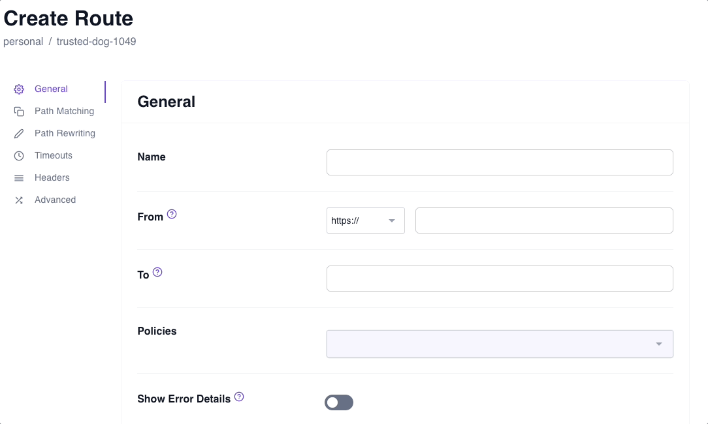
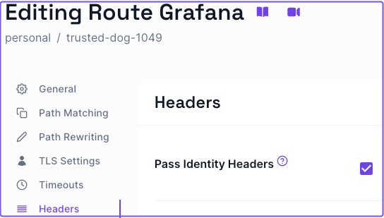
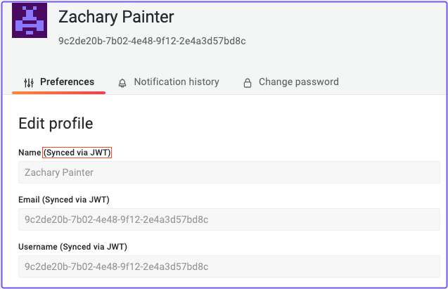

import TabItem from '@theme/TabItem';
import Tabs from '@theme/Tabs';

import Config from '/content/examples/guides/grafana/config.yaml.md';
import Compose from '/content/examples/guides/grafana/docker-compose.yaml.md';

# Secure Grafana with Pomerium

## What this guide does

You'll put Grafana behind Pomerium so that Pomerium handles single sign-on and authorization, then forwards a cryptographically signed identity JWT to Grafana. Grafana verifies that JWT and signs the user in automatically, so there's no second login and no separate Grafana user directory to manage.

<iframe
  width="100%"
  height="500"
  src="https://www.youtube.com/embed/kpTcbu5s-xU?si=rlass29s-lncmFRe"
  frameborder="0"
  webkitallowfullscreen="true"
  mozallowfullscreen="true"
  allowfullscreen="true"></iframe>

## When to use this guide

Use it when you want one front door for Grafana with your existing identity, and you want Grafana to trust Pomerium for authentication instead of running its own login. If you only need to reach Grafana over a private network without browser SSO, a plain [TCP route](/docs/capabilities/non-http) is a better fit.

## Prerequisites

This guide assumes you've completed the [Quickstart](/docs/get-started/quickstart), so you already have Pomerium running and signing users in through the hosted authenticate service.

You also need:

- [Docker](https://docs.docker.com/install/) and [Docker Compose](https://docs.docker.com/compose/install/)
- A domain you control for the Grafana route (this guide uses `grafana.yourdomain.com`)

:::tip Prefer to self-host the identity provider?

This guide uses the hosted authenticate service so you don't have to run an IdP. To run your own instead, follow [Keycloak + Pomerium](/docs/integrations/user-identity/oidc) and swap the `authenticate_service_url` / `idp_*` settings into the config below.

:::

## Configure Pomerium

<Tabs queryString="type">
<TabItem value="zero" label="Pomerium Zero" default>

In the [Zero Console](https://console.pomerium.app):

1. Create a **Route**. In **From**, enter `https://grafana.<your-starter-domain>`; in **To**, enter `http://grafana:3000`.
2. Set the policy to **Any Authenticated User**.

   

3. On the **Headers** tab, enable **Pass Identity Headers** and save.

   

Zero manages the route's TLS certificate and the signing key behind its starter domain, so Grafana's JWKS URL is your authenticate service: `https://authenticate.<your-starter-domain>/.well-known/pomerium/jwks.json`. Use that value for `GF_AUTH_JWT_JWK_SET_URL` in the next section.

</TabItem>
<TabItem value="core" label="Pomerium Core">

Create a `config.yaml`. It routes `grafana.yourdomain.com` to the Grafana container, passes identity headers, and sets a `signing_key` so Pomerium publishes a JWKS that Grafana can verify the forwarded assertion against.

<Config />

Replace `grafana.yourdomain.com` with your domain, `you@example.com` with your email, and generate your own `signing_key` with the command in the comment. With Core, Grafana's JWKS URL is the route's own well-known endpoint (`https://grafana.yourdomain.com/.well-known/pomerium/jwks.json`), which is what the Compose file below uses.

</TabItem>
</Tabs>

## Configure Grafana

Grafana's [JWT authentication](https://grafana.com/docs/grafana/latest/setup-grafana/configure-security/configure-authentication/jwt/) reads the assertion Pomerium forwards and signs the user in. The key settings:

- `GF_AUTH_JWT_HEADER_NAME=X-Pomerium-Jwt-Assertion` — the header Pomerium sends the signed identity JWT in.
- `GF_AUTH_JWT_JWK_SET_URL` — where Grafana fetches Pomerium's public keys to verify the JWT (see the URL for your path above).
- `GF_AUTH_JWT_EMAIL_CLAIM` / `GF_AUTH_JWT_USERNAME_CLAIM=email` — which claim becomes the Grafana account.
- `GF_AUTH_JWT_AUTO_SIGN_UP=true` — create the Grafana user on first sign-in.

## Run the stack

The Compose file runs Pomerium Core and Grafana together (for Zero, drop the `pomerium` service and use the `compose.yaml` from the Quickstart with your `POMERIUM_ZERO_TOKEN`, keeping the `grafana` service below):

<Compose />

Start it:

```bash
docker compose up -d
```

## Verify the setup

1. **The route requires authentication.** In a fresh browser, open `https://grafana.yourdomain.com`. You should be redirected to sign in, not straight into Grafana.
2. **An allowed user gets in.** Sign in. Pomerium redirects you back to Grafana.
3. **JWT SSO works.** Grafana signs you in automatically. Open `/profile` and confirm your name, email, and username show **Synced via JWT**.

   

This guide ships a sealed end-to-end test (`content/examples/guides/grafana/validate/`) that runs exactly these checks against an in-network identity provider on every change.

## Common failure modes

- **Grafana shows its own login form instead of signing you in.** The JWT didn't verify. Check `GF_AUTH_JWT_JWK_SET_URL` is reachable from the Grafana container and that Pomerium has a `signing_key` (Core) so the JWKS isn't empty.
- **`failed to verify JWT: no keys found` in Grafana logs.** Same cause: no published signing key. Generate and set `signing_key` in `config.yaml`.
- **Redirect loop or certificate errors.** Make sure DNS for `grafana.yourdomain.com` points at Pomerium and that `autocert` could reach Let's Encrypt on ports 80/443.

## Security considerations

- Grafana trusts any request carrying a JWT it can verify, so **don't expose Grafana directly** — only Pomerium should reach `grafana:3000`. Keep it off published ports and on the internal Docker network.
- `GF_AUTH_JWT_AUTO_SIGN_UP=true` grants a Grafana account to every user your Pomerium policy allows. Scope the route policy (group or domain) to who should have access, and manage Grafana org roles separately.

## Next steps

- [Build policies](/docs/get-started/fundamentals/zero/zero-build-policies)
- [Pass identity headers](/docs/reference/routes/pass-identity-headers-per-route)
- [Custom domains](/docs/capabilities/custom-domains)
