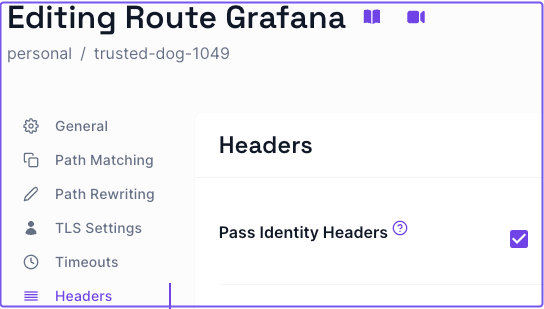

---
# cSpell:ignore abnf

title: Securing Grafana with Pomerium
sidebar_label: Grafana
lang: en-US
keywords:
  [
    pomerium,
    identity access proxy,
    data,
    logging,
    graphing,
    grafana,
    authentication,
    authorization,
  ]
description: This guide covers how to use Pomerium to authenticate and authorize users of Grafana.
---

import Tabs from '@theme/Tabs';
import TabItem from '@theme/TabItem';

# Secure Grafana with Pomerium Zero

In this guide, you'll configure Pomerium Zero to provide single sign-on (SSO) access to Grafana with JWT authentication.

### Before you start

This guide uses Docker to run Pomerium Zero and Grafana services in containers.

To complete this guide, you need:

- A Pomerium Zero account
- Docker and Docker Compose

## Configure Pomerium Zero

### Create a Grafana route

First, build a route that points to the Grafana service.

In the Zero Console:

1. Create a **Route** and name it
2. In **From**, select `https://` and enter the external URL
3. In **To**, enter the internal URL
4. In the **Policies** field, select `Any Authenticated User`
    

### Configure headers settings

Instruct Pomerium to forward the user's JWT as a cryptographically signed HTTP header with the [Pass Identity Headers](/docs/reference/routes/pass-identity-headers-per-route) setting.

1. Select the **Headers** tab
1. Apply **Pass Identity Headers**
1. Save the route changes

    

:::note

See the [**Sign in to Grafana**](https://grafana.com/docs/grafana/latest/setup-grafana/sign-in-to-grafana/) docs for steps on accessing Grafana with initial admin settings. You may want to sign in as the admin user to Grafana before configuring Pomerium to forward the JWT. This way, you can add yourself as a user and assign yourself `Admin` privileges.

:::

## Configure Grafana

Add the Grafana configuration below to the Docker Compose file running Pomerium Zero. The Grafana environment variables configure Grafana to accept JWTs from the incoming request and what claims to look for.

```yaml title="docker-compose.yaml" {14,22,27} showLineNumbers
  pomerium:
    image: pomerium/pomerium:v0.25.1
    ports:
      - 443:443
    restart: always
    environment:
      POMERIUM_ZERO_TOKEN: <CLUSTER_TOKEN>
      XDG_CACHE_HOME: /var/cache
    volumes:
      - pomerium-cache:/var/cache
    networks:
      main:
        aliases:
        - authenticate.<CLUSTER_STARTER_SUBDOMAIN>.pomerium.app
  grafana:
    image: grafana/grafana:latest
    ports:
      - 3000:3000
    networks:
      main: {}
    environment:
      - GF_AUTH_SIGNOUT_REDIRECT_URL=https://grafana.<CLUSTER_STARTER_SUBDOMAIN>.pomerium.app/.pomerium/sign_out
      - GF_AUTH_JWT_ENABLED=true
      - GF_AUTH_JWT_HEADER_NAME=X-Pomerium-Jwt-Assertion
      - GF_AUTH_JWT_EMAIL_CLAIM=sub
      - GF_AUTH_JWT_USERNAME_CLAIM=sub
      - GF_AUTH_JWT_JWK_SET_URL=https://authenticate.<CLUSTER_STARTER_SUBDOMAIN>.pomerium.app/.well-known/pomerium/jwks.json
      - GF_AUTH_JWT_CACHE_TTL=60m
      - GF_AUTH_JWT_AUTO_SIGN_UP=true
    volumes:
      - ./grafana-storage:/var/lib/grafana
```

In lines `14`, `22`, and `27`, replace `CLUSTER_STARTER_SUBDOMAIN` with your own.

For example, if your starter domain is `curious-cat-9999.pomerium.app`, you would replace `CLUSTER_STARTER_DOMAIN` in lines `14`, `22`, and `27` with `curious-cat-9999`.

:::info

You can add your own custom domain to replace the generated starter domain assigned to your cluster. See the [**Custom Domains**](/docs/capabilities/custom-domains) page for specific instructions.

:::

Now, apply your changeset. Then, run the following command to start Docker:

```bash
docker compose up
```

## Access Grafana with JWT Authentication

In your browser, access the external route you built that points to Grafana.

Grafana will automatically sign you in with your JWT. You can verify the JWT worked by going to the `/profile` page and looking at your profile preferences:


Success!
