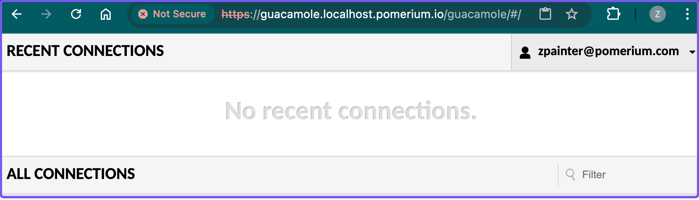

# Secure Apache Guacamole

This guide shows you how to secure an instance of [Apache Guacamole](https://guacamole.apache.org/), a clientless, remote desktop gateway that supports VNC, RDP, and SSH protocols. 

## How to secure Apache Guacamole 

You'll run a Guacamole server behind Pomerium, and configure the Guacamole instance to support [HTTP header authentication](https://guacamole.apache.org/doc/gug/header-auth.html). After a user authenticates against the configured identity provider, Pomerium will forward the user's email address in an unsigned HTTP header to Guacamole with the request.  

Guacamole will pull the email address from the unsigned HTTP header and verify that it matches the authenticated user's email address. If Guacamole can validate the email address, it will sign the user in without prompting them to reauthenticate.

:::note

This guide provides steps to secure client access to the Guacamole gateway behind Pomerium. It does not cover how to add connections to Guacamole itself.

:::

### Before you start

To complete this guide, you need:

- [Pomerium Core](/docs/core) 
- [Docker](https://docs.docker.com/install/) and [Docker Compose](https://docs.docker.com/compose/install/)

:::note 

This guide uses the [Hosted Authenticate Service](/docs/capabilities/hosted-authenticate-service.md), which provides its own hosted identity provider and authenticate service URL. If you prefer to configure your own identity provider, see [Self-Hosted Authenticate Service](/docs/capabilities/self-hosted-authenticate-service).

:::

## Install Guacamole with Docker Compose

[Installing Guacamole](https://guacamole.apache.org/doc/gug/guacamole-docker.html) with Docker requires the following services:

- `guacamole/guacd`: The guacd daemon, which provides support for VNC, RDP, SSH, telnet, and Kubernetes.
- `guacamole/guacamole`: The Guacamole web application running within a Tomcat 8 server with websocket support.
- `mysql` or `postgres`: The relational database that stores authentication and connection configuration data.

This guide uses an open-source [Docker Compose](https://github.com/boschkundendienst/guacamole-docker-compose) configuration to install these services. This configuration file also includes an `nginx` instance, which you'll replace with Pomerium.

To get started: 

1. Clone the [`guacamole-docker-compose`](https://github.com/boschkundendienst/guacamole-docker-compose) repository:   
    ```bash
    git clone https://github.com/boschkundendienst/guacamole-docker-compose
    ```
1. Go into your project and run the provided `prepare.sh` script. This script initializes a PostgreSQL database that works with Guacamole. (It generates also a self-signed certificate and private key for Nginx, which you can ignore.)
    ```bash
    cd guacamole-docker-compose
    ./prepare.sh
    ```

1. In the `guacamole` container, add the following environment variables:
  ```yaml title="docker-compose.yaml"
    guacamole:
      container_name: guacamole_compose
      depends_on:
      - guacd
      - postgres
      environment:
        GUACD_HOSTNAME: guacd
        POSTGRES_DATABASE: guacamole_db
        POSTGRES_HOSTNAME: postgres
        POSTGRES_PASSWORD: 'ChooseYourOwnPasswordHere1234'
        POSTGRES_USER: guacamole_user
        # highlight-start
        # Enables HTTP header authentication
        HEADER_ENABLED: true
        # Adds expected HTTP header from incoming Pomerium requests
        HTTP_AUTH_HEADER: X-Pomerium-Claim-Email
        # highlight-end
      image: guacamole/guacamole
      networks:
        - guacnetwork_compose
      volumes:
        - ./record:/record:rw
      ports:
      - 8080/tcp
      restart: always
  ```

## Configure Pomerium

In your Docker Compose file, replace `nginx` with Pomerium Core:

1. Remove the `nginx` configuration:
    ```yaml
    # nginx
    nginx:
      container_name: nginx_guacamole_compose
      restart: always
      image: nginx
      volumes:
      - ./nginx/templates:/etc/nginx/templates:ro
      - ./nginx/ssl/self.cert:/etc/nginx/ssl/self.cert:ro
      - ./nginx/ssl/self-ssl.key:/etc/nginx/ssl/self-ssl.key:ro
      ports:
      - 8443:443
      links:
      - guacamole
      networks:
        guacnetwork_compose
    ```
1. Add the Pomerium Core configuration:
    ```yaml showLineNumbers
    pomerium:
      image: cr.pomerium.com/pomerium/pomerium:latest
      # highlight-start
      # Mount your config file
      volumes:
        - ./config.yaml:/pomerium/config.yaml:ro
      # highlight-end
      ports:
        - 443:443
      networks:
        - guacnetwork_compose
      environment:
        JWT_CLAIMS_HEADERS: email
    ```
  
1. In line 5 above, you mount a Pomerium configuration file into Docker Compose. In your project's root directory, create a `config.yaml` file with the following configuration:
    ```yaml title="Pomerium configuration file"
    authenticate_service_url: https://authenticate.pomerium.app

    jwt_claim_headers: email

    routes:
      - from: https://guacamole.localhost.pomerium.io
        to: http://guacamole:8080
        policy:
          - allow:
              or:
                - email:
                  # highlight-next-line
                    is: user@example.com
        pass_identity_headers: true
        jwt_claims_headers: email
    ```
    Don't forget to replace `user@example.com` with your own email address.

A few things to note:
- [`pass_identity_headers`](/docs/reference/routes/pass-identity-headers-per-route) instructs Pomerium to send the [Pomerium JWT](/docs/capabilities/getting-users-identity) to Guacamole after the user authenticates successfully against the identity provider.
- [`jwt_claims_headers`](/docs/reference/jwt-claim-headers) instructs Pomerium to forward additional claims as unsigned HTTP headers with the request. (Guacamole expects an incoming `X-Pomerium-Claim-Email` HTTP header from Pomerium.)

## Run Docker Compose

Now, run `docker compose up -d`. 

Navigate to the Guacamole route defined in `config.yaml` by adding `/guacamole` to its path. For example, if your route is `guacamole.localhost.pomerium.io`, the route you'd access in the browser would be `guacamole.localhost.pomerium.io/guacamole`. 

After authenticating against the configured identity provider, Pomerium will redirect you to the Guacamole dashboard:

