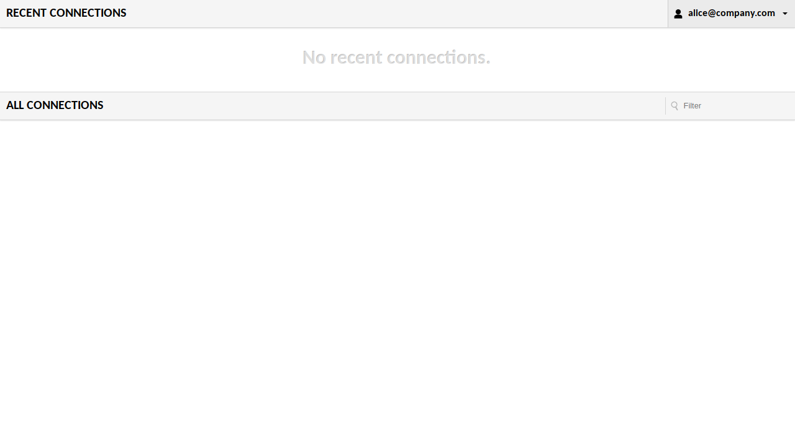

import TabItem from '@theme/TabItem';
import Tabs from '@theme/Tabs';

import Config from '/content/examples/guides/guacamole/config.yaml.md';
import Compose from '/content/examples/guides/guacamole/docker-compose.yaml.md';

# Secure Apache Guacamole with Pomerium

## What this guide does

You'll put [Apache Guacamole](https://guacamole.apache.org/) behind Pomerium so that Pomerium handles single sign-on and authorization, then forwards the authenticated user's email to Guacamole in an HTTP header. Guacamole's [header authentication extension](https://guacamole.apache.org/doc/gug/header-auth.html) reads that header and signs the user in, so users don't get a second login prompt. Guacamole still seeds a local administrator account; rotate or delete it before exposing the service.

This guide secures access to the Guacamole gateway. It does not cover adding remote-desktop connections inside Guacamole.

## When to use this guide

Use it when you want one front door for Guacamole with your existing identity and you want Pomerium, not Guacamole, to own authentication. Because Guacamole trusts the forwarded header, this pattern depends on Guacamole never being reachable except through Pomerium. See [Security considerations](#security-considerations) before exposing it.

## Prerequisites

This guide assumes you've completed the [Quickstart](/docs/get-started/quickstart), so you already have Pomerium running and signing users in through the hosted authenticate service.

You also need:

- [Docker](https://docs.docker.com/install/) and [Docker Compose](https://docs.docker.com/compose/install/)
- A domain you control for the Guacamole route (this guide uses `guacamole.yourdomain.com`)

## Configure Pomerium

<Tabs queryString="type">
<TabItem value="zero" label="Pomerium Zero" default>

In the [Zero Console](https://console.pomerium.app):

1. Create a **Route**. In **From**, enter `https://guacamole.<your-starter-domain>`; in **To**, enter `http://guacamole:8080`.
2. Set the policy to **Any Authenticated User** (or scope it to a group or domain).
3. On the **Headers** tab, enable **Pass Identity Headers**, and add a JWT claim header mapping `email` to `X-Pomerium-Claim-Email`. That unsigned header is what Guacamole reads to identify the user.

</TabItem>
<TabItem value="core" label="Pomerium Core">

Create a `config.yaml`. It routes `guacamole.yourdomain.com` to the Guacamole container, passes identity headers, and forwards the user's email as `X-Pomerium-Claim-Email`:

<Config />

Replace `guacamole.yourdomain.com` with your domain and `you@example.com` with your email. The `jwt_claims_headers` mapping is what produces the `X-Pomerium-Claim-Email` header that Guacamole's header-auth extension expects.

:::tip Prefer to self-host the identity provider?

This guide uses the hosted authenticate service so you don't have to run your own identity provider (IdP). To run your own instead, follow [Keycloak + Pomerium](/docs/integrations/user-identity/oidc) and swap the `authenticate_service_url` / `idp_*` settings into the config above.

:::

</TabItem>
</Tabs>

## Configure Guacamole

Guacamole runs as three services: the `guacd` daemon, a PostgreSQL database, and the web application. The web application turns on header authentication with two environment variables:

- `HEADER_ENABLED=true` enables the header-auth extension.
- `HTTP_AUTH_HEADER=X-Pomerium-Claim-Email` tells Guacamole which header carries the already-authenticated user.

When a request arrives with that header, Guacamole accepts the named user as authenticated. It does not validate a password, which is exactly why only Pomerium may reach it (see [Security considerations](#security-considerations)).

Guacamole stores its users and connections in PostgreSQL, so the database needs Guacamole's schema loaded on first boot. Generate it once into an `init/` directory next to your Compose file:

```bash
mkdir -p init
docker run --rm guacamole/guacamole /opt/guacamole/bin/initdb.sh --postgresql > init/initdb.sql
```

The Compose file below mounts that `init/` directory into PostgreSQL so the schema loads automatically.

## Run the stack

The Compose file runs Pomerium Core alongside Guacamole's three services (for Zero, drop the `pomerium` service and use the `compose.yaml` from the Quickstart with your `POMERIUM_ZERO_TOKEN`, keeping the rest below):

<Compose />

Start it:

```bash
docker compose up -d
```

On the first run, PostgreSQL loads Guacamole's schema before the web app can connect, so the `guacamole` container may restart a few times until the database is ready. `restart: always` handles this; give it up to a minute to settle.

## Verify the setup

1. **The route requires authentication.** In a fresh browser, open `https://guacamole.yourdomain.com`. You should be redirected to sign in, not straight into Guacamole.
2. **An allowed user gets in.** Sign in. Pomerium redirects you back to Guacamole.
3. **Header auth signs you in.** You land on the Guacamole home screen as your own user, not the Guacamole username/password form.

   

   To confirm it's the header (not a form login) that authenticated you, use the signed-in browser session to mint a token through Guacamole's REST API. Open your browser's developer console on the Guacamole page and run:

   ```js
   await fetch('/api/tokens', {method: 'POST'}).then((r) => r.json());
   ```

   The response should include your forwarded email as `username` and `header` as `dataSource`:

   ```json
   {"authToken": "...", "username": "you@example.com", "dataSource": "header"}
   ```

4. **A disallowed user is blocked.** Sign in as a user your policy excludes and open `https://guacamole.yourdomain.com`. Pomerium denies access, so no identity header is forwarded and you never reach Guacamole.

## Common failure modes

- **Guacamole shows its own login form instead of signing you in.** The header didn't arrive. Confirm the route has `pass_identity_headers: true` and a `jwt_claims_headers` mapping for `X-Pomerium-Claim-Email`, and that `HTTP_AUTH_HEADER` matches it exactly.
- **`Unexpected internal error` / `password is an empty string` in the Guacamole logs.** The web app can't reach PostgreSQL. Check the `POSTGRESQL_HOSTNAME`, `POSTGRESQL_USERNAME`, and `POSTGRESQL_PASSWORD` values on the `guacamole` service match the database, and that `init/initdb.sql` was generated and mounted.
- **Redirect loop or certificate errors.** Make sure DNS for `guacamole.yourdomain.com` points at Pomerium and that Pomerium can obtain a TLS certificate. On the Core path, `autocert` needs ports 80 and 443 reachable for Let's Encrypt; Zero manages certificates for you.

## Security considerations

The header-auth model is only as safe as two properties the Compose file above enforces, plus two steps you own in production:

- **Pomerium owns the identity header.** With `HEADER_ENABLED=true`, Guacamole signs in whoever the `X-Pomerium-Claim-Email` header names, with no password. The header is unsigned, so its trustworthiness depends on Pomerium setting it. Pomerium overwrites any inbound copy of the header with the authenticated user before the request reaches Guacamole, so a client that forges `X-Pomerium-Claim-Email` through Pomerium is still signed in as its real identity, never the spoofed one.
- **Guacamole is reachable only through Pomerium.** The forged-header protection only matters if a client can't skip Pomerium and talk to Guacamole directly. The Compose file puts `guacd`, `postgres`, and `guacamole` on an `internal: true` network and publishes host ports only on `pomerium`, so nothing but Pomerium can route to `guacamole:8080`. If you deploy differently, keep Guacamole off public ports and off any network a client can reach. A client that could reach Guacamole directly would forge the header and bypass authentication entirely.
- **Rotate or delete the default `guacadmin` account.** Guacamole's database schema seeds a built-in administrator, `guacadmin` / `guacadmin`, that authenticates against the database, not the header. Header auth doesn't remove it: a client that reaches Guacamole's form login directly (off Pomerium) could sign in with it and get full admin access. Through Pomerium the forwarded header takes over before the form login runs, so remediate it in the database. Delete the row or give it a strong, unique password:

  ```bash
  docker compose exec postgres psql -U guacamole_user -d guacamole_db \
    -c "DELETE FROM guacamole_entity WHERE name = 'guacadmin' AND type = 'USER';"
  ```

- **Scope the route policy** to the group or domain that should have access. Header auth grants a Guacamole session to every user your Pomerium policy allows.

## Operations

Guacamole's users, connections, and history live in PostgreSQL on the `guacamole-data` volume, so they persist across restarts.

```bash
docker compose down      # stop the stack, keep the database
docker compose down -v   # stop and delete the volumes (resets the DB, including guacadmin)
```

## Next steps

- [Build policies](/docs/get-started/fundamentals/zero/zero-build-policies)
- [Pass identity headers](/docs/reference/routes/pass-identity-headers-per-route)
- [Custom domains](/docs/capabilities/custom-domains)
