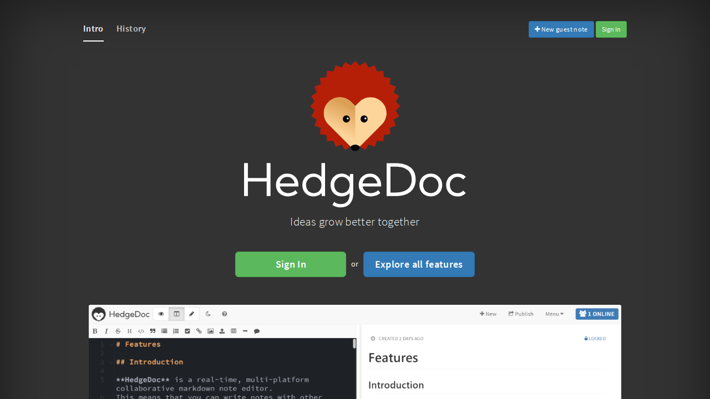

import TabItem from '@theme/TabItem';
import Tabs from '@theme/Tabs';

import Config from '/content/examples/guides/hedgedoc/config.yaml.md';
import Compose from '/content/examples/guides/hedgedoc/docker-compose.yaml.md';

# Secure HedgeDoc with Pomerium

## What this guide does

[HedgeDoc](https://hedgedoc.org/) is a collaborative, web-based Markdown editor for writing notes, diagrams, and documents in real time. This guide puts HedgeDoc behind Pomerium so that Pomerium handles single sign-on and authorization before any request reaches the editor. HedgeDoc keeps its own accounts and sharing model; Pomerium is the front door that decides who is allowed to open it.

## When to use this guide

Use it when you run a self-hosted HedgeDoc instance and want one identity-aware front door in front of it instead of exposing it to the open internet. If you only need to reach HedgeDoc over a private network without browser SSO, a plain [TCP route](/docs/capabilities/non-http) is a better fit.

## Prerequisites

This guide assumes you've completed the [Quickstart](/docs/get-started/quickstart), so you already have Pomerium running and signing users in through the hosted authenticate service.

You also need:

- [Docker](https://docs.docker.com/install/) and [Docker Compose](https://docs.docker.com/compose/install/)
- A domain you control for the HedgeDoc route (this guide uses `hedgedoc.yourdomain.com`)

:::tip Prefer to self-host the identity provider?

This guide uses the hosted authenticate service so you don't have to run your own identity provider (IdP). To run your own instead, follow [Keycloak + Pomerium](/docs/integrations/user-identity/oidc) and swap the `authenticate_service_url` / `idp_*` settings into the config below.

:::

## Configure Pomerium

<Tabs queryString="type">
<TabItem value="zero" label="Pomerium Zero" default>

In the [Zero Console](https://console.pomerium.app):

1. Create a **Route**. In **From**, enter `https://hedgedoc.<your-starter-domain>`; in **To**, enter `http://hedgedoc:3000`.
2. On the route's settings, enable **Allow WebSockets**. HedgeDoc's collaborative editor keeps a live connection open, and the route has to permit the WebSocket upgrade or the editor will fail to load.
3. Set the policy to **Any Authenticated User**, or scope it to the group or domain that should have access.

</TabItem>
<TabItem value="core" label="Pomerium Core">

Create a `config.yaml`. It routes `hedgedoc.yourdomain.com` to the HedgeDoc container, allows the WebSocket upgrade the editor needs, and limits access with a policy.

<Config />

Replace `hedgedoc.yourdomain.com` with your domain and `you@example.com` with the email (or group, or domain) that should be allowed in. The `allow_websockets: true` line is required: without it HedgeDoc's real-time editor can't open its connection.

</TabItem>
</Tabs>

## Configure HedgeDoc

HedgeDoc needs to know the public URL it's served from so that links, redirects, and cookies are correct when it sits behind Pomerium's TLS. The key [configuration](https://docs.hedgedoc.org/configuration/) values:

- `CMD_DOMAIN=hedgedoc.yourdomain.com` — the external hostname users reach, which is the Pomerium route host.
- `CMD_PROTOCOL_USESSL=true` and `CMD_URL_ADDPORT=false` — HedgeDoc is reached over HTTPS on the standard port through Pomerium, so it should build `https://` URLs without a port suffix.
- `CMD_SESSION_SECRET` — signs HedgeDoc's session cookies. Generate your own with `head -c32 /dev/urandom | base64`; if you leave it unset, HedgeDoc picks a new random value on every restart and signs everyone out.

HedgeDoc stores its notes in PostgreSQL, so the Compose file below also runs a `database` service and points `CMD_DB_URL` at it.

## Run the stack

The Compose file runs Pomerium Core, HedgeDoc, and its PostgreSQL database together. For Zero, drop the `pomerium` service and use the `compose.yaml` from the Quickstart with your `POMERIUM_ZERO_TOKEN`, keeping the `hedgedoc` and `database` services below. Either way, the Pomerium container and the `hedgedoc` container must share a Docker network so that `to: http://hedgedoc:3000` resolves.

<Compose />

Start it:

```bash
docker compose up -d
```

## Verify the setup

1. **The route requires authentication.** In a fresh browser, open `https://hedgedoc.yourdomain.com`. You should be redirected to sign in, not straight into HedgeDoc.
2. **An allowed user gets in.** Sign in through Pomerium. After authentication, Pomerium redirects you to the HedgeDoc home page and the editor loads.

   

3. **The editor connects.** Open a new note and start typing. The live editor relies on the WebSocket connection you allowed on the route; if it works, your `allow_websockets` setting is correct.

## Common failure modes

- **Redirect loop or broken links inside HedgeDoc.** `CMD_DOMAIN`, `CMD_PROTOCOL_USESSL`, and `CMD_URL_ADDPORT` don't match how Pomerium serves the route. Set the domain to the route host, `CMD_PROTOCOL_USESSL=true`, and `CMD_URL_ADDPORT=false`.
- **The editor never loads or notes don't sync.** The WebSocket upgrade is being dropped. Confirm `allow_websockets: true` is set on the route (Core) or that **Allow WebSockets** is enabled (Zero).
- **Everyone gets signed out after a restart.** No fixed `CMD_SESSION_SECRET`. Set a stable, secret value so sessions survive restarts.
- **Certificate errors reaching the route.** Make sure DNS for `hedgedoc.yourdomain.com` points at Pomerium and that Pomerium can obtain a TLS certificate. On the Core path, `autocert` needs ports 80 and 443 reachable for Let's Encrypt; Zero manages certificates for you.

## Security considerations

HedgeDoc has no idea Pomerium is in front of it; it simply trusts whatever can reach `hedgedoc:3000`. That makes the trust boundary entirely Pomerium's job, so **don't expose HedgeDoc directly**. Keep the `hedgedoc` container off published host ports and only reachable on the internal Docker network, so the only path in is through Pomerium's policy.

The Compose file above leaves HedgeDoc's default guest-note behavior in place, so anyone your Pomerium policy admits can open the editor without a separate HedgeDoc account. Treat the route policy as the outer perimeter and tighten HedgeDoc's own authentication settings if note creation should require local accounts. The demo `database` password is `password`; change it before running anything beyond a local demo.

## Operations

To stop the stack without losing data, run `docker compose down`. The notes live in the `hedgedoc-database` volume and uploads in `hedgedoc-uploads`, so they survive a restart. Use `docker compose down -v` only when you want to delete those volumes and start clean.

To upgrade HedgeDoc, bump the pinned image tag (this guide uses `1.10.8`; check [the latest release](https://hedgedoc.org/latest-release)), then `docker compose pull && docker compose up -d`. Review the HedgeDoc release notes for database migrations before upgrading across minor versions.

## Next steps

- [Build policies](/docs/get-started/fundamentals/zero/zero-build-policies)
- [Custom domains](/docs/capabilities/custom-domains)
- [Non-HTTP (TCP) routes](/docs/capabilities/non-http)
