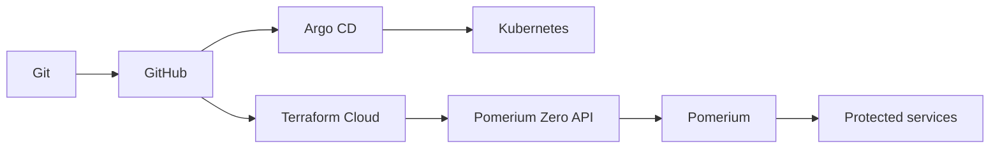
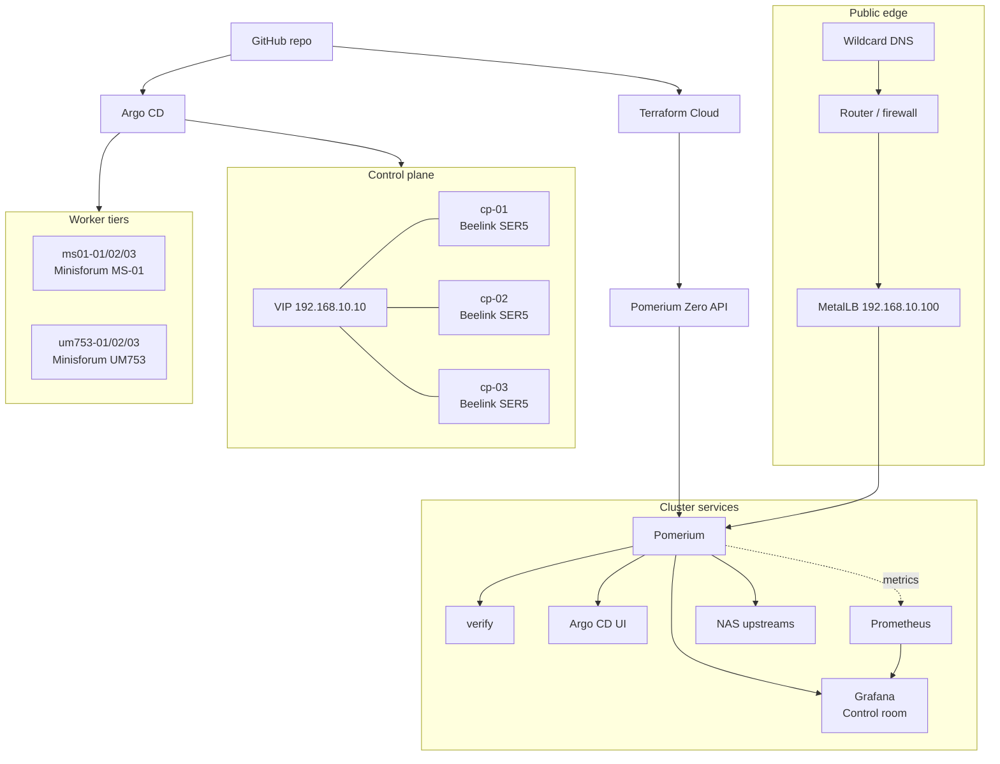
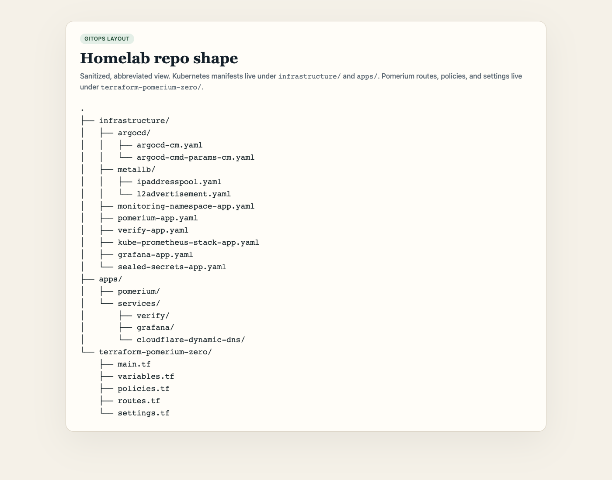
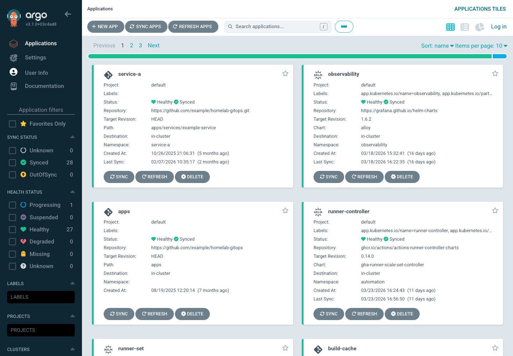
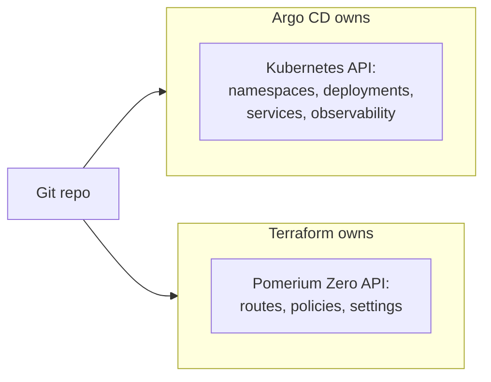
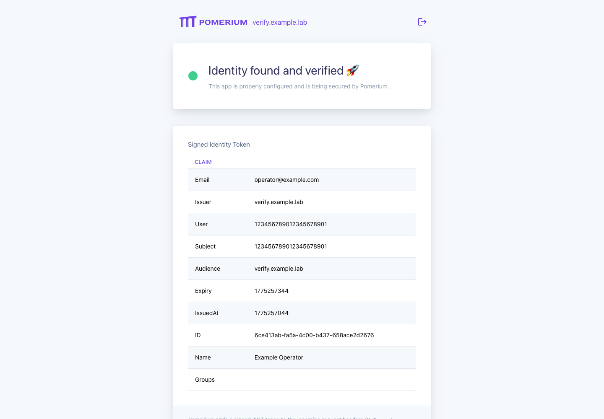
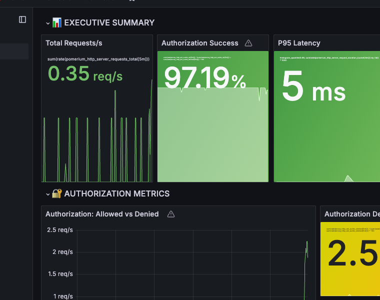

---
# cSpell:ignore homelab talosctl talconfig metallb kubeseal ddns mikrotik beelink minisforum argocd gitops siderolabs controlplane talosconfig kubeconfig ipaddresspool ipify checkip jsonencode parentbased traceidratio dogfood dogfooding

title: Build a Production-Grade Homelab Deployment Pipeline
sidebar_label: Homelab Pipeline
lang: en-US
keywords:
  [
    pomerium,
    homelab,
    talos,
    terraform,
    terraform cloud,
    argo cd,
    argocd,
    gitops,
    kubernetes,
    pomerium zero,
  ]
description: Build a production-grade homelab deployment pipeline with Talos Linux, Terraform Cloud, Argo CD, and Pomerium Zero on bare metal.
---

# Build a Production-Grade Homelab Deployment Pipeline

If your homelab matters, stop deploying it like a side project.

This guide takes one opinionated path: bare metal, Talos Linux, Argo CD, Terraform Cloud, Pomerium Zero, and Grafana as the control room. It is based on a live homelab that currently runs a 9-node Talos cluster, exposes Pomerium through MetalLB, reconciles workloads with Argo CD, and manages Pomerium routes and policies with the official Terraform provider.

The point is not to cosplay a datacenter. The point is to stop losing state, stop inventing drift, and know where to look when something breaks.

## Start state and end state

Start here if you want a deployment model with these properties:

- Kubernetes runs on hardware you control
- Git is the source of truth
- Argo CD owns Kubernetes objects
- Terraform owns Pomerium Zero objects
- You want one ingress layer in front of internal services
- You want every change to flow through the same validation loop

By the end of this guide, you will have:

- A Talos-based bare-metal cluster with clear node roles
- A GitOps repo split between Kubernetes manifests and Terraform
- Argo CD continuously reconciling cluster state
- Terraform Cloud managing Pomerium Zero routes, policies, and supported settings
- Pomerium protecting both in-cluster services and selected LAN upstreams
- Observability with Prometheus, Grafana, and OpenTelemetry
- Grafana as the first real operator UI behind Pomerium
- A shipped dashboard for managing the Pomerium cluster itself

## What "production-grade" means here

For a homelab, "production-grade" does not mean "copy a hyperscaler."

It means:

- the control plane is intentional
- ownership boundaries are clear
- infrastructure is reproducible
- you do not fix drift by hand
- every change is easy to validate and easy to roll back

If you cannot answer "who owns this change" and "how do I roll it back" in one sentence, the design is not done yet.

The control loop is simple:



This is the reference lab shape behind the guide:



## Before you start

This guide assumes:

- Three control-plane nodes (or one to start)
- At least one worker pool
- A dedicated Kubernetes subnet or VLAN
- A domain you control with wildcard DNS
- Router or firewall access for ports `443` and `80`
- A GitHub repository for GitOps state
- A [Terraform Cloud](https://app.terraform.io/signup) organization (free tier)
- A [Pomerium Zero](https://console.pomerium.app/create-account) account (free tier)
- An identity provider (the reference flow uses Google OAuth)

### Tools

```bash
brew install siderolabs/tap/talosctl
brew install kubectl
brew install hashicorp/tap/terraform
brew install kubeseal
brew install helm
```

## 1. Design the network first

Do not start with YAML. Start with failure domains, IP ranges, and traffic flow.

The live reference lab uses:

- a Kubernetes VLAN on `192.168.10.0/24`
- a control-plane VIP at `192.168.10.10`
- a MetalLB pool on `192.168.10.100-192.168.10.110`
- wildcard DNS that points at one public IP
- router forwards for `443` and `80` into the MetalLB address used by Pomerium

Keep these rules even if your numbers differ:

1. Give Kubernetes its own network segment.
2. Reserve a stable control-plane VIP.
3. Reserve a stable ingress address or range.
4. Put one ingress layer in front of everything.
5. Keep public DNS simple. A wildcard record is usually enough.

The live lab also separates hardware classes on purpose:

- three Beelink SER5 control-plane nodes
- three Minisforum MS-01 high-performance workers
- three Minisforum UM753 standard workers

That exact hardware is not the point. The point is that the control plane stays small and predictable while worker capacity can change independently.

### IP allocation

| Range              | Purpose               |
| ------------------ | --------------------- |
| 192.168.10.1       | Gateway               |
| 192.168.10.10      | Control plane VIP     |
| 192.168.10.11-13   | Control plane nodes   |
| 192.168.10.21-23   | HP worker nodes       |
| 192.168.10.31-33   | Standard worker nodes |
| 192.168.10.100-110 | MetalLB pool          |

### DNS flow

```
*.example.lab
  -> Cloudflare DNS (A record -> public IP)
  -> Router (port forward 443 -> 192.168.10.100)
  -> MetalLB (L2 advertisement -> Pomerium pod)
  -> Pomerium (authenticate -> authorize -> proxy)
  -> Backend service (e.g., verify.verify.svc.cluster.local:80)
```

## 2. Bootstrap Talos on bare metal

[Talos Linux](https://www.talos.dev) is a minimal, immutable operating system purpose-built for Kubernetes. There is no SSH, no shell, no package manager. You manage everything through the `talosctl` API.

Use the latest stable Talos release when you build the cluster. A live-lab snapshot at the end of this guide shows the real cluster state this public example was cross-checked against on April 3, 2026.

### Generate machine configs

```bash
mkdir -p ~/talos/homelab && cd ~/talos/homelab

talosctl gen config homelab https://192.168.10.10:6443 \
  --output-dir .
```

This creates `controlplane.yaml`, `worker.yaml`, and `talosconfig`.

### Configure the control plane VIP

For high availability, configure a shared VIP across your control plane nodes. Each node gets its own static IP, but they all share the VIP. Talos handles failover automatically.

```yaml title="controlplane.yaml (network excerpt)"
machine:
  network:
    interfaces:
      - interface: enp1s0
        addresses:
          - 192.168.10.11/24
        routes:
          - network: 0.0.0.0/0
            gateway: 192.168.10.1
        vip:
          ip: 192.168.10.10
```

### Apply configs and bootstrap

Flash Talos onto each machine (USB boot or PXE), then apply:

```bash
# Control plane
talosctl apply-config --insecure -n 192.168.10.11 -f controlplane.yaml
talosctl apply-config --insecure -n 192.168.10.12 -f controlplane.yaml
talosctl apply-config --insecure -n 192.168.10.13 -f controlplane.yaml

# Workers
talosctl apply-config --insecure -n 192.168.10.21 -f worker.yaml
talosctl apply-config --insecure -n 192.168.10.22 -f worker.yaml
talosctl apply-config --insecure -n 192.168.10.23 -f worker.yaml

# Bootstrap and get kubeconfig
talosctl bootstrap -n 192.168.10.11
talosctl kubeconfig -n 192.168.10.10
kubectl get nodes
```

Do these four things from the beginning:

- use static addresses for every important node
- give the control plane a VIP
- name every node intentionally
- treat NIC selection as part of the design, not as an afterthought

That last point matters. In the live lab, the most common rack-move failure mode is plugging a node into the wrong interface and watching Talos come up on the wrong network.

## 3. Create the GitOps repo layout

Keep Kubernetes manifests and Terraform in the same repository, but do not mix them in the same directory.

If you are starting fresh, a clean layout looks like this:

```text
homelab-gitops/
├── infrastructure/
│   ├── argocd/
│   ├── metallb/
│   ├── sealed-secrets-app.yaml
│   ├── pomerium-app.yaml
│   └── verify-app.yaml
├── apps/
│   ├── pomerium/
│   └── services/
│       ├── verify/
│       └── cloudflare-ddns/
└── terraform-pomerium/
    ├── main.tf
    ├── variables.tf
    ├── policies.tf
    ├── routes.tf
    └── settings.tf
```

Use this split consistently:

- `infrastructure/` defines Argo CD Applications and shared platform components
- `apps/` contains the manifests Argo CD applies into the cluster
- `terraform-pomerium/` manages Pomerium Zero state outside the Kubernetes API

The live lab follows the same shape today, with one practical exception: the Terraform working directory is still named `terraform-pomerium-zero/`. That stale name remains in place to avoid changing the Terraform Cloud working directory during the provider migration. If you are starting fresh, use a cleaner name.



## 4. Install MetalLB and Argo CD

Install the core control-plane components before you try to deploy services.

### MetalLB

In a homelab, there is no cloud provider to hand out `LoadBalancer` IPs. MetalLB fills that gap using L2 (ARP) advertisement.

```yaml title="infrastructure/metallb/ipaddresspool.yaml"
apiVersion: metallb.io/v1beta1
kind: IPAddressPool
metadata:
  name: default-pool
  namespace: metallb-system
spec:
  addresses:
    - 192.168.10.100-192.168.10.110
```

```yaml title="infrastructure/metallb/l2advertisement.yaml"
apiVersion: metallb.io/v1beta1
kind: L2Advertisement
metadata:
  name: default
  namespace: metallb-system
spec:
  ipAddressPools:
    - default-pool
```

MetalLB needs both the `IPAddressPool` and the `L2Advertisement` to function. Without the advertisement, the pool never gets announced to the network.

### Argo CD

```bash
kubectl create namespace argocd
kubectl apply -n argocd --server-side --force-conflicts \
  -f https://raw.githubusercontent.com/argoproj/argo-cd/v3.3.6/manifests/install.yaml
```

Switch to the per-application model early. One Application per service or platform component:

- smaller blast radius
- easier sync debugging
- clearer ownership boundaries
- simpler rollback behavior

### The Application pattern

Each service gets its own Argo CD `Application` resource:

```yaml title="infrastructure/verify-app.yaml"
apiVersion: argoproj.io/v1alpha1
kind: Application
metadata:
  name: verify
  namespace: argocd
  annotations:
    argocd.argoproj.io/sync-wave: '4'
spec:
  project: default
  source:
    repoURL: https://github.com/your-org/homelab-k8s-gitops.git
    targetRevision: main
    path: apps/services/verify
  destination:
    server: https://kubernetes.default.svc
    namespace: verify
  syncPolicy:
    automated:
      prune: true
      selfHeal: true
    retry:
      limit: 5
      backoff:
        duration: 5s
        factor: 2
        maxDuration: 3m
    syncOptions:
      - CreateNamespace=true
      - PruneLast=true
```

- **`prune`**: Deletes resources from the cluster that no longer exist in Git
- **`selfHeal`**: Reverts manual changes made directly to the cluster
- **`retry`**: Exponential backoff on sync failures during bootstrap
- **`sync-wave`**: Controls deployment order -- CRDs and infrastructure (wave 0-1) before applications (wave 2+)

### Disable Argo CD built-in auth

Since Pomerium handles authentication, disable Argo CD's built-in auth:

```yaml title="infrastructure/argocd/argocd-cmd-params-cm.yaml"
apiVersion: v1
kind: ConfigMap
metadata:
  name: argocd-cmd-params-cm
  namespace: argocd
data:
  server.disable.auth: 'true'
  server.insecure: 'true'
```

With `server.disable.auth` set to `true`, Pomerium handles all authentication at the proxy layer. The OIDC config below is optional -- it tells Argo CD how to resolve user identity from Pomerium's JWT so the UI can display who is logged in:

```yaml title="infrastructure/argocd/argocd-cm.yaml (excerpt)"
apiVersion: v1
kind: ConfigMap
metadata:
  name: argocd-cm
  namespace: argocd
data:
  url: 'https://argocd.example.lab'
  oidc.config: |
    name: Pomerium
    issuer: https://authn.example.lab
    clientId: argocd
    requestedScopes: ["openid", "profile", "email", "groups"]
```



### DNS with Cloudflare

If you have a residential IP, set up a DDNS cronjob so `*.example.lab` stays pointed at your public IP:

```yaml title="apps/services/cloudflare-ddns/cronjob.yaml"
apiVersion: batch/v1
kind: CronJob
metadata:
  name: cloudflare-ddns
  namespace: cloudflare-ddns
spec:
  schedule: '*/5 * * * *'
  concurrencyPolicy: Forbid
  jobTemplate:
    spec:
      template:
        spec:
          restartPolicy: OnFailure
          containers:
            - name: updater
              image: python:3.12-slim
              envFrom:
                - configMapRef:
                    name: cloudflare-ddns-config
                - secretRef:
                    name: cloudflare-ddns-secret
              command: ['/bin/sh', '-c']
              args:
                - python3 /opt/ddns/ddns.py
              volumeMounts:
                - name: script
                  mountPath: /opt/ddns
                  readOnly: true
          volumes:
            - name: script
              configMap:
                name: cloudflare-ddns-config
                items:
                  - key: ddns.py
                    path: ddns.py
```

Store the Python script as a key in a ConfigMap and the Cloudflare API token as a Secret (sealed with kubeseal, covered in [Seal your secrets](#5-seal-your-secrets)).

Forward ports `443` and `80` on your router to the Pomerium MetalLB IP (`192.168.10.100`). All HTTPS traffic routes through Pomerium, which handles TLS, authentication, and proxying.

## 5. Seal your secrets

Secrets do not belong in Git -- but the encrypted versions do. [Sealed Secrets](https://github.com/bitnami-labs/sealed-secrets) encrypts your secrets with a cluster-specific key. Only the controller running in your cluster can decrypt them.

Deploy it as a Helm-based Argo CD Application at sync wave 0 (before anything else needs secrets):

```yaml title="infrastructure/sealed-secrets-app.yaml"
apiVersion: argoproj.io/v1alpha1
kind: Application
metadata:
  name: sealed-secrets
  namespace: argocd
  annotations:
    argocd.argoproj.io/sync-wave: '0'
spec:
  project: default
  source:
    repoURL: https://bitnami-labs.github.io/sealed-secrets
    chart: sealed-secrets
    targetRevision: 2.16.2
    helm:
      releaseName: sealed-secrets
      values: |
        fullnameOverride: sealed-secrets
  destination:
    server: https://kubernetes.default.svc
    namespace: sealed-secrets
  syncPolicy:
    automated:
      prune: true
      selfHeal: true
    syncOptions:
      - CreateNamespace=true
```

Create and seal a secret:

```bash
# Create a plain secret (never commit this)
kubectl -n cloudflare-ddns create secret generic cloudflare-ddns-secret \
  --from-literal=CF_API_TOKEN=your-cloudflare-token \
  --from-literal=CF_ZONE_NAME=example.com \
  --from-literal=CF_RECORDS="example.lab,*.example.lab" \
  --dry-run=client -o yaml > /tmp/secret.yaml

# Seal it
kubeseal --format yaml < /tmp/secret.yaml \
  > apps/services/cloudflare-ddns/secret.sealed.yaml

# Clean up
rm /tmp/secret.yaml
```

Commit the sealed secret. Argo CD syncs it, the controller decrypts it, the plain secret exists only inside the cluster.

## 6. Deploy Pomerium in the cluster

This guide uses Pomerium Zero as the control plane and runs Pomerium in the cluster as the data plane.

1. Sign in to the [Pomerium Zero Console](https://console.pomerium.app)
2. Create a new cluster and copy the token
3. Configure your identity provider (Google OAuth in this guide)

Set the authenticate URL in the Pomerium Zero Console to `https://authn.example.lab`. Your `*.example.lab` wildcard DNS record covers it automatically.

Deploy Pomerium as an Argo CD-managed application:

```yaml title="apps/pomerium/deployment.yaml"
apiVersion: v1
kind: Namespace
metadata:
  name: pomerium
---
apiVersion: apps/v1
kind: Deployment
metadata:
  name: pomerium
  namespace: pomerium
spec:
  replicas: 1
  selector:
    matchLabels:
      app: pomerium
  template:
    metadata:
      labels:
        app: pomerium
      annotations:
        prometheus.io/scrape: 'true'
        prometheus.io/port: '9090'
    spec:
      containers:
        - name: pomerium
          image: pomerium/pomerium:v0.32.3
          env:
            - name: POMERIUM_ZERO_TOKEN
              valueFrom:
                secretKeyRef:
                  name: pomerium-zero-token
                  key: token
            - name: POMERIUM_METRICS_ADDRESS
              value: ':9090'
          ports:
            - containerPort: 443
              name: https
            - containerPort: 80
              name: http
            - containerPort: 9090
              name: metrics
          readinessProbe:
            httpGet:
              path: /ping
              port: 443
              scheme: HTTPS
            initialDelaySeconds: 5
            periodSeconds: 10
          livenessProbe:
            httpGet:
              path: /ping
              port: 443
              scheme: HTTPS
            initialDelaySeconds: 15
            periodSeconds: 30
          resources:
            requests:
              memory: 256Mi
              cpu: 250m
            limits:
              memory: 512Mi
              cpu: 500m
          volumeMounts:
            - name: databroker-storage
              mountPath: /var/pomerium/databroker
      volumes:
        - name: databroker-storage
          emptyDir: {}
---
apiVersion: v1
kind: Service
metadata:
  name: pomerium
  namespace: pomerium
  annotations:
    metallb.universe.tf/loadBalancerIPs: '192.168.10.100'
spec:
  type: LoadBalancer
  selector:
    app: pomerium
  ports:
    - name: https
      port: 443
      targetPort: 443
    - name: http
      port: 80
      targetPort: 80
```

The `metallb.universe.tf/loadBalancerIPs` annotation pins the LoadBalancer to a specific IP. This is the IP your router port-forwards to.

For a durable data plane, back Pomerium's databroker storage with a persistent volume. The manifest above uses `emptyDir` as a starting point; replace it with a PVC when you are ready to persist state across restarts.

:::note

The live lab currently runs a `git-` tagged Pomerium image to dogfood in-flight work. Do not copy that by default. This example pins `v0.32.3` as a concrete stable starting point. Update intentionally after checking the current release notes.

:::

## 7. Manage Pomerium Zero with Terraform

This is where the pipeline comes together. Instead of clicking through a UI to create routes, you define them as Terraform resources in your Git repository.

The [official Pomerium Terraform provider](https://registry.terraform.io/providers/pomerium/pomerium/latest/docs) works with Pomerium Zero, Core, and Enterprise. Same provider, same resources, same workflow.

### Provider configuration

```hcl title="terraform-pomerium/main.tf"
terraform {
  required_version = ">= 1.6.0"

  required_providers {
    pomerium = {
      source  = "pomerium/pomerium"
      version = "~> 0.32.0"
    }
  }
}

provider "pomerium" {
  api_url               = "https://console.pomerium.app"
  service_account_token = var.pomerium_api_token
}
```

### Define policies

```hcl title="terraform-pomerium/policies.tf"
resource "pomerium_policy" "trusted_users" {
  namespace_id = var.namespace_id
  name         = "trusted_users"
  description  = "Trusted users with full homelab access"
  enforced     = true

  ppl = jsonencode([{
    allow = {
      or = [
        { email = { ends_with = var.allowed_email_domain } },
      ]
    }
  }])
}
```

### Define routes

Each route maps an external URL to an internal service:

```hcl title="terraform-pomerium/routes.tf"
resource "pomerium_route" "verify" {
  namespace_id = var.namespace_id
  name         = "verify"
  from         = "https://verify.example.lab"
  to           = ["http://verify.verify.svc.cluster.local:80"]

  policies             = [pomerium_policy.trusted_users.id]
  preserve_host_header = true
  timeout              = "30s"
  idle_timeout         = "300s"
}

resource "pomerium_route" "argocd" {
  namespace_id = var.namespace_id
  name         = "ArgoCD Interface"
  from         = "https://argocd.example.lab"
  to           = ["http://argocd-server.argocd.svc.cluster.local:80"]

  policies             = [pomerium_policy.trusted_users.id]
  allow_websockets     = true
  preserve_host_header = true
  timeout              = "60s"
  idle_timeout         = "600s"
}

resource "pomerium_route" "grafana" {
  namespace_id = var.namespace_id
  name         = "Grafana"
  from         = "https://grafana.example.lab"
  to           = ["http://grafana.grafana.svc.cluster.local:3000"]

  policies             = [pomerium_policy.trusted_users.id]
  allow_websockets     = true
  preserve_host_header = true
  timeout              = "60s"
  idle_timeout         = "600s"

  set_request_headers = {
    "X-Environment" = "homelab"
    "X-Tool"        = "grafana"
  }
}
```

### Configure cluster settings

```hcl title="terraform-pomerium/settings.tf"
resource "pomerium_settings" "homelab" {
  cluster_id = var.cluster_id

  address           = ":443"
  dns_lookup_family = "V4_ONLY"
  log_level         = "info"
  metrics_address   = ":9090"

  authenticate_service_url = "https://authn.example.lab"
  idp_provider             = "google"
  idp_client_id            = var.idp_client_id
  idp_client_secret        = var.idp_client_secret
  scopes                   = ["openid", "profile", "email"]

  cookie_name      = "_pomerium_homelab"
  cookie_http_only = true
  cookie_expire    = "24h"
  cookie_same_site = "lax"

  default_upstream_timeout = "30s"
  pass_identity_headers    = true
}
```

### Set up Terraform Cloud

Terraform Cloud provides remote state, VCS-triggered runs, and team collaboration -- all on the free tier.

1. Create an organization and workspace connected to your GitHub repository
2. Set the working directory to `terraform-pomerium/`
3. Add variables as **environment** category (not Terraform category -- see note below):

| Variable                    | Type        | Sensitive |
| --------------------------- | ----------- | --------- |
| `TF_VAR_pomerium_api_token` | Environment | Yes       |
| `TF_VAR_idp_client_id`      | Environment | No        |
| `TF_VAR_idp_client_secret`  | Environment | Yes       |
| `TF_VAR_cluster_id`         | Environment | No        |
| `TF_VAR_namespace_id`       | Environment | No        |

4. Configure the backend:

```hcl title="terraform-pomerium/backend.tf"
terraform {
  cloud {
    organization = "your-homelab"
    workspaces { name = "homelab-k8s-gitops" }
  }
}
```

The VCS-triggered workflow: push a route change to `main`, Terraform Cloud plans, auto-apply applies, Pomerium picks up the new configuration.

:::caution Live-lab caveats

The live lab has a few migration details worth knowing about:

- the active provider endpoint is `https://console.pomerium.app`, not the older Console API URL pattern
- the token used here is a Pomerium Zero API Access token
- the live Terraform Cloud workspace still points at `terraform-pomerium-zero/`
- Terraform Cloud inputs are stored as environment-category `TF_VAR_*` variables because terraform-category vars are materialized at the repo root instead of the configured subdirectory
- `pomerium_settings` still has provider caveats in this area; the live lab omits fields that normalize badly at apply time, including the current `skip_xff_append` null behavior

These are live-lab details, not the default public path. Start with the released provider first.

:::

## 8. Put Argo CD on the Kubernetes side and Terraform on the Pomerium side

This ownership split is the core design decision in the guide.

Treat it as a hard boundary, not a suggestion:



Use Argo CD to own:

- namespaces
- deployments
- services
- ingress-adjacent Kubernetes resources
- observability stack components
- any object that naturally belongs in the Kubernetes API

Use Terraform to own:

- Pomerium settings
- Pomerium policies
- Pomerium routes

Do not make Argo CD and Terraform fight over the same object class.

In the live lab, that means:

- `apps/pomerium/` deploys the Pomerium pod and Service into Kubernetes
- `terraform-pomerium-zero/` manages the Zero-side route and policy model

That separation is what keeps the system understandable when you come back to it six months later.

## 9. Start with verify, then make Grafana canonical

Use a small service to prove the control loop before you protect real systems.

The live lab starts with `verify`, and that is still the right move.

```yaml title="apps/services/verify/deployment.yaml"
apiVersion: v1
kind: Namespace
metadata:
  name: verify
---
apiVersion: apps/v1
kind: Deployment
metadata:
  name: verify
  namespace: verify
spec:
  replicas: 1
  selector:
    matchLabels:
      app: verify
  template:
    metadata:
      labels:
        app: verify
    spec:
      containers:
        - name: verify
          image: pomerium/verify:latest
          ports:
            - containerPort: 8000
              name: http
          readinessProbe:
            httpGet:
              path: /
              port: 8000
            initialDelaySeconds: 5
            periodSeconds: 10
          resources:
            requests:
              cpu: 10m
              memory: 32Mi
            limits:
              cpu: 100m
              memory: 64Mi
---
apiVersion: v1
kind: Service
metadata:
  name: verify
  namespace: verify
spec:
  type: ClusterIP
  selector:
    app: verify
  ports:
    - name: http
      port: 80
      targetPort: 8000
```

Push the manifests and the Terraform route. Argo CD deploys the app, Terraform creates the route, Pomerium starts proxying.

Visit `https://verify.example.lab`. You should get a `302` redirect to your identity provider. After authenticating, you will see the verify page with your identity headers.



Your first protected service should let you confirm:

- Argo CD can reconcile the workload
- the upstream Service is healthy
- Terraform can create the route
- unauthenticated traffic gets a `302` redirect to the authenticate service
- authenticated traffic reaches the upstream cleanly

This is the pattern for every service you add: Kubernetes manifests in `apps/`, an Argo CD Application in `infrastructure/`, and a Terraform route in `terraform-pomerium/`.

After `verify`, do not jump straight to a random pile of apps. Protect Grafana next.

`verify` proves the pipe. Grafana keeps you out of the dark.

Grafana is the canonical second service because it answers the question that actually matters after bring-up: is the lab healthy, or are you about to waste an hour debugging blind.

Then make Grafana trust Pomerium and land on the right dashboard:

```yaml title="apps/services/grafana/deployment.yaml (env excerpt)"
env:
  - name: GF_SERVER_ROOT_URL
    value: https://grafana.example.lab
  - name: GF_AUTH_PROXY_ENABLED
    value: 'true'
  - name: GF_AUTH_PROXY_HEADER_NAME
    value: X-Pomerium-User
  - name: GF_AUTH_PROXY_WHITELIST
    value: 'YOUR_CLUSTER_INTERNAL_CIDR'
  - name: GF_AUTH_PROXY_HEADERS
    value: Name:X-Pomerium-Claim-Name,Email:X-Pomerium-Claim-Email,Login:X-Pomerium-User
  - name: GF_AUTH_PROXY_AUTO_SIGN_UP
    value: 'true'
  - name: GF_AUTH_DISABLE_LOGIN_FORM
    value: 'true'
  - name: GF_USERS_AUTO_ASSIGN_ORG_ROLE
    value: Viewer
  - name: GF_DASHBOARDS_DEFAULT_HOME_DASHBOARD_PATH
    value: /var/lib/grafana/dashboards/pomerium-cluster-control-room.json
```

Replace `YOUR_CLUSTER_INTERNAL_CIDR` with the pod CIDR or other internal source-network CIDR that can actually reach Grafana from the Pomerium side in your cluster.

Argo CD is still important, but Grafana should be the first operator UI you reach for once the pipe works. Argo tells you whether desired state converged. Grafana tells you whether the system is actually healthy.

Two rules matter here:

- do not leave Grafana reachable except through Pomerium
- restrict the auth proxy whitelist to the CIDR that can actually reach Grafana from the Pomerium side

## 10. Ship the dashboard

Do not protect Grafana and then land on a blank page.

Ship one landing dashboard that acts like a control room, not a screenshot wall.

It should answer these questions in under 10 seconds:

- are requests flowing
- are authorization decisions succeeding
- is latency rising
- are the Pomerium pods healthy
- which route is getting noisy

This guide now ships a dashboard bundle in the docs repo:

- https://github.com/pomerium/documentation/tree/main/content/examples/homelab-pipeline/grafana

It includes:

- `pomerium-cluster-control-room.json` for direct import into Grafana
- `dashboard-configmap.yaml` for Kubernetes provisioning

The dashboard is derived from the live lab's existing `pomerium-consolidated` and `homelab-ops-control` dashboards. It is smaller, but it keeps the same intent: fast triage first, drill-down second.

Representative PromQL queries from that bundle were executed successfully against the live lab's Prometheus API on April 3, 2026.

Treat the JSON file as the source of truth. If you provision Grafana from files, UI edits are temporary and will be overwritten on the next reprovision or restart.



## 11. Add observability

Deploy Prometheus for metrics, Grafana for dashboards, and OpenTelemetry for traces. Do not wait until after your first outage.

### Prometheus and Grafana

```yaml title="infrastructure/kube-prometheus-stack-app.yaml"
apiVersion: argoproj.io/v1alpha1
kind: Application
metadata:
  name: kube-prometheus-stack
  namespace: argocd
  annotations:
    argocd.argoproj.io/sync-wave: '2'
spec:
  project: default
  source:
    repoURL: https://prometheus-community.github.io/helm-charts
    chart: kube-prometheus-stack
    targetRevision: '>=65.0.0'
    helm:
      releaseName: kube-prometheus-stack
  destination:
    server: https://kubernetes.default.svc
    namespace: monitoring
  syncPolicy:
    automated:
      prune: true
      selfHeal: true
    syncOptions:
      - CreateNamespace=true
      - ServerSideApply=true
```

### Pomerium telemetry

Configure Pomerium to send traces and metrics by adding these environment variables to the deployment:

```yaml
- name: OTEL_TRACES_EXPORTER
  value: otlp
- name: OTEL_EXPORTER_OTLP_ENDPOINT
  value: otel-collector.observability.svc.cluster.local:4317
- name: OTEL_EXPORTER_OTLP_PROTOCOL
  value: grpc
- name: OTEL_EXPORTER_OTLP_INSECURE
  value: 'true'
- name: OTEL_TRACES_SAMPLER
  value: parentbased_traceidratio
- name: OTEL_TRACES_SAMPLER_ARG
  value: '1.0'
```

Pomerium also exposes a Prometheus metrics endpoint on `:9090`. Use the `prometheus.io/scrape` pod annotation (already in the deployment above) to scrape it.

Add a Terraform route for Grafana (shown in the [routes section](#define-routes) above). After Terraform applies, visit `https://grafana.example.lab`, authenticate through Pomerium, and you will land in Grafana with your Pomerium metrics available.

## 12. Validate every change the same way

Treat the control loop as part of the system, not as background plumbing.

For every change:

1. Confirm GitHub automation is green
2. Confirm Terraform Cloud planned or applied successfully
3. Confirm Argo CD is `Synced` and `Healthy`
4. Confirm there are no broken pods
5. Confirm the route behavior with `curl -I`

These are the exact checks used against the live lab.

Typical route test:

```bash
curl -I https://verify.example.lab
```

Expected behavior for a protected route:

- `302` redirect to the authenticate endpoint when unauthenticated
- not `404` (route missing)
- not `502` (upstream down)
- not `503` (Pomerium overloaded)

On April 3, 2026, the live lab validated this successfully for representative routes including `verify`, `grafana`, and `argocd`. Each returned a `302` redirect to the authenticate service, and all Argo CD applications were `Synced` and `Healthy`.

## Current live lab snapshot

This public example was cross-checked against the real lab on April 3, 2026. The cluster was running:

| Category           | Current state                   |
| ------------------ | ------------------------------- |
| Kubernetes         | `v1.33.3`                       |
| Talos              | `v1.12.2`                       |
| Argo CD            | `v3.1.0`                        |
| Pomerium           | `git-7cb5e0f7`                  |
| Terraform provider | `pomerium/pomerium v0.32.101`   |
| Nodes              | 9 total (3 CP + 3 HP + 3 Std)   |
| Control plane VIP  | `192.168.10.10`                 |
| MetalLB range      | `192.168.10.100-192.168.10.110` |

The snippets above are not a byte-for-byte export of that repo. They intentionally normalize a few lab-specific pins for public docs: the live lab is still on Argo CD `v3.1.0`, while the install example uses `v3.3.6` for a fresh deployment; the guide uses cleaner example domains instead of `k8s.bdd.io`; it uses a stable Pomerium image instead of the live lab's dogfood build; and it uses broader install/version examples where the real lab is carrying migration or upgrade lag.

## Next steps

Once this baseline works, add complexity carefully:

- Move more workloads behind Pomerium
- Make Grafana the control room before the first real outage
- Add another worker class before you need it
- Add backup and storage plans before you need them
- Keep the rollback rules simple

**Explore Pomerium capabilities:**

- [MCP server access](/docs/capabilities/mcp) -- Secure access to MCP servers through Pomerium
- [SSH access](/docs/guides/zero-ssh) -- SSH to cluster nodes through Pomerium
- [TCP routes](/docs/capabilities/non-http/tcp) -- Proxy TCP connections (databases, Redis, etc.)

**Upgrade to Enterprise:** For teams, [Pomerium Enterprise](/docs/deploy/enterprise) adds device trust, session recording, audit log streaming, and centralized management.

If you are also working through the consolidated Terraform and ingress documentation, use this guide as the deployment narrative and treat the reference pages as the option matrix.
