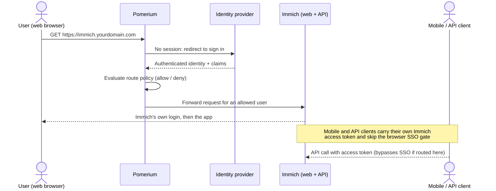
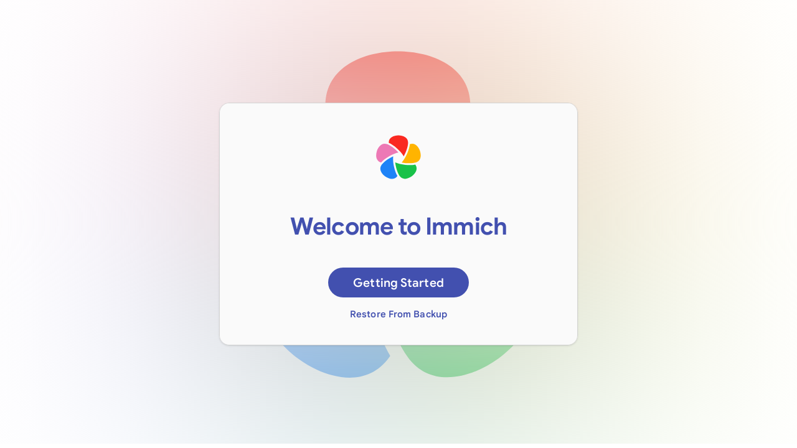
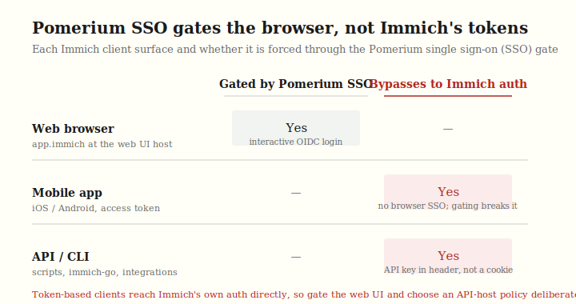

import TabItem from '@theme/TabItem';
import Tabs from '@theme/Tabs';

import Config from '/content/examples/guides/immich/config.yaml.md';
import Compose from '/content/examples/guides/immich/docker-compose.yaml.md';

# Secure Immich with Pomerium

## What this guide does

You'll put a self-hosted [Immich](https://immich.app/) instance behind Pomerium so that Pomerium becomes the single front door for its web interface: every browser request is authenticated against your identity provider (IdP) and checked against your policy before it ever reaches Immich. Immich keeps running its own login and accounts on top, so Pomerium acts as an additional gate rather than replacing Immich's user database.

The value of putting Immich behind Pomerium is not a second login. It is centralized single sign-on (SSO), one place to express group and domain policy, an audit trail of who reached the service, and keeping the whole web surface off the public internet behind your identity provider.

## When to use this guide

Use it when you run self-hosted Immich and want to make sure only people from your organization can even reach the web app, without exposing Immich's interface directly to the internet. Pomerium handles the network-level access decision; Immich continues to manage albums, sharing, and its own user sessions behind that gate.

This guide gates the web interface. Immich's mobile apps and API clients authenticate with their own access tokens and cannot complete an interactive browser SSO flow, so they need a deliberate routing choice. See [Security considerations](#security-considerations) before you gate the API host.

## How the request flows



## Prerequisites

This guide assumes you've completed the [Quickstart](/docs/get-started/quickstart), so you already have Pomerium running and signing users in through the hosted authenticate service.

You also need:

- [Docker](https://docs.docker.com/install/) and [Docker Compose](https://docs.docker.com/compose/install/)
- A domain you control for the Immich route (this guide uses `immich.yourdomain.com`)

:::tip Prefer to self-host the identity provider?

This guide uses the hosted authenticate service so you don't have to run an IdP. To run your own instead, follow [Keycloak + Pomerium](/docs/integrations/user-identity/oidc) and swap the `authenticate_service_url` / `idp_*` settings into the config below.

:::

## Configure Pomerium

<Tabs queryString="type">
<TabItem value="zero" label="Pomerium Zero" default>

In the [Zero Console](https://console.pomerium.app):

1. Create a **Route**. In **From**, enter `https://immich.<your-starter-domain>`; in **To**, enter `http://immich-server:2283`.
2. Set the policy to scope access to who should reach Immich (for example, **Any Authenticated User** or a specific group or domain).
3. On the route's settings, enable **Allow WebSockets** and **Preserve Host Header**. Immich's reverse-proxy guidance expects WebSocket upgrades and the original host to reach the server.
4. Raise the request **Timeout** (or set it to 0 for no limit), and set a generous **Idle Timeout** such as `600s`, so large photo and video uploads and original-quality downloads are not cut off mid-transfer.

Zero manages the route's TLS certificate behind your starter domain, so there's nothing else to configure on the Pomerium side.

</TabItem>
<TabItem value="core" label="Pomerium Core">

Create a `config.yaml`. It routes `immich.yourdomain.com` to the Immich server container, preserves the public host header, allows WebSockets, and lifts the request time limit so large uploads and downloads are not cut off.

<Config />

Replace `immich.yourdomain.com` with your domain and `you@example.com` with the email (or switch to a group or domain match) that should be allowed through.

</TabItem>
</Tabs>

## Configure Immich

Immich keeps its own login and account database. The first time you reach it through Pomerium, Immich serves its own onboarding screen where you create the initial admin account; after that it enforces its own sessions on top of the Pomerium gate.

This minimal stack includes what the Immich web/API server needs to boot behind Pomerium:

- A connection to its database. Immich ships a specific PostgreSQL image that bundles the vector-search extension it depends on. Set `DB_HOSTNAME`, `DB_USERNAME`, `DB_PASSWORD`, and `DB_DATABASE_NAME` to match the database service, and set the matching `POSTGRES_USER` / `POSTGRES_PASSWORD` / `POSTGRES_DB` on the database.
- A connection to Redis (Valkey) for its job queue, via `REDIS_HOSTNAME`.
- A media volume for uploaded photos and videos.

Generate a unique database password and use the same value for `DB_PASSWORD` and `POSTGRES_PASSWORD`.

It does not include Immich's `immich-machine-learning` service; add it from the official Immich release Compose file if you need smart search or face recognition.

:::caution Use Immich's database image, not stock Postgres

Immich requires the [VectorChord](https://docs.immich.app/administration/postgres-standalone/) PostgreSQL image it ships (`ghcr.io/immich-app/postgres:...` in the Compose file). A stock `postgres` image crashes `immich-server` on first boot because the vector-search extension is missing. Pin the exact image Immich publishes for your release.

:::

## Run the stack

The Compose file runs Pomerium Core together with the Immich server, its VectorChord PostgreSQL database, and Redis (Valkey). Pomerium publishes ports 80 and 443 for the protected route; the Immich server publishes no host ports, and Pomerium reaches it by service name on the Compose project network. For Zero, drop the `pomerium` service and use the `compose.yaml` from the Quickstart with your `POMERIUM_ZERO_TOKEN`, keeping the Immich services below; put those services on the same Docker network as the Quickstart's `pomerium` service (the Quickstart names it `main`) so Pomerium can resolve `immich-server` by name.

<Compose />

Start it:

```bash
docker compose up -d
```

On first boot the Immich server runs database migrations against the VectorChord database, which can take a minute or two before it answers requests. Watch `docker compose ps` until `immich-server` reports `healthy`, or follow `docker compose logs -f immich-server`.

To stop the stack, run `docker compose down`. Add `-v` only if you mean it: that flag deletes the named volumes, which wipes the Immich database and your entire photo library.

This guide was last tested with Immich v2.7.5 and Pomerium v0.32.7. Newer Immich releases pin a different VectorChord PostgreSQL image, so take the database image from the [release matching your Immich version](https://github.com/immich-app/immich/releases) when you upgrade.

## Verify the setup

1. **The route requires authentication.** In a fresh browser, open `https://immich.yourdomain.com`. You should be redirected to sign in through Pomerium, not straight to Immich.
2. **An allowed user passes the gate.** Sign in with a user your policy allows. Pomerium redirects you back and Immich's own onboarding or login screen loads behind the gate.



3. **Immich answers behind the gate.** In the same browser where you signed in, open `https://immich.yourdomain.com/api/server/ping`. The browser carries your Pomerium session, so the request reaches Immich and returns `{"res":"pong"}`. A plain `curl` with no Pomerium session is redirected to sign in instead. On Pomerium Zero or Enterprise, you can script the check by attaching a [Pomerium service account](/docs/capabilities/service-accounts) token that your route policy allows.

Pomerium gates the route; Immich runs its own login on top. Immich's admin onboarding and first-run setup are Immich's concern, not Pomerium's.

## Common failure modes

- **`502` or `503` right after `docker compose up`.** The Immich server is still running first-boot database migrations. Wait for the container to report `healthy`; watch `docker compose logs -f immich-server`.
- **`immich-server` restarts in a crash loop with a missing-extension error.** The database is a stock Postgres image instead of Immich's VectorChord image. Switch the database service to the `ghcr.io/immich-app/postgres:...` image Immich ships. If this happened on a fresh test stack, remove the database volume and reinitialize it; for an existing library, back up the database and follow Immich's migration or recovery docs before deleting any volume.
- **Uploads of large videos fail or time out.** The proxy is cutting the request short. Set the route `timeout` to `0s` (and a generous `idle_timeout`) as shown in the config so long transfers aren't capped.
- **Redirect loop or certificate errors.** Make sure DNS for `immich.yourdomain.com` points at Pomerium and that Pomerium can obtain a TLS certificate. On the Core path, `autocert` needs ports 80 and 443 reachable for Let's Encrypt; Zero manages certificates for you.

## Security considerations

Immich runs its own authentication, so this guide uses Pomerium as a front-door gate on top of that login. (Immich can also sign users in itself with native OIDC against your identity provider; see [Next steps](#next-steps).) The trust boundary depends on Pomerium being the only path to the web interface, and on understanding which clients that gate actually covers.

- **Don't expose Immich directly.** Only Pomerium should reach `immich-server:2283`. Keep the Immich server off published host ports and on the Docker network Pomerium uses to reach it, so the policy can't be bypassed by hitting Immich's port directly.
- **Scope the route policy** (group or domain) to who should have any access to Immich at all. Immich's own per-user albums and sharing still apply on top of that.
- **The SSO gate covers the web browser, not token-based clients.** The Immich mobile apps and API or command-line clients authenticate with their own Immich access tokens and cannot complete an interactive browser SSO (single sign-on) flow. If you put the host the mobile app talks to behind Pomerium's browser gate, the mobile app breaks: it has no way to satisfy the interactive redirect. Gate the web UI, and make a deliberate choice for the API host rather than gating it by default and locking out every mobile client. Practical options: serve the API or mobile hostname on a separate route with [public access](/docs/reference/routes/public-access) so Immich's own token auth handles it, or keep that host off Pomerium entirely and reach it over a virtual private network (VPN). If you use public access, treat that route as protected only by Immich's own authentication: Pomerium will not authenticate or authorize matching requests, so scope the host or path as narrowly as Immich supports.

The matrix below summarizes which client surfaces the browser SSO gate actually covers:



## Next steps

- **Go further: single sign-on into Immich.** Immich supports [native OIDC](https://docs.immich.app/administration/oauth/). Point it at the same identity provider Pomerium uses, turn on Auto Register, and users land already signed in instead of meeting a second Immich login. This is Immich doing its own OIDC, not something Pomerium forwards, so it also covers the mobile app's login (which the browser SSO gate above cannot).
- [Build policies](/docs/get-started/fundamentals/zero/zero-build-policies)
- [Set route timeouts](/docs/reference/routes/timeouts)
- [Custom domains](/docs/capabilities/custom-domains)
