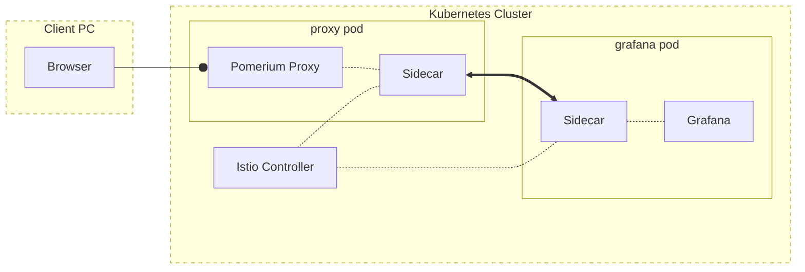

---
# cSpell:ignore finalizers e1c5d20b9cf771de0bd6038ee5b5fe831f771d3715b72c2db921611ffca7242f cxprp jfWNKJkq3b5hrTz2JsrXCcvgJCPP7QSFgX1ZT9wapIQ j8I1I7eb0Imr2pvxRk13cK9ZjAA3VPrdUIHkAslX2e0
title: Secure Istio with Pomerium
sidebar_label: Istio
lang: en-US
keywords:
  [
    pomerium,
    istio,
    service mesh,
    sso,
    oidc,
    identity aware proxy,
    kubernetes,
    mutual authentication,
  ]
description: Integrate the Pomerium Ingress Controller with an Istio service mesh to extend authentication and authorization to east-west traffic inside your cluster.
---

import GrafanaIni from '/content/examples/kubernetes/istio/grafana.ini.yml.md';

# Secure Istio with Pomerium

## What this guide does

You'll run the [Pomerium Ingress Controller][pomerium ingress controller] inside a Kubernetes cluster that has the [Istio][istio] service mesh installed, so Pomerium handles single sign-on and authorization for traffic entering the cluster ([north-south traffic]) and Istio enforces that authenticated identity on traffic between services inside the cluster ([east-west traffic]).

Pomerium forwards a signed identity JWT to the upstream. Istio's `RequestAuthentication` and `AuthorizationPolicy` resources verify that JWT at each service's sidecar, so a request only reaches a service if it arrived through an authorized Pomerium route carrying a valid token. This brings you closer to complete [zero trust]: every hop authenticates, not just the front door.

## When to use this guide

Use it when you already run Istio and want Pomerium as the identity-aware front door, with the mesh re-verifying the user's identity on internal hops rather than trusting the network. If you only need to publish a single HTTP app from Kubernetes without a mesh, the [Ingress Controller quickstart](/docs/deploy/k8s/quickstart) is simpler. For a non-mesh app that consumes the identity JWT directly, see the [Grafana guide][grafana-guide].

## Prerequisites

- A Kubernetes cluster with [Istio installed](https://istio.io/latest/docs/setup/getting-started/) and sidecar injection available.
- The [Pomerium Ingress Controller][pomerium ingress controller] installed with our [Helm chart][install pomerium using helm]. This guide covers only the values that change for Istio; see the [controller reference](/docs/deploy/k8s/reference) for the full spec.
- A domain you control for the routes. This guide uses `*.localhost.pomerium.io` placeholders; replace them with your domain.

## How it works

A single service can offload authentication and authorization to a sidecar, as described in [Mutual Authentication with a Sidecar](/docs/internals/mutual-auth#mutual-authentication-with-a-sidecar). In a mesh, every service runs a sidecar and the control plane configures them to mutually authenticate. Pomerium sits at the edge, and each upstream sidecar independently verifies the Pomerium-issued JWT before letting traffic through:



:::tip

This is a simplified model that omits the additional traffic for authentication and authorization. See the [Mutual Authentication](/docs/internals/mutual-auth) page for details.

:::

## Configure Pomerium for Istio

Follow [Install Pomerium using Helm][install pomerium using helm] to set up the Ingress Controller, with the adjustments below.

1. Label the Pomerium namespace for Istio sidecar injection:

   ```bash
   kubectl label namespace pomerium istio-injection=enabled
   ```

2. Update `pomerium-values.yaml` with the Istio-specific changes:

   ```yaml title="pomerium-values.yaml"
   authenticate:
     idp:
       provider: 'google'
       clientID: YOUR_CLIENT_ID
       clientSecret: YOUR_SECRET

   proxy:
     deployment:
       podAnnotations:
         # Let external connections terminate on the Pomerium proxy directly
         # rather than on the sidecar.
         traffic.sidecar.istio.io/excludeInboundPorts: '80,443'

   config:
     rootDomain: localhost.pomerium.io
     generateTLS: false # offload TLS to the mesh
     insecure: true # disable TLS on internal Pomerium services

   ingress:
     enabled: false # we use the Ingress Controller, not a static ingress

   ingressController:
     enabled: true

   service:
     authorize:
       headless: false # route through the Istio service, not individual pods
     databroker:
       headless: false
   ```

   :::tip Prefer to self-host the identity provider?

   This example uses Google as the identity provider (IdP). To run your own instead, follow [Keycloak + Pomerium](/docs/integrations/user-identity/oidc) and set the matching `idp` values.

   :::

3. Apply the values and confirm injection worked. When you deploy a [test service](/docs/deploy/k8s/quickstart#test-service), its pod now shows two containers (the app plus the injected sidecar):

   ```shell-session
   $ kubectl get pods
   NAME                                           READY   STATUS    RESTARTS   AGE
   ...
   nginx-6955473668-cxprp                         2/2     Running   0          19s
   ```

## Configure Istio authentication for a service

With Pomerium installed, define the Istio rules that validate traffic to an upstream as coming through an authorized Pomerium route with an authenticated user token. The example below protects a test `nginx` service published at `hello.localhost.pomerium.io`. This assumes you already created a Pomerium route to the service with an Ingress, as in the [quickstart](/docs/deploy/k8s/quickstart#test-service); you'll update that Ingress in step 3.

1. Create `nginx-istio-policy.yaml`, adjusting the selectors and hosts for your environment:

   ```yaml title="nginx-istio-policy.yaml"
   apiVersion: security.istio.io/v1
   kind: RequestAuthentication
   metadata:
     name: nginx-require-pomerium-jwt
   spec:
     selector:
       matchLabels:
         app.kubernetes.io/name: nginx # matches the label on the test service
     jwtRules:
       - issuer: 'hello.localhost.pomerium.io' # the route's From host; this is the JWT iss claim. See /docs/reference/routes/jwt-issuer-format
         audiences:
           - hello.localhost.pomerium.io # matches the route's host (spec.rules[].host in its Ingress)
         fromHeaders:
           - name: 'X-Pomerium-Jwt-Assertion'
         # Preferred in production: fetch the signing key over the route's
         # well-known endpoint. See
         # https://istio.io/latest/docs/reference/config/security/jwt/#JWTRule
         jwksUri: https://hello.localhost.pomerium.io/.well-known/pomerium/jwks.json
         # If your route host is not a fully qualified domain name (FQDN) Istio
         # can resolve, inline the key served at that path instead of jwksUri:
         #jwks: |
         #  {"keys":[{"use":"sig","kty":"EC","kid":"e1c5d20b9cf771de0bd6038ee5b5fe831f771d3715b72c2db921611ffca7242f","crv":"P-256","alg":"ES256","x":"j8I1I7eb0Imr2pvxRk13cK9ZjAA3VPrdUIHkAslX2e0","y":"jfWNKJkq3b5hrTz2JsrXCcvgJCPP7QSFgX1ZT9wapIQ"}]}
   ---
   apiVersion: security.istio.io/v1
   kind: AuthorizationPolicy
   metadata:
     name: nginx-require-pomerium-jwt
   spec:
     selector:
       matchLabels:
         app.kubernetes.io/name: nginx
     action: ALLOW
     rules:
       - when:
           - key: request.auth.claims[aud]
             values: ['hello.localhost.pomerium.io'] # matches the route's host (spec.rules[].host in its Ingress)
   ```

   The `RequestAuthentication` resource tells Istio that, for pods labeled `app.kubernetes.io/name: nginx`, a request must carry an `X-Pomerium-Jwt-Assertion` header whose JWT has an `iss` claim equal to the route's From host (`hello.localhost.pomerium.io`) and is signed by the key Pomerium publishes for that route. The `iss` claim is the route host, not the Authenticate service URL; see [JWT Issuer Format](/docs/reference/routes/jwt-issuer-format). A request with no JWT fails every `AuthorizationPolicy`; a request with an invalid JWT fails `RequestAuthentication`.

   The `AuthorizationPolicy` then allows the request only if the validated JWT's `aud` claim matches the route host. This confirms the traffic came through the expected Pomerium route. That matters in Pomerium Enterprise, where a manager of a separate [Namespace](/docs/internals/namespacing) could otherwise create a second route to the same service.

2. Apply the resources:

   ```bash
   kubectl apply -f nginx-istio-policy.yaml
   ```

3. Visit `https://hello.localhost.pomerium.io`. After signing in you should see `RBAC: access denied`, which confirms the policy is enforced. Pomerium isn't yet forwarding the identity JWT, so the sidecar rejects the request. Add the `pass_identity_headers` annotation to the route's Ingress:

   ```yaml {9} title="example-ingress.yaml"
   apiVersion: networking.k8s.io/v1
   kind: Ingress
   metadata:
     name: hello
     annotations:
       kubernetes.io/ingress.class: pomerium
       cert-manager.io/issuer: pomerium-issuer
       # Add this line to forward the signed identity JWT to the upstream.
       ingress.pomerium.io/pass_identity_headers: 'true'
       ingress.pomerium.io/policy: '[{"allow":{"and":[{"domain":{"is":"example.com"}}]}}]' # your users' email domain
   spec:
     rules:
       - host: hello.localhost.pomerium.io # the route host; must match audiences/issuer above
         http:
           paths:
             - path: /
               pathType: Prefix
               backend:
                 service:
                   name: nginx
                   port:
                     number: 80
   ```

4. Apply the update and access the service again:

   ```bash
   kubectl apply -f example-ingress.yaml
   ```

   The request now carries the JWT, the sidecar validates it, and the test service responds.

## Pass identity through to the upstream

The nginx example proves the mesh enforces Pomerium's identity. To show an upstream consuming that same identity, the [Grafana guide][grafana-guide] configures Grafana to sign users in from the forwarded JWT. The pieces that change for a mesh deployment:

1. Annotate the Grafana Ingress for the Pomerium Ingress Controller and `pass_identity_headers`, the same way as the nginx route above. Point `hosts` and `tls` at `grafana.localhost.pomerium.io`.

2. Configure Grafana to read the assertion. Add these values to the Grafana `grafana.ini` settings:

   <GrafanaIni />

   This tells Grafana to trust the email claim in the `X-Pomerium-Jwt-Assertion` JWT and disables Grafana's own login form. See Grafana's [JWT authentication](https://grafana.com/docs/grafana/latest/setup-grafana/configure-security/configure-authentication/jwt/) docs for more options.

3. Add the matching Istio policy. Use the same `RequestAuthentication` / `AuthorizationPolicy` shape as nginx, with Grafana's selector and host, and set `forwardOriginalToken: true`. The nginx example omits this because it only gates on the JWT; Grafana needs the token forwarded so it can read the email claim and sign the user in:

   ```yaml {15} title="grafana-istio-policy.yaml"
   apiVersion: security.istio.io/v1
   kind: RequestAuthentication
   metadata:
     name: grafana-require-pomerium-jwt
   spec:
     selector:
       matchLabels:
         app.kubernetes.io/name: grafana
     jwtRules:
       - issuer: 'grafana.localhost.pomerium.io' # the route's From host; this is the JWT iss claim
         audiences:
           - grafana.localhost.pomerium.io
         fromHeaders:
           - name: 'X-Pomerium-Jwt-Assertion'
         forwardOriginalToken: true
         jwksUri: https://grafana.localhost.pomerium.io/.well-known/pomerium/jwks.json
   ---
   apiVersion: security.istio.io/v1
   kind: AuthorizationPolicy
   metadata:
     name: grafana-require-pomerium-jwt
   spec:
     selector:
       matchLabels:
         app.kubernetes.io/name: grafana
     action: ALLOW
     rules:
       - when:
           - key: request.auth.claims[aud]
             values: ['grafana.localhost.pomerium.io']
   ```

   Apply it with `kubectl apply -f grafana-istio-policy.yaml`. Grafana now signs you in as the user identified by the Pomerium JWT.

## Verify the setup

1. **The route requires authentication.** Open `https://hello.localhost.pomerium.io` in a fresh browser. You should be redirected to sign in, not straight to the service.
2. **The mesh rejects unauthenticated traffic.** Before adding `pass_identity_headers`, an authenticated browser request still returns `RBAC: access denied` because the sidecar sees no valid JWT.
3. **Authorized traffic reaches the service.** After adding `pass_identity_headers` and applying the Istio policy, the same request succeeds.
4. **The upstream consumes identity.** With Grafana configured, opening `https://grafana.localhost.pomerium.io` signs you in automatically as the user from the Pomerium claim.

## Common failure modes

- **`RBAC: access denied` after sign-in.** The sidecar got no valid JWT. Confirm `ingress.pomerium.io/pass_identity_headers: 'true'` is on the route's Ingress and that `RequestAuthentication` succeeded.
- **`Jwt issuer is not configured` or signature errors.** The `issuer` in `RequestAuthentication` must match the JWT's `iss` claim exactly, which is the route's From host (for example `hello.localhost.pomerium.io`), not the authenticate service. See [JWT Issuer Format](/docs/reference/routes/jwt-issuer-format). Also confirm `jwksUri` is reachable by Istio; for hosts that aren't a fully qualified domain name (FQDN), inline the `jwks` value instead.
- **`aud` mismatch.** The `audiences` and `AuthorizationPolicy` `values` must match the route host (`spec.rules[].host` in the Ingress) precisely.
- **No sidecar injected.** Confirm `istio-injection=enabled` on the namespace and that the pod shows `2/2` containers.

## Security considerations

- The whole model depends on **upstreams being reachable only through the mesh**. Istio enforces the JWT at the sidecar, so do not expose services on a `NodePort` or external `LoadBalancer` that bypasses the mesh.
- A forged header is only a risk if a service trusts it without verification. Here Istio verifies the JWT's signature and `aud` at every hop, so a fake `X-Pomerium-Jwt-Assertion` is rejected. Keep the `signing_key` private.
- Scope each route's Pomerium policy (group or domain) to who should reach that service. The `AuthorizationPolicy` `aud` check prevents a second route in another namespace from reaching the same upstream.

## Compatibility

The manifests use the `security.istio.io/v1` Istio API and the `ingress.pomerium.io` annotations, which apply to Istio 1.18 and later and current Pomerium Ingress Controller releases. The JWT `iss` value follows the [JWT Issuer Format](/docs/reference/routes/jwt-issuer-format) (the route's From host), and the JSON Web Key Set (JWKS) endpoint and trust model match the [JWT Authentication](/docs/capabilities/getting-users-identity) and [Mutual Authentication](/docs/internals/mutual-auth) references.

## Rollback and cleanup

To revert the mesh integration:

1. Remove the Istio policies you applied. Once they're gone, the sidecar no longer requires the JWT:

   ```bash
   kubectl delete -f nginx-istio-policy.yaml
   kubectl delete -f grafana-istio-policy.yaml
   ```

2. Remove the `ingress.pomerium.io/pass_identity_headers` annotation from each route's Ingress and re-apply the Ingress.

3. To undo sidecar injection on the Pomerium namespace, remove the label and restart the workloads so they come back without a sidecar (removing the label does not strip the sidecar from already-running pods):

   ```bash
   kubectl label namespace pomerium istio-injection-
   kubectl rollout restart deployment -n pomerium
   ```

4. Roll back the Helm values change with `helm rollback pomerium` (or re-apply your previous `pomerium-values.yaml`).

## Next steps

- [Pomerium Ingress Controller reference](/docs/deploy/k8s/reference)
- [Pass identity headers](/docs/reference/routes/pass-identity-headers-per-route)
- [Mutual Authentication](/docs/internals/mutual-auth)
- [Secure Grafana with Pomerium][grafana-guide]

[istio]: https://istio.io/latest/
[grafana-guide]: /docs/guides/grafana
[east-west traffic]: /docs/internals/glossary.md#east-west-traffic
[north-south traffic]: /docs/internals/glossary.md#north-south-traffic
[pomerium ingress controller]: /docs/deploy/k8s/ingress.md
[zero trust]: /docs/internals/zero-trust#zero-trust-1
[install pomerium using helm]: /docs/deploy/k8s/quickstart
