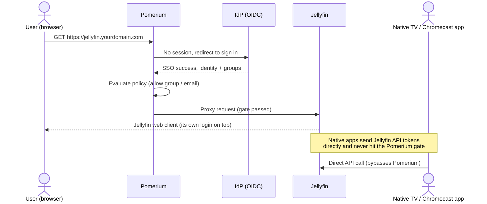
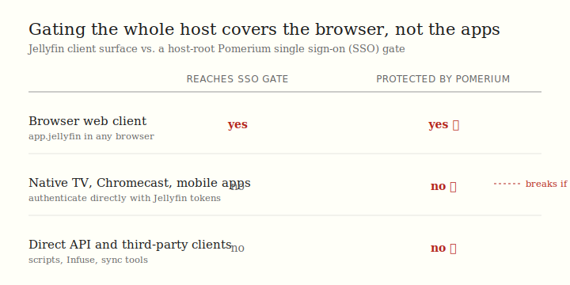

import TabItem from '@theme/TabItem';
import Tabs from '@theme/Tabs';

import Config from '/content/examples/guides/jellyfin/config.yaml.md';
import Compose from '/content/examples/guides/jellyfin/docker-compose.yaml.md';

# Secure Jellyfin with Pomerium

## What this guide does

You'll put a self-hosted [Jellyfin](https://jellyfin.org/) media server behind Pomerium so that Pomerium becomes the single front door for the web client: every browser request is authenticated against your identity provider (IdP) and checked against your policy before it ever reaches Jellyfin. Jellyfin keeps running its own login and user accounts on top, so Pomerium acts as an additional gate rather than replacing Jellyfin's accounts.

The value of Pomerium here is centralized single sign-on (SSO), group-based policy, and an audit trail in front of a service you'd otherwise expose to the internet on its own. You sign in once with your organization identity, your group membership decides who can even reach the server, and every access decision is logged at the proxy. That is the point, not adding a second password prompt -- Jellyfin already has its own login.



## When to use this guide

Use it when you run self-hosted Jellyfin and want to make sure only people from your organization can even reach the web interface, without exposing Jellyfin directly to the internet. Pomerium handles the network-level access decision; Jellyfin continues to manage libraries, its own user sessions, and playback behind that gate.

This guide gates browser access. Before you adopt it, read the [Security considerations](#security-considerations): Jellyfin's native TV, mobile, and Chromecast apps authenticate directly to Jellyfin's application programming interface (API) with Jellyfin tokens and do not pass through a browser SSO flow, so gating the whole host root breaks them. If you rely on those clients, gate Jellyfin selectively or keep it on a private network reachable another way.

## Prerequisites

This guide assumes you've completed the [Quickstart](/docs/get-started/quickstart), so you already have Pomerium running and signing users in through the hosted authenticate service.

You also need:

- [Docker](https://docs.docker.com/install/) and [Docker Compose](https://docs.docker.com/compose/install/)
- A domain you control for the Jellyfin route (this guide uses `jellyfin.yourdomain.com`)

:::tip Prefer to self-host the identity provider?

This guide uses the hosted authenticate service so you don't have to run your own IdP. To run your own instead, follow [Keycloak + Pomerium](/docs/integrations/user-identity/oidc) and swap the `authenticate_service_url` / `idp_*` settings into the config below.

:::

## Configure Pomerium

<Tabs queryString="type">
<TabItem value="zero" label="Pomerium Zero" default>

In the [Zero Console](https://console.pomerium.app):

1. Create a **Route**. In **From**, enter `https://jellyfin.<your-starter-domain>`; in **To**, enter `http://jellyfin:8096`.
2. On the route's settings, enable **Allow WebSockets**. The Jellyfin web client streams playback and session state over WebSockets; without this the UI loads but never updates.
3. Enable **Preserve Host Header** so Jellyfin's absolute URLs (web client, casting) match the public name rather than the container name.
4. Set the policy to scope access to who should reach Jellyfin (for example, **Any Authenticated User** or a specific group or domain).

</TabItem>
<TabItem value="core" label="Pomerium Core">

Create a `config.yaml`. It routes `jellyfin.yourdomain.com` to the Jellyfin container, allows WebSockets for the web client, and preserves the host header so Jellyfin's links stay correct.

<Config />

Replace `jellyfin.yourdomain.com` with your domain and `you@example.com` with the email (or switch to a group or domain match) that should be allowed through. Restart Pomerium after saving.

</TabItem>
</Tabs>

## Configure Jellyfin

Jellyfin needs to know its public URL and to trust the Pomerium hop so it does not mangle absolute URLs. The key settings in the Compose file below:

- `JELLYFIN_PublishedServerUrl: https://jellyfin.yourdomain.com` -- Jellyfin builds absolute URLs (the web client, casting, Digital Living Network Alliance discovery) from this value, so it must match the public route host, not the container name.
- Leave the network base URL empty. This guide serves Jellyfin at the host root, so no base-path prefix is set.

After first boot, finish Jellyfin's own setup wizard and create your Jellyfin accounts. In **Dashboard > Networking**, keep **Enable remote connections** on so Jellyfin accepts the proxied request, and add the address Jellyfin sees the proxied requests arriving from -- the Pomerium container's address on the shared Docker network -- to the **Known proxies** list, so Jellyfin trusts the forwarded headers rather than treating every request as remote. If you are unsure of the address, Jellyfin logs the source of each request; use that value. (Jellyfin's [reverse proxy docs](https://jellyfin.org/docs/general/post-install/networking/reverse-proxy/) cover Known proxies in detail.) Jellyfin keeps its own login; the first time you reach it through Pomerium you'll still see Jellyfin's sign-in on top of the gate.

## Run the stack

The Compose file runs Pomerium Core and Jellyfin together (for Zero, drop the `pomerium` service and use the `compose.yaml` from the Quickstart with your `POMERIUM_ZERO_TOKEN`, keeping the `jellyfin` service below):

<Compose />

Start it:

```bash
docker compose up -d
```

Jellyfin initializes its configuration and database on first boot; watch `docker compose ps` until its status changes from `health: starting` to `healthy`, or follow `docker compose logs -f jellyfin`.

When you're done, tear the Core stack down. The `-v` flag also removes the named volumes:

```bash
docker compose down -v
```

## Verify the setup

1. **The route requires authentication.** In a fresh browser, open `https://jellyfin.yourdomain.com`. You should be redirected to sign in through Pomerium, not straight into Jellyfin.
2. **An allowed user reaches Jellyfin.** Sign in with a user your policy allows. Pomerium redirects you back and Jellyfin's own web client loads behind the gate.


3. **The upstream is actually live behind the gate.** With your session, open `https://jellyfin.yourdomain.com/System/Info/Public`. Jellyfin answers `200` with a small JSON document (it includes a `Version`); that endpoint needs no Jellyfin login, so a JSON response confirms the gate opened and the proxy reached a running Jellyfin rather than an error page.
4. **The session is yours.** Open `https://jellyfin.yourdomain.com/.pomerium` to confirm your identity and the group claims Pomerium evaluated.

Pomerium gates the route; Jellyfin runs its own login on top. Jellyfin's accounts and library setup are Jellyfin's concern, not Pomerium's.

## Client surface and the gate

Gating the host root protects the browser web client. Native apps do not pass through it. This is the single most important thing to understand before you put Jellyfin behind any front-door proxy:



## Common failure modes

- **The web client loads but playback state never updates.** The route is missing `allow_websockets`. The Jellyfin web client streams session and playback events over WebSockets; enable WebSockets on the route.
- **Redirects or absolute links point at the container name or the wrong host.** Jellyfin's `JELLYFIN_PublishedServerUrl` doesn't match the public route, or `preserve_host_header` isn't set. Make both agree on `jellyfin.yourdomain.com`.
- **Jellyfin shows every client as a remote connection, or rejects the proxied request.** Jellyfin isn't trusting the Pomerium hop. In **Dashboard > Networking**, keep remote connections enabled and add Pomerium to **Known proxies** so Jellyfin trusts the forwarded headers.
- **Native TV, Chromecast, or mobile apps stop connecting after you add the gate.** Those clients authenticate directly to Jellyfin's API and never complete a browser SSO flow, so the gate blocks them. See [Security considerations](#security-considerations).

## Security considerations

- **Native and casting clients bypass the browser SSO gate.** Jellyfin's native TV apps, mobile apps, and Chromecast authenticate directly to Jellyfin's API with Jellyfin tokens. They do not perform the browser redirect flow Pomerium uses, so gating the entire host root breaks them. If you depend on those clients, don't gate the whole host: serve them on a separate, network-restricted path or keep Jellyfin on a private network and gate only the browser entry point. Treat the gate as protecting browser access, not as locking down every way into Jellyfin.
- **Jellyfin runs its own authentication, so Pomerium here is a front-door gate, not a header-trust integration.** Even so, **don't expose Jellyfin directly** -- only Pomerium should reach `jellyfin:8096`. Keep Jellyfin off published host ports and on an internal-only network (as the validation fixture does) so the policy can't be bypassed by hitting the container directly.
- **Scope the route policy.** Limit the route to the users or groups who should reach the media server at all, rather than allowing every authenticated user. Jellyfin's own per-user library permissions still apply on top of that.

## Next steps

- [Build policies](/docs/get-started/fundamentals/zero/zero-build-policies)
- [Routes reference](/docs/reference/routes)
- [Custom domains](/docs/capabilities/custom-domains)
