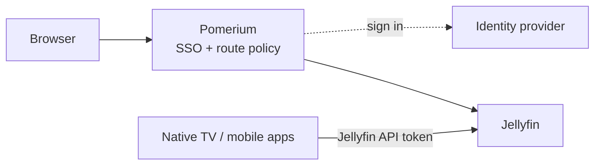
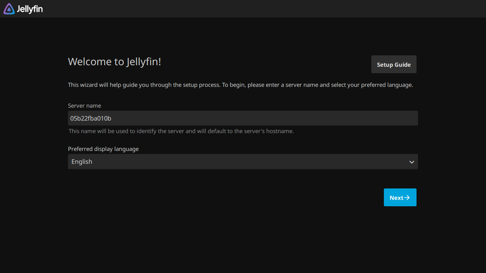

import TabItem from '@theme/TabItem';
import Tabs from '@theme/Tabs';

import Config from '/content/examples/guides/jellyfin/config.yaml.md';
import Compose from '/content/examples/guides/jellyfin/docker-compose.yaml.md';

# Secure Jellyfin with Pomerium

## What this guide does

Put a self-hosted [Jellyfin](https://jellyfin.org/) media server behind Pomerium to gate its web client with SSO and route policy: you sign in once with your organization identity, group membership decides who can reach the server at all, and every access decision is logged at the proxy. Jellyfin keeps its own login and user accounts on top.



## When to use this guide

Use it when you run self-hosted Jellyfin and want only people from your organization to reach the web interface, without exposing Jellyfin directly to the internet.

This setup protects browser access only. Jellyfin's native TV, mobile, and Chromecast apps authenticate straight to Jellyfin's API with Jellyfin access tokens and never perform a browser SSO redirect, so if the only route to Jellyfin requires Pomerium SSO, those apps cannot connect. If you rely on them, keep native-app access on a private network or a virtual private network (VPN), or serve the apps' endpoint on a separate [public access](/docs/reference/routes/public-access) route. A public-access route is not identity-protected, so Jellyfin's own token authentication is then the only control on it. A [TCP route](/docs/capabilities/non-http) can also carry a client that runs Pomerium CLI or Pomerium Desktop, such as a laptop player, but TVs and Chromecast can't run the tunnel.

## Prerequisites

- [Docker](https://docs.docker.com/install/) and [Docker Compose](https://docs.docker.com/compose/install/)
- For the Pomerium Zero path: a [Pomerium Zero](https://console.pomerium.app) account with its Pomerium instance running locally via the [Quickstart](/docs/get-started/quickstart) Compose file; the route uses the starter domain that comes with it
- For the Pomerium Core path: a domain you control (this guide uses `jellyfin.yourdomain.com`), with DNS pointed at the host running Pomerium and ports 80 and 443 reachable so `autocert` can provision certificates; the Compose file below runs Pomerium itself

:::tip Prefer to self-host the identity provider?

This guide uses the hosted authenticate service so you don't have to run your own identity provider (IdP). To run your own instead, follow [Keycloak + Pomerium](/docs/integrations/user-identity/oidc) and swap the `authenticate_service_url` / `idp_*` settings into the config below.

:::

## Configure Pomerium

<Tabs queryString="type">
<TabItem value="zero" label="Pomerium Zero" default>

In the [Zero Console](https://console.pomerium.app):

1. Create a **Route**. In **From**, enter `https://jellyfin.<your-starter-domain>`; in **To**, enter `http://jellyfin:8096`.
2. On the route's settings, enable **Allow WebSockets**. The Jellyfin web client streams playback and session state over WebSockets; without this the UI loads but never updates.
3. Enable **Preserve Host Header** so Jellyfin's absolute URLs (web client, casting) match the public name rather than the container name.
4. Raise the request **Timeout** (or set it to 0 for no limit), and set a generous **Idle Timeout** such as `600s`. Direct-play streams and file downloads are long plain HTTP responses, separate from the WebSocket control channel.
5. Set the policy to scope access to who should reach Jellyfin (for example, **Any Authenticated User** or a specific group or domain).

</TabItem>
<TabItem value="core" label="Pomerium Core">

Create a `config.yaml`. It routes `jellyfin.yourdomain.com` to the Jellyfin container, allows WebSockets for the web client, preserves the host header so Jellyfin's links stay correct, and removes the total request-time cap for long playback and downloads.

<Config />

Replace `jellyfin.yourdomain.com` with your domain and `you@example.com` with the email (or switch to a group or domain match) that should be allowed through. Restart Pomerium after saving.

</TabItem>
</Tabs>

## Configure Jellyfin

Two settings in the Compose file keep Jellyfin's URLs correct behind the proxy:

- `JELLYFIN_PublishedServerUrl: https://jellyfin.yourdomain.com` — Jellyfin builds absolute URLs (the web client, casting, Digital Living Network Alliance (DLNA) discovery) from this value, so it must match the **From** URL chosen above.
- Leave the network base URL empty. This guide serves Jellyfin at the root of the **From** URL, so there is no base-path prefix to set.

The Compose file runs Pomerium Core and Jellyfin together. For Zero, drop the `pomerium` service and use the `compose.yaml` from the [Quickstart](/docs/get-started/quickstart) with your `POMERIUM_ZERO_TOKEN`, keeping the `jellyfin` service; put `jellyfin` on the same Docker network as the Quickstart's `pomerium` service (the Quickstart names it `main`) so Pomerium can resolve `jellyfin` by name.

<Compose />

## Run the stack

```bash
docker compose up -d
```

Jellyfin initializes its configuration and database on first boot; watch `docker compose ps` until the container is `Up`, then follow `docker compose logs -f jellyfin` until the web server is listening if the page isn't ready yet.

Once it's up, finish Jellyfin's setup wizard and create your Jellyfin accounts. In **Dashboard > Networking**, keep **Enable remote connections** on so Jellyfin accepts the proxied requests, and add the address the proxied requests arrive from (the Pomerium container's address on the shared Docker network) to the **Known proxies** list so Jellyfin trusts the forwarded headers rather than treating every request as remote. If you're unsure of the address, Jellyfin logs the source of each request; use that value. Jellyfin's [reverse proxy docs](https://jellyfin.org/docs/general/post-install/networking/reverse-proxy/) cover Known proxies in detail.

When you're done testing, stop the stack:

```bash
docker compose down
```

Add `-v` only if you mean to delete Jellyfin's config and cache volumes.

## Verify the setup

1. **The route requires authentication.** In a fresh browser, open `https://jellyfin.yourdomain.com`. You should be redirected to sign in through Pomerium, not straight into Jellyfin.
2. **An allowed user reaches Jellyfin.** Sign in with a user your policy allows. Pomerium redirects you back and Jellyfin's web client loads.



3. **The upstream is live.** With your session, open `https://jellyfin.yourdomain.com/System/Info/Public`. Jellyfin answers `200` with a small JSON document (it includes a `Version`); that endpoint needs no Jellyfin login, so a JSON response confirms the proxy reached a running Jellyfin rather than an error page.
4. **The session is yours.** Open `https://jellyfin.yourdomain.com/.pomerium` to confirm your identity and the group claims Pomerium evaluated.

## What Pomerium protects — and what it doesn't

Pomerium authenticates and authorizes browser requests on the route. Jellyfin's other client channels never complete a browser sign-in, so wherever they connect, Jellyfin's own authentication is the control:

| Access channel | What gates it | Credential the client presents |
| --- | --- | --- |
| Jellyfin web client in a browser | Pomerium route policy, then Jellyfin's own login | Pomerium SSO session, then a Jellyfin login |
| Native TV, mobile, and Chromecast apps | Jellyfin's authentication only (these apps can't complete a browser SSO redirect) | A Jellyfin access token |
| HTTP API and DLNA | Jellyfin's API authentication for HTTP clients; DLNA discovery is local-network multicast and never crosses the proxy | A Jellyfin API key or access token; DLNA presents none |

## Common failure modes

- **The web client loads but playback state never updates.** The route is missing `allow_websockets`. The Jellyfin web client streams session and playback events over WebSockets; enable WebSockets on the route.
- **Direct-play video or a large download stops after about 30 seconds.** The route is still using the default request timeout. Raise the route `timeout` (or set it to `0s` on Pomerium Core) and keep a generous `idle_timeout`; WebSockets do not cover direct-play or download responses.
- **Redirects or absolute links point at the container name or the wrong host.** Jellyfin's `JELLYFIN_PublishedServerUrl` doesn't match the public route, or `preserve_host_header` isn't set. Make both agree on `jellyfin.yourdomain.com`.
- **Jellyfin shows every client as a remote connection, or rejects the proxied request.** Jellyfin isn't trusting the Pomerium hop. In **Dashboard > Networking**, keep remote connections enabled and add Pomerium to **Known proxies** so Jellyfin trusts the forwarded headers.
- **Native TV, Chromecast, or mobile apps stop connecting.** Those apps authenticate straight to Jellyfin's API and never perform the browser redirect, so a route that requires SSO blocks them. See [When to use this guide](#when-to-use-this-guide) for the alternatives.

## Security considerations

- **Don't expose Jellyfin directly.** Only Pomerium should reach `jellyfin:8096`. Keep Jellyfin off published host ports and on a Docker network shared only with Pomerium so the route policy can't be bypassed by connecting to the container.
- **Jellyfin has no native single sign-on** and doesn't trust a reverse-proxy identity header. A community SSO plugin can add OIDC for the web client only, so for most setups the front door in this guide is the practical ceiling.
- **Scope the route policy.** Limit the route to the users or groups who should reach the media server at all, rather than allowing every authenticated user. Jellyfin's per-user library permissions still apply on top.

## Next steps

- [Build policies](/docs/get-started/fundamentals/zero/zero-build-policies)
- [Routes reference](/docs/reference/routes)
- [Custom domains](/docs/capabilities/custom-domains)
