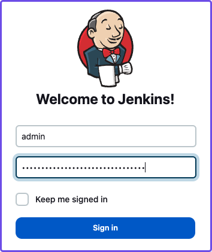
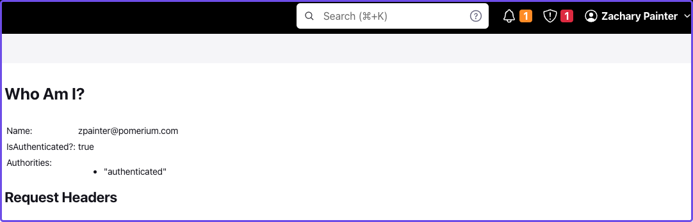

import Tabs from '@theme/Tabs';
import TabItem from '@theme/TabItem';
import JenkinsCompose from '../../examples/jenkins/jenkins-docker-compose.md'

# Run Jenkins with Docker

Run Pomerium with Docker Compose to secure your Jenkins application with JWT authentication and custom claims.

## What is Jenkins?

Jenkins is an automation server you can use to build, test, and deploy applications.

## Why use Pomerium with Jenkins?

You can set up role-based permissions in Jenkins to control a user’s privileges with Jenkins’ built-in authorization matrix. However, this method requires a username and password to sign in and relies on Jenkins’ user database to store credentials.

JWT authentication is a more secure method of identity verification that authenticates and authorizes users against an identity provider, eliminating the need to store or share credentials to access your Jenkins application.

Jenkins doesn’t support JWT authentication out of the box. With Pomerium, you can implement JWT authentication and apply claims to your route’s authorization policy to determine a user’s role and privileges before granting a user access to Jenkins.

Once you’ve configured JWT authentication, you can assign permissions within Jenkins for a specific user, any authenticated user, anonymous users, or a user group.

### Groups and namespaces with Pomerium

Most identity providers allow administrators to create user groups. If you use [Pomerium Enterprise](https://www.pomerium.com/enterprise-sales/), you can import users and groups from your identity provider and place them in custom namespaces with the Pomerium Console’s [Namespacing](/docs/capabilities/namespacing) feature.

By adding a group and its users to a namespace, you can pass the group identifier in a custom claim to upstream applications with JWT authentication; you can also apply group claims to your authorization policy so that only members of a group are granted access.

Pomerium Core does not support namespacing. For the Pomerium Core portion of the guide, you will write an authorization policy that grants access to users with the specified domain and/or username.

## Before you begin

To complete this guide, you need:

1. [Docker](https://docs.docker.com/get-docker/) and [Docker Compose](https://docs.docker.com/compose/install/)
2. An [identity provider](/docs/identity-providers) (IdP)

:::tip Note

If you haven’t, complete the [Pomerium Core quickstart](/docs/quickstart) to familiarize yourself with running Pomerium in a container environment.

Pomerium Enterprise customers can complete the [Enterprise quickstart](/docs/releases/enterprise/install/quickstart) using Docker containers as well.

:::

## Run Jenkins with Docker Compose

<Tabs>
<TabItem label="Core" value="Core">

Create a project and add a file called `docker-compose.yaml`.

In the `docker-compose.yaml` file, add the following code:

```yaml title=docker-compose.yaml
 jenkins:
   networks:
     main: {}
   image: jenkins/jenkins:lts-jdk11
   privileged: true
   user: root
   ports:
     - 8080:8080
     - 50000:50000

   volumes:
     # File path to Jenkins_home -- stores configs, build logs, and artifacts
     - ./home/jenkins_compose/jenkins_configuration:/var/jenkins_home
     # "sock" is the Unix socket the Docker daemon listens on by default
     - ./var/run/docker.sock:/var/run/docker.sock
```

Run `docker compose up`.

## Set up your Jenkins instance

If your Jenkins container is set up correctly, the Setup Wizard will guide you through several prompts before you can access your dashboard.

To set up your Jenkins instance:

1. Go to `localhost:8080` and enter the admin user password to continue

You can find the admin user password in your Docker logs or in `/var/jenkins_home/secrets/initialAdminPassword`.


2. Install the suggested plugins
3. Create an admin user

You can create your first admin user or select **Skip and continue as admin**. If you skip and continue as admin, the default username is **admin** and the password is the admin user password.

4. In the **Instance Configuration** window, accept the default hostname

After completing the Setup Wizard prompts, you can access the Jenkins dashboard.


Run `docker compose stop` so you can configure Pomerium.

## Configure Pomerium

### Create a Pomerium configuration file

In your project’s root folder, create a `config.yaml` file.

Tabs > Core

In your `config.yaml` file, add the following code:

```yaml title=config.yaml
authenticate_service_url: https://authenticate.localhost.pomerium.io

idp_provider: REPLACE_ME
idp_provider_url: REPLACE_ME
idp_client_id: REPLACE_ME
idp_client_secret: REPLACE_ME

signing_key: REPLACE_ME

routes:
 - from: https://verify.localhost.pomerium.io
   to: http://verify:8000
   pass_identity_headers: true
   policy:
     - allow:
         and:
	email:
	      is: user@example.com
 - from: https://jenkins.localhost.pomerium.io
   to: http://jenkins:8080/
   host_rewrite_header: true
   pass_identity_headers: true
   policy:
     - allow:
         and:
           - domain:
               is: example.com
           - user:
               is: username
```

Next, you need to:

- Update the [identity provider](/docs/identity-providers) configuration variables with your own
- Replace `user@example.com` with the email associated with your IdP
- Replace `example.com` with your organization’s domain name
- Replace `username` with the username associated with your IdP
- Generate a signing key

To generate a [signing key](/docs/reference/signing-key), use the commands below:

```bash
# Generates a P-256 (ES256) signing key
openssl ecparam  -genkey  -name prime256v1  -noout  -out ec_private.pem
# Prints the base64 encoded value of the signing key
cat ec_private.pem | base64
```

Add the base64-encoded signing key to the `signing_key` variable in your `config.yaml` file.

### Run Pomerium services with Docker Compose

In your `docker-compose.yaml` file, replace the code in the file with the Pomerium and Jenkins services below:

<JenkinsCompose />

Run `docker compose up` and navigate to the external Jenkins route at `https://jenkins.localhost.pomerium.io`.

Jenkins will prompt you to sign in with your username and password.



Sign in to continue to the Jenkins dashboard.

</TabItem>
<TabItem label="Enterprise" value="Enterprise">

:::tip Note

This guide assumes you can access the Enterprise Console.

:::

In your Enterprise Console, create an external route to access Jenkins.


</TabItem>
</Tabs>

## Install Jenkins plugins

Next, you need to add plugins to enable JWT authentication and bypass TLS validation.

Install the **JWT Auth** plugin:
1. Select **Manage Jenkins**
2. Under **System Configuration**, select **Manage Plugins**
3. Select **Available Plugins**
4. In the search bar, enter **JWT Auth**
5. Select the JWT Auth plugin and **Install without restart**


Install the **skip-certificate-check** plugin:
1. Select **Available Plugins**
2. In the search bar, enter **skip-certificate-check**
3. Select the skip-certificate-check plugin and **Install without restart**

Once you’ve installed both plugins, stop your containers.

## Configure JWT authentication

Restart your containers and go to your external Jenkins route.

To configure JWT authentication:
1. Go to **Manage Jenkins**
2. Under **Security**, select **Configure Global Security**
3. Under **Authentication** > **Security Realm**, select **JWT Header Authentication Plugin**

Under **Global JWT Auth Settings**, you’ll see form fields where you can enter JWT claims. Pomerium forwards a user’s associated [identity information](/docs/capabilities/getting-users-identity#jwt-verification) in a signed attestation JWT that’s included in upstream requests in an `X-Pomerium-Jwt-Assertion` header.

With the JWT Auth plugin installed, Jenkins can receive and parse the assertion header to authenticate users – you just need to give it the right instructions to find the header and JWT claims.


Enter the following information in the **Global JWT Auth Settings** field:

| Field                       | Value                                                          |
|-----------------------------|----------------------------------------------------------------|
| **Header name**                 | `x-pomerium-jwt-assertion`                                     |
| **Username claim name**         | `name`                                                         |
| **Groups claim name**           | `groups`                                                       |
| **Groups claim list seperator** | `,`                                                            |
| **Email claim name**            | `email`                                                        |
| **Acceptable issuers**          | `authenticate.corp.example.com`                                |
| **Acceptable audiences**        | `jenkins.corp.example.com`                                     |
| **JWKS JSON URL**               | `authenticate.corp.example.com/.well-known/pomerium/jwks.json` |

Note the following details about the fields above:
- **Acceptable issuers** must be the URL of the authentication domain that issued the JWT. The `iss` claim tells the target application who the issuing authority is and provides context about the subject.
- **Acceptable audiences** must be the URL of the target application. The `aud` claim defines what application the JWT is intended for.
- **JWKS JSON URL** appends `/.well-known/pomerium/jwks.json` to the authenticate service URL, and lives on the authenticate service. The JWKS endpoint provides Jenkins the user’s public key to verify their JWT signature.

:::tip

Go to the external `verify` route defined in your policy to view your JWT claims.

:::

Select **save** to apply the security changes.

Restart your container. If the JWT authentication worked, you will see your name in the dashboard instead of **admin**. To see more details about the request, enter `/whoAmI` to the URL. For example, `https://jenkins.localhost.pomerium.io/whoAmI`.



## Configure the Jenkins authorization policy

Configure your Jenkins authorization policy:

1. Go to **Manage Jenkins** > **Configure Global Security**
2. In **Authorization** dropdown, select **Matrix-based security**
3. Select **Add user…** and enter the email associated with your IdP

Assign yourself **Administer** privileges and whatever privileges seem appropriate to **Authenticated Users** and **Anonymous** users.

Save your security settings.

## Next steps: Add context-aware policies

You can adjust the authorization policy within Jenkins to limit or broaden what privileges authenticated and anonymous users have, but you can also extend your authorization policies with Pomerium.

For example, you can build a policy that only allows users to access Jenkins at certain times of day or days of the week, or limit access to certain devices.
