---
# cSpell:ignore seperator

title: Run Jenkins with Docker
sidebar_label: Jenkins
lang: en-US
description: Secure Jenkins by adding JWT authentication with Pomerium.
keywords:
  [jwt, jenkins, pomerium, jwks, authorization policy, groups, namespaces]
---

import Tabs from '@theme/Tabs';
import TabItem from '@theme/TabItem';
import JenkinsCompose from '../../examples/jenkins/jenkins-docker-compose.md';

# Run Jenkins with Docker

In this guide, you'll secure an instance of Jenkins behind Pomerium Zero using single sign-on (SSO).

## What is Jenkins?

Jenkins is an automation server you can use to build, test, and deploy applications.

## Why use Pomerium with Jenkins?

You can set up role-based permissions in Jenkins to control a user’s privileges with Jenkins’ built-in authorization matrix. However, this method requires username/password authentication, which relies on Jenkins’ user database to store credentials.

JWT authentication is a more secure method of identity verification that authenticates and authorizes users against an identity provider, eliminating the need to store or share credentials to access your Jenkins application.

Jenkins doesn’t support JWT authentication out of the box. It requires a JWT authentication plugin to communicate with Pomerium. With the plugin installed, you can configure Pomerium to forward a user's JWT to Jenkins to achieve SSO.

Once you’ve configured JWT authentication, you can assign permissions within Jenkins for a specific user, any authenticated user, anonymous users, or a user group.

## Before you start

To complete this guide, you need:

- Pomerium Zero
- Linux OS (this guide uses a Compute Engine VM running Debian 12)
- [Jenkins](https://www.jenkins.io/doc/book/installing/linux/#debianubuntu) (LTS release)
- [Java](https://www.jenkins.io/doc/book/installing/linux/#installation-of-java) (OpenJDK 17)

:::note

This guide runs Pomerium Zero and Jenkins in a Linux VM running Debian 12. If you're using Docker or Kubernetes, the steps will vary.

:::

<Tabs>
<TabItem label="Zero" value="zero">

## Set up Pomerium Zero

### Build a policy for Jenkins

In the Zero Console, build a policy that grants access to a request only if the user's email address contains the specified domain:

1. Select **Policies**, **New Policy**
1. Name your policy (for example, "Allow matching email domain")
1. Add an **Allow** block with an **And** operator
1. Keep the **Domain** criterion and **Is** operator
1. Enter the domain portion of the email address you'll use to access Jenkins (for example, `mycorp.com`)
1. Save your policy

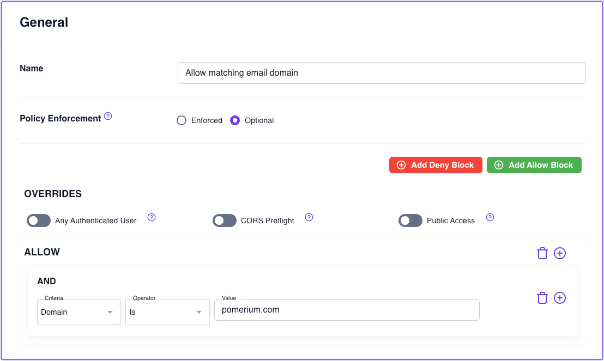

### Build a route to Jenkins

In the Zero Console:

1. Select **Routes**, **+ New Route**
1. Name your route (for example, **Jenkins**)
1. In the **From** field, select **https://** and enter `jenkins.<YOUR_SUBDOMAIN>.pomerium.app` as the URL
1. In the **To** field, enter `http://localhost:8080`
1. In the **Policies** field, select the policy you just saved
1. Select the **Headers** tab and enable **Pass Identity Headers**
1. Save your route

:::info

These steps assume you're using your cluster's **Starter Domain** to build a route to secure Jenkins. If you added a **Custom Domain** to your cluster, you can use that domain instead.

:::

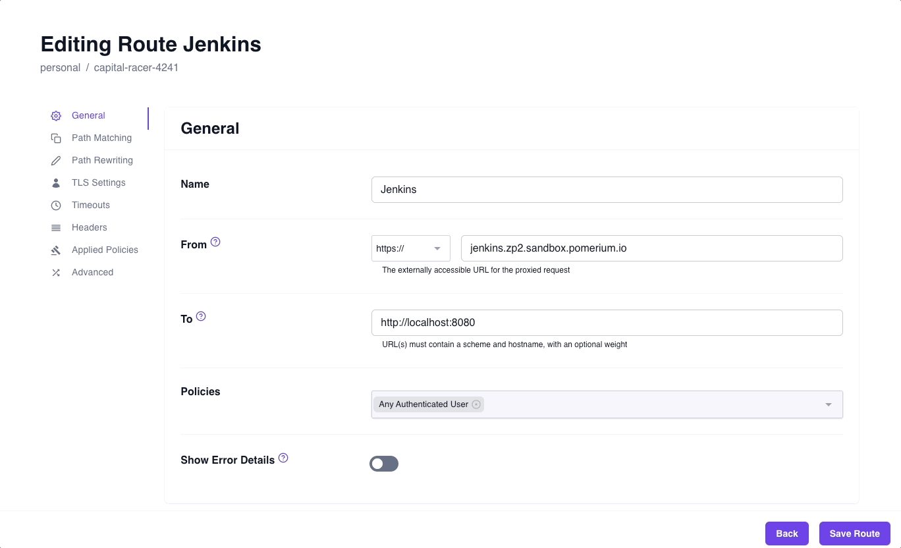

After you've saved your route and policy, **apply the changeset** to your cluster configuration:

1. Select the changeset icon
1. Select **Apply Changeset**

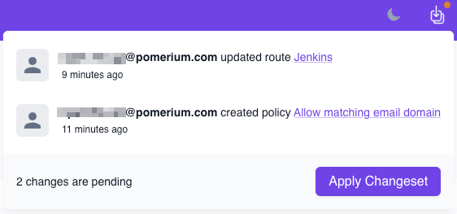

## Access Jenkins

From your Zero Console:

1. Access the external route you built to access Jenkins. After authenticating against Pomerium's hosted identity provider, you should be redirected to your Jenkins instance.
1. Before you can access your Jenkins dashboard, Jenkins will prompt you to enter the initial admin password. You can find it in `/var/lib/jenkins/secrets/initialAdminSecret`.

    Run the following command to get the admin password:
        ```bash
        sudo cat /var/lib/jenkins/secrets/initialAdminPassword
        ```
1. Install the suggested plugins. Then, **Skip and continue as admin** (if you skip, the default username is **admin** and the password is the initial admin password). You'll reconfigure authentication for admin and non-admin users in the next section.
1. In the **Instance Configuration** window, accept the default hostname


### Get JWT Auth plugin

In the Jenkins dashboard:

1. Select **Manage Jenkins**
1. Select **Plugins**
1. In the sidebar, select **Available plugins**
1. In the search bar, search for and install the [**JWT Auth Plugin**](https://plugins.jenkins.io/jwt-auth)
1. After installing, restart Jenkins:

    ```bash
    sudo systemctl restart jenkins
    ```

### Configure JWT authentication

After Jenkins restarts:

1. Access Jenkins from the Zero Console
1. Select **Manage Jenkins**
1. Select **Security**
1. In the **Security Realm** dropdown, select **JWT Header Authentication Plugin**
1. Under **Global JWT Auth Settings**, fill out the fields (reference the table below for the correct values)

    | Field | Value |
    | --- | --- |
    | **Header name** | `x-pomerium-jwt-assertion` |
    | **Username claim name** | `email` |
    | **Groups claim name** | `groups` |
    | **Groups claim list seperator** | `,` |
    | **Email claim name** | `email` |
    | **Full Name claim name** | `name` |
    | **Acceptable issuers** | `jenkins.<YOUR_SUBDOMAIN>.pomerium.app` |
    | **Acceptable audiences** | `jenkins.<YOUR_SUBDOMAIN>.pomerium.app` |
    | **JWKS JSON URL** | `https://jenkins.<YOUR_SUBDOMAIN>.pomerium.app/.well-known/pomerium/jwks.json` |
1. Enable **Allow verification failures**
1. Under **Authorization**, keep **Anyone can do anything**
    - This ensures you can re-configure authentication settings in the event that JWT authenticaiton fails, which will lock you out of your Jenkins instance

Save your changes and restart Jenkins.

### Authenticate with your JWT

From the Zero Console, access your external Jenkins route. If you configured JWT authentication correctly, you'll notice you're logged in already.

Next, you need to configure authorization in Jenkins to set permissions.

### Configure matrix-based authorization

1. Select **Manage Jenkins**, **Security**
1. Under **Authorization**, select **Matrix-based security**
1. Select **Add user...**
1. In the modal, enter your **User ID**
    :::tip

    To find your user ID, go to **Dashboard**, **People**. In the user table, you'll find the assigned ID value under the **User ID** column.

    :::
1. Give the added user **Administrator** privileges
    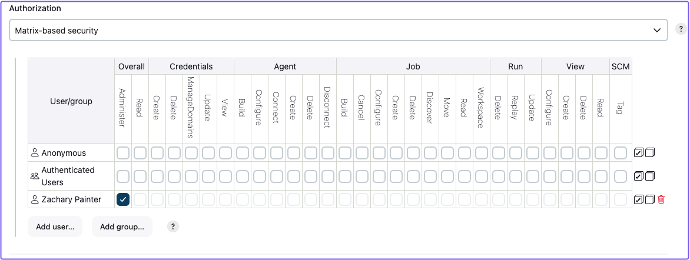
1. You can also give **Anonymous** users **Overall Read** privileges. This way, if someones accesses this Jenkins instance from another account, they won't be able to make changes to the application.

Save your changes. You're done!

## Next steps

- If you access Jenkins using another email address, Jenkins will add that user to your Jenkins directory and assign them a user ID. You can add this user to the authorization matrix and assign them appropriate permissions.
- You can also add groups to the authorization matrix and assign permissions to them.

</TabItem>
<TabItem label="Enterprise" value="Enterprise">

:::enterprise

This guide assumes you can access the [Enterprise Console](/docs/deploy/enterprise).

:::

First, add Jenkins to the same `docker-compose` file running your Pomerium Core, Console, and PostgreSQL services:

```yaml title=docker-compose.yaml
jenkins:
  networks:
    main: {}
  image: jenkins/jenkins:lts-jdk11
  privileged: true
  user: root
  ports:
    - 8080:8080
    - 50000:50000

  volumes:
    # File path to Jenkins_home -- stores configs, build logs, and artifacts
    - ./home/jenkins_compose/jenkins_configuration:/var/jenkins_home
    # "sock" is the Unix socket the Docker daemon listens on by default
    - ./var/run/docker.sock:/var/run/docker.sock
```

In your Enterprise Console, create a policy:

1. Give your policy a name (for example, **Jenkins Admin**), then select the **Builder** tab
2. Select **ADD ALLOW BLOCK**, then select the **+** icon to add an **AND** operator
3. In the **Criteria** field, select **Email**
4. In the **Value** field, enter the email address associated with your IdP

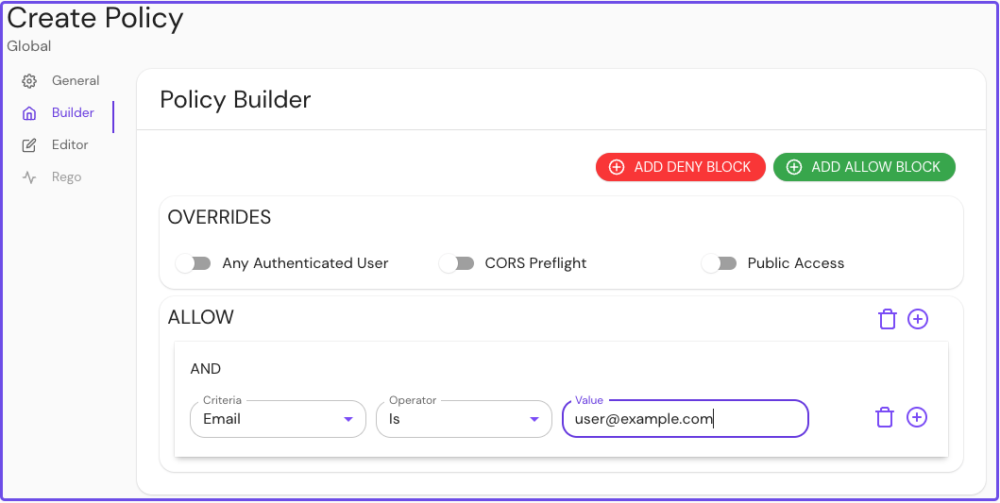

Save your policy.

Create an external route to access Jenkins:

1. Name your route and enter the external route in the **from:** field
2. Enter the scheme and hostname in the **to:** field
3. In the **Policies** field, select the policy you built for Jenkins
4. Select **Pass Identity Headers**

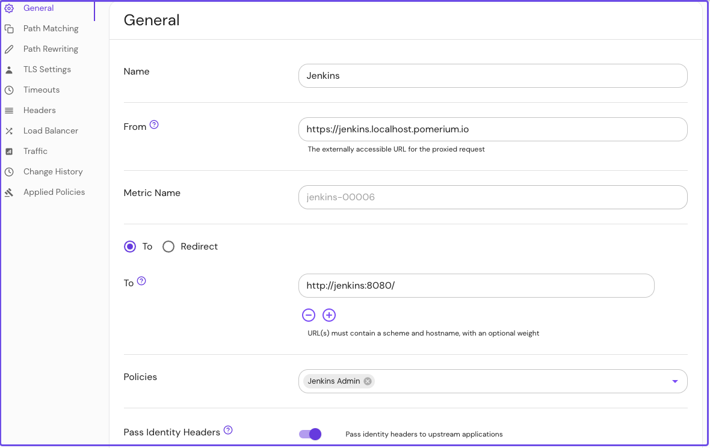

Configure your route to rewrite the host header:

1. Select **Headers** from the sidebar
2. In the **Host Headers** dropdown, select **Rewrite to Header**
3. In the **Host Rewrite to Header** field, enter the external route without the protocol

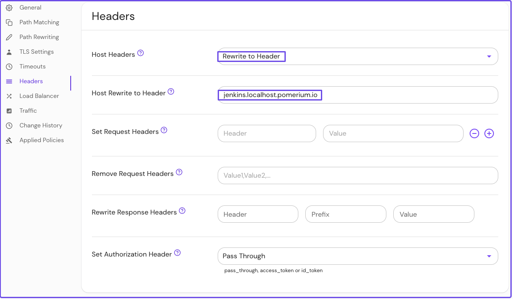

Save your route.

## Set up your Jenkins instance

1. Go to your external Jenkins route and enter the admin user password to continue

You can find the admin user password in your Docker logs or in `/var/jenkins_home/secrets/initialAdminPassword`.

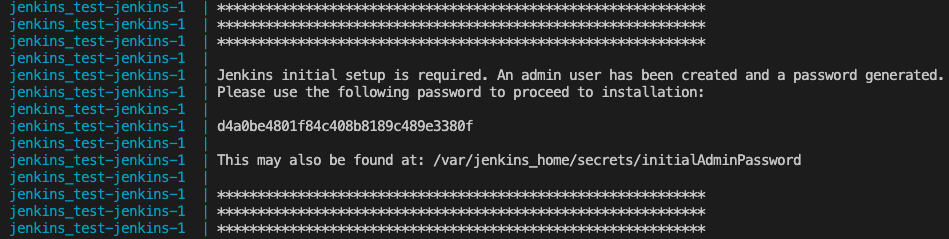

2. Install the suggested plugins
3. Create an admin user

You can create your first admin user or select **Skip and continue as admin**. If you skip and continue as admin, the default username is **admin** and the password is the admin user password.

4. In the **Instance Configuration** window, accept the default hostname

After completing the Setup Wizard prompts, you can access the Jenkins dashboard.

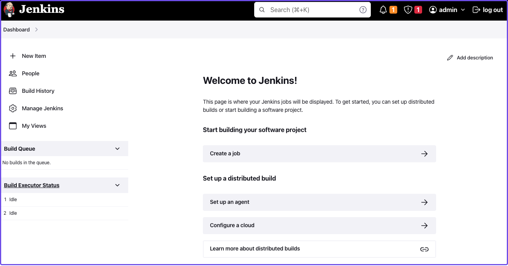

</TabItem>
</Tabs>

## Install Jenkins plugins

Next, you need to add plugins to enable JWT authentication and bypass TLS validation.

Install the **JWT Auth** plugin:

1. Select **Manage Jenkins**
2. Under **System Configuration**, select **Manage Plugins**
3. Select **Available Plugins**
4. In the search bar, enter **JWT Auth**
5. Select the JWT Auth plugin and **Install without restart**

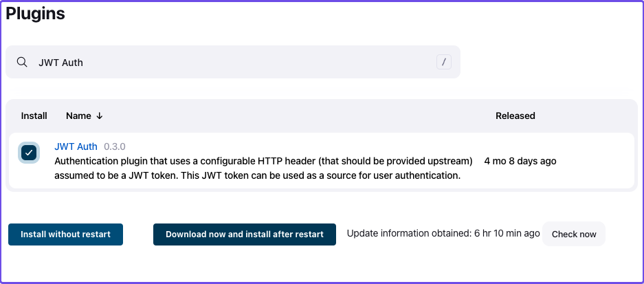

Install the **skip-certificate-check** plugin:

1. Select **Available Plugins**
2. In the search bar, enter **skip-certificate-check**
3. Select the skip-certificate-check plugin and **Install without restart**

Once you’ve installed both plugins, **stop your containers** (you don't need to stop your containers if you're using the Enterprise Console).

## Configure JWT authentication

Go to your external Jenkins route.

To configure JWT authentication:

1. Go to **Manage Jenkins**
2. Under **Security**, select **Configure Global Security**
3. Under **Authentication** > **Security Realm**, select **JWT Header Authentication Plugin**

Under **Global JWT Auth Settings**, you’ll see form fields where you can enter JWT claims. Pomerium forwards a user’s associated [identity information](/docs/capabilities/getting-users-identity#jwt-verification) in a signed attestation JWT that’s included in upstream requests in an `X-Pomerium-Jwt-Assertion` header.

With the JWT Auth plugin installed, Jenkins can receive and parse the assertion header to authenticate users – you just need to give it the right instructions to find the header and JWT claims.

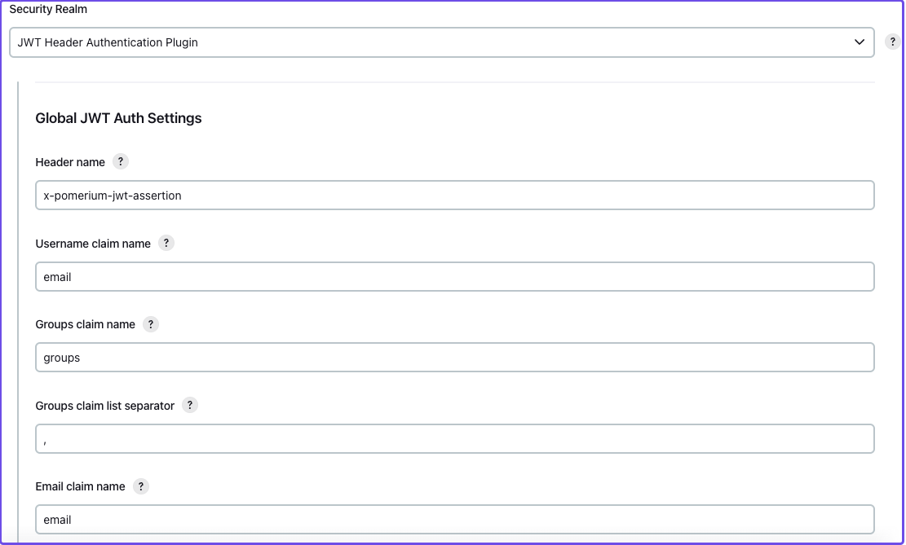

Enter the following information in the **Global JWT Auth Settings** field:

| Field | Value |
| --- | --- |
| **Header name** | `x-pomerium-jwt-assertion` |
| **Username claim name** | `name` or `email` |
| **Groups claim name** | `groups` |
| **Groups claim list seperator** | `,` |
| **Email claim name** | `email` |
| **Acceptable issuers** | `authenticate.corp.example.com` |
| **Acceptable audiences** | `jenkins.corp.example.com` |
| **JWKS JSON URL** | `https://jenkins.corp.example.com/.well-known/pomerium/jwks.json` |

Note the following details about the fields above:

- **Username claim name** can be either your name or email
- **Acceptable issuers** must be the URL of the authentication domain that issued the JWT. The `iss` claim tells the target application who the issuing authority is and provides context about the subject.
- **Acceptable audiences** must be the URL of the target application. The `aud` claim defines what application the JWT is intended for.
- **JWKS JSON URL** appends `/.well-known/pomerium/jwks.json` to the external route URL. The JWKS endpoint provides Jenkins the user’s public key to verify their JWT signature.

:::tip

Go to the external `verify` route defined in your policy to view your JWT claims.

:::

In the **Authorization** dropdown, configure Jenkins permissions so that **Anonymous** has **Administer** privileges.

1. Select **Matrix-based security**
2. Under **Overall**, assign **Administer** to **Anonymous** and **Authenticated Users**

If JWT authentication doesn't authenticate you successfully, Jenkins will sign you in as an anonymous user. With administer privileges, you can troubleshoot JWT settings as an anonymous user and try again.

Select **save** to apply the security settings.

## Test JWT authentication

Restart your container. If JWT authentication worked, you will see your name in the dashboard instead of **admin**. To see more details about the request, add `/whoAmI` to the URL. For example, `https://jenkins.localhost.pomerium.io/whoAmI`.

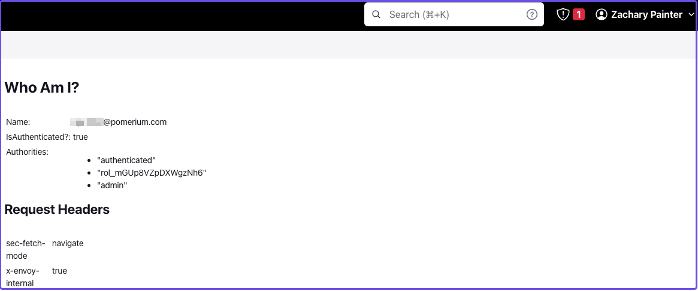

## Update your Jenkins authorization settings

Now, you can configure your Jenkins authorization settings:

1. Select **Matrix-based security**
2. Select **Add user…** and enter the name or email associated with your IdP (the value depends on what claim you entered for **Username claim name**)

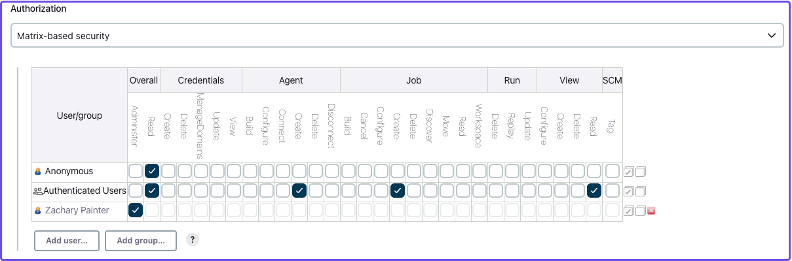

Assign yourself **Administer** privileges and whatever privileges seem appropriate to **Authenticated Users** and **Anonymous** users.

Select **save** to apply the security changes.

## Next steps: Add more context to your policies

You can adjust the authorization policy within Jenkins to limit or broaden what privileges authenticated and anonymous users have, but you can also extend your authorization policies with Pomerium.

For example:

- You can build a policy that only allows users to access Jenkins at certain times of day or days of the week, or limit access to certain devices
- You can import custom groups claims from your IdP and only allow access to members of the group
