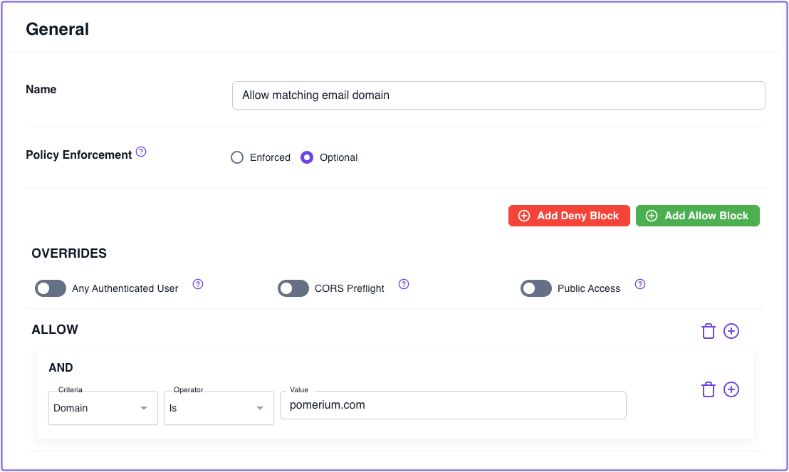
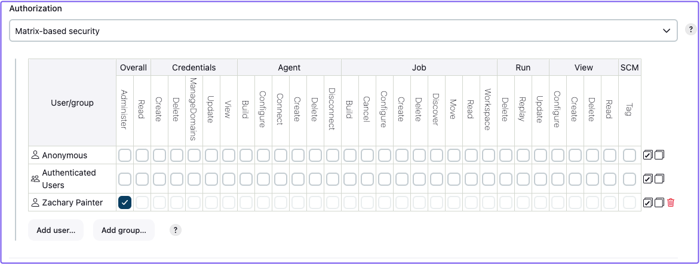
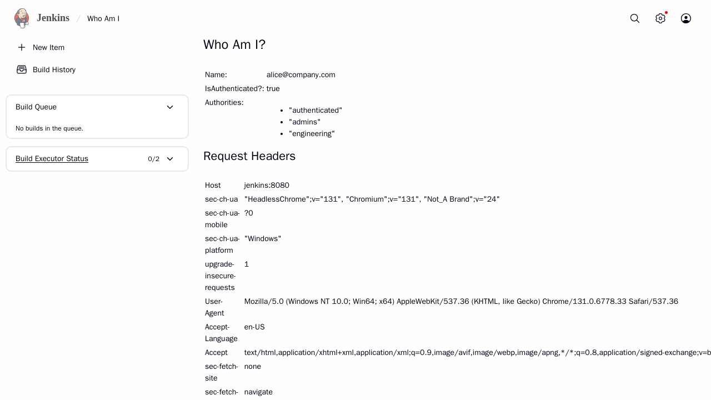

---
# cSpell:ignore truststore
title: Secure Jenkins with Pomerium
sidebar_label: Jenkins
lang: en-US
keywords: [pomerium, jenkins, sso, oidc, jwt, identity aware proxy]
description: Put Jenkins behind Pomerium for single sign-on, forwarding a signed identity JWT that the Jenkins JWT Auth plugin verifies to sign users in automatically.
---

import TabItem from '@theme/TabItem';
import Tabs from '@theme/Tabs';

import Config from '/content/examples/guides/jenkins/config.yaml.md';
import Compose from '/content/examples/guides/jenkins/docker-compose.yaml.md';

# Secure Jenkins with Pomerium

## What this guide does

You'll put Jenkins behind Pomerium so that Pomerium handles single sign-on and authorization, then forwards a cryptographically signed identity JWT to Jenkins. The Jenkins [JWT Auth plugin](https://plugins.jenkins.io/jwt-auth/) verifies that assertion against Pomerium's public keys and signs the user in automatically, so there's no second login and no Jenkins-managed password to store or share.

Jenkins verifies the assertion by fetching Pomerium's public keys from a JSON Web Key Set (JWKS) endpoint that Pomerium publishes, so the rest of this guide refers to that JWKS URL.

## When to use this guide

Use it when you want one front door for Jenkins with your existing identity, and you want Jenkins to trust Pomerium for authentication instead of running its own user database. Jenkins has no built-in JWT support, so this flow depends on the JWT Auth plugin. If you only need to reach Jenkins over a private network without browser SSO, a plain [TCP route](/docs/capabilities/non-http) is a better fit.

## Prerequisites

This guide assumes you've completed the [Quickstart](/docs/get-started/quickstart), so you already have Pomerium running and signing users in through the hosted authenticate service.

You also need:

- [Docker](https://docs.docker.com/install/) and [Docker Compose](https://docs.docker.com/compose/install/)
- A domain you control for the Jenkins route (this guide uses `jenkins.yourdomain.com`)

:::tip Prefer to self-host the identity provider (IdP)?

This guide uses the hosted authenticate service so you don't have to run an IdP. To run your own instead, follow [Keycloak + Pomerium](/docs/integrations/user-identity/oidc) and swap the `authenticate_service_url` / `idp_*` settings into the config below.

:::

## Configure Pomerium

<Tabs queryString="type">
<TabItem value="zero" label="Pomerium Zero" default>

In the [Zero Console](https://console.pomerium.app):

1. Create a **Route**. In **From**, enter `https://jenkins.<your-starter-domain>`; in **To**, enter `http://jenkins:8080`.
2. Set the policy to **Any Authenticated User** (or scope it to a group or domain). To restrict by email domain, create a policy with an **ALLOW** block matching the **Domain** criteria.

   

3. On the **Headers** tab, enable **Pass Identity Headers**, then save the route.

Zero manages the route's TLS certificate and the signing key behind its starter domain, so the JWT Auth plugin's JWKS URL is your authenticate service: `https://authenticate.<your-starter-domain>/.well-known/pomerium/jwks.json`. Use that value for the **JWKS JSON URL** in the next section.

</TabItem>
<TabItem value="core" label="Pomerium Core">

Create a `config.yaml`. It routes `jenkins.yourdomain.com` to the Jenkins container, passes identity headers, and sets a `signing_key` so Pomerium publishes a JWKS that the JWT Auth plugin can verify the forwarded assertion against.

<Config />

Replace `jenkins.yourdomain.com` with your domain, `you@example.com` with your email, and generate your own `signing_key` with the command in the comment. With Core, the JWKS URL is the route's own well-known endpoint (`https://jenkins.yourdomain.com/.well-known/pomerium/jwks.json`).

</TabItem>
</Tabs>

## Configure Jenkins

Jenkins doesn't read a JWT out of the box, so install the JWT Auth plugin and point it at Pomerium. After the stack is running and you've completed the Jenkins first-run wizard:

1. Go to **Manage Jenkins** -> **Plugins** -> **Available plugins**, search for **JWT Auth Plugin**, install it, and restart Jenkins.
2. Go to **Manage Jenkins** -> **Security**. In the **Security Realm** dropdown, select **JWT Header Authentication Plugin** and fill in the fields:

   | Field | Value |
   | --- | --- |
   | **Header name** | `X-Pomerium-Jwt-Assertion` |
   | **Username claim name** | `email` |
   | **Email claim name** | `email` |
   | **Full Name claim name** | `name` |
   | **Groups claim name** | `groups` |
   | **Groups claim list separator** | `,` |
   | **Acceptable issuers** | your route host |
   | **Acceptable audiences** | your route host |
   | **JWKS JSON URL** | the JWKS URL for your setup (see the tab above) |
   | **Leeway seconds** | `30` (clock-skew tolerance when validating `exp` / `nbf`) |

   Pomerium sets the JWT's `iss` and `aud` to the route host, so use the host from your **From** URL: `jenkins.<your-starter-domain>` on Zero, or `jenkins.yourdomain.com` on Core.

3. Leave **Allow verification failures** unchecked once the flow works. While you're first wiring it up, you can enable it temporarily so a misconfiguration doesn't lock you out, then turn it off so only verified Pomerium requests are trusted.
4. Under **Authorization**, pick a strategy. **Logged-in users can do anything** is a reasonable start, since Pomerium's route policy is the real access gate; tighten it with matrix-based security as needed. With **Matrix-based security**, click **Add user...** and grant the signed-in user the permissions they need (for example, **Administer**) so you aren't locked out.

   

Save and restart Jenkins.

## Run the stack

The Compose file runs Pomerium Core and Jenkins together (for Zero, drop the `pomerium` service and use the `compose.yaml` from the Quickstart with your `POMERIUM_ZERO_TOKEN`, keeping the `jenkins` service below):

<Compose />

Start it:

```bash
docker compose up -d
```

Jenkins prints an initial admin password to the container log on first start (`docker compose logs jenkins`), which you'll need to complete the setup wizard the first time you reach it through Pomerium.

## Verify the setup

1. **The route requires authentication.** In a fresh browser, open `https://jenkins.yourdomain.com`. You should be redirected to sign in, not straight into Jenkins.
2. **An allowed user gets in.** Sign in. Pomerium redirects you back to Jenkins.
3. **JWT SSO works.** Once the JWT Auth plugin is configured, Jenkins signs you in automatically as the identity in the assertion. The top-right corner shows your account, and the **Who Am I** page (`/whoAmI`) reports your email under **Name** and **IsAuthenticated?: true**.

   

## Common failure modes

| Symptom | Cause | Fix |
| --- | --- | --- |
| Jenkins shows its own login form instead of signing you in | The assertion didn't verify | Confirm the **JWKS JSON URL** is reachable from the Jenkins container, and that Pomerium has a `signing_key` (Core) so the JWKS isn't empty |
| `unable to find valid certification path to requested target` in the Jenkins log | Jenkins (the Java runtime) doesn't trust the certificate on the JWKS endpoint | With the hosted authenticate service or a public certificate this won't happen; if you front Jenkins with a private CA, import that CA into the Java truststore |
| `Unable to find a suitable verification key` for the JSON Web Signature (JWS) | Empty or unreachable JWKS: no published signing key, or the plugin can't fetch it | Set a `signing_key` (Core) and confirm the JWKS URL resolves from inside the container |
| Redirect loop or certificate errors | DNS or autocert | Make sure DNS for `jenkins.yourdomain.com` points at Pomerium and that Pomerium can get a TLS certificate (Core needs ports 80/443 open for `autocert`; Zero manages it) |

## Security considerations

- The JWT Auth plugin trusts any request carrying an assertion it can verify, so **don't expose Jenkins directly**. Only Pomerium should reach `jenkins:8080`: keep it off published host ports and on the internal Docker network. If Jenkins is reachable directly, an attacker who can craft or replay an accepted header bypasses Pomerium entirely.
- Keep **Allow verification failures** off in production. It's a recovery hatch while configuring the plugin, not a steady state: with it on, Jenkins accepts requests whose JWT didn't verify.
- Scope the route policy (group or domain) to who should have access, and manage Jenkins permissions (matrix-based security) separately for fine-grained authorization.

## Operations

- Tear the stack down with `docker compose down`. Add `-v` to also delete the `jenkins-home` and `pomerium-cache` volumes, which resets Jenkins (including its JWT configuration) to a fresh first run.
- Rotating the `signing_key` re-signs assertions under a new key. After rotation, Jenkins picks up the new key on its next JWKS fetch; restart Jenkins if you want it to re-fetch immediately.
- Last tested with Jenkins LTS (`jenkins/jenkins:lts`, 2.555.2), the JWT Auth plugin, and Pomerium Core v0.32.7.

## Next steps

- [Build policies](/docs/get-started/fundamentals/zero/zero-build-policies)
- [Pass identity headers](/docs/reference/routes/pass-identity-headers-per-route)
- [Custom domains](/docs/capabilities/custom-domains)
