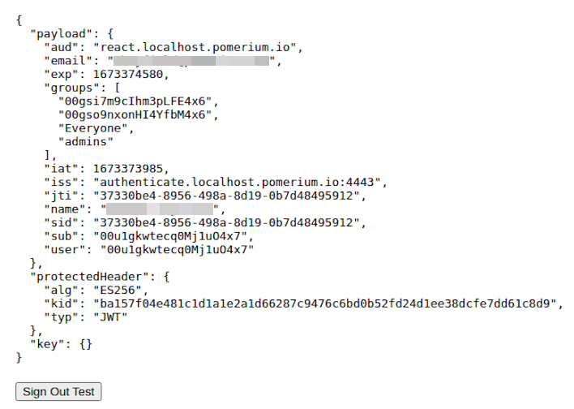

---
# cSpell:ignore finalizers e1c5d20b9cf771de0bd6038ee5b5fe831f771d3715b72c2db921611ffca7242f cxprp jfWNKJkq3b5hrTz2JsrXCcvgJCPP7QSFgX1ZT9wapIQ j8I1I7eb0Imr2pvxRk13cK9ZjAA3VPrdUIHkAslX2e0

title: Pomerium JavaScript SDK
sidebar_label: JavaScript SDK
lang: en-US
keywords: [pomerium, jwt, authorization]
description: Learn how to verify and parse Pomerium JWTs with Pomerium's JavaScript SDK.
---

import Tabs from '@theme/Tabs';
import TabItem from '@theme/TabItem';
import ExpressServer from '../../examples/js-sdk/express-server.md';
import ReactApp from '../../examples/js-sdk/react-app.md';

# Pomerium JavaScript SDK

Learn how to use Pomerium's [JavaScript SDK](https://github.com/pomerium/js-sdk) to verify and parse JWTs issued by the authorization service.

## Background

Pomerium is designed to sit in front of internal backend applications and services so that it can provide context-aware access management in a uniform way.

Although you can configure Pomerium to secure upstream applications with assertion headers (`X-Pomerium-JWT-Assertion`) and Pomerium’s well-known JWKS endpoint (`/.well-known/pomerium/jwks.json`), it’s not immediately obvious or easy for application developers to implement.

Pomerium’s JavaScript SDK offers both client- and server-side solutions that make it easier for developers to verify JWT assertion headers in upstream applications.

## How to use the JavaScript SDK

You can install the JavaScript SDK is available as an [NPM package](https://www.npmjs.com/package/@pomerium/js-sdk).

To use the JavaScript SDK, you need:

- [Node.js](https://nodejs.org/en/download/) (version 18+)
- [NPM](https://www.npmjs.com/) (to install Node.js and Yarn)
- [Yarn](https://classic.yarnpkg.com/lang/en/docs/install/#mac-stable) (preferred package manager)

<Tabs>
<TabItem value="React app" label="React app">

### Secure a React app with Pomerium

1. Boostrap a React application using [Create React App](https://reactjs.org/docs/create-a-new-react-app.html#create-react-app)

```bash
npx create-react-app react-app
cd react-app
```

2. Add dependencies

```bash
yarn add
```

3. Install the JavaScript SDK

```bash
yarn add @pomerium/js-sdk
```

4. Go to `App.js` and add the following code

<ReactApp />

5. Run `yarn start`

You should see your React application in the browser.


</TabItem>
<TabItem value="Express server" label="Express server">

### Secure an Express server with Pomerium

1. Create a directory for your Express server

```bash
mkdir express-server
cd express-server
```

2. Initialize Node.js

```bash
npm init
```

3. Add [Express](https://expressjs.com/) and the JavaScript SDK

```bash
yarn add express @pomerium/js-sdk
```

4. Create an **index.js** file

```bash
touch index.js
```

5. In `index.js`, add the following code

<ExpressServer />

6. Run your server

```bash
node index.js
```

</TabItem>

</Tabs>

### Configure a route in Pomerium

Add a route in Pomerium.

<Tabs>

<TabItem value="Core" label="Core">

```yaml title="pomerium core"
routes:
  - from: https://react.localhost.pomerium.io:4443
    to: http://localhost:3000
    pass_identity_headers: true
    allowed_domains:
      - pomerium.com
      - gmail.com
```

</TabItem>
<TabItem value="Enterprise" label="Enterprise">

Create a policy that only allows `pomerium.com` and `gmail.com` domains:

1. Go to **Policies** and enter a **Name**
2. In the **Create Policy** sidebar, select **Builder**
3. Select **ADD ALLOW BLOCK** and add an **OR** operator
4. In the **Value** field, enter **pomerium.com**
5. Select the **+** icon and add **gmail.com** in the **Value** field
6. Save the policy


Build a route:

1. Go to **Routes** and select **NEW ROUTE**
2. Enter a **Name**
3. In the **From** field, enter `https://react.localhost.pomerium.io:4443`
4. In the **To** field, enter `http://localhost:3000`
5. Select **Pass Identity Headers**
6. Select **Policies** and **Allow Domains**
7. Save the route


</TabItem>

</Tabs>

### Verify the JWT

In your browser, navigate to the relevant route:

- `https://react.localhost.pomerium.io:4443`
- `https://express.localhost.pomerium.io:443/tofu`

If your JWT is valid, you should receive a JSON payload with the following claims:



If the JWT is not valid or something wasn't implemented correctly, you should receive an error:


