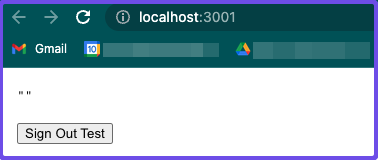
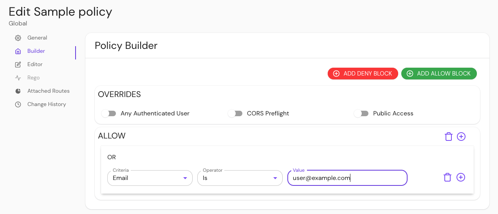
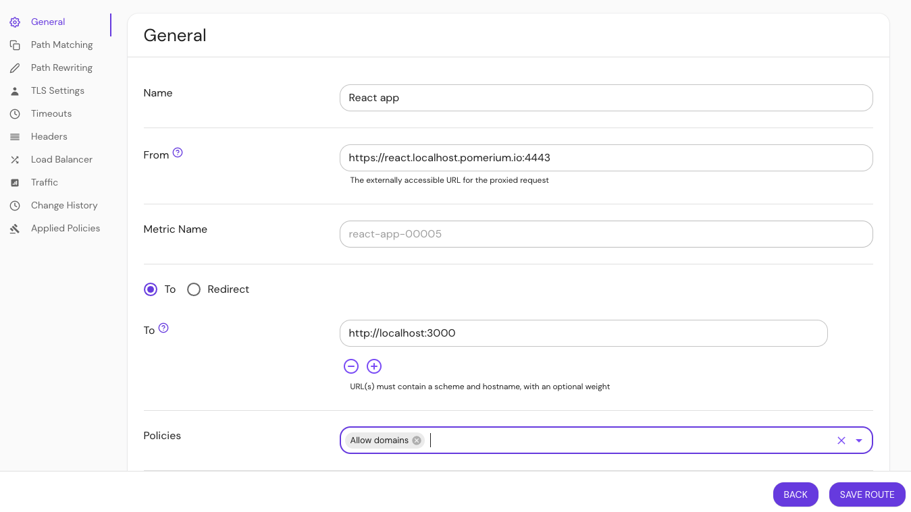
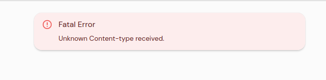

---
# cSpell:ignore 00u1gkwtecq0Mj1u04x7

title: Pomerium JavaScript SDK
sidebar_label: JavaScript SDK
lang: en-US
keywords: [pomerium, jwt, authorization]
description: Learn how to verify and parse Pomerium JWTs with Pomerium's JavaScript SDK.
---

import Tabs from '@theme/Tabs';
import TabItem from '@theme/TabItem';
import ExpressServer from '../../examples/js-sdk/express-server.md';
import ReactApp from '../../examples/js-sdk/react-app.md';

# Pomerium JavaScript SDK

Learn how to use Pomerium's [JavaScript SDK](https://github.com/pomerium/js-sdk) to verify and parse JWTs issued by the authorization service.

## Background

Pomerium is designed to sit in front of internal backend applications and services so that it can provide context-aware access management in a uniform way.

Although you can configure Pomerium to secure upstream applications with assertion headers (`X-Pomerium-JWT-Assertion`) and Pomerium’s well-known JWKS endpoint (`/.well-known/pomerium/jwks.json`), it’s not immediately obvious or easy for application developers to implement.

Pomerium’s JavaScript SDK offers both client- and server-side solutions that make it easier for developers to verify JWT assertion headers in upstream applications.

## How to use the JavaScript SDK

The JavaScript SDK is available as an [NPM package](https://www.npmjs.com/package/@pomerium/js-sdk).

To use the JavaScript SDK, you need:

- [Node.js](https://nodejs.org/en/download/) (version 18+)
- [NPM](https://www.npmjs.com/) (to install Node.js and Yarn)
- [Yarn](https://classic.yarnpkg.com/lang/en/docs/install/#mac-stable) (preferred package manager)

<Tabs>
<TabItem value="React app" label="React app">

### Secure a React app with Pomerium

1. Bootstrap a React application using [Create React App](https://reactjs.org/docs/create-a-new-react-app.html#create-react-app)

```bash
npx create-react-app react-app
cd react-app
```

2. Add dependencies

```bash
yarn add
```

3. Install the JavaScript SDK

```bash
yarn add @pomerium/js-sdk
```

4. Go to `App.js` and add the following code

<ReactApp />

<details>
  <summary>Trust on first use (TOFU)</summary>
  <div>

The `issuer` and `audience` parameters are optional. If you don’t define them, `PomeriumVerifier` applies `firstUse` by default to the JWT provided by the identity provider. `PomeriumVerifier` verifies subsequent requests with these claims.

If you define the `issuer` and `audience` parameters, `PomeriumVerifier` verifies their values against the claims provided by the identity provider.

The `issuer` and `audience` will both be set to the URL of the upstream application without the prefixed protocol (for example, `httpbin.corp.example.com`).

  </div>
</details>

5. Run `yarn start`

You should see your React app in the browser.



</TabItem>
<TabItem value="Express server" label="Express server">

### Secure an Express server with Pomerium

1. Create a directory for your Express server

```bash
mkdir express-server
cd express-server
```

2. Initialize Node.js

```bash
npm init
```

3. Add [Express](https://expressjs.com/) and the JavaScript SDK

```bash
yarn add express @pomerium/js-sdk
```

4. Create an **index.js** file

```bash
touch index.js
```

5. In `index.js`, add the following code

<ExpressServer />

<details>
  <summary>Trust on first use (TOFU)</summary>
  <div>

The `issuer` and `audience` parameters are optional. If you don’t define them, `PomeriumVerifier` applies `firstUse` by default to the JWT provided by the identity provider. `PomeriumVerifier` verifies subsequent requests with these claims.

If you define the `issuer` and `audience` parameters, `PomeriumVerifier` verifies their values against the claims provided by the identity provider.

The `issuer` and `audience` will both be set to the URL of the upstream application without the prefixed protocol (for example, `httpbin.corp.example.com`).

  </div>
</details>

6. Run your server

```bash
node index.js
```

</TabItem>

</Tabs>

### Configure a route in Pomerium

Add a route in Pomerium.

<Tabs>

<TabItem value="Core" label="Core">

```yaml title="pomerium core"
routes:
  - from: https://react.localhost.pomerium.io:4443
    to: http://localhost:3000
    pass_identity_headers: true
     policy:
       - allow:
           or:
             - email:
                 is: user@example.com
```

</TabItem>
<TabItem value="Enterprise" label="Enterprise">

Create a policy:

1. Go to **Policies** and enter a **Name**
2. In the **Create Policy** sidebar, select **Builder**
3. Select **ADD ALLOW BLOCK** and add an **OR** operator
4. In the **Criteria** field, select **Email**
5. In the **Value** field, enter the email associated with your [identity provider](/docs/identity-providers)
6. Save the policy



Build a route:

1. Go to **Routes** and select **NEW ROUTE**
2. Enter a **Name**
3. In the **From** field, enter the relevant URL:

- `https://react.localhost.pomerium.io:4443`
- `https://express.localhost.pomerium.io/4443/tofu`

4. In the **To** field, enter `http://localhost:3000`
5. Select **Pass Identity Headers**
6. Select **Policies**
7. Select the policy you want to use with your route
8. Save the route



</TabItem>

</Tabs>

:::tip **Note:**

If you're using more than one machine, deploy your React app and use the associated IP address instead of localhost.

:::

### Verify the JWT

In your browser, navigate to the relevant URL:

- `https://react.localhost.pomerium.io:4443`
- `https://express.localhost.pomerium.io:443/tofu`

If your JWT is valid, you should see a JSON payload with the following claims:

```json
{
  "payload": {
    "aud": "react.localhost.pomerium.io",
    "email": /* redacted */
    "exp": 1685477549,
    "groups": [],
    "iat": 1685477249,
    "iss": "react.localhost.pomerium.io",
    "jti": "d6e514e9-f8a6-49bb-a5c4-258391d19e4d",
    "name": /* redacted */
    "sid": "d6e514e9-f8a6-49bb-a5c4-258391d19e4d",
    "sub": "00u1gkwtecq0Mj1u04x7",
    "user": "00u1gkwtecq0Mj1u04x7"
  },
  "protectedHeader": {
    "alg": "ES256",
    "kid": "997cf46e7e54de7e077419a5bf467dc1f711a96b2bf71d6de2ba35d07f29c3a2",
    "typ": "JWT"
  },
  "key": {}
}
```

If the JWT is not valid or something wasn't implemented correctly, you should receive an error:



---

**Resources:**

- [Identity Verification](/docs/capabilities/getting-users-identity)
- [JWT Verification](/docs/guides/jwt-verification)
