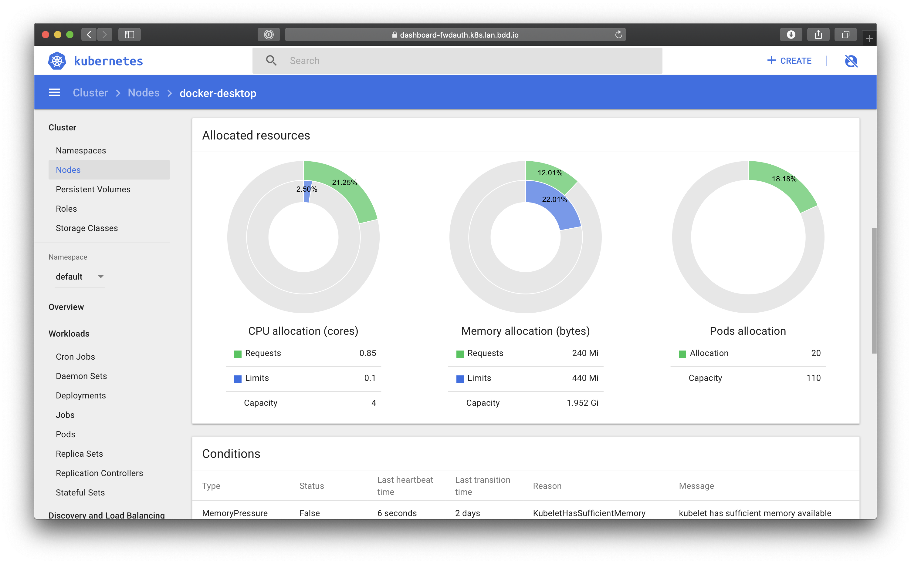

The following guide covers how to secure [Kubernetes Dashboard] using Pomerium. Kubernetes Dashboard is a powerful, web-based UI for managing Kubernetes clusters. Pomerium can act as an independent **identity-aware access proxy** improving and adding single-sign-on to Kubernetes Dashboard's default access control. This is in contrast to most deployments, which use static tokens for access.



This tutorial covers:

- Deploying [Kubernetes Dashboard]
- Establishing secure Kubernetes Dashboard access through Pomerium

## Before You Begin

This guide builds off of existing articles and guides. It assumes you have deployed Pomerium to your cluster (see our [Kubernetes Quickstart] doc), configured a certificate solution like [cert-manager], and set up secure access to the Kubernetes API. Follow the instructions in these pages before you continue:

- [Kubernetes Quickstart]
- [Securing Kubernetes]

## Background

Though securing [Kubernetes Dashboard] as an example may seem contrived, the damages caused by an unsecured dashboard is a real threat vector. In late 2018, Tesla [determined](https://redlock.io/blog/cryptojacking-tesla) that the hackers who were running [crypto-mining malware](https://arstechnica.com/information-technology/2018/02/tesla-cloud-resources-are-hacked-to-run-cryptocurrency-mining-malware/) on their cloud accounts came in through an unsecured [Kubernetes Dashboard] instance.


## Install Kubernetes Dashboard

[Kubernetes Dashboard] is a general purpose, web-based UI for Kubernetes clusters. It allows users to manage applications running in the cluster and troubleshoot them, as well as manage the cluster itself.

Following the [Deploy and Access the Kubernetes Dashboard](https://kubernetes.io/docs/tasks/access-application-cluster/web-ui-dashboard/) page, we can install the dashboard with a single command:

```sh
kubectl apply -f https://raw.githubusercontent.com/kubernetes/dashboard/v2.5.0/aio/deploy/recommended.yaml
```

This will create a `kubernetes-dashboard` namespace and deploy the dashboard within.

## Add a Route

1. Create and apply an ingress for the Kubernetes Dashboard:

    ```yaml title="dashboard-ingress.yaml"
    apiVersion: networking.k8s.io/v1
    kind: Ingress
    metadata:
      name: dashboard
      namespace: kubernetes-dashboard
      annotations:
        #cert-manager.io/cluster-issuer: letsencrypt-staging #Remove or adjust this based on your certificate management strategy
        ingress.pomerium.io/secure_upstream: "true"
        ingress.pomerium.io/tls_skip_verify: "true"
        ingress.pomerium.io/policy: '[{"allow":{"and":[{"domain":{"is":"example.com"}}]}}]'
        ingress.pomerium.io/kubernetes_service_account_token_secret: "pomerium-sa-secret"
    spec:
      ingressClassName: pomerium
      rules:
      - host: dashboard.example.com
        http:
          paths:
          - path: /
            pathType: Prefix
            backend:
              service:
                name: kubernetes-dashboard 
                port:
                  number: 443
      tls:
        - hosts:
            - dashboard.example.com
          secretName: dashboard.example.com-tls
    ```

    The service account token used for `kubernetes_service_account_token_file` is <!-- @wasaga to update after updating our deployment. -->

1. Access to the dashboard for a user is authorized by the cluster role binding defined in role-based access control (**RBAC**) permissions. Following the [User Permissions] section of [Securing Kubernetes], you should already have permissions for your user, or you can create a new RBAC definition following this example:

    ```yaml title="rbac-someuser.yaml"
    apiVersion: rbac.authorization.k8s.io/v1
    kind: ClusterRoleBinding
    metadata:
      name: cluster-admin-crb
    roleRef:
      apiGroup: rbac.authorization.k8s.io
      kind: ClusterRole
      name: cluster-admin
    subjects:
      - apiGroup: rbac.authorization.k8s.io
        kind: User
        name: someuser@example.com
    ```

## Conclusion

Because we've defined RBAC for our users, they can authenticate with Pomerium and Kubernetes will recognize that user in the Dashboard:

<video controls  muted={true}width="100%" height="600" control=""><source src="/k8s-dashboard-user.mp4" type="video/mp4"/>
Your browser does not support the video tag.
</video>

🎉🍾🎊 **Congratulations!** 🎉🍾🎊 You now have a single-sign-on enabled [Kubernetes Dashboard] protected by Pomerium.

[cert-manager]: https://cert-manager.io/docs/
[helm chart]: https://github.com/pomerium/pomerium-helm
[Helm]: https://helm.sh
[Kubernetes Quickstart]: /docs/k8s/quickstart
[Kubernetes Dashboard]: https://kubernetes.io/docs/tasks/access-application-cluster/web-ui-dashboard/
[Securing Kubernetes]: /docs/guides/kubernetes.md
[User Permissions]: /docs/guides/kubernetes.md#user-permissions
