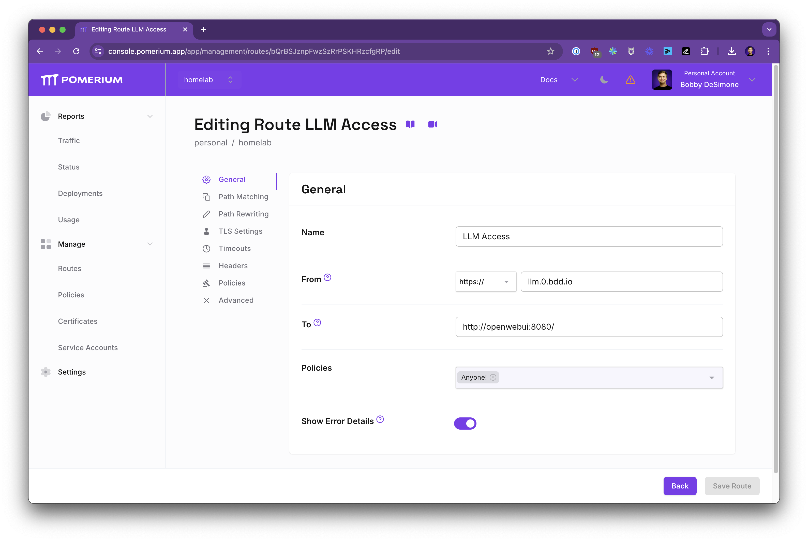
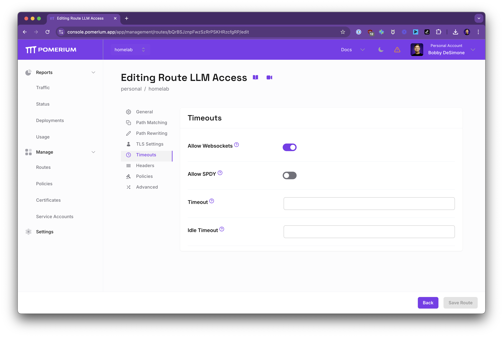
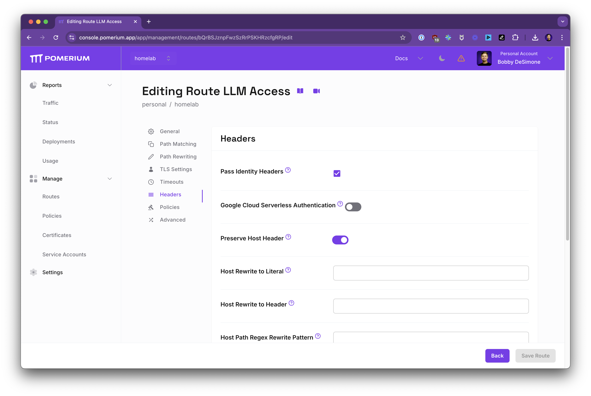
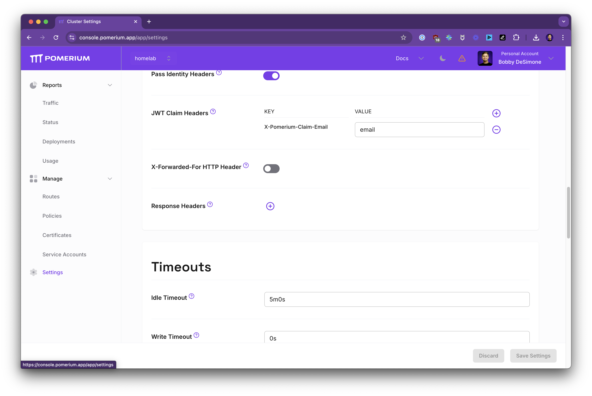
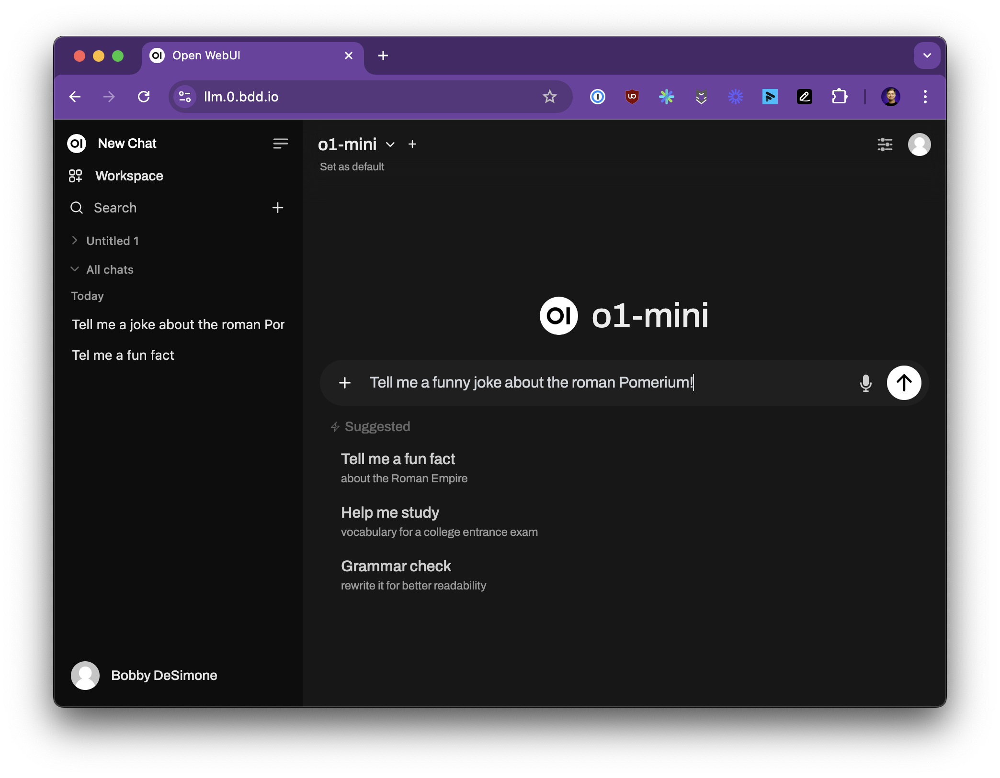

# Self-Hosted LLM Behind Pomerium

This guide shows how to run a self-hosted LLM web interface (e.g., [Open WebUI](https://github.com/open-webui/open-webui)) and protect it behind Pomerium. Similar to the [code-server guide](https://www.pomerium.com/docs/guides/code-server), this setup applies enterprise-grade access controls to a local LLM, while passing user identity information through trusted headers so the upstream application knows who's accessing it.

## Why Use Open WebUI?

Open WebUI is a self-hosted interface for interacting with local or remote LLMs. Hosting it locally allows:

- Private experimentation with different LLMs
- Full control over data and configuration
- Integration of custom features like retrieval augmentation, voice, or browsing

## Why Pomerium?

By placing Open WebUI behind Pomerium, you can:

- Authenticate users with your existing IdP (e.g., Google, GitHub, corporate SSO).
- Enforce policy-based access using user attributes like email domain.
- Pass identity headers (e.g., `X-Pomerium-Claim-Email`) to the upstream app, letting it personalize the experience without separate logins.

Pomerium injects trusted identity information, so Open WebUI can recognize authenticated users and skip its own password handling.

## Overview

1. **Run Open WebUI** in Docker.
2. **Configure Pomerium Zero** to secure it.
3. **Access the LLM UI** through a protected URL. Pomerium handles auth, passes user identity, and ensures only allowed users access the LLM.

## Prerequisites

- [Pomerium Zero](https://console.pomerium.app/create-account) account
- Docker and Docker Compose
- A machine capable of running your chosen LLM backend

For GPU acceleration, follow Open WebUI's CUDA instructions.

## Configure Pomerium Zero

### Create a Policy

Define who can access the LLM interface. For example, restrict access to your email domain:

1. In the Zero Console, go to **Policies** → **New Policy**.
2. Name it **LLM Access**.
3. Add an allow condition: `Domain` equals `example.com`.

This ensures only authenticated users with `example.com` email addresses can access the route.

### Create a Route

Map an external domain to the internal Open WebUI service. For example:



1. In the Zero Console, go to **Routes** → **New Route**.
2. Name: `LLM Access`
3. From: `https://llm.your-domain.pomerium.app`
4. To: `http://openwebui:8080`
5. Policies: Select **LLM Access**

Save the route. Now only authorized users can reach `llm.your-domain.pomerium.app`.

### Enable Websockets

LLM UIs often use streaming responses:



- Under **Timeouts**, toggle **Allow Websockets** to `On`.

### Preserve Host Header & Pass Identity

Enable these settings so Open WebUI receives the correct host header and identity claims:



- **Pass Identity Headers**: On
- **Preserve Host Header**: On

This ensures Pomerium forwards identity info like `X-Pomerium-Claim-Email`. In **Settings**, you can define how claims map to headers:



With these settings, Open WebUI trusts the identity headers and can attribute actions to the authenticated user.

## Example Docker Compose

Use placeholders for secrets and adjust `WEBUI_URL` to your external route. If you trust Pomerium's headers, set `WEBUI_AUTH=False` in Open WebUI.

```yaml
version: '3.9'
services:
  pomerium:
    image: pomerium/pomerium:latest
    ports:
      - 443:443
    restart: always
    environment:
      POMERIUM_ZERO_TOKEN: '<YOUR_CLUSTER_TOKEN>'
      XDG_CACHE_HOME: /var/cache
    volumes:
      - pomerium-cache:/var/cache
    networks:
      main:
        aliases:
          - authenticate.<YOUR_CLUSTER_SUBDOMAIN>.pomerium.app

  openwebui:
    image: ghcr.io/open-webui/open-webui:main
    environment:
      HOST: '0.0.0.0'
      OLLAMA_HOST: '0.0.0.0'
      WEBUI_URL: 'https://llm.your-domain.pomerium.app'
      WEBUI_AUTH_TRUSTED_EMAIL_HEADER: 'X-Pomerium-Claim-Email'
      WEBUI_AUTH: 'False'
    ports:
      - 3000:8080
    volumes:
      - open-webui-data:/app/backend/data
    restart: always
    networks:
      main: {}

networks:
  main:

volumes:
  pomerium-cache:
  open-webui-data:
```

Replace `<YOUR_CLUSTER_TOKEN>` and `YOUR_CLUSTER_SUBDOMAIN`. For GPU support, see Open WebUI docs.

## Run and Access

```bash
docker compose up -d
```

Visit `https://llm.your-domain.pomerium.app`. After authenticating via your IdP, Pomerium routes you to Open WebUI with identity headers included.

## Test the LLM

- Load a model, prompt it, and interact.
- Your identity is passed through; Open WebUI sees your user email. No extra passwords needed.
- The entire session is protected behind Pomerium's authentication and authorization.

### Example of a Secured UI



## Next Steps

- Refine policies: Add group-based rules or restrict certain endpoints.
- Integrate different backends: Adjust `OLLAMA_BASE_URL` or `OPENAI_API_KEY`.
- Add more routes behind Pomerium to scale your secure environment.

You've successfully secured a self-hosted LLM WebUI using Pomerium, with identity-aware access control and automatic user recognition upstream.
