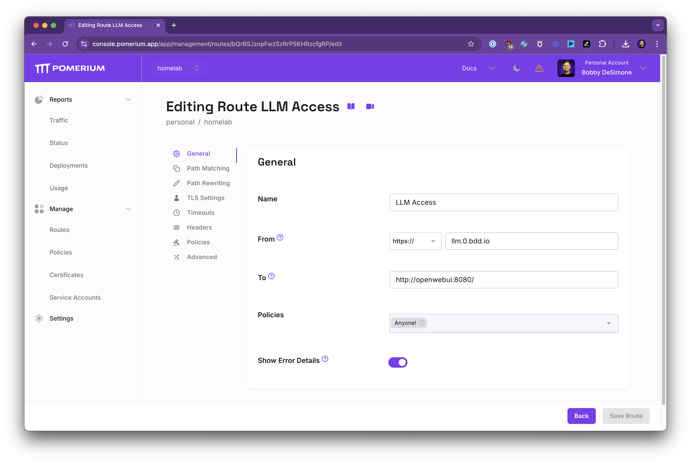
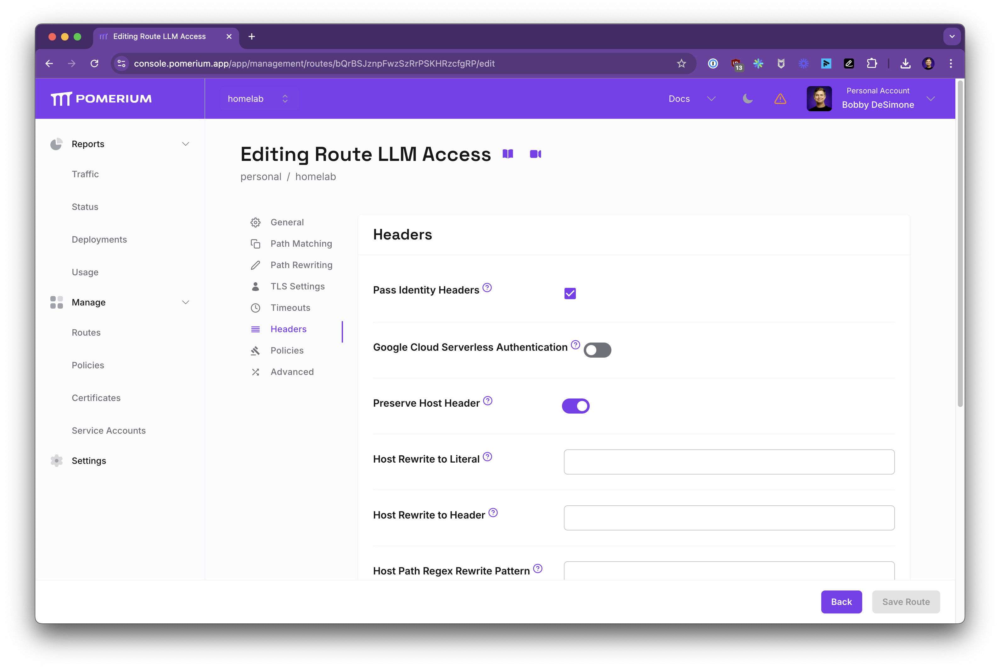
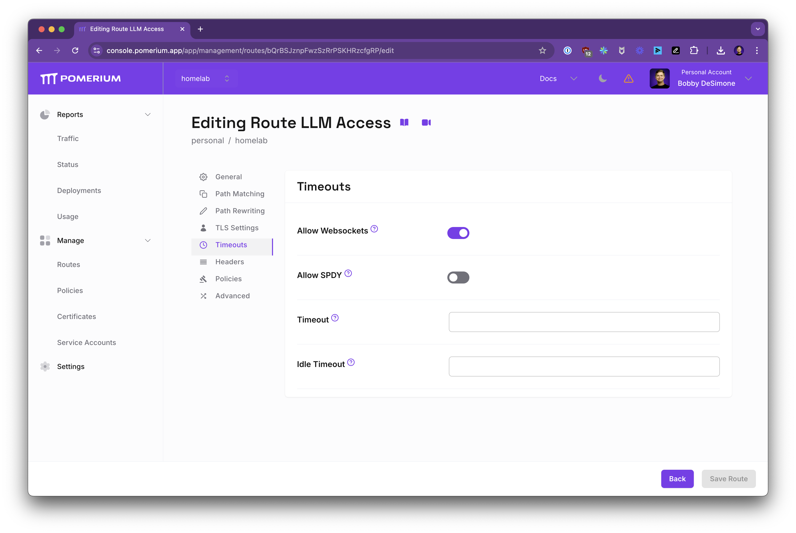
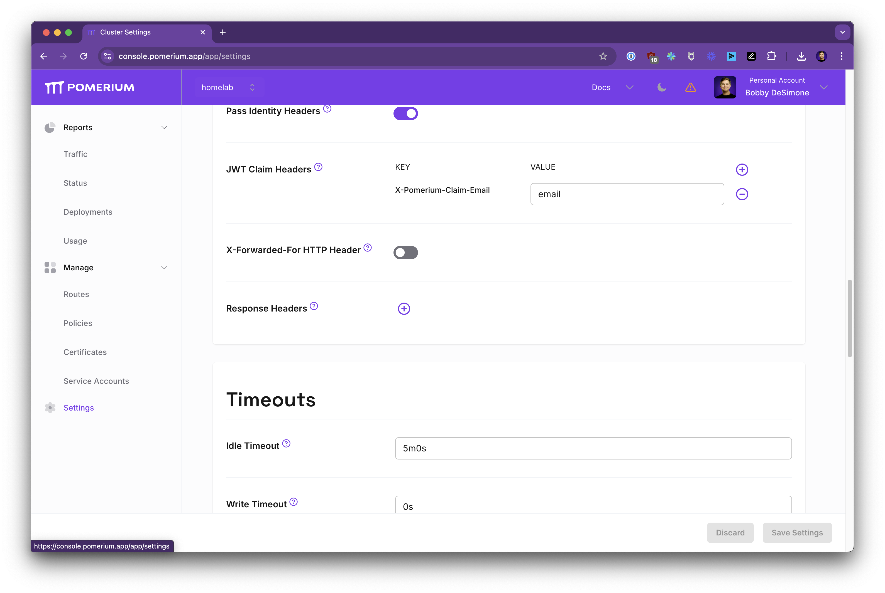
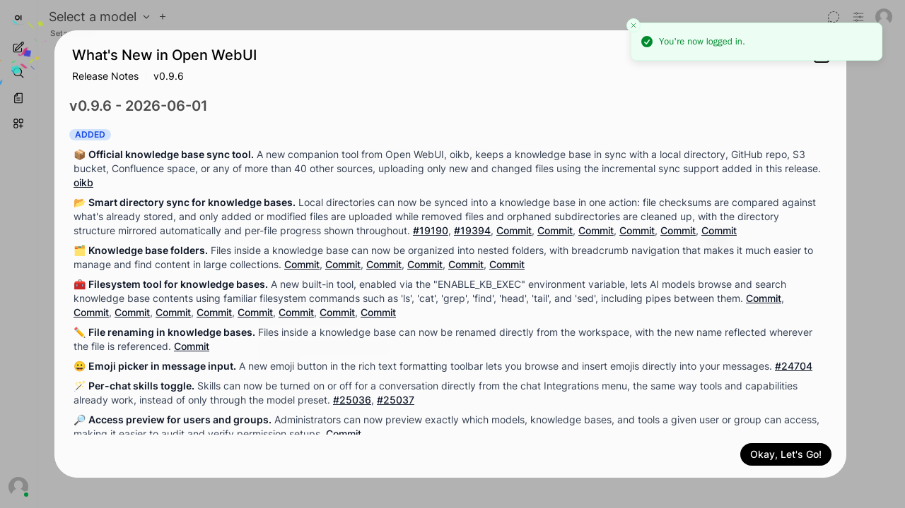

import TabItem from '@theme/TabItem';
import Tabs from '@theme/Tabs';

import Config from '/content/examples/guides/llm/config.yaml.md';
import Compose from '/content/examples/guides/llm/docker-compose.yaml.md';

# Secure Open WebUI with Pomerium

## What this guide does

[Open WebUI](https://github.com/open-webui/open-webui) is a self-hosted web interface for talking to local or remote large language models (LLMs). This guide puts it behind Pomerium so that every request is authenticated against your identity provider before it reaches the model, and so that Open WebUI knows who the user is without running its own login.

Pomerium forwards the authenticated user's email to Open WebUI in a trusted header (`X-Pomerium-Claim-Email`). With trusted-header SSO enabled, Open WebUI provisions and signs in that account automatically, so the only credential prompt your users ever see is your corporate identity provider (IdP).

## When to use this guide

Use this guide when you host Open WebUI yourself and want one access control plane in front of it: SSO, per-user or per-group policy, and audit logging, without standing up and maintaining a separate login system inside the app. It applies whether your model backend is a local Ollama instance, a remote API, or anything Open WebUI supports; Pomerium sits in front of the UI regardless of the backend.

If you only need to gate access and do not care about Open WebUI recognizing the user, you can skip the trusted-header settings and treat this as a plain HTTP app behind Pomerium.

## Prerequisites

- A completed [Pomerium quickstart](/docs/get-started/quickstart) (Zero or Core).
- Docker and Docker Compose.
- A domain you control for the route, for example `llm.yourdomain.com`.

## Configure Pomerium

<Tabs queryString="type">
<TabItem value="zero" label="Pomerium Zero" default>

In the [Zero Console](https://console.pomerium.app), create a policy and a route.

1. Under **Policies**, create a policy that allows the users who should reach the LLM, for example an allow rule matching your email domain.
2. Under **Routes**, create a route:
   - **From**: `https://llm.yourdomain.com`
   - **To**: `http://open-webui:8080`
   - **Policy**: the policy from step 1.

   

3. On the route, enable **Pass Identity Headers** (Headers tab) so Pomerium forwards identity to Open WebUI, and enable **Allow WebSockets** (Timeouts tab) so streamed responses work.

   

   

4. Under **Settings**, configure **JWT Claim Headers** to emit the `email` claim as `X-Pomerium-Claim-Email`. Pass Identity Headers alone forwards only the signed assertion; the `X-Pomerium-Claim-Email` header Open WebUI reads comes from this mapping.

   

</TabItem>
<TabItem value="core" label="Pomerium Core">

With Pomerium Core you supply a `config.yaml`. `jwt_claims_headers` emits the user's email as `X-Pomerium-Claim-Email`, the route's `pass_identity_headers` forwards it to Open WebUI, and `allow_websockets` keeps streamed responses working. Note that `pass_identity_headers` on its own only forwards the signed assertion; the `X-Pomerium-Claim-Email` header comes from `jwt_claims_headers`, so both are required.

<Config />

`autocert: true` provisions TLS from Let's Encrypt for the route host. Replace `llm.yourdomain.com` with your domain and the `email` allow rule with the users or groups that should have access. This config uses the hosted authenticate service; to run your own identity provider instead, see the [Keycloak fallback](/docs/integrations/user-identity/oidc).

</TabItem>
</Tabs>

:::tip

To self-host the identity provider rather than use the hosted authenticate service, follow the [OIDC / Keycloak integration](/docs/integrations/user-identity/oidc).

:::

## Configure Open WebUI

Open WebUI reads the trusted email header through one environment variable:

- `WEBUI_AUTH_TRUSTED_EMAIL_HEADER=X-Pomerium-Claim-Email` tells Open WebUI to trust the email Pomerium forwards, provision the account on first sight, and sign the user in without its own password prompt.
- `WEBUI_URL` should match your external route so generated links are correct.

The first user Open WebUI provisions becomes an admin; everyone provisioned after that lands in a pending role and sees a "waiting for activation" screen until an admin approves them. Plan for that, or set `DEFAULT_USER_ROLE=user` so new trusted-header users are active immediately.

Trusted-header SSO is only safe when the app is unreachable except through Pomerium; see [Security considerations](#security-considerations).

## Run the stack

The compose file runs Pomerium and Open WebUI together. Open WebUI listens on `8080`, which Pomerium routes to internally; only Pomerium publishes ports to the host.

<Compose />

```bash
docker compose up -d
```

The Open WebUI image is large and its first boot runs a one-time database migration, so give the container a minute or two to become ready the first time you start it.

The compose file pins both images by digest so the example is reproducible. To move to a newer release, update the digests (or switch to a version tag you have tested) and re-pull.

## Operations

To stop the stack without losing data:

```bash
docker compose down
```

To tear it down completely, including the `pomerium-cache` and `open-webui-data` volumes (this deletes your Open WebUI accounts, chats, and settings):

```bash
docker compose down -v
```

To upgrade, pull the newer images and recreate the containers; your data persists in the named volumes unless you remove them:

```bash
docker compose pull
docker compose up -d
```

## Verify the setup

1. Visit `https://llm.yourdomain.com` while logged out. Pomerium should redirect you to your identity provider rather than show the Open WebUI login.
2. Sign in with an allowed account. After the identity provider redirect you land in Open WebUI already signed in, with no second password prompt.

   

3. Confirm Open WebUI shows the right identity: the account in the top corner reflects your authenticated email, which Pomerium forwarded as `X-Pomerium-Claim-Email`.
4. Sign in with a user the policy denies and confirm Pomerium blocks the request before it reaches Open WebUI.

## Common failure modes

- **Open WebUI shows its own login screen.** The trusted-header variable is unset or misspelled, or Pomerium is not emitting the claim header. Confirm `WEBUI_AUTH_TRUSTED_EMAIL_HEADER` matches the header name, that `jwt_claims_headers` (Core) or JWT Claim Headers (Zero) maps `email` to `X-Pomerium-Claim-Email`, and that the route has `pass_identity_headers` enabled.
- **Streamed responses hang or never start.** WebSockets are not allowed on the route. Enable **Allow WebSockets** (Zero) or `allow_websockets: true` (Core).
- **502 / connection refused from Pomerium.** Open WebUI is still booting its first-run migration, or the `to` address does not match the service name and port (`http://open-webui:8080`).
- **Wrong or blank user in Open WebUI.** The forwarded header name does not match what Open WebUI expects. Both sides must agree on `X-Pomerium-Claim-Email`.

## Security considerations

Trusted-header SSO means Open WebUI believes whatever identity arrives in `X-Pomerium-Claim-Email`. Two properties keep that safe, and both must hold:

- **Pomerium owns the header.** Pomerium overwrites any inbound `X-Pomerium-*` headers with the authenticated user before forwarding upstream, so a client cannot smuggle a forged email through Pomerium to impersonate someone else. The identity Open WebUI sees is always the one Pomerium authenticated.
- **Pomerium is the only path to the app.** That guarantee is worth nothing if a user can reach Open WebUI directly on `8080` and set the header themselves. The compose file enforces this: Open WebUI publishes no host ports and sits on an `internal` Docker network shared only with Pomerium, so the only route to it is through Pomerium. Reproduce that isolation in production, and make sure no firewall, load balancer, or other route bypasses Pomerium.

Treat any direct path to the upstream as an authentication bypass.

## Next steps

- Tighten the policy with group-based rules or [Pomerium Policy Language](/docs/internals/ppl).
- Point Open WebUI at your model backend with `OLLAMA_BASE_URL` or an OpenAI-compatible endpoint.
- Add more self-hosted tools behind the same Pomerium instance with additional routes.
