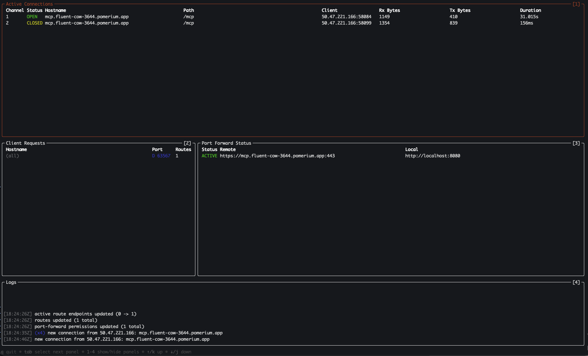
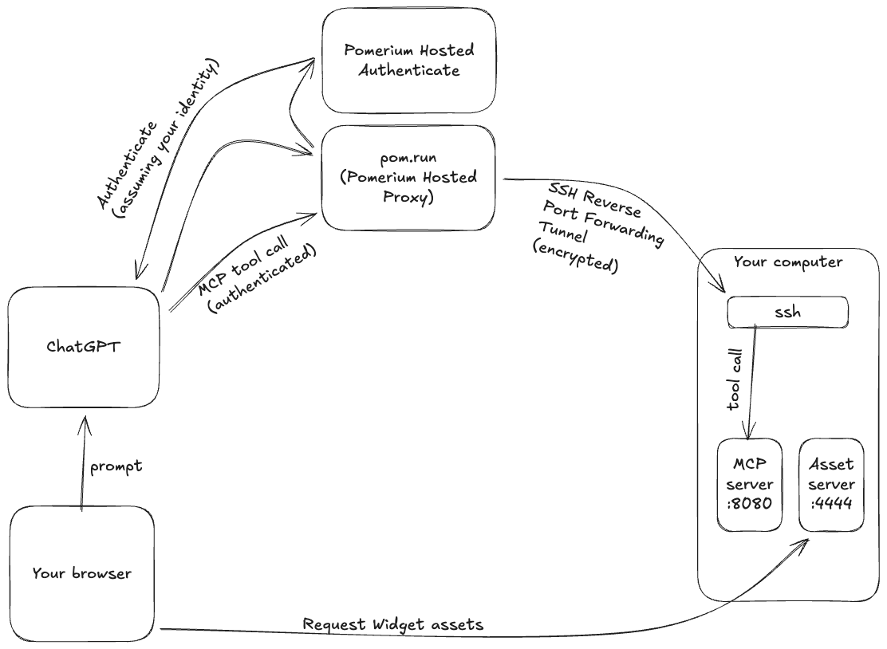

# Securing and Proxying MCP tool calls

[Pomerium](/docs/internals/architecture) is a zero-trust reverse proxy server. Individual requests are made to a Pomerium Cluster are [authenticated](/docs/capabilities/authentication) and [authorized](/docs/capabilities/authorization), and then forwarded to a destination server. Using Pomerium's Hosted MCP Clusters, you can now secure a local MCP server, allowing you to e.g. develop a ChatGPT Widget application. This guide will walk you through doing so.

# Prerequisites

Before getting started with Pomerium Hosted MCP clusters, you should have a local MCP server that implements the HTTP Streamable protocol serving on port 8080, and you should have access to an MCP Client that can use it (e.g. a ChatGPT plus subscription). This guide will walk you through setting up an example local MCP server.

## A note on OAuth

Pomerium uses OAuth to authenticate requests. An MCP client will use OAuth to assume the identity of the user (i.e. you). It is easiest to use one common account (e.g. your Google account) when signing in to ChatGPT and Pomerium.

For more about MCP and OAuth, cf. [MCP key benefits](/docs/capabilities/mcp#key-benefits).

# Creating an example local MCP server

We’ve created an example ChatGPT app, [chatgpt-app-typescript-template](https://github.com/pomerium/chatgpt-app-typescript-template). Run:

```
git clone https://github.com/pomerium/chatgpt-app-typescript-template ${to-be-changed}
cd ${to-be-changed}
npm install
npm run dev
```

The sample app will start an MCP server on port http://localhost:8080 and an assets server on http://localhost:4444 .

How do we secure these servers and expose them to ChatGPT?

# Run ssh -R 0 pom.run

It's simple. Just run

```
ssh -R 0 pom.run
```

This will create an SSH reverse port forwarding tunnel from [pom.run](http://pom.run) to your computer. A reverse port forwarding tunnel is a TCP connection, encrypted using SSH, that forwards traffic to/from a port on your computer from/to a port on a remote computer. In this case, we are establishing a connection with a hosted instance of a Pomerium proxy that will forward traffic from it to you. It works without any custom components, just using the SSH client that is already installed on your computer.

Once you run `ssh -R 0 pom.run`, you will see

```
Please sign in with hosted to continue
http://data-plane-us-centrial1-1.dataplane.pomerium.com/.pomerium/sign_in?user_code=xxxxxxxx
```

Click the sign-in link.

## If you do not already have a Pomerium account

Click “sign up”

You will be sent an email. Verify your email.

Click “Authorize”

The Pomerium Terminal UI (TUI) will appear in your terminal.

## If you already have a Pomerium account

Log in

Click “Authorize”

The Pomerium Terminal UI (TUI) will appear in your terminal.

# Pomerium Terminal UI (TUI)

At this point, you have a Route (e.g. `https://mcp.your-route-1234.pomerium.app/`). That URL points to the Pomerium hosted MCP custer, which will forward requests to port 8080 on your computer using the SSH reverse port forwarding tunnel you just established.



The Pomerium TUI is divided up into several panes.

- **Active Connections** shows unique connections from remote machines to your local server.
- **Client Requests** shows unique port forwarding requests
- **Port Forward Status** shows the status of port forwarding tunnels into your local machine
- **Logs** shows events from the Pomerium proxy server

# Using your new MCP server as a ChatGPT app

## Creating the app

Sign in to your ChatGPT Plus account. Click on your name in the bottom left hand corner, and click Settings. Click on Apps, then “Advanced settings”, then enable “Developer mode”. Finally, click “Create app”.

- Name: Echo Server
- MCP Server URL: `https://mcp.your-route-1234.pomerium.app/mcp`
- Authentication: OAuth
- I understand and want to continue: [check]

## Using your new app

Ask ChatGPT to call the Echo Server app. In this example, I have asked it to echo "Thank you for trying Pomerium!"


# Putting it all together

You now have a local MCP server that implements a ChatGPT Apps widget. You are using an SSH Reverse Port Forwarding tunnel to create a secure, encrypted connection from Pomerium’s Hosted Proxy to your computer. That provides a URL, and it authenticates and authorizes requests that it proxies to your computer.

You’ve created a ChatGPT App, given it that URL, and had ChatGPT use OAuth to authenticate itself as you. When ChatGPT makes MCP tool calls, it sends them to the Pomerium hosted proxy. Pomerium checks to make sure the request is authenticated and authorized, and then proxies it to the MCP server on your computer using the SSH tunnel.

The MCP server responds to the request. That response passes back through the SSH tunnel, through the Pomerium proxy, back to ChatGPT, and then back to your browser.



# Appendix

## Troubleshooting connections

Use the MCP Inspector to verify your new MCP server is running correctly.

`npx -y @modelcontextprotocol/inspector@latest`

### Connecting to the local port

- Transport type: Streamable HTTP
- URL: http://localhost:8080/mcp
- Connection Type: Via Proxy
- Connect

You should be able to click on “Tools” and then “List Tools”, and see the tools exposed by your MCP server. E.g.


### Connecting via the Pomerium proxy

Now click Disconnect.

Click the button in the middle of the screen that says OAuth Settings, and then Quick OAuth Flow. You should see “Authentication completed successfully”.

On the left, change the following

- URL: [your hosted route URL]

Click "Connect". You should be able to call tools on your MCP server as before.
