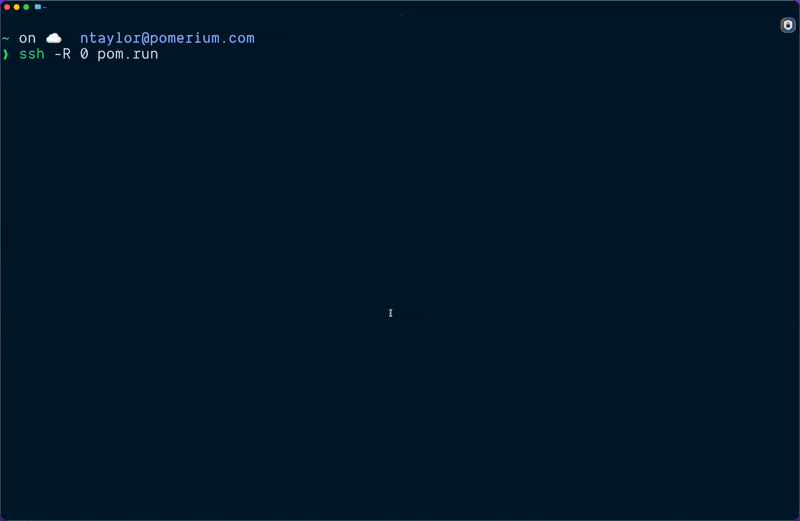
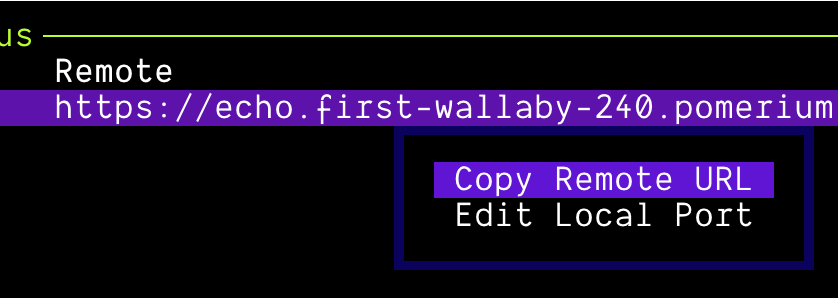
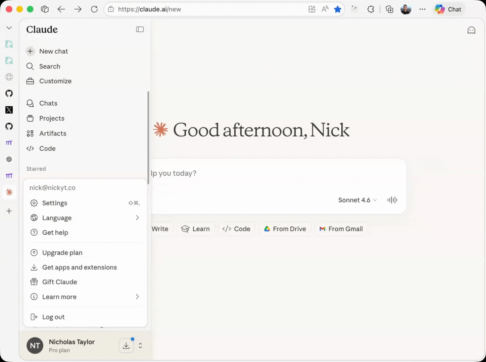
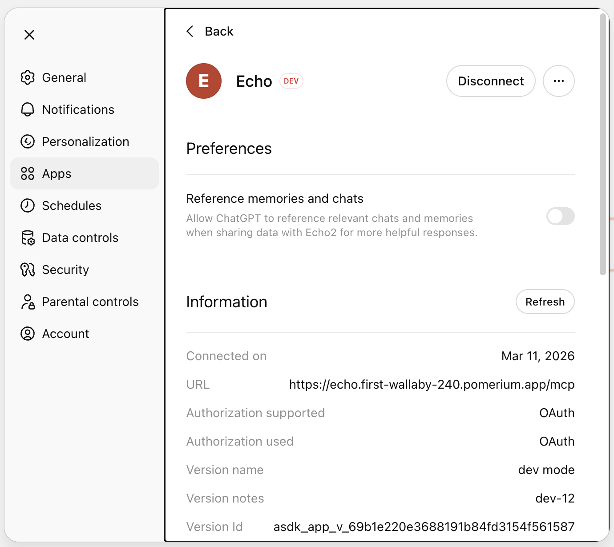
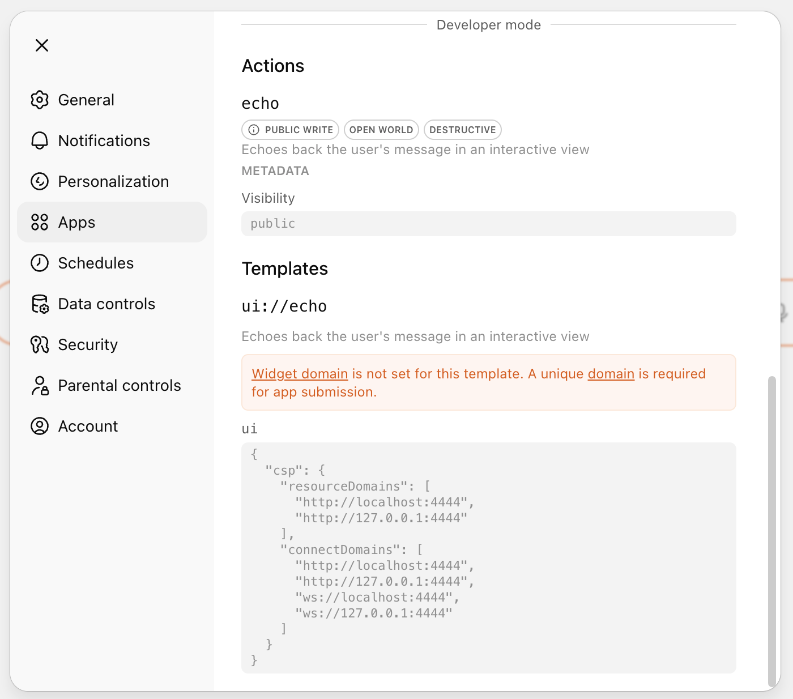

This guide walks you through building a secure MCP App using the [Pomerium MCP App template](https://github.com/pomerium/chatgpt-app-typescript-template) and `ssh -R 0 pom.run`. `pom.run` is a hosted reverse SSH tunnel that gives your local MCP server a public URL and handles OAuth automatically. No auth code to write, no certificate management. The quick start gets you a working app you can test in ChatGPT in about 5 minutes. The rest covers connecting to Claude.ai, building your own tools, sharing what you're building, and deploying your MCP server behind Pomerium when you're ready to ship.

## Quick Start

You need:

- **Node.js 24+** (verify with `node -v`)
- **SSH client** (pre-installed on macOS/Linux; use WSL2 on Windows)
- A ChatGPT Plus subscription or Claude.ai account

### 1. Open the tunnel

In a terminal, run:

```bash
ssh -R 0 pom.run
```

On first run, you'll see a sign-in prompt:

```
Please sign in with hosted to continue
https://data-plane-us-central1-1.dataplane.pomerium.com/.pomerium/sign_in?user_code=some-code
```

Click the link to sign in. If this is your first time, you'll be prompted to create a Pomerium account. You can sign up with email, Google, or GitHub. Authentication is handled by Pomerium's hosted authenticate service, so there's nothing to configure on your end.

After authenticating, your terminal shows the Pomerium TUI. Find your public URL in the **Port Forward Status** section:



```
Status:  ACTIVE
Remote:  https://echo.first-wallaby-240.pomerium.app
Local:   http://localhost:8080
```

Keep this terminal open. The tunnel stays active as long as the SSH session is running. See [Reverse Tunneling](https://main.docs.pomerium.com/docs/capabilities/reverse-tunneling) for more detail on the TUI and how the tunnel works.

If the URL is cut off, you can right click in the TUI and select **Copy Remote URL** to get the full URL.



### 2. Clone and start the template

In a new terminal:

```bash
git clone https://github.com/pomerium/chatgpt-app-typescript-template your-mcp-app
cd your-mcp-app
npm install
npm run dev
```

or via the GitHub CLI:

```bash
# Requires GitHub CLI: https://cli.github.com/
gh repo clone pomerium/chatgpt-app-typescript-template your-mcp-app
cd your-mcp-app
npm install
npm run dev
```

This starts two processes:

- **MCP server** on `http://localhost:8080`
- **UI dev server** on `http://localhost:4444`

You should see something similar to this in your terminal:

```
❯ npm run dev

> chatgpt-app-typescript-template@1.0.0 dev
> concurrently "npm run dev:server" "npm run dev:widgets"

[1]
[1] > chatgpt-app-typescript-template@1.0.0 dev:widgets
[1] > npm run dev --workspace=widgets
[1]
[0]
[0] > chatgpt-app-typescript-template@1.0.0 dev:server
[0] > npm run dev --workspace=server
[0]
[0]
[0] > chatgpt-app-server@1.0.0 dev
[0] > tsx watch src/server.ts
[0]
[1]
[1] > chatgpt-app-widgets@1.0.0 dev
[1] > vite
[1]
[1]
[1] Found 1 widget(s):
[1]   - echo
[1]
[1] 3:25:38 PM [vite] (client) Re-optimizing dependencies because lockfile has changed
[1]
[1]   VITE v7.3.0  ready in 261 ms
[1]
[1]   ➜  Local:   http://localhost:4444/
[1]   ➜  Network: use --host to expose
[0] [dotenv@17.2.3] injecting env (0) from .env -- tip: 🔐 encrypt with Dotenvx: https://dotenvx.com
[0] [19:25:38] INFO: Starting MCP App Template server
[0]     port: 8080
[0]     nodeEnv: "development"
[0]     logLevel: "info"
[0]     assetsDir: "/Users/nicktaylor/dev/oss/chatgpt-app-typescript-template/assets"
[0]     baseUrl: ""
[0]     inlineDevMode: false
[0] [19:25:38] INFO: Server started successfully
[0]     port: 8080
[0]     mcpEndpoint: "http://localhost:8080/mcp"
[0]     healthEndpoint: "http://localhost:8080/health"
```

### 3. Connect to ChatGPT and test

1. In ChatGPT, go to **Settings → Apps → Advanced settings** and enable **Developer mode**
2. Click **Create app**
3. Set **MCP Server URL** to your tunnel URL + `/mcp`, e.g. `https://echo.first-wallaby-240.pomerium.app/mcp`
4. Set **Authentication** to **OAuth**
5. Check the acknowledgment and save


Start a new chat and send: `echo today is a great day`

You should see the message displayed in an interactive widget. That's a working MCP App.

---

From here, you can stop. You have a working app you can build on. The sections below cover connecting to Claude.ai, building your own tools, sharing your work, and deploying to production.

---

## Connecting to Claude.ai

Claude.ai requires a different dev mode than ChatGPT. ChatGPT renders widgets in an iframe in your browser, which can reach `localhost:4444` directly. Claude.ai's iframe is more tightly sandboxed and can't load assets from localhost, so widget assets need to be fully self-contained.

<!-- [UNDER_EXPLAINED: "Claude.ai's iframe is more tightly sandboxed" — the exact mechanism isn't confirmed. Worth verifying whether it's a server-side render, a different CSP policy, or something else. The practical effect (can't reach localhost) is correct, but the explanation may be imprecise.] -->

Stop your dev server and restart with inline mode:

```bash
npm run dev:inline
```

This bundles all JavaScript and CSS directly into the widget HTML, producing self-contained files that work inside Claude's sandboxed iframe. The widget dev server still runs in watch mode, so changes are automatically rebuilt.

**Connect to Claude.ai:**

1. Go to **Settings → Integrations** and add a new integration
2. Set the MCP Server URL to your tunnel URL + `/mcp`
3. Authenticate when prompted



<!-- [NOT_EXPLAINED: These steps are incomplete and unverified. The Claude.ai integration flow isn't documented anywhere in Pomerium's current docs — no screenshots, no detail on what "Authenticate when prompted" looks like, and no confirmation of the exact Settings path. This needs someone to walk through the actual Claude.ai UI and document it before publishing.] -->

Test it the same way: ask Claude to echo a message and confirm the widget renders.

After making code changes, refresh the integration to reload tool definitions.

<!-- [NOT_EXPLAINED: How do you refresh an integration in Claude.ai? The ChatGPT flow has a specific path (Settings → Apps → Your App → Refresh). Claude.ai's equivalent isn't documented here or elsewhere in Pomerium's docs.] -->

:::note
Inline mode is only needed when tunneling via `pom.run` to get your MCP working in claude.ai for the development environment. In production, once your assets are served from a public URL, Claude.ai fetches them directly and inline mode isn't required.

You can also use inline mode if you want to test the MCP on another device other then your development machine, e.g. ChatGPT or Claude on your phone.
:::

## Building Your Own Tools

The echo tool in the template shows the full pattern. Here's what you need when adding your own.

<!-- [NOT_EXPLAINED: Display modes (inline, picture-in-picture, fullscreen) and `requestDisplayMode()` are a meaningful part of the MCP Apps widget API but aren't covered here. At minimum, a brief mention and a link to the template README would help developers know this capability exists.] -->

### Tool response

Return `structuredContent` for the widget and a `_meta.ui.resourceUri` pointing to your widget resource:

```typescript
return {
  content: [{ type: "text", text: "Human-readable result" }],
  structuredContent: { result: args.input },
  _meta: {
    ui: { resourceUri: "ui://my-widget" },
  },
};
```

### Widget entry point

Create `widgets/src/widgets/my-widget.tsx`. The build system auto-discovers all files matching `widgets/src/widgets/*.{tsx,jsx}`:

```tsx
import { App } from "@modelcontextprotocol/ext-apps";
import { StrictMode, useEffect, useState } from "react";
import { createRoot } from "react-dom/client";

function MyWidget() {
  const [toolOutput, setToolOutput] = useState(null);
  const [theme, setTheme] = useState("light");

  useEffect(() => {
    const app = new App({ name: "MyWidget", version: "1.0.0" });
    app.ontoolresult = (result) =>
      setToolOutput(result.structuredContent ?? null);
    app.onhostcontextchanged = (context) => setTheme(context?.theme ?? "light");
    app.connect();
  }, []);

  return (
    <div className={theme === "dark" ? "dark" : ""}>
      <pre>{JSON.stringify(toolOutput, null, 2)}</pre>
    </div>
  );
}

// Mounting code required at the bottom of each widget file
const rootElement = document.getElementById("my-widget-root");
if (rootElement) {
  createRoot(rootElement).render(
    <StrictMode>
      <MyWidget />
    </StrictMode>,
  );
}
```

### Widget resource registration

Register the widget resource on the server. The `RESOURCE_MIME_TYPE` constant used below (imported from `@modelcontextprotocol/ext-apps/server`) is `text/html;profile=mcp-app`, the MIME type MCP hosts expect for widget resources:

```typescript
registerAppResource(
  server,
  "ui://my-widget",
  "ui://my-widget",
  { mimeType: RESOURCE_MIME_TYPE },
  async () => ({
    contents: [
      {
        uri: "ui://my-widget",
        mimeType: RESOURCE_MIME_TYPE,
        text: await readWidgetHtml("my-widget"),
      },
    ],
  }),
);
```

<!-- [NEEDS_VERIFICATION: There's a discrepancy between docs. The template README uses `text/html;profile=mcp-app` while the develop-mcp-app docs page shows `text/html+skybridge`. One of these is wrong or outdated — needs to be resolved before publishing.] -->

Then build your widgets and restart the server:

```bash
npm run build:widgets
npm run dev:server
```

### External resources in widgets

MCP hosts render widgets in sandboxed iframes with a strict Content Security Policy. Remote images and API calls are blocked by default. To allow them, declare the domains in your resource registration:

```typescript
return {
  contents: [
    {
      uri: resourceUri,
      mimeType: RESOURCE_MIME_TYPE,
      text: html,
      _meta: {
        ui: {
          csp: {
            resourceDomains: ["https://cdn.example.com"],
            connectDomains: ["https://api.example.com"], // for fetch/XHR
          },
        },
      },
    },
  ],
};
```

List every domain explicitly. Wildcards aren't supported. If a URL redirects (e.g. `https://picsum.photos` to `https://fastly.picsum.photos`), include both.

### Testing without a host

You can inspect your server locally before connecting to ChatGPT or Claude.ai:

```bash
npm run inspect
```

This opens the MCP Inspector in your browser where you can list tools, invoke them, and verify responses.

<!-- [NOT_EXPLAINED: The MCP Inspector is a text-only client — it won't render widgets. The server's UI capability negotiation (`getUiCapability()`) detects this and returns plain text responses instead. Developers may be confused when their widget doesn't show up in inspector output. A note setting this expectation would help.] -->

## Production Deployment

`pom.run` is for development, not a deployment target. It's a hosted reverse SSH tunnel. When you're ready to ship, you need two things:

**MCP server**: must sit behind a Pomerium route with authentication and policy enforcement. Your options:

- **[Pomerium Zero](https://www.pomerium.com/docs/get-started/quickstart)**: managed control plane, fastest path to production
- **Open core**: self-hosted, full control
- **Pomerium Enterprise**: for organizations that need the enterprise console

**Widget assets**: must be publicly accessible because MCP hosts render widgets in sandboxed iframes and can't forward credentials. Serve them from a Pomerium public route, or host them anywhere static assets work: Netlify, Vercel, a CDN via `BASE_URL`. Your call.

### Build

```bash
npm run build
```

This compiles widget bundles with content hashing and the server TypeScript. Outputs:

- `assets/`: optimized widget bundles
- `server/dist/`: compiled server code

Start the production server:

```bash
NODE_ENV=production npm start
```

### Docker

The template includes a multi-stage Dockerfile:

```bash
docker build -f docker/Dockerfile -t my-mcp-app:latest .
docker-compose -f docker/docker-compose.yml up -d
```

Verify it's healthy:

```bash
curl http://localhost:8080/health
```

### Pomerium routes and deployment

<!-- [TODO Nick: finish this section — cover the two-route pattern (auth-gated MCP server + public widget assets), how BASE_URL connects to the widget route so production servers don't point widgets at localhost, and link out to Zero/open core/enterprise getting started paths. Also verify whether `to: http://my-mcp-app:8080/mcp` with the path suffix is correct or should be `http://my-mcp-app:8080` — check protect-mcp-server doc for the canonical pattern. Include Docker compose notes on how the widget assets service is expected to be configured.] -->

## Troubleshooting

**HTTP 503 errors**

This usually means the tunnel, the local MCP server, or both aren't reachable:

- **Tunnel isn't running** — make sure `ssh -R 0 pom.run` is running in a terminal and the session is active.
- **MCP server isn't running** — if the tunnel is up but you're still getting 503s, confirm the MCP server is running locally on `http://localhost:8080`. Start it with `npm run dev`.
- **Both are down** — restart both the tunnel and the dev server.

**MCP host can't connect to your server**

If you're not getting a 503 but your MCP host (e.g. ChatGPT) still can't connect, check that you're using the full MCP endpoint URL with the `/mcp` path. For example, use `https://echo.first-wallaby-240.pomerium.app/mcp`, not `https://echo.first-wallaby-240.pomerium.app`.

**Widget not rendering**

Check that your resource registration uses `text/html;profile=mcp-app` as the MIME type. Verify `assets/` exists and contains built widget files (`ls assets/`). Rebuild with `npm run build:widgets` and restart the server.

**Widget renders in ChatGPT but not Claude.ai**

Claude.ai's Content Security Policy (CSP) blocks loading resources from `localhost`, so widgets that reference external scripts or stylesheets on `localhost:4444` won't render. Run `npm run dev:inline` instead of `npm run dev` — inline mode bundles all JavaScript and CSS directly into the widget HTML, producing self-contained files that work within Claude's CSP restrictions.

**Remote images or API calls not loading in widgets**

MCP hosts render widgets in sandboxed iframes with strict CSP. If remote images or `fetch` calls aren't working, you need to allowlist their domains in your widget resource registration:

```typescript
return {
  contents: [
    {
      uri: resourceUri,
      mimeType: RESOURCE_MIME_TYPE,
      text: html,
      _meta: {
        ui: {
          csp: {
            resourceDomains: ["https://cdn.example.com"],
            connectDomains: ["https://api.example.com"],
          },
        },
      },
    },
  ],
};
```

List every domain explicitly — wildcards aren't supported. If a URL redirects (e.g. `https://picsum.photos` → `https://fastly.picsum.photos`), include both the original and the redirect target.

**Tool not appearing in host**

Test locally with `npm run inspect` first. If the tool doesn't show in the inspector, check server logs for schema errors.

If it works in the inspector but not in your MCP host, the host is likely using a cached tool list. MCP hosts cache tools when you first connect, so after adding or modifying tools you need to refresh. For example, in ChatGPT, go to **Settings → Apps**, select your app, and click **Refresh** under the Information section:



You can also verify your registered tools and widget resources are correct from the app's detail view:



**Widget not mounting (blank iframe)**

Check that the root element ID in your widget's `document.getElementById()` call matches the ID in the HTML template. A mismatch causes the widget to silently fail to mount with no error in the host.

**Text response works but no widget renders**

Make sure your tool response includes `_meta.ui.resourceUri` pointing to a registered widget resource. Without it, the host displays the text content but has no widget to render.

**Port already in use**

```bash
lsof -ti:8080 | xargs kill
# or change the port in .env
PORT=3001
```

## Additional Resources

- [pomerium/chatgpt-app-typescript-template](https://github.com/pomerium/chatgpt-app-typescript-template): Full README with project structure, App API reference, display modes, Storybook, and Docker
- [MCP Full Reference](https://www.pomerium.com/docs/capabilities/mcp/reference): Token types, session lifecycle, configuration
- [Protect an MCP Server](https://www.pomerium.com/docs/capabilities/mcp/protect-mcp-server): Permanent deployment behind Pomerium
- [Limit MCP Tool Calling](https://www.pomerium.com/docs/capabilities/mcp/limit-mcp-tools): Fine-grained tool-level authorization
- [MCP Apps extension spec](https://modelcontextprotocol.io/docs/extensions/apps): The open standard this is built on
