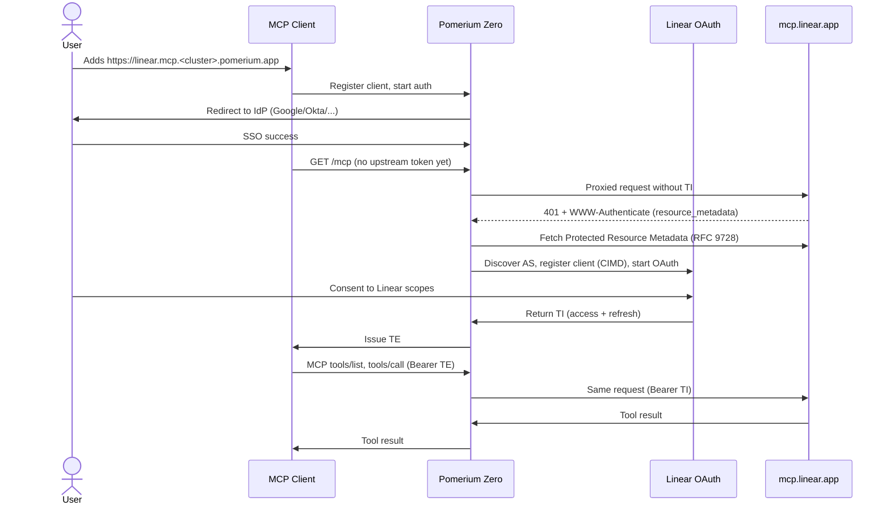
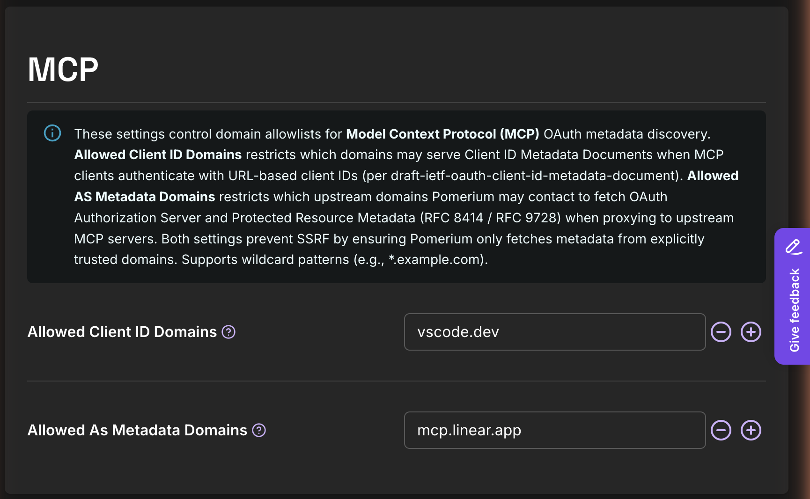
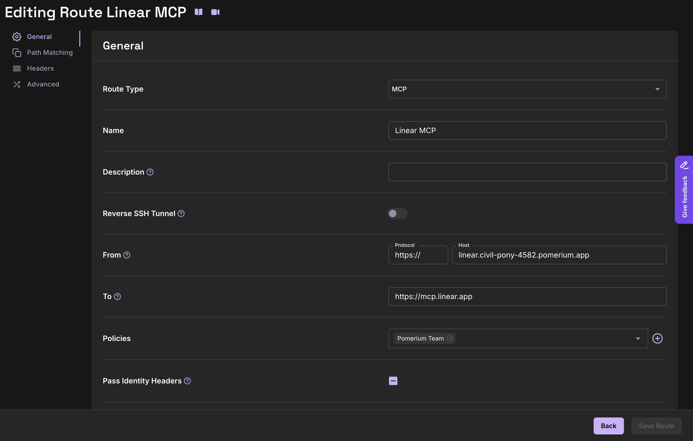
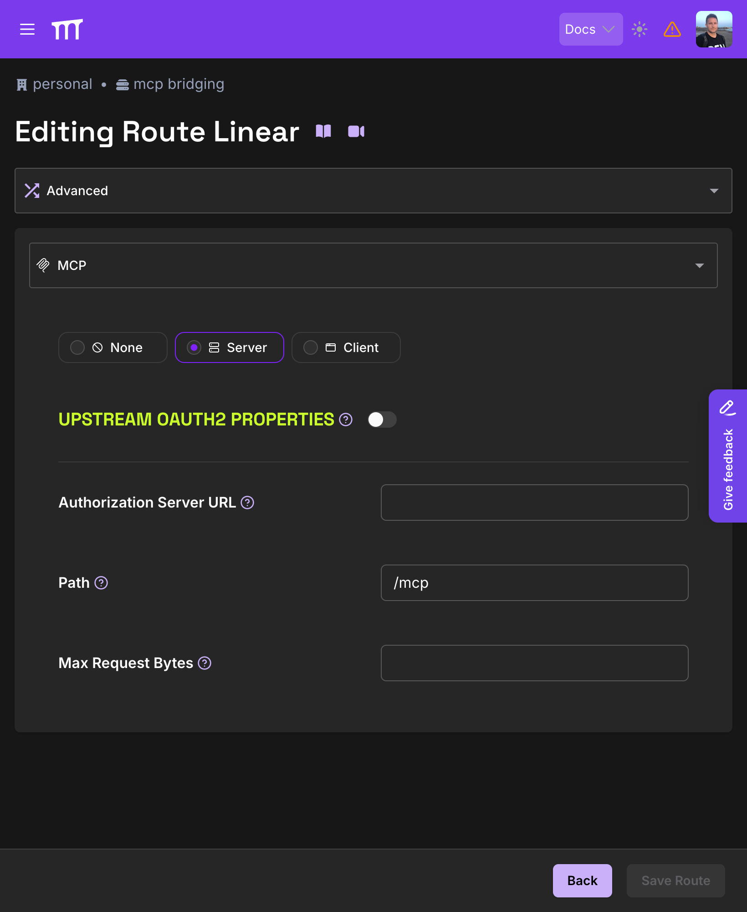
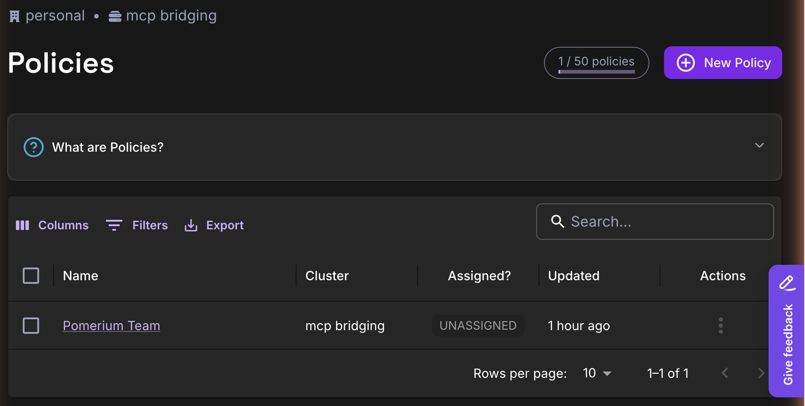
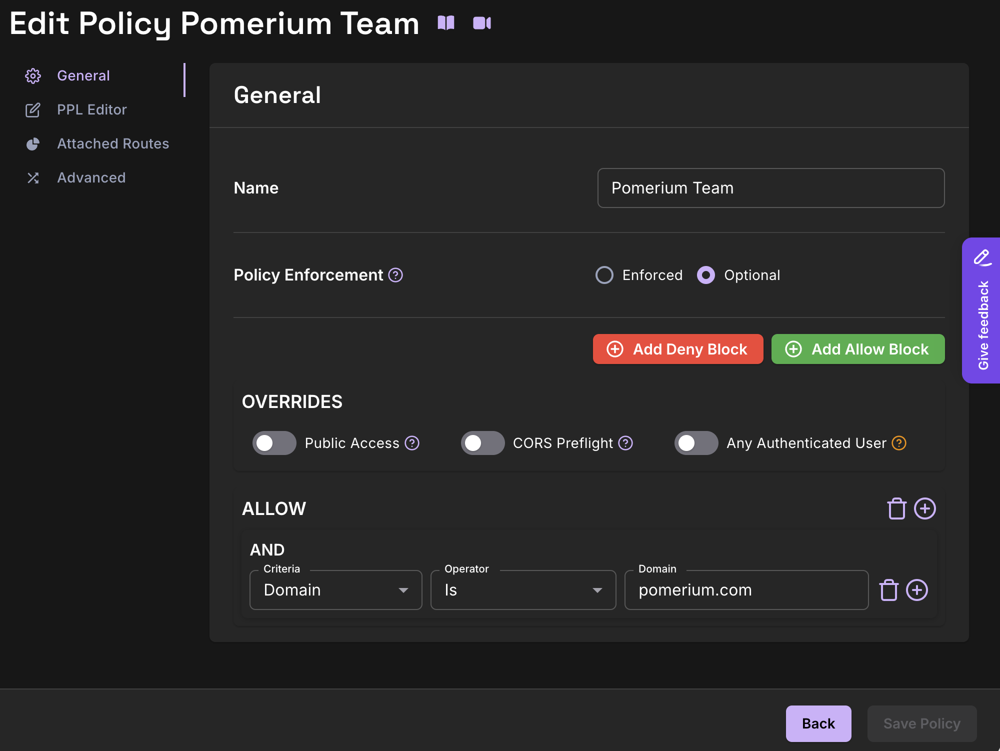
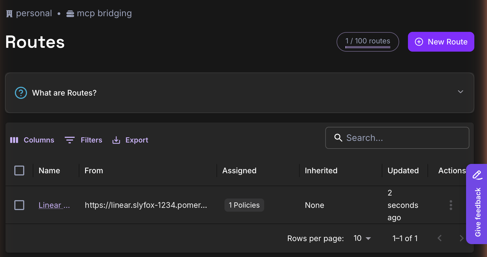
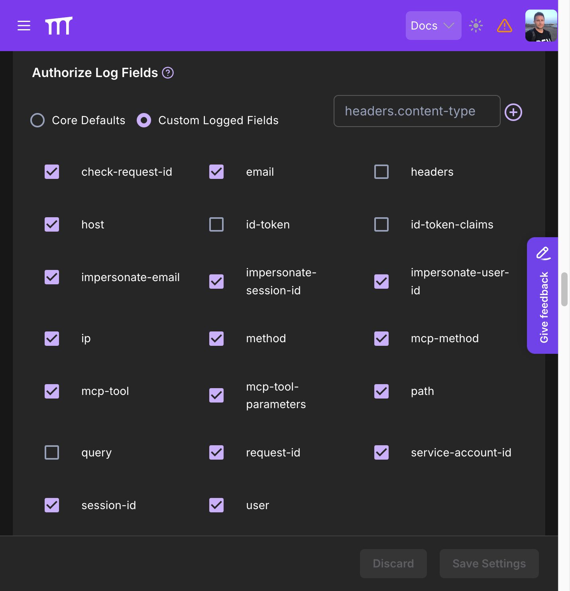
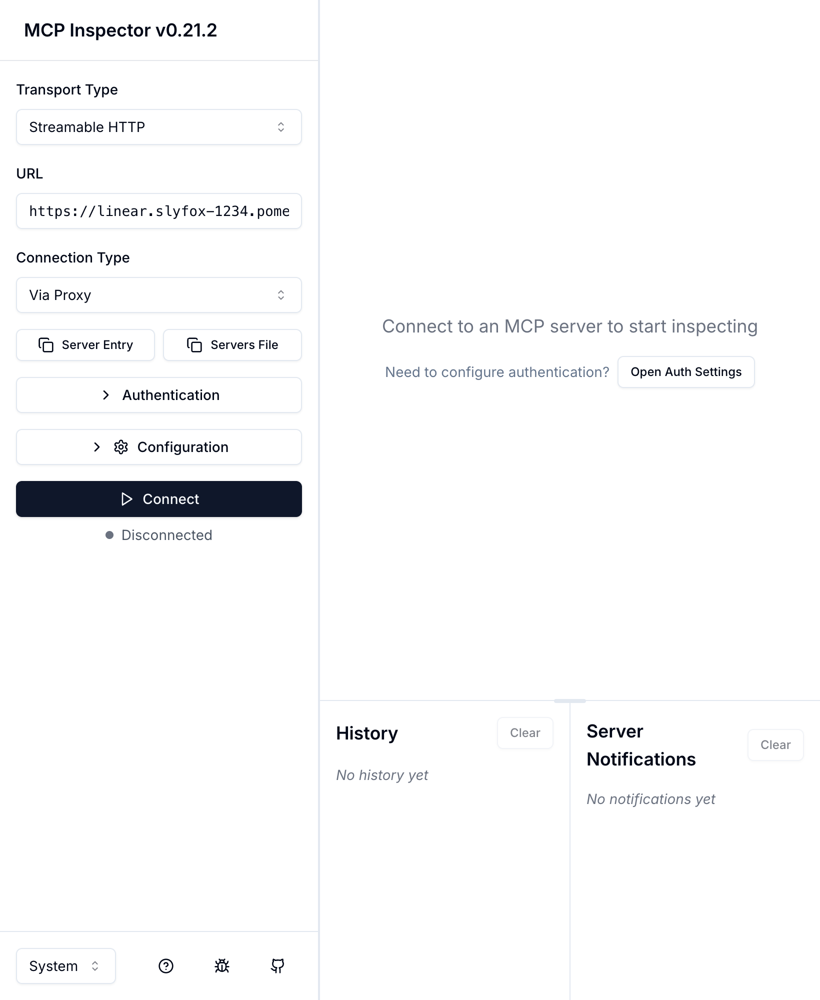

# MCP Bridge: Linear

This guide is a concrete walkthrough of [Model Context Protocol (MCP) bridging](/docs/capabilities/mcp#mcp-bridging): fronting a third-party hosted MCP server with Pomerium Zero so your team can use it under your existing single sign-on (SSO). We'll use [Linear's](https://linear.app) remote MCP server (`https://mcp.linear.app/mcp`) so the steps, policies, and screenshots stay concrete. The same pattern applies to any MCP server that publishes its OAuth configuration in a format Pomerium can discover automatically. That format is [RFC 9728: OAuth 2.0 Protected Resource Metadata](https://datatracker.ietf.org/doc/html/rfc9728). In plainer terms: any MCP server that can tell Pomerium "here's where your users should authenticate," so you don't have to register an OAuth app with the provider by hand.

## What this guide does

You'll end up with a single Zero route (for example, `https://linear.mcp.<your-cluster>.pomerium.app`) that any MCP client (Claude Desktop, ChatGPT, VS Code, the MCP Inspector) can add as an MCP server. When a user connects:

1. Pomerium authenticates them with your identity provider (IdP) via SSO.
2. Pomerium bridges them through Linear's OAuth flow the first time, caches the resulting Linear token, and refreshes it automatically. The MCP client never sees that token.
3. Every tool call is evaluated against your Pomerium Policy Language (PPL) policy and logged with the user's identity and the tool name.

You manage access the same way you manage access to anything else behind Pomerium, and your internal apps never have to implement OAuth against Linear.

## When to use this guide

Use this pattern when:

- Your team already uses Linear and you want AI agents (Claude, ChatGPT, Codex, internal chat apps) to call Linear tools on behalf of a signed-in user.
- You want to centralize MCP access control in Pomerium rather than letting every client negotiate its own OAuth with Linear.
- You want group-based access control and per-tool restrictions. This guide sets up the bridged route; [Limit MCP Tool Calling](/docs/capabilities/mcp/limit-mcp-tools) is how you then add rules like read-only Linear for support, full access for engineering, or no `issue_delete` for anyone.
- You want DevSecOps teams to have visibility into which users connect to which MCP servers and which tools they invoke, using the same Pomerium audit logs and policy layer you already rely on elsewhere.

Use a different blueprint when:

| What you're trying to do | Use this guide instead |
| --- | --- |
| Expose your own internal MCP server (no upstream OAuth) | [Protect an MCP Server](/docs/capabilities/mcp/protect-mcp-server) |
| Bridge a provider that requires you to manually register an OAuth app (Google Workspace, most enterprise SaaS) | [MCP + Upstream OAuth: pre-registered credentials](/docs/capabilities/mcp/mcp-upstream-oauth#pre-registered-credentials) |
| Let an LLM backend (OpenAI, Anthropic) call MCP servers on a user's behalf | [Delegate MCP Access to an LLM](/docs/capabilities/mcp/delegate-mcp-to-llm) |
| Run your own internal MCP server that calls an upstream API (e.g. internal service → GitHub REST) and want Pomerium to inject the upstream OAuth token | [MCP + Upstream OAuth](/docs/capabilities/mcp/mcp-upstream-oauth) (same bridging machinery; just point `to:` at your own server) |

## Who this is for

Platform, security, or DevOps engineers running a Pomerium Zero cluster who are comfortable editing routes and PPL policies in the Zero Console and who own the IdP that backs Pomerium authentication.

End users of the MCP route (the people installing Claude Desktop or VS Code's MCP client) do not need any of this. They just add the Pomerium URL as a server.

## Prerequisites

Before you start, confirm all of the following:

- **A working Pomerium Zero cluster** that you own, with a custom or default cluster starter domain (the guide assumes `<your-cluster>.pomerium.app`). If you don't have one, follow the [Pomerium Zero Quickstart](/docs/get-started/quickstart?type=zero) first.
- **A persistent databroker backend.** Prefer Pebble by setting a `file://` connection string under **Settings → General** in the Zero Console. Don't use the in-memory default: it loses the upstream OAuth state Pomerium caches per user, which forces every user to re-authorize Linear on every restart. See [Databroker Storage Settings](/docs/reference/databroker) for the full reference.
- An identity provider wired into Pomerium Zero. [Google Workspace](/docs/integrations/user-identity/google), [Okta](/docs/integrations/user-identity/okta), [Microsoft Entra ID (Azure AD)](/docs/integrations/user-identity/azure), [Auth0](/docs/integrations/user-identity/auth0), or any OIDC-compatible IdP will work. For Zero-specific setup, see [Zero Custom IdP](/docs/get-started/fundamentals/zero/zero-custom-idp) and [Identity Providers](/docs/integrations/user-identity/identity-providers). Domain-based access (the policy used in this guide) works with any IdP; group-based rules require one that emits group claims, and are covered in [Limit MCP Tool Calling](/docs/capabilities/mcp/limit-mcp-tools).
- A Linear workspace, and permission from a Linear admin for members to authorize a third-party OAuth client (the client will be Pomerium). No Linear OAuth application registration is required. Linear's MCP server advertises its own authorization metadata and Pomerium registers itself automatically.
- An MCP-capable client for testing. This guide uses the [MCP Inspector](https://github.com/modelcontextprotocol/inspector) (`npx @modelcontextprotocol/inspector@latest`) because it exposes the raw OAuth and tool-call steps. Claude Desktop, ChatGPT, VS Code, and Cursor also work once the route is live.
- DNS for the route's `from` subdomain resolves to your Pomerium Zero cluster. On `*.<your-cluster>.pomerium.app` subdomains this is automatic; for custom domains see [Custom Domains](/docs/capabilities/custom-domains).
- The Pomerium replica running on your cluster must be a build that includes MCP. MCP is still experimental and its code paths ship only in images built from the `main` branch: `pomerium/pomerium:main` (nightly) or a custom build from source. The default `pomerium/pomerium:latest` is the most recent stable release and does **not** include MCP support. If you followed the [Pomerium Zero Quickstart](/docs/get-started/quickstart?type=zero), the starter compose file uses `:latest`; swap it for `:main` on any cluster where you plan to configure MCP routes. See [Docker Images](/docs/deploy/core#docker-images) for the full tag taxonomy.
- At least one policy exists in your cluster that you can attach to the Linear MCP route. A route needs a policy to allow anything; if you haven't created any yet, follow [Zero Build Policies](/docs/get-started/fundamentals/zero/zero-build-policies) to create a simple domain-based policy first, or plan to create one inline from the route editor in step 3.

:::warning Not for regulated production workloads

Do not rely on this guide for regulated production workloads without additional review. See [MCP Full Reference](/docs/capabilities/mcp/reference#experimental-feature) for current status.

:::

## Architecture and request flow

Pomerium sits between the MCP client and Linear. It holds two distinct tokens for every active session:

- **External Token (TE):** the token Pomerium issues to the MCP client after SSO. This is what Claude Desktop or VS Code sees and sends. Think of it as "the client's Pomerium session."
- **Internal Token (TI):** the upstream OAuth access token Linear issues to Pomerium after the user completes Linear's consent screen. Pomerium caches it per-user and attaches it to proxied requests to `mcp.linear.app`. The client never sees it. Think of it as "Pomerium's cached Linear token on behalf of this user."

The **authorization server (AS)** in the sequence diagram below is the OAuth service that issues tokens, run by Linear for the upstream side and by Pomerium for the downstream side.

The first connection looks like this:



Subsequent calls skip everything from the `401` down to OAuth consent. Pomerium reuses the cached Linear token (the TI from the bullets above) and refreshes it when it expires.

**Trust boundaries to keep in mind:**

- The MCP client trusts Pomerium's certificate on the `from` host. It has no direct relationship with Linear.
- Pomerium trusts Linear's authorization server metadata at `mcp.linear.app`. That host must be explicitly allowed in the **Allowed As Metadata Domains** subsection of **Settings → MCP** (step 1).
- Linear's OAuth consent screen is the only place a user can scope down what Pomerium is allowed to see. If a user has read-only Linear access, the cached upstream token will too.

## Step-by-step implementation

You'll do this entirely in the Zero Console, with a quick check from the command line at the end.

:::note Three places called "MCP" or "Advanced"

The Zero Console has three distinct settings surfaces you'll touch in this guide. Knowing which is which up front will save confusion:

| Where | What it controls | Used in |
| --- | --- | --- |
| **Settings → MCP** (cluster-wide) | Server-Side Request Forgery (SSRF) allowlists for OAuth metadata discovery (the **Allowed As Metadata Domains** and **Allowed Client ID Domains** subsections) | Step 1 |
| **Route editor → Advanced tab → MCP panel** (per route) | Route-level MCP properties (server vs. client mode, path the MCP server is served at, pre-registered upstream credentials) | Step 2 |
| **Settings → Logging** (cluster-wide) | Access and authorize log field selection, including the MCP-specific `mcp-method`, `mcp-tool`, and `mcp-tool-parameters` fields | Step 4 |

:::

### 1. Allow Linear's metadata domain

Linear's MCP server advertises its authorization server via [RFC 9728 Protected Resource Metadata](https://datatracker.ietf.org/doc/html/rfc9728). Pomerium must be allowed to fetch that metadata, so add `mcp.linear.app` to the cluster-wide allowlist.

In the Zero Console:

1. In the left nav, click **Settings**, then go to the **MCP** section in the main cluster settings. This is a dedicated panel (separate from the **Advanced** section further down) that controls SSRF allowlists for MCP OAuth metadata discovery.
2. Under the **Allowed As Metadata Domains** subsection, click the **+** and enter `mcp.linear.app`.
3. Click **Save Settings**.



This section also contains the **Allowed Client ID Domains** subsection, a related but separate allowlist for MCP clients that authenticate using URL-based client IDs. The default list includes `vscode.dev`, which is what this guide uses as the test client. Add other hosted MCP clients you want to permit, for example `claude.ai` or `chatgpt.com`. Leave the default in place if you only need VS Code.

If you skip this step, the first client connection will fail with a log line like `mcp: upstream AS metadata domain not allowed`. See [Troubleshooting](#common-failure-modes).

### 2. Create the MCP route

In the Zero Console, go to **Routes → New Route**. On the **General** tab, fill in:

| Field                 | Value                                            |
| --------------------- | ------------------------------------------------ |
| Route Type            | Set to `MCP`                                     |
| Name                  | `Linear MCP`                                     |
| From → Host           | `linear.mcp.<your-cluster>.pomerium.app`         |
| To                    | `https://mcp.linear.app/mcp`                     |
| Policies              | leave empty for now; you'll attach one in step 3 |
| Pass Identity Headers | leave default                                    |

Click **Save Route**. The route will show up with **Assigned: None**. That's expected until you attach a policy.



After saving, open the route again and go to **Advanced → MCP**. Set **Path** to `/mcp` (Linear's MCP endpoint) and leave everything else at its defaults. That's enough to enable [auto-discovery](/docs/capabilities/mcp/mcp-upstream-oauth#auto-discovery-rfc-9728): Pomerium registers itself with Linear via a [Client ID Metadata Document (CIMD)](/docs/capabilities/mcp/mcp-upstream-oauth#auto-discovery-rfc-9728) on the first connection and caches the registration.



### 3. Create and attach an authorization policy

This is the point of the whole exercise. You'll create a reusable policy and attach it to the Linear MCP route. You can do this inline from the route's **Policies** field or from the dedicated **Policies** page; the steps below use the Policies page so the policy is reusable across future routes.

1. In the left nav, click **Manage → Policies**, then **New Policy**.
2. On the **General** tab, set **Name** to `Pomerium Team`.
3. Leave **Policy Enforcement** on its default.
4. Click **Add Allow Block** (green). An empty `ALLOW` block appears with a `+` icon.
5. Click the `+`, then pick **And**. A condition row is added with three dropdowns: **Criteria**, **Operator**, and a value field.
6. Set:
   - **Criteria:** `Domain`
   - **Operator:** `Is`
   - **Domain:** `your-company.com` (in the screenshots for this guide, the test cluster uses `pomerium.com`)
7. Click **Save Policy**.





Now attach the policy to the route:

1. Go back to **Manage → Routes** and click the `Linear MCP` route.
2. On the **General** tab, click the **Policies** dropdown and select `Pomerium Team`.
3. Click **Save Route**. The route row will now show **Assigned: 1 Policies**.



At this point anyone with a verified email at your configured domain can sign in and connect the MCP client.

Once this domain-only policy is working, see [Limit MCP Tool Calling](/docs/capabilities/mcp/limit-mcp-tools) for how to layer on group-based access (for example, read-only Linear for support versus full access for engineering) and per-tool `deny` rules (for example, blocking `issue_delete` organization-wide). That blueprint covers the `mcp_tool` criterion in full, including prefix and allowlist patterns, and is where all of Pomerium's tool-restriction guidance lives.

### 4. Enable MCP-aware audit logging

In **Settings → Logging**, scroll to **Authorize Log Fields**, select **Custom Logged Fields**, and check at least the fields below. The MCP-specific entries (`mcp-method`, `mcp-tool`, and `mcp-tool-parameters`) are the reason this step matters: without them, your authorize logs record that a request happened but not _which tool was called_ or _with what arguments_.



Without this, your authorize logs won't tell you which tool was called or by whom, and [Checkpoint 4](#checkpoint-4-authorize-log-records-the-tool-call) below depends on it.

### 5. Confirm the config is live

Pomerium Zero distributes each **Save Settings**, **Save Policy**, and **Save Route** to every connected replica as soon as it completes. There is no separate "Apply changeset" button. You can confirm the deployment by going to **Reports → Status**. A healthy cluster shows no red banners; if you see `Cluster has no active replicas`, no Pomerium replica is currently connected and nothing will enforce your config until one is. For help wiring up a replica, see [Pomerium Zero Quickstart](/docs/get-started/quickstart?type=zero).

### 6. Connect an MCP client

From any machine with Node installed:

```bash
npx -y @modelcontextprotocol/inspector@latest
```

In the Inspector UI:

1. **Transport type:** Streamable HTTP
2. **URL:** the MCP server URL with `/mcp` at the end, for example `https://linear.slyfox-1234.pomerium.app/mcp`.
3. Enable **Quick OAuth Flow**.
4. Click **Connect**.



You'll be redirected through two sign-ins in sequence: first Pomerium → your IdP, then Pomerium → Linear. After the second one you land back in the Inspector with a green **Connected** status on the connection banner.

:::note

The MCP Inspector works under the default **Allowed Client ID Domains** list (`vscode.dev`). If you edited that list in step 1 and removed `vscode.dev`, either add it back before running Inspector or add Inspector's origin explicitly. Other hosted clients (Claude Desktop, ChatGPT) register through their own origins. Add them to the allowlist when you test those.

:::

## Verify the setup

Run these four checks in order. Every one of them has a specific expected result; if you see something different, skip down to [Common failure modes](#common-failure-modes).

### Checkpoint 1: Route resolves and requires auth

```bash
curl -sS -o /dev/null -w '%{http_code}\n' \
  https://linear.mcp.<your-cluster>.pomerium.app/mcp
```

Expected: `401` or `302` (redirect to the Pomerium sign-in page). If you see `404` or `Could not resolve host`, DNS isn't pointing at the cluster yet.

### Checkpoint 2: OAuth bridge completes

In the MCP Inspector, after clicking **Connect**, you should:

- Be redirected to your IdP sign-in (once).
- Then be redirected to a Linear **Authorize** screen listing Pomerium as the client and showing the requested scopes.
- Then land back in the Inspector with a green **Connected** status on the connection banner.

If you see the IdP sign-in but Linear's consent screen never appears, the route isn't fully configured as an MCP server route. Re-open the route in the Zero Console and confirm **Route Type: MCP** is set on the General tab and that **Advanced → MCP** matches the screenshot in step 2 (Server mode, Path `/mcp`, Upstream OAuth2 Properties off). A route without Route Type MCP will proxy to Linear but won't trigger the bridging handshake, and a missing or wrong Path will break the MCP discovery Pomerium advertises back to clients. The other common cause is `mcp.linear.app` missing from the **Allowed As Metadata Domains** subsection under **Settings → MCP** (step 1).

### Checkpoint 3: `tools/list` returns Linear tools

In the Inspector, open **Tools → List Tools**. You should see Linear's tool set, for example `issue_create`, `issue_update`, `issue_search`, `project_list`, `comment_create`, and so on. Exact names depend on Linear's current MCP build.

If `tools/list` errors or returns empty, check both logs in the Zero Console: **Logs → Authorize** for policy denials (entries with `"allow-why-false"`) and **Logs → Proxy** for upstream OAuth failures (entries mentioning `upstream_oauth2` or `resource_metadata`). A missing Linear token surfaces in the proxy log; a blocked request surfaces in the authorize log.

### Checkpoint 4: Authorize log records the tool call

Call a cheap read tool from the Inspector, for example `issue_search` with a simple query. Then open **Logs → Authorize** in the Zero Console and filter by your email.

You should see a log entry like:

```json
{
  "request-id": "...",
  "email": "you@your-company.com",
  "mcp-method": "tools/call",
  "mcp-tool": "issue_search",
  "mcp-tool-parameters": {"query": "oncall"},
  "allow-why-true": ["domain-ok", "mcp-tool-ok"],
  "allow-why-false": []
}
```

The reasons in `allow-why-true` come from the PPL evaluator. For this guide's policy that's `domain-ok` (domain matched) and, for tool calls, `mcp-tool-ok` (the tool wasn't blocked by a `deny` rule). The `mcp-tool-parameters` object echoes the arguments the MCP client passed to the tool, which is useful for audit but may contain data you'd rather not retain; redact or drop that field in your log pipeline if that's a concern.

For a blocked call (try `issue_delete`), the same entry should show `"allow-why-false": ["mcp-tool-unauthorized"]` and Pomerium should return `403` to the client.

## Common failure modes

| Symptom | Likely cause | What to check | Fix |
| --- | --- | --- | --- |
| Inspector connects but `tools/list` is empty | Upstream OAuth didn't complete; Pomerium has no cached Linear token for this user | Zero Console **Logs → Proxy**, search for `upstream_oauth2` and `resource_metadata` warnings | Re-run the connect flow. If Linear's consent screen never appeared, add `mcp.linear.app` to **Settings → MCP → Allowed As Metadata Domains** and save. |
| Connect flow hangs on `mcp.linear.app` with a browser error | Linear's consent screen rejected Pomerium's client registration | Open the browser devtools network tab during OAuth; look for a 4xx from `mcp.linear.app` or Linear's authorization server | Usually a stale Client ID Metadata Document (CIMD) entry. Wait for Pomerium to retry, or restart the route from the Zero Console so the client registration is re-initialized. |
| First user works, second user gets "not connected" in the Inspector | You're confusing session state: each user has their own cached Linear token. The first user's session doesn't grant access for anyone else. | Sign in as the second user in a fresh browser profile and complete the Linear consent once | This is expected behavior. Per-user connection state is documented under [Per-User Connection Management](/docs/capabilities/mcp#per-user-connection-management). |
| Policy change had no effect | The cached Pomerium-issued client token (TE) is stale, or no replica is connected to the cluster | Zero Console: confirm the route shows the policy under **Assigned**; check **Reports → Status** for a connected replica; sign out of the MCP client and reconnect | Policies apply on the next MCP request once the replica has picked them up. If Status reports no active replicas, nothing is enforcing the config. Attach a replica via the Zero Quickstart. |
| `401 mcp: upstream AS metadata domain not allowed` in proxy logs | The **Allowed As Metadata Domains** subsection under **Settings → MCP** is missing `mcp.linear.app` | **Settings → MCP → Allowed As Metadata Domains** | Add the entry and save. |
| Tools worked earlier in the session; suddenly all tool calls return `401` (or the client disconnects) | Upstream refresh token failed. Common causes: the user revoked Pomerium in Linear, Linear rotated the token out, or the cached refresh token is stale | Zero Console **Logs → Proxy**: look for `upstream_oauth2` refresh failures attributed to the user | Have the user reconnect from the MCP client. Pomerium will re-run the Linear consent flow and cache a fresh TI. If this is happening cluster-wide, check that system clocks are in sync. Large skew can cause refresh tokens to be rejected by Linear. |
| After a Pomerium restart, every user is asked to re-authorize Linear | Databroker is configured with the in-memory backend (or its storage has been wiped), so the cached TI tokens and CIMD registration are gone | Zero Console **Settings → General → Databroker Storage Connection String**; verify a `file://` or `postgres://` value is set | Set a Pebble connection string like `file:///var/lib/pomerium` (or a Postgres one if that's what you use). See [Databroker Storage Settings](/docs/reference/databroker). |

## Security considerations

- **The upstream token represents the user, not Pomerium.** If a user has write access to `#core` in Linear, the agent using this bridge does too, within the limits of your PPL policy. Treat MCP bridging as "Linear with an LLM keyboard." Layer group scoping and `mcp_tool` deny rules on top of this guide's domain-based policy to shrink the blast radius before anyone connects for the first time; see [Limit MCP Tool Calling](/docs/capabilities/mcp/limit-mcp-tools) for both patterns.
- **Put destructive tools under `deny`, not behind an honor system.** Linear exposes tools that delete issues, archive projects, and manage workspace membership. A model that hallucinates an argument can call those tools just as readily as a useful one. When you add a [tool-restriction policy](/docs/capabilities/mcp/limit-mcp-tools), block `issue_delete`, `project_delete`, `comment_delete`, and anything else whose loss you can't easily recover from, and apply that block globally (including to privileged groups) unless you have a specific reason to relax it.
- **Audit, don't trust.** Enable the `mcp-tool` and `mcp-method` [audit log](/docs/capabilities/audit-logs) fields from step 4 and route them to wherever your team already aggregates security-relevant logs. That could be a [Security Information and Event Management (SIEM)](https://en.wikipedia.org/wiki/Security_information_and_event_management) platform like Splunk or Elastic Security, an observability backend like Grafana (Loki for the log fields, Tempo for the [OTel traces](/docs/reference/tracing) Pomerium already emits), or a combined platform like Datadog or Honeycomb. Every tool call is attributed to the end user's email, not to a service credential, which is the whole point of bridging, and it only pays off if the logs actually land somewhere searchable.
- **Secrets: there are none to store, but the CIMD registration is still state.** Auto-discovery uses CIMD, so there's no `client_secret` to rotate for the Linear bridge. The client registration Pomerium negotiates with Linear is cached in the databroker and reused across restarts. That's another reason the persistent-backend prerequisite matters. If you ever switch to pre-registered credentials for another provider, store the secret in your config management or secret manager and limit who can read it. See the [MCP + Upstream OAuth](/docs/capabilities/mcp/mcp-upstream-oauth#static-oauth2) reference for the static-credential variant.
- **Rotating upstream tokens means clearing databroker state, not just revoking in Linear.** Each user's Linear access + refresh token is cached server-side in the databroker. Revoking the user in Linear will prevent future refreshes from succeeding, but the currently cached access token will continue to work until it expires. If you need to forcibly cut a user off immediately (for example during offboarding), revoke them in Linear _and_ remove the user's session from Pomerium so the cached TI is no longer associated with any valid Pomerium session.
- **Domain allowlists are an SSRF control.** The **Allowed As Metadata Domains** and **Allowed Client ID Domains** subsections under **Settings → MCP** exist to prevent a malicious upstream response from pointing Pomerium at an arbitrary host. Keep them narrow, one provider at a time.
- **TLS is non-optional.** The `from` URL must be HTTPS; Pomerium Zero handles this automatically for `*.<cluster>.pomerium.app` and for custom domains configured per [Custom Domains](/docs/capabilities/custom-domains).

## Next steps and related guides

- [MCP + Upstream OAuth](/docs/capabilities/mcp/mcp-upstream-oauth): the full reference for bridging, including the static or pre-registered credential variant used for Google Workspace and most enterprise SaaS.
- [Limit MCP Tool Calling](/docs/capabilities/mcp/limit-mcp-tools): more patterns for the `mcp_tool` criterion, including allowlists with `not_in`.
- [Delegate MCP Access to an LLM](/docs/capabilities/mcp/delegate-mcp-to-llm): let an LLM backend call this Linear bridge on behalf of a user.
- [Protect an MCP Server](/docs/capabilities/mcp/protect-mcp-server): the bridge's counterpart, fronting your own internal MCP server with Pomerium.
- [MCP Full Reference](/docs/capabilities/mcp/reference): token types, session lifecycle, every config field.
