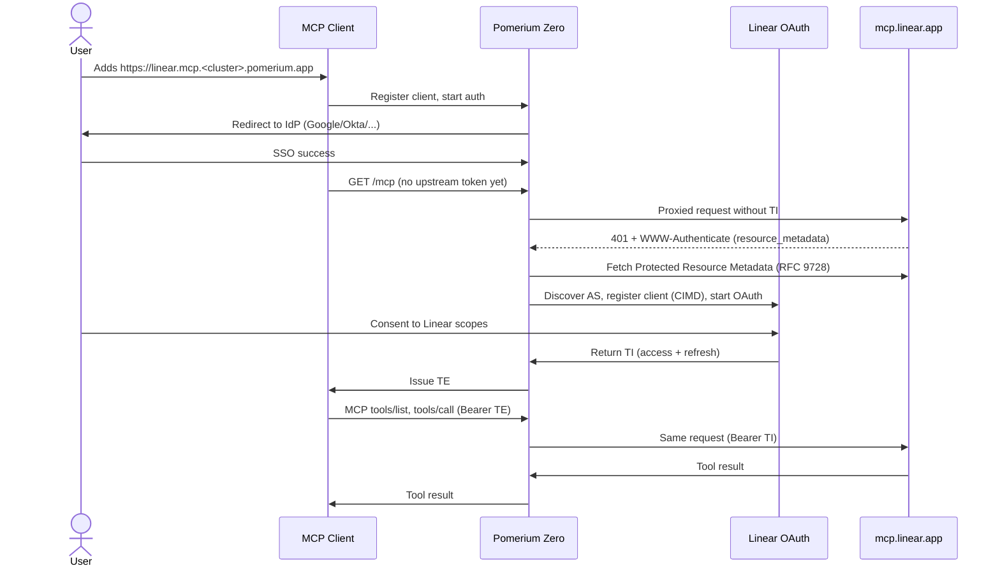

# MCP Bridge

This guide is a concrete walkthrough of [MCP bridging](/docs/capabilities/mcp#mcp-bridging): fronting a third-party hosted MCP server with Pomerium Zero so your team can use it under your SSO.

:::info Example upstream: Linear

Throughout this guide we use [Linear's](https://linear.app) hosted MCP server (`https://mcp.linear.app/mcp`) as the example upstream to make the steps, policies, and screenshots concrete. The same pattern works unchanged for any provider that advertises OAuth metadata via [RFC 9728](https://datatracker.ietf.org/doc/html/rfc9728). Swap the `to` URL, metadata domain, and tool names and you're done.

Another provider we've tested this pattern with is the [GitHub MCP server](https://github.com/github/github-mcp-server). GitHub's hosted MCP endpoint (`https://api.githubcopilot.com/mcp/`) advertises its authorization metadata via RFC 9728, so the same auto-discovery flow used for Linear applies: set `to: https://api.githubcopilot.com/mcp/`, add `api.githubcopilot.com` to **Allowed As Metadata Domains**, and attach your policy. No manual OAuth app registration required.

For providers that require pre-registered OAuth credentials (Google and most enterprise SaaS), see the [static-credentials variant](/docs/capabilities/mcp/mcp-upstream-oauth#pre-registered-credentials) instead.

:::

You'll stand up a Pomerium Zero route that fronts the upstream's MCP endpoint, then use your existing identity provider to gate who can connect, which workspace their tokens come from, and which tools the agent is allowed to call.

## What this guide does

You'll end up with a single Zero route (for example, `https://linear.mcp.<your-cluster>.pomerium.app`) that any MCP client (Claude Desktop, ChatGPT, VS Code, the MCP Inspector) can add as an MCP server. When a user connects:

1. Pomerium authenticates them with your IdP (SSO).
2. Pomerium bridges them through Linear's OAuth flow the first time, caches the resulting Linear token, and refreshes it automatically.
3. Every tool call is evaluated against your PPL policy (domain, group, `mcp_tool`) and logged with the user's identity and the tool name.

The MCP client never sees your users' Linear tokens. Your internal apps never have to implement OAuth against Linear. You manage access the same way you manage access to anything else behind Pomerium.

## When to use this guide

Use this pattern when:

- Your team already uses Linear and you want AI agents (Claude, ChatGPT, Codex, internal chat apps) to call Linear tools on behalf of a signed-in user.
- You want to centralize MCP access control in Pomerium rather than letting every client negotiate its own OAuth with Linear.
- You want group-based access control and per-tool restrictions. For example, read-only Linear access for support, full access for engineering, and no `issue_delete` for anyone.

Use a different blueprint when:

- You're **exposing your own internal MCP server** (no upstream OAuth) → use [Protect an MCP Server](/docs/capabilities/mcp/protect-mcp-server).
- You're bridging a provider that **requires you to manually register an OAuth app** (for example, Google Workspace or most enterprise SaaS) → use the [static or pre-registered credentials variant in MCP + Upstream OAuth](/docs/capabilities/mcp/mcp-upstream-oauth#pre-registered-credentials).
- You need to let an **LLM backend** (OpenAI, Anthropic) call MCP servers on a user's behalf → use [Delegate MCP Access to an LLM](/docs/capabilities/mcp/delegate-mcp-to-llm).
- You run **your own internal MCP server that calls an upstream API** (for example, an internal MCP service that calls the GitHub REST API) and want Pomerium to inject the upstream OAuth token into those outbound calls → use [MCP + Upstream OAuth](/docs/capabilities/mcp/mcp-upstream-oauth). The same bridging machinery applies; you just point `to:` at your own server instead of the third-party endpoint.

## Who this is for

Platform, security, or DevOps engineers running a Pomerium Zero cluster who are comfortable editing routes and PPL policies in the Zero Console and who own the IdP that backs Pomerium authentication.

End users of the MCP route (the people installing Claude Desktop or VS Code's MCP client) do not need any of this. They just add the Pomerium URL as a server.

## Prerequisites

Before you start, confirm all of the following:

- **A working Pomerium Zero cluster** that you own, with a custom or default cluster starter domain (the guide assumes `<your-cluster>.pomerium.app`). If you don't have one, follow the [Pomerium Zero Quickstart](/docs/get-started/quickstart) first.
- An identity provider wired into Pomerium Zero SSO. Google Workspace, Okta, Azure AD, Auth0, or any OIDC IdP will work. See [Zero Single Sign-On](/docs/get-started/fundamentals/zero/zero-single-sign-on).
- Group claims flowing from your IdP into Pomerium, so the `groups` PPL criterion works. If you use a custom IdP, see [Zero Custom IdP](/docs/get-started/fundamentals/zero/zero-custom-idp).
- A Linear workspace, and permission from a Linear admin for members to authorize a third-party OAuth client (the client will be Pomerium). No Linear OAuth application registration is required. Linear's MCP server advertises its own authorization metadata and Pomerium registers itself automatically.
- An MCP-capable client for testing. This guide uses the [MCP Inspector](https://github.com/modelcontextprotocol/inspector) (`npx @modelcontextprotocol/inspector@latest`) because it exposes the raw OAuth and tool-call steps. Claude Desktop, ChatGPT, VS Code, and Cursor also work once the route is live.
- DNS for the route's `from` subdomain resolves to your Pomerium Zero cluster. On `*.<your-cluster>.pomerium.app` subdomains this is automatic; for custom domains see [Custom Domains](/docs/capabilities/custom-domains).
- MCP support is enabled on your cluster. MCP is an experimental feature gated by `runtime_flags.mcp: true`. In Pomerium Zero you don't toggle this flag directly: selecting **Route Type: MCP** on any route enables it automatically for the cluster and exposes the MCP-specific settings described below.
- At least one policy exists in your cluster that you can attach to the Linear MCP route. A route needs a policy to allow anything; if you haven't created any yet, follow [Zero Build Policies](/docs/get-started/fundamentals/zero/zero-build-policies) to create a simple domain-based policy first, or plan to create one inline from the route editor in step 3.

:::warning Experimental feature

MCP support is experimental and subject to change. Do not rely on this guide for regulated production workloads without additional review. See [MCP Full Reference](/docs/capabilities/mcp/reference#experimental-feature) for current status.

:::

## Architecture and request flow

Pomerium sits between the MCP client and Linear. It holds two distinct tokens for every active session:

- **External Token (TE):** the token Pomerium issues to the MCP client after SSO. This is what Claude Desktop or VS Code sees and sends. Think of it as "the client's Pomerium session."
- **Internal Token (TI):** the upstream OAuth access token Linear issues to Pomerium after the user completes Linear's consent screen. Pomerium caches it per-user and attaches it to proxied requests to `mcp.linear.app`. The client never sees it. Think of it as "Pomerium's cached Linear token on behalf of this user."

A third acronym that appears in the sequence diagram below is **AS**, for **authorization server** (the OAuth service that issues tokens, run by Linear for the upstream side and by Pomerium for the downstream side).

The first connection looks like this:



Subsequent calls skip everything from the `401` down to OAuth consent. Pomerium reuses the cached Linear token (the TI from the bullets above) and refreshes it when it expires.

**Trust boundaries to keep in mind:**

- The MCP client trusts Pomerium's certificate on the `from` host. It has no direct relationship with Linear.
- Pomerium trusts Linear's authorization server metadata at `mcp.linear.app`. That host must be explicitly allowed in `mcp_allowed_as_metadata_domains` (step 1).
- Linear's OAuth consent screen is the only place a user can scope down what Pomerium is allowed to see. If a user has read-only Linear access, the cached upstream token will too.

## Step-by-step implementation

You'll do this entirely in the Zero Console, with a quick check from the command line at the end. Every snippet below is shown as the YAML you'd see in the Zero Console's **PPL Editor** tab. The console also lets you build the same thing with dropdowns.

### 1. Allow Linear's metadata domain

Linear's MCP server advertises its authorization server via [RFC 9728 Protected Resource Metadata](https://datatracker.ietf.org/doc/html/rfc9728). Pomerium must be allowed to fetch that metadata, so add `mcp.linear.app` to the cluster-wide allowlist.

In the Zero Console:

1. In the left nav, click **Settings** and scroll to the **MCP** section. This is a dedicated panel (separate from the **Advanced** section further down) that controls SSRF allowlists for MCP OAuth metadata discovery.
2. Under **Allowed As Metadata Domains** (maps to `mcp_allowed_as_metadata_domains`), click the **+** and enter `mcp.linear.app`.
3. Click **Save Settings**.

The equivalent YAML:

```yaml
mcp_allowed_as_metadata_domains:
  - 'mcp.linear.app'
```


This section also contains **Allowed Client ID Domains** (`mcp_allowed_client_id_domains`), a related but separate allowlist for MCP clients that authenticate using URL-based client IDs. The default list includes `vscode.dev`, which is what this guide uses as the test client. Add other hosted MCP clients you want to permit, for example `claude.ai` or `chatgpt.com`. Leave the default in place if you only need VS Code.

If you skip this step, the first client connection will fail with a log line like `mcp: upstream AS metadata domain not allowed`. See [Troubleshooting](#common-failure-modes).

### 2. Create the MCP route

In the Zero Console, go to **Routes → New Route**. On the **General** tab, fill in:

| Field | Value |
| --- | --- |
| Route Type | `MCP` (dropdown; this is what enables MCP for the cluster) |
| Name | `Linear MCP` |
| From → Protocol | `https://` |
| From → Host | `linear.mcp.<your-cluster>.pomerium.app` |
| To | `https://mcp.linear.app/mcp` |
| Policies | leave empty for now; you'll attach one in step 3 |
| Pass Identity Headers | leave default |

Click **Save Route**. The route will show up with **Assigned: None**. That's expected until you attach a policy.

Because you selected **Route Type: MCP**, Pomerium treats this as an MCP server route by default. If you want to inspect or change the MCP-specific properties (for example, switch from server mode to client mode, or provide pre-registered upstream OAuth credentials), open the route, go to the **Advanced** tab, and expand the **MCP** panel. For this Linear bridge you don't need to touch anything there; the defaults are correct.

The equivalent YAML (shown in the **PPL Editor** when you save):

```yaml
routes:
  - from: https://linear.mcp.<your-cluster>.pomerium.app
    to: https://mcp.linear.app/mcp
    name: Linear MCP
    mcp:
      server: {}
```


The absence of an `upstream_oauth2` block is deliberate: it tells Pomerium to use [auto-discovery](/docs/capabilities/mcp/mcp-upstream-oauth#auto-discovery-rfc-9728). Pomerium will register itself with Linear via a [Client ID Metadata Document (CIMD)](/docs/capabilities/mcp/mcp-upstream-oauth#auto-discovery-rfc-9728) on the first connection and cache the client registration.

### 3. Create and attach an authorization policy

This is the point of the whole exercise. You'll create a reusable policy and attach it to the Linear MCP route. You can do this inline from the route's **Policies** field or from the dedicated **Policies** page; the steps below use the Policies page so the policy is reusable across future routes.

1. In the left nav, click **Manage → Policies**, then **New Policy**.
2. On the **General** tab, set **Name** to `Pomerium Team`.
3. Leave **Policy Enforcement** on its default.
4. Click **Add Allow Block** (green). An empty `ALLOW` block appears with a `+` icon.
5. Click the `+`, then pick **And**. A condition row is added with three dropdowns: **Criteria**, **Operator**, and a value field.
6. Set:
   - **Criteria:** `Domain`
   - **Operator:** `Is`
   - **Domain:** `your-company.com` (for this walkthrough on our test cluster we used `pomerium.com`)
7. Click **Save Policy**.


The equivalent PPL (visible on the **PPL Editor** tab of the policy):

```yaml
allow:
  and:
    - domain:
        is: your-company.com
```


Now attach the policy to the route:

1. Go back to **Manage → Routes** and click the `Linear MCP` route.
2. On the **General** tab, click the **Policies** dropdown and select `Pomerium Team`.
3. Click **Save Route**. The route row will now show **Assigned: 1 Policies**.


At this point anyone with a verified email at your configured domain can sign in and connect the MCP client.

#### Adding group-based and per-tool restrictions

For more granular access (read-only Linear for support, engineering-only access to write tools, or blocking destructive tools for everyone), extend the same policy. The following example is what most teams should end up with once their IdP is emitting group claims:

```yaml
allow:
  and:
    - domain:
        is: your-company.com
    - groups:
        has: linear-users
deny:
  or:
    # Organization-wide: never allow delete tools
    - mcp_tool:
        in:
          - issue_delete
          - project_delete
          - comment_delete
    # Support reps get read-only: block anything that mutates
    - and:
        - groups:
            has: support
        - mcp_tool:
            starts_with: create_
    - and:
        - groups:
            has: support
        - mcp_tool:
            starts_with: update_
```

The tool names shown in the `deny` block (`issue_delete`, `project_delete`, `comment_delete`, and the `create_` / `update_` prefixes) are illustrative. Run `tools/list` against the route in the MCP Inspector (checkpoint 3 below) and copy the names you see into the policy, since Linear updates its MCP tool set from time to time.

The rule of thumb: **identity in `allow`, tool restrictions in `deny`**. Putting `mcp_tool` under `allow` would block non-tool MCP requests like `tools/list`. See [Limit MCP Tool Calling](/docs/capabilities/mcp/limit-mcp-tools#the-mcp_tool-criterion) for the full `mcp_tool` matcher reference.

:::note Groups require a group-aware IdP

The `groups:` criterion only works if your IdP emits group claims into Pomerium. The default Pomerium Zero **Hosted Authenticate** IdP does not emit groups. Swap it out for your own OIDC IdP (Google Workspace, Okta, Azure AD, Auth0, or any custom OIDC provider) as described in [Zero Custom IdP](/docs/get-started/fundamentals/zero/zero-custom-idp) before relying on group-based rules.

:::

### 4. Enable MCP-aware audit logging

In **Settings → Advanced**, find **Authorize log fields** and add the entries below. (This is the cluster-wide **Advanced** section, not to be confused with the route-level **Advanced** tab or the **MCP** section from step 1.)

```yaml
authorize_log_fields:
  - request-id
  - email
  - groups
  - mcp-method
  - mcp-tool
```

Without this, your authorize logs won't tell you which tool was called or by whom, and the rest of the guide's verification steps depend on it.

### 5. Confirm the config is live

Pomerium Zero distributes each **Save Settings**, **Save Policy**, and **Save Route** to every connected replica as soon as it completes. There is no separate "Apply changeset" button. You can confirm the deployment by going to **Reports → Status**. A healthy cluster shows no red banners; if you see `Cluster has no active replicas`, no Pomerium replica is currently connected and nothing will enforce your config until one is. For help wiring up a replica, see [Pomerium Zero Quickstart](/docs/get-started/quickstart).

### 6. Connect an MCP client

From any machine with Node installed:

```bash
npx -y @modelcontextprotocol/inspector@latest
```

In the Inspector UI:

1. **Transport type:** Streamable HTTP
2. **URL:** `https://linear.mcp.<your-cluster>.pomerium.app`
3. Enable **Quick OAuth Flow**.
4. Click **Connect**.

You'll be redirected through two sign-ins in sequence: first Pomerium → your IdP, then Pomerium → Linear. After the second one you land back in the Inspector with a green **Connected** indicator.

## Verify the setup

Run these four checks in order. Every one of them has a specific expected result; if you see something different, skip down to [Common failure modes](#common-failure-modes).

### Checkpoint 1: Route resolves and requires auth

```bash
curl -sS -o /dev/null -w '%{http_code}\n' \
  https://linear.mcp.<your-cluster>.pomerium.app/mcp
```

Expected: `401` or `302` (redirect to the Pomerium sign-in page). If you see `404` or `Could not resolve host`, DNS isn't pointing at the cluster yet.

### Checkpoint 2: OAuth bridge completes

In the MCP Inspector, after clicking **Connect**, you should:

- Be redirected to your IdP sign-in (once).
- Then be redirected to a Linear **Authorize** screen listing Pomerium as the client and showing the requested scopes.
- Then land back in the Inspector with **Connected: true** on the connection banner.

If the Linear consent screen never shows up, the route isn't actually flagged as an MCP server route (re-check step 2) or `mcp.linear.app` isn't in `mcp_allowed_as_metadata_domains`.

### Checkpoint 3: `tools/list` returns Linear tools

In the Inspector, open **Tools → List Tools**. You should see Linear's tool set, for example `issue_create`, `issue_update`, `issue_search`, `project_list`, `comment_create`, and so on. Exact names depend on Linear's current MCP build.

If `tools/list` returns empty or errors, Pomerium probably isn't attaching the Linear token. Check the **Activity** log in the Zero Console for entries with `"allow-why-false"`.

### Checkpoint 4: Authorize log records the tool call

Call a cheap read tool from the Inspector, for example `issue_search` with a simple query. Then open **Logs → Authorize** in the Zero Console and filter by your email.

You should see a log entry like:

```json
{
  "request-id": "...",
  "email": "you@your-company.com",
  "groups": ["linear-users", "engineering"],
  "mcp-method": "tools/call",
  "mcp-tool": "issue_search",
  "allow-why-true": ["domain-ok", "groups-ok"],
  "allow-why-false": []
}
```

For a blocked call (try `issue_delete`), the same entry should show `"allow-why-false": ["mcp-tool-unauthorized"]` and Pomerium should return `403` to the client.

## Common failure modes

| Symptom | Likely cause | What to check | Fix |
| --- | --- | --- | --- |
| Inspector connects but `tools/list` is empty | Upstream OAuth didn't complete; Pomerium has no cached Linear token for this user | Zero Console **Logs → Proxy**, search for `upstream_oauth2` and `resource_metadata` warnings | Re-run the connect flow. If Linear's consent screen never appeared, add `mcp.linear.app` to **Settings → MCP → Allowed As Metadata Domains** and save. |
| Every tool call returns `403` with `mcp-tool-unauthorized` | Policy is blocking the tool for this user's groups | Authorize log: look at `allow-why-false` and the user's `groups` list | If the user should have access, adjust the `deny` block or move them into the right IdP group. Do not delete the `deny` rule to "unblock" a specific user. |
| Connect flow hangs on `mcp.linear.app` with a browser error | Linear's consent screen rejected Pomerium's client registration | Open the browser devtools network tab during OAuth; look for a 4xx from `mcp.linear.app` or Linear's authorization server | Usually a stale Client ID Metadata Document (CIMD) entry. Wait for Pomerium to retry, or restart the route from the Zero Console so the client registration is re-initialized. |
| First user works, second user gets "not connected" in the Inspector | You're confusing session state: each user has their own cached Linear token. The first user's session doesn't grant access for anyone else. | Sign in as the second user in a fresh browser profile and complete the Linear consent once | This is expected behavior. Per-user connection state is documented under [Per-User Connection Management](/docs/capabilities/mcp#per-user-connection-management). |
| Policy change had no effect | The cached Pomerium-issued client token (TE) is stale, or no replica is connected to the cluster | Zero Console: confirm the route shows the policy under **Assigned**; check **Reports → Status** for a connected replica; sign out of the MCP client and reconnect | Policies apply on the next MCP request once the replica has picked them up. If Status reports no active replicas, nothing is enforcing the config. Attach a replica via the Zero Quickstart. |
| `401 mcp: upstream AS metadata domain not allowed` in proxy logs | Cluster-wide `mcp_allowed_as_metadata_domains` is missing `mcp.linear.app` | **Settings → MCP → Allowed As Metadata Domains** | Add the entry and save. |

## Security considerations

- **The upstream token represents the user, not Pomerium.** If a user has write access to `#core` in Linear, the agent using this bridge does too, within the limits of your PPL policy. Treat MCP bridging as "Linear with an LLM keyboard." Use group scoping and `mcp_tool` deny rules to shrink the blast radius before anyone connects for the first time.
- **Put destructive tools under `deny`, not behind an honor system.** Linear exposes tools that delete issues, archive projects, and manage workspace membership. A model that hallucinates an argument can call those tools just as readily as a useful one. The example policy in step 3 blocks them globally; keep that block in place even for privileged groups unless you have a very specific reason to relax it.
- **Audit, don't trust.** Enable the `mcp-tool` and `mcp-method` [audit log](/docs/capabilities/audit-logs) fields from step 4 and route them to wherever your team already aggregates security-relevant logs. That could be a [Security Information and Event Management (SIEM)](https://en.wikipedia.org/wiki/Security_information_and_event_management) platform like Splunk or Elastic Security, an observability backend like Grafana (Loki for the log fields, Tempo for the [OTel traces](/docs/reference/tracing) Pomerium already emits), or a combined platform like Datadog or Honeycomb. Every tool call is attributed to the end user's email, not to a service credential, which is the whole point of bridging, and it only pays off if the logs actually land somewhere searchable.
- **Secrets: there are none to store.** Auto-discovery uses CIMD, so there's no `client_secret` to rotate for the Linear bridge. If you ever switch to pre-registered credentials for another provider, store the secret in your config management or secret manager and limit who can read it. See the [MCP + Upstream OAuth](/docs/capabilities/mcp/mcp-upstream-oauth#static-oauth2) reference for the static-credential variant.
- **Domain allowlists are an SSRF control.** `mcp_allowed_as_metadata_domains` and `mcp_allowed_client_id_domains` exist to prevent a malicious upstream response from pointing Pomerium at an arbitrary host. Keep them narrow, one provider at a time.
- **TLS is non-optional.** The `from` URL must be HTTPS; Pomerium Zero handles this automatically for `*.<cluster>.pomerium.app` and for custom domains configured per [Custom Domains](/docs/capabilities/custom-domains).

## Next steps and related guides

- [MCP + Upstream OAuth](/docs/capabilities/mcp/mcp-upstream-oauth): the full reference for bridging, including the static or pre-registered credential variant used for Google Workspace and most enterprise SaaS.
- [Limit MCP Tool Calling](/docs/capabilities/mcp/limit-mcp-tools): more patterns for the `mcp_tool` criterion, including allowlists with `not_in`.
- [Delegate MCP Access to an LLM](/docs/capabilities/mcp/delegate-mcp-to-llm): let an LLM backend call this Linear bridge on behalf of a user.
- [Protect an MCP Server](/docs/capabilities/mcp/protect-mcp-server): the bridge's counterpart, fronting your own internal MCP server with Pomerium.
- [MCP Full Reference](/docs/capabilities/mcp/reference): token types, session lifecycle, every config field.
