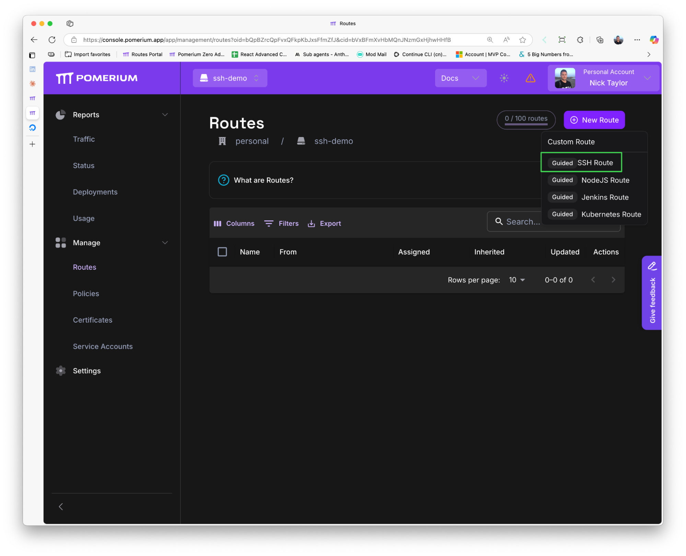
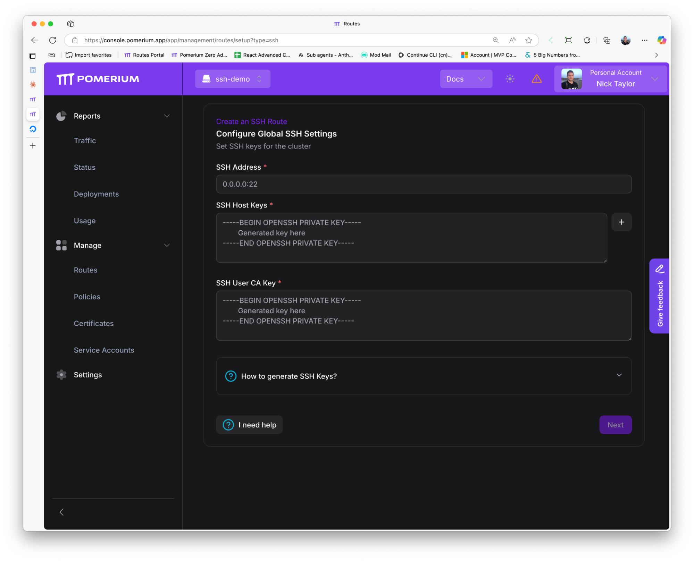
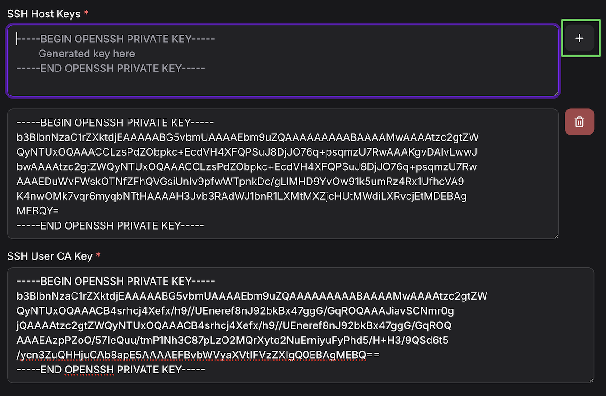
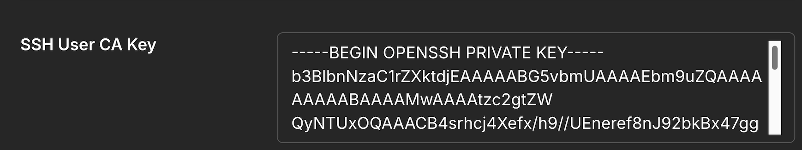
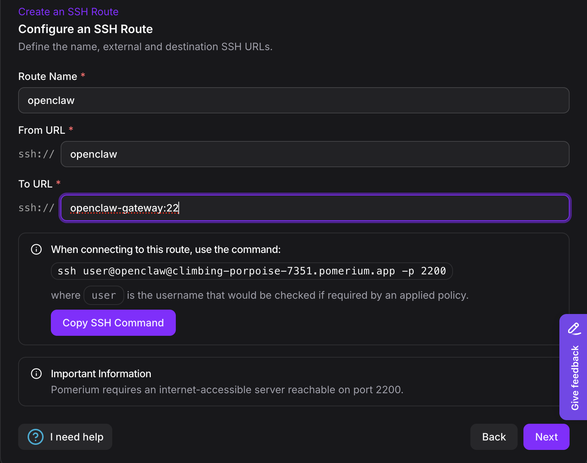
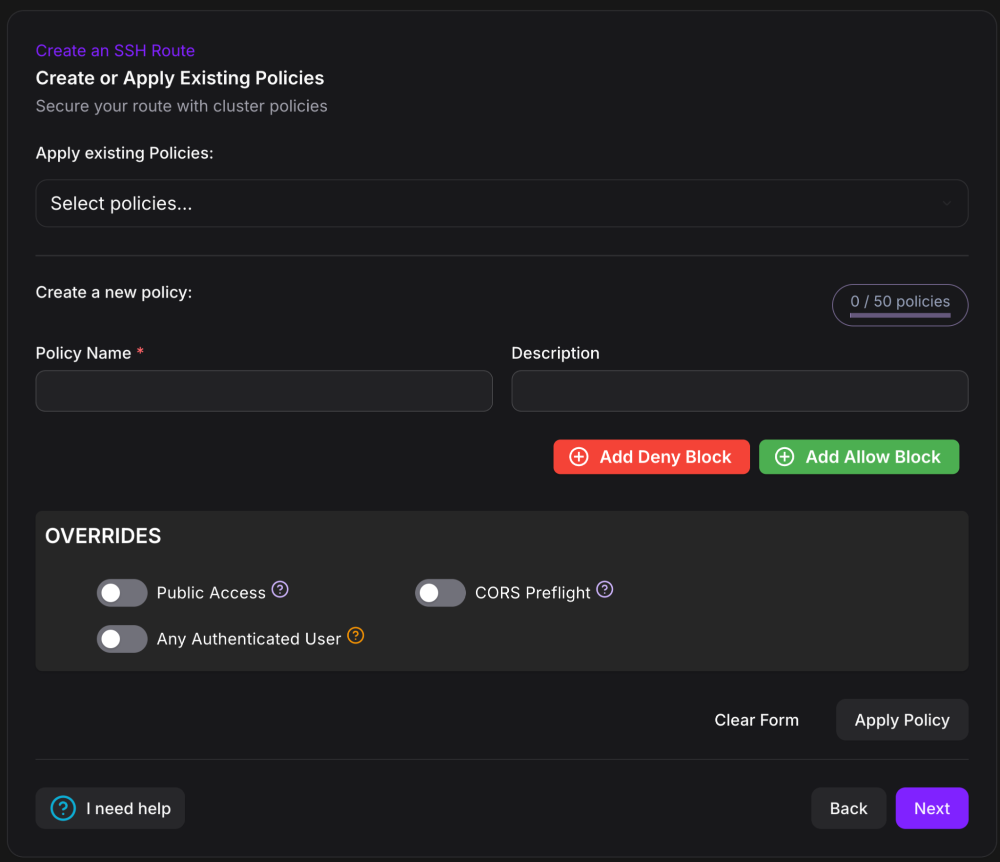
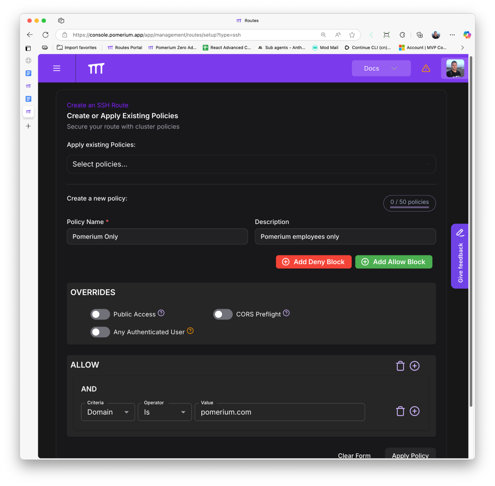

# Secure OpenClaw (Clawdbot/Moltbot) Gateway with Pomerium

This guide shows you how to deploy [OpenClaw](https://openclaw.ai) gateway behind Pomerium for secure, authenticated access. OpenClaw (formerly known as Moltbot and Clawdbot) is an open-source personal AI assistant that features persistent memory, system access (file operations, shell commands), browser automation, and supports multiple chat platforms. In this guide, we'll deploy it in a Docker container on your deployment host.

:::caution Security Scope

OpenClaw is not production-ready software and has known security limitations. **This guide secures access to OpenClaw** (SSH and gateway portal) using Pomerium's identity-aware proxy, but **does not address OpenClaw's internal security model**. For details on OpenClaw's security considerations, see the [OpenClaw Gateway Security documentation](https://docs.openclaw.ai/gateway/security).

**What Pomerium Secures:**

- User authentication and identity verification
- Access control to SSH and gateway endpoints
- Network-level protection

**What This Guide Does NOT Secure:**

- OpenClaw's internal operations and tool execution
- Code or commands run by authenticated users
- Subagent isolation (configurable via sandboxing - see below)

This guide configures sandboxing as a **starting point**. You can adjust OpenClaw's security model based on your risk tolerance and use case. See the [OpenClaw sandboxing documentation](https://docs.openclaw.ai/gateway/sandboxing) for customization options.

:::

## What You'll Build

By the end of this guide, you'll have:

- **Complete stack**: Pomerium + OpenClaw running in Docker
- **Identity-aware proxy**: Pomerium verifies user identity through your identity provider (Google, Okta, Azure AD, etc.) and enforces access policies on every request to the gateway
- **SSH access**: Secure SSH access to the OpenClaw container via [Pomerium SSH routes](/docs/capabilities/native-ssh-access)
- **Persistent storage**: OpenClaw configuration and workspace data that survives container restarts
- **Full Docker sandboxing**: Subagents run in isolated containers for enhanced security

## Before You Start

To complete this guide, you need:

- A [Pomerium Zero](https://www.pomerium.com/docs/get-started/quickstart) account (free)
- A deployment machine (VPS, bare metal server, or local machine) with:
  - [Docker](https://docs.docker.com/install/) and [Docker Compose](https://docs.docker.com/compose/install/) installed
  - Ports 443 and 2200 accessible (see [Network Requirements](#network-requirements) below)

### Network Requirements

Your deployment host must meet these network requirements:

- **Port 443 accessible from the internet** - Users connect to Pomerium on this port for HTTPS traffic
  - Configure your firewall to allow inbound traffic on port 443
  - If using a cloud provider (AWS, GCP, Azure, DigitalOcean, etc.), ensure security groups/firewall rules allow port 443
- **Port 2200 accessible from the internet** - Pomerium SSH traffic uses this port
  - Configure your firewall to allow inbound traffic on port 2200
  - Required for SSH access to the OpenClaw container and any other SSH routes
  - Note: Port 2200 is configurable in Pomerium - you can use any available port except 22 (which would conflict with the standard SSH port)
- **Outbound connectivity** - The host must be able to reach the managed control plane (Pomerium Zero) at `console.pomerium.app`

:::note

Pomerium provides zero-trust access without requiring traditional VPN infrastructure.

:::

## Step 1: Set Up Pomerium Zero

Before deploying the Docker stack, you'll need a Pomerium Zero account and cluster.

1. **Create a Pomerium Zero account** at [pomerium.com](https://www.pomerium.com/docs/get-started/quickstart) (free)

2. During cluster creation, select **Docker** as your setup method

3. **Configure a custom identity provider** (required for SSH access)

   :::caution Required for SSH Access

   The hosted authenticate service doesn't support native SSH for self-hosted Pomerium using Zero as a managed control plane (soon). You must configure a custom identity provider during cluster creation to use SSH routes.

   During the onboarding wizard:
   - Select a custom identity provider (Google, Okta, Azure AD, GitHub, etc.)
   - Complete the provider configuration steps
   - Save your provider credentials

   For detailed instructions, see [Configuring a Custom Identity Provider in Pomerium Zero](https://www.pomerium.com/docs/get-started/fundamentals/zero/zero-custom-idp).

   :::

4. The onboarding wizard will provide:
   - Your **POMERIUM_ZERO_TOKEN**
   - Your cluster domain (e.g., `fantastic-fox-1234.pomerium.app`)

5. Save both the token and your cluster domain for the next step

:::note Ignore the Docker Compose File

The Pomerium Zero onboarding will provide you with a docker-compose file. **You don't need it** - the openclaw-pomerium repository (cloned in Step 2) already includes the necessary docker-compose setup. Just save your **POMERIUM_ZERO_TOKEN** and **cluster domain** for the next step.

:::

:::tip

Your Pomerium Zero cluster comes with a built-in `*.pomerium.app` domain that you can use immediately. You can [configure a custom domain](https://www.pomerium.com/docs/capabilities/custom-domains) later if preferred.

:::

## Step 2: Clone and Configure the Repository

1. **Clone the repository** to your deployment host:

   ```bash
   git clone https://github.com/nickytonline/openclaw-pomerium/
   cd openclaw-pomerium
   ```

   **All subsequent setup commands should be run from this directory.**

2. **Configure environment variables**:

   ```bash
   cp .env.example .env
   ```

3. Edit `.env` and set your values:

   ```bash title=".env"
   # Your Pomerium Zero token from the onboarding wizard
   POMERIUM_ZERO_TOKEN=your-token-here

   # Your cluster subdomain (e.g., fantastic-fox-1234.pomerium.app)
   POMERIUM_CLUSTER_DOMAIN=fantastic-fox-1234.pomerium.app

   # OpenClaw version (optional, defaults to `latest`)
   OPENCLAW_VERSION=2026.2.1
   ```

## Step 3: Generate SSH Keys for Pomerium SSH Access

The openclaw-pomerium repository's [Dockerfile](https://github.com/nickytonline/openclaw-pomerium//blob/main/openclaw/Dockerfile) includes an SSH server that allows you to remotely access the OpenClaw container via [Pomerium SSH routes](/docs/capabilities/native-ssh-access). You'll need to generate SSH keys for this functionality.

### Quick Setup (Recommended)

For automated setup, use the provided script:

```bash
./setup-ssh.sh
```

The script will:

- Generate all required SSH keys (User CA and Host keys)
- Install the User CA public key in the openclaw-gateway container
- Optionally configure the host SSH daemon to trust Pomerium CA (recommended for jump box access via Pomerium)
- Display instructions for Pomerium Zero configuration
- Show all private keys needed for Pomerium

### Manual Setup

If you prefer to set up SSH manually, follow these steps:

#### Generate SSH Keys

Generate all keys in the repository root following the [Pomerium Native SSH Access guide](/docs/capabilities/native-ssh-access):

```bash
# User CA key pair (used by Pomerium to sign SSH certificates)
ssh-keygen -N "" -f pomerium_user_ca_key -C "Pomerium User CA"

# Host keys (for different SSH algorithms)
ssh-keygen -t ed25519 -f ssh_host_ed25519_key -N ""
ssh-keygen -t rsa -b 3072 -f ssh_host_rsa_key -N ""
ssh-keygen -t ecdsa -b 256 -f ssh_host_ecdsa_key -N ""
```

:::info Security Note

All private keys stay in the repository root. Only the User CA public key will be copied to the container.

:::

#### Install User CA Public Key

Copy the User CA public key to the container mount location:

```bash
# Copy to container mount
cp pomerium_user_ca_key.pub ./openclaw-data/pomerium-ssh/
```

The container is configured to trust certificates signed by this CA.

#### Optional: Configure Host SSH Access

If you want to SSH directly to the host machine via Pomerium (useful as a jump box), configure the host SSH daemon:

```bash
# Copy to system SSH directory
sudo cp pomerium_user_ca_key.pub /etc/ssh/pomerium_user_ca_key.pub
sudo chmod 644 /etc/ssh/pomerium_user_ca_key.pub

# Configure SSH daemon to trust it
echo "TrustedUserCAKeys /etc/ssh/pomerium_user_ca_key.pub" | sudo tee -a /etc/ssh/sshd_config

# Restart SSH daemon
sudo systemctl restart sshd
```

For security, create a dedicated non-root user for SSH access:

```bash
# Create user (example: clawadmin)
sudo useradd -m -s /bin/bash clawadmin

# Optional: Add to sudo group if you need admin privileges
sudo usermod -aG sudo clawadmin
```

## Step 4: Start the Docker Stack

Start all services with Docker Compose:

```bash
docker compose up -d
```

**Note**: The first run will build the OpenClaw image, which may take a few minutes.

```bash
❯ docker compose build openclaw-gateway --no-cache
[+] Building 2.8s (5/10)
 => [internal] load local bake definitions                                0.0s
 => => reading from stdin 640B                                            0.0s
 => [internal] load build definition from Dockerfile                      0.0s
 => => transferring dockerfile: 1.81kB                                    0.0s
 => [internal] load metadata for docker.io/library/node:24-slim           0.1s
 => [internal] load .dockerignore                                         0.0s
 => => transferring context: 2B                                           0.0s
 => CACHED [1/6] FROM docker.io/library/node:24-slim@sha256:4660b1ca8b28  0.0s
 => [2/6] RUN apt-get update &&     apt-get install -y git openssh-serve  2.6s
 => => # Get:91 http://deb.debian.org/debian bookworm/main amd64 psmisc amd64
 => => # 23.6-1 [259 kB]
 => => # Get:92 http://deb.debian.org/debian bookworm/main amd64 publicsuffix
 => => # all 20230209.2326-1 [126 kB]
 => => # Get:93 http://deb.debian.org/debian bookworm/main amd64 xauth amd64 1
 => => # :1.1.2-1 [36.0 kB]
[+] build 0/1
 ⠙ Image openclaw:2026.2.1 Building                                        2.8s
```

:::info Custom Docker Image

Since OpenClaw doesn't provide an official Docker image, the openclaw-pomerium repository includes a custom [Dockerfile](https://github.com/nickytonline/openclaw-pomerium//blob/main/openclaw/Dockerfile) that packages OpenClaw with an SSH server. This Dockerfile can be customized to add additional tools or utilities you need. For example, you might want to add:

- Development tools (git, vim, etc.)
- Language runtimes (Node.js, Python, etc.)
- CLI utilities specific to your workflow

Simply edit `openclaw/Dockerfile` and rebuild with `docker compose up -d --build`.

:::

Verify all services are running:

```bash
docker ps
```

You should see three services running:

- `pomerium` - The authentication proxy (port 443)
- `verify` - Pomerium's verification service
- `openclaw-gateway` - The OpenClaw gateway container

```bash
❯ docker ps
CONTAINER ID   IMAGE                       COMMAND                  CREATED          STATUS                          PORTS     NAMES
a6882babc788   pomerium/pomerium:v0.32.0   "/bin/pomerium --con…"   47 seconds ago   Restarting (1) 18 seconds ago             openclaw-pomerium-pomerium-1
d03c1849ab7d   pomerium/verify:latest      "/bin/verify"            47 seconds ago   Up 47 seconds (healthy)                   openclaw-pomerium-verify-1
190520ccdc2f   openclaw:2026.2.3          "docker-entrypoint.s…"   47 seconds ago   Up 47 seconds (healthy)         22/tcp    openclaw-pomerium-openclaw-gateway-1
```

## Step 5: Configure Pomerium SSH Routes

Now configure SSH routes in Pomerium Zero to access your OpenClaw container.

### Configure Global SSH Settings (First-Time Only)

If this is your first SSH route in Pomerium Zero, you'll need to configure global SSH settings:

1. Navigate to **Manage → Routes** in the Pomerium Zero console

   

2. Click **New Route** → **Guided SSH Route**
   - Configure global SSH settings:

     

   - **SSH Address**: `0.0.0.0:2200`
   - **SSH Host Keys**: Paste all three private host keys from your repository root:
     - Contents of `ssh_host_ed25519_key`
     - Contents of `ssh_host_rsa_key`
     - Contents of `ssh_host_ecdsa_key`

     

   - **SSH User CA Key**: Paste the contents of `pomerium_user_ca_key` (private key)

     

:::note

These are cluster-wide settings shared by all SSH routes. If you've already configured SSH for your cluster, these steps won't be shown.

:::

For detailed SSH configuration instructions, see the [Pomerium Zero Native SSH Configuration Guide](/docs/guides/zero-ssh).

### Create SSH Route to OpenClaw Container

1. Create a new **Guided SSH Route** with the following settings:
   - **Name**: `openclaw` (or your preferred name)
   - **From URL**: `ssh://openclaw`
   - **To URL**: `ssh://openclaw-gateway:22`

   
   - **Access Policies**: Configure who can connect (e.g., allow your email address)

   

2. Save and apply the route

### Optional: Create SSH Route to Host Machine

If you configured host SSH access in Step 3, create another route for the host:

1. Create another **Guided SSH Route**:
   - **Name**: `jumpbox`
   - **From URL**: `ssh://jumpbox`
   - **To URL**: `ssh://host.docker.internal:22`
   - **Access Policies**: Configure who can connect

2. Save and apply the route

## Step 6: Configure OpenClaw

Now that SSH access is configured, connect to the container and set up OpenClaw.

### Connect via SSH

SSH into the OpenClaw container via your Pomerium SSH route:

```bash
# note: use the container username 'claw' not 'root'
ssh claw@openclaw@your-cluster.pomerium.app -p 2200
```

Replace `your-cluster.pomerium.app` with your actual Pomerium Zero cluster domain.

Pomerium will prompt you to authenticate via your identity provider, then connect you to the container.

### Configure OpenClaw Authentication

Inside the container, run the OpenClaw configuration wizard:

```bash
openclaw configure
```

This will guide you through setting up authentication for Claude API access. The configuration method depends on your model provider (API key, browser login, etc.).

### Get the Gateway Token

Retrieve the gateway authentication token (needed for client connections):

```bash
openclaw config get gateway.auth.token
```

:::caution

Change the default auth token (`configure-gateway-token`) before allowing access. You can update it with:

```bash
openclaw config set gateway.auth.token "your-secure-token-here"
```

:::

## Step 7: Configure Gateway Web Interface Route

To access the OpenClaw gateway website in your browser, create a route in Pomerium Zero with WebSocket support enabled.

1. Navigate to **Manage → Routes** in Pomerium Zero
2. Click **New Route** → **Custom Route**
3. Configure the route:
   - **From**: `https://openclaw.your-cluster.pomerium.app`
   - **To**: `http://openclaw-gateway:18789`
   - **Policies**: Configure access policies for who can connect

   

4. **Enable WebSocket support** (required for the web interface to function):
   - Go to **Advanced → Timeouts**
   - Enable WebSocket support
5. Save and apply the route

:::note WebSocket support is required for the OpenClaw gateway web interface to work properly. Without it, the web UI will fail to connect to the gateway. :::

For more information on WebSocket configuration, see the [Pomerium timeouts documentation](/docs/reference/routes/timeouts).

Once configured, you can access the OpenClaw gateway at `https://openclaw.your-cluster.pomerium.app` in your browser.

## Step 8: Approve Device Pairing

OpenClaw requires device pairing for security. Each new device or browser must be explicitly approved before connecting.

### What Triggers Device Pairing

Device pairing is required for:

- New browsers (Chrome on your laptop is different from Firefox)
- New devices (phone, colleague's computer, etc.)
- Incognito/private browsing windows
- Cleared browser cache

### Approve Pairing Requests

For more information on device pairing, see the [OpenClaw pairing documentation](https://docs.openclaw.ai/start/pairing).

When someone tries to connect for the first time:

1. **List pending requests** (via SSH):

   ```bash
   ssh claw@openclaw@your-cluster.pomerium.app -p 2200
   openclaw devices list
   ```

   You'll see output showing pending device requests. Copy the `<request-id>` for the device you want to approve.

2. **Approve the request**:

   ```bash
   openclaw devices approve <request-id>
   ```

3. The user can now refresh their browser and connect without seeing the pairing error.

:::note Why Pairing with Pomerium?

- **Pomerium** authenticates the _user_ (who you are)
- **Device pairing** authorizes the _device_ (which devices that user can use)

This provides defense-in-depth: even if someone steals a user's Pomerium credentials, they can't access OpenClaw from a new device without admin approval.

:::

## Configuration

OpenClaw configuration is persisted in `./openclaw-data/config/.openclaw/openclaw.json`. The repository includes a starting configuration with:

- Gateway port: `18789`
- Auth token: `configure-gateway-token` (change this!)
- Workspace: `/home/claw/workspace`
- Bind mode: `lan` (accessible from network)
- Sandbox mode: `non-main` (main agent unsandboxed, subagents sandboxed)
- Workspace access for sandboxed agents: `none`

### Updating Configuration

Access the container and use OpenClaw commands:

```bash
# Access container via SSH or docker exec
ssh claw@openclaw@your-cluster.pomerium.app

# Run OpenClaw configuration
openclaw configure
```

### Sandbox Configuration

The repository includes a pre-configured `openclaw.json` with sandboxing as a **reasonable starting point for personal use behind Pomerium**. You can adjust these settings based on your security requirements and risk tolerance.

**Starting Configuration: `non-main` sandbox mode**

Located in `./openclaw-data/config/.openclaw/openclaw.json`:

- Main agent runs directly on the gateway container (enables WebFetch/network tools)
- Spawned subagents run in isolated Docker containers
- Sandboxed agents have no workspace access (`workspaceAccess: "none"`)
- Sandbox scope: `session` (containers cleaned up after session ends)

**Tool Restrictions (Sandboxed Agents)**

- Command execution: `exec, process`
- Browser/UI tools: `browser, canvas, nodes`
- System management: `gateway, cron`
- Messaging integrations: `telegram, whatsapp, discord, slack, signal, imessage`

**Security Trade-offs:**

**Advantages:**

- WebFetch and WebSearch work (main agent has network access)
- Subagents are fully sandboxed
- Behind Pomerium authentication
- Most dangerous operations blocked

**Considerations:**

- Main agent runs direct (not sandboxed) - necessary for WebFetch
- Docker socket access required for sandboxing
- Suitable for personal/authenticated use behind Pomerium
- For multi-tenant/public deployments, consider `mode: all` (full isolation)

**Customizing Security:**

You have full control over OpenClaw's security model. To adjust sandbox configuration:

```bash
# Change sandbox mode (options: non-main, all, off)
openclaw config set 'agents.defaults.sandbox.mode' 'all'

# Update tool deny list
openclaw config set 'tools.sandbox.tools.deny' '["exec","process","browser"]' --json

# Disable sandboxing entirely (not recommended)
openclaw config set 'agents.defaults.sandbox.mode' 'off'
```

:::tip Your Security, Your Choice

The sandboxing configuration in this guide balances functionality with security for personal use. You can:

- **Increase security**: Use `mode: all` to sandbox everything, though this limits functionality
- **Decrease security**: Loosen restrictions or disable sandboxing if you trust all authenticated users

Pomerium ensures only authorized users reach OpenClaw, but what they can do inside is up to you.

:::

For complete security details and sandboxing options, see the [OpenClaw sandboxing documentation](https://docs.openclaw.ai/gateway/sandboxing).

## Architecture

The deployment consists of three services:

- **pomerium**: Zero-trust authentication proxy
  - Runs in "Zero-managed" mode (cloud control plane)
  - Automatic TLS certificate management via ZeroSSL
  - Listens on port 443 for HTTPS and port 2200 for SSH
- **verify**: Pomerium's verification service for testing authentication
- **openclaw-gateway**: Claude Code gateway
  - Accessible via WebSocket at `ws://openclaw-gateway:18789`
  - Configuration persisted in `./openclaw-data/config/`
  - Workspace data persisted in `./openclaw-data/workspace/`
  - SSH server on port 22 (accessible via [Pomerium SSH routes](/docs/capabilities/native-ssh-access))

All services communicate over a shared Docker network.

## Troubleshooting

### Check Container Status

```bash
# View all containers
docker ps

# View logs
docker compose logs -f openclaw-gateway

# View recent logs
docker compose logs --tail=100 openclaw-gateway
```

### Configuration Issues

```bash
# Access container and run diagnostics
ssh claw@openclaw@your-cluster.pomerium.app
openclaw doctor
```

### SSH Connection Issues

- Verify the User CA public key is in `./openclaw-data/pomerium-ssh/`
- Check file permissions are 600 on private keys
- Confirm the SSH route is configured correctly in Pomerium Zero
- Test with verbose SSH: `ssh -v claw@openclaw@your-cluster.pomerium.app`
- Enable SSH server debugging: Set `LogLevel DEBUG3` in `/etc/ssh/sshd_config` and check logs

### WebSocket Connection Issues

If you see "pairing required" errors:

1. This is normal for first-time connections
2. Check for pending pairing requests:
   ```bash
   ssh claw@openclaw@your-cluster.pomerium.app
   openclaw devices list
   ```
3. Approve the pending request
4. Refresh your browser/client

### Gateway Not Starting

Check the container logs for errors:

```bash
docker compose logs openclaw-gateway
```

Common issues:

- Port 18789 already in use
- Invalid configuration in `./openclaw-data/config/`
- Missing User CA public key in `./openclaw-data/pomerium-ssh/`

## Persistent Data

Data is persisted in the `./openclaw-data/` directory:

- `./openclaw-data/config/` - OpenClaw configuration files
- `./openclaw-data/workspace/` - Agent workspace (mounted at `/claw/workspace`)
- `./openclaw-data/pomerium-ssh/` - Pomerium User CA public key

:::caution Backup Your Data

Regularly backup the `./openclaw-data/` directory to prevent data loss.

:::

## Next Steps

- Configure [advanced policies](/docs/internals/ppl) for granular access control
- Set up [custom domains](/docs/capabilities/custom-domains) instead of `*.pomerium.app`
- Explore [OpenClaw documentation](https://docs.openclaw.ai) for advanced features

## Additional Resources

- [Pomerium Zero Native SSH Configuration Guide](/docs/guides/zero-ssh)
- [Pomerium Native SSH Access](/docs/capabilities/native-ssh-access)
- [Pomerium Policy Language (PPL)](/docs/internals/ppl)
- [OpenClaw](https://openclaw.ai)
- [OpenClaw Security Guidelines](https://docs.openclaw.ai/security)
