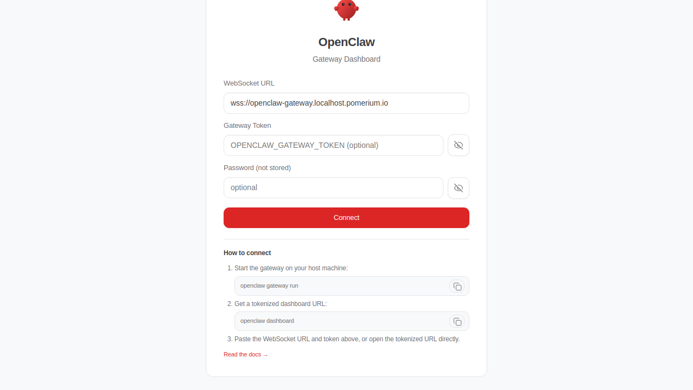

import TabItem from '@theme/TabItem';
import Tabs from '@theme/Tabs';

import Config from '/content/examples/guides/openclaw-gateway/config.yaml.md';
import Compose from '/content/examples/guides/openclaw-gateway/docker-compose.yaml.md';

# Secure OpenClaw with Pomerium

[OpenClaw](https://openclaw.ai) (formerly Clawdbot/Moltbot) is an open-source personal AI assistant with persistent memory, system access, and browser automation. It ships a web "control" gateway but no built-in user authentication, so anyone who can reach the gateway port can drive the assistant. This guide puts that gateway behind Pomerium: every request to the web UI is authenticated against your identity provider before it ever reaches the OpenClaw container.

## What this guide does

You run OpenClaw and Pomerium together with Docker Compose. Pomerium terminates TLS on a public hostname, verifies the user's identity with your identity provider, evaluates an access policy, and only then proxies the request to the OpenClaw gateway on its internal port. The gateway is never exposed directly; the only way in is through Pomerium.

The same container also runs an SSH server so you can administer OpenClaw (run the setup wizard, approve devices, read logs) over a [Pomerium SSH route](/docs/capabilities/native-ssh-access). Wiring up that SSH route is optional and covered separately in [Configure OpenClaw](#configure-openclaw).

## When to use this guide

Use this guide when you want to self-host OpenClaw and gate its web gateway behind real authentication and access policy instead of leaving it open on the network. It assumes a single OpenClaw instance reachable over HTTP on your deployment host. If you only need to protect a generic HTTP app, the [Grafana guide](/docs/guides/grafana) shows the same pattern with a simpler upstream.

## Prerequisites

- A working Pomerium deployment. If you don't have one, start with the [Pomerium quickstart](/docs/get-started/quickstart).
- [Docker](https://docs.docker.com/install/) and [Docker Compose](https://docs.docker.com/compose/install/) on your deployment host.
- A domain you control, with DNS for the gateway hostname (for example `openclaw.yourdomain.com`) pointing at the host. Pomerium uses [autocert](/docs/reference/autocert) to obtain a TLS certificate for it.

## Configure Pomerium

Pomerium needs a single route that sends authenticated traffic to the OpenClaw gateway. OpenClaw's web UI relies on WebSockets, so the route enables `allow_websockets`.

<Tabs queryString="type">
<TabItem value="zero" label="Pomerium Zero" default>

In the [Pomerium Zero console](https://console.pomerium.app), create a route:

- **From**: `https://openclaw.yourdomain.com`
- **To**: `http://openclaw-gateway:18789`
- **Policy**: allow the users or groups who should reach OpenClaw (for example, your own email address).

Under **Advanced**, enable WebSocket support so the control UI can hold its live connection open. Pomerium Zero manages TLS and the hosted authenticate service for you, so there is nothing else to configure on the proxy side.

:::tip Self-host the identity provider

Prefer to run your own identity provider (IdP) instead of the hosted authenticate service? Point Pomerium at any OIDC provider, such as [Keycloak](/docs/integrations/user-identity/oidc).

:::

</TabItem>
<TabItem value="core" label="Pomerium Core">

Save this as `config.yaml` next to your Compose file. Replace `openclaw.yourdomain.com` with your hostname and set the policy to the users who should have access.

<Config />

The `authenticate_service_url` points at Pomerium's hosted authenticate service, so you don't run your own identity provider. `autocert: true` obtains a Let's Encrypt certificate for the route hostname. `allow_websockets: true` is required for OpenClaw's control UI; without it the web UI loads but never connects.

:::tip Self-host the identity provider

To use your own OIDC provider instead of the hosted authenticate service, follow the [Keycloak integration guide](/docs/integrations/user-identity/oidc) and set `idp_*` accordingly.

:::

</TabItem>
</Tabs>

## Configure OpenClaw

OpenClaw has no official Docker image, so you build one that installs the `openclaw` npm package and runs `openclaw gateway`. The community [openclaw-pomerium-guide](https://github.com/pomerium/openclaw-pomerium-guide) repository provides a ready-made `openclaw/Dockerfile` (plus an SSH server for administration) that the Compose file in the next section builds from.

Clone it onto your host and use it as the build context:

```bash
git clone https://github.com/pomerium/openclaw-pomerium-guide
cd openclaw-pomerium-guide
```

On first launch OpenClaw has no configuration yet. Administer it over SSH through a Pomerium [SSH route](/docs/capabilities/native-ssh-access) (the repository's `setup-ssh.sh` generates the host and CA keys for you), then run the setup wizard inside the container:

```bash
ssh claw@openclaw@your-cluster.pomerium.app
openclaw configure
```

OpenClaw also requires per-device pairing: the first time a browser connects you approve it from the CLI with `openclaw devices approve <request-id>`. Pomerium authenticates the user; device pairing authorizes the specific device. See the [OpenClaw pairing docs](https://docs.openclaw.ai/start/pairing) for details.

## Run the stack

The Compose file runs Pomerium and the OpenClaw gateway together. Pomerium publishes ports 80 and 443; the gateway listens only on the internal Docker network, reachable through Pomerium.

<Compose />

Before you start it, set `POMERIUM_CLUSTER_DOMAIN` in the Compose file to your base domain (for example `yourdomain.com`). OpenClaw uses it to build the allowed origin for its control UI; if it doesn't match the hostname Pomerium serves the gateway on, the UI refuses to connect.

Bring it up from the directory holding `docker-compose.yaml` and `config.yaml`:

```bash
docker compose up -d
```

The first run builds the OpenClaw image, which takes a few minutes. Check status with `docker compose ps`; you should see `pomerium` and `openclaw-gateway` running.

## Verify the setup

1. In a fresh private browser window, open `https://openclaw.yourdomain.com`. Pomerium should redirect you to your identity provider rather than showing the OpenClaw UI.
2. Sign in as a user your policy allows. After login Pomerium proxies you to the OpenClaw Gateway Dashboard (its control UI), which presents a WebSocket connect form (WebSocket URL, an optional Gateway Token and password, and a **Connect** button) plus "How to connect" steps:

   

   Reaching this dashboard confirms Pomerium authenticated you and the gateway is reachable through the route. Driving the assistant from here still depends on OpenClaw's own gateway token and device pairing, which Pomerium does not manage.

3. Confirm the gateway is only reachable through Pomerium: a direct request to the container's `18789` port from outside the Docker network should fail or be refused.

This confirms the access path: Pomerium gates the web gateway behind SSO and an allowed user reaches it. The SSH administration route and OpenClaw's device pairing are separate flows you set up and confirm by hand, as described in [Configure OpenClaw](#configure-openclaw).

## Common failure modes

- **The web UI loads but never connects.** WebSocket support is off. Enable it on the route (Pomerium Zero: **Advanced**; Core: `allow_websockets: true`).
- **Login succeeds but you get a "pairing required" error.** That is OpenClaw's device pairing, not Pomerium. Approve the device with `openclaw devices approve <request-id>` over SSH.
- **TLS or "certificate not yet ready" errors.** Autocert needs the route hostname to resolve to your host and ports 80 and 443 reachable from the internet so Let's Encrypt can complete the challenge.
- **A 502 from Pomerium.** The gateway container isn't healthy yet, or `to:` doesn't match its service name and port (`http://openclaw-gateway:18789`).

## Security considerations

OpenClaw is not production-ready software and has a permissive internal model: an authenticated user can run shell commands, file operations, and browser automation through the assistant. Pomerium secures _access_ to the gateway (it authenticates the user, enforces policy, and terminates TLS); it does not sandbox what OpenClaw does once a user is in. Scope your access policy tightly and treat anyone you allow as effectively having shell access on the host. For OpenClaw's own security model, see its [security documentation](https://docs.openclaw.ai/security).

Keep the trust boundary intact. The OpenClaw gateway must never be reachable except through Pomerium: in this setup it has no published host port and only listens on the internal Docker network. If you expose the gateway port directly, you bypass authentication entirely and anyone on the network can drive the assistant. The same applies to the optional SSH server in the container; reach it only through a [Pomerium SSH route](/docs/capabilities/native-ssh-access) and trust the Pomerium User CA, not arbitrary keys.

## Next steps

- Tighten access with [Pomerium Policy Language](/docs/internals/ppl).
- Replace `*.pomerium.app` with a [custom domain](/docs/capabilities/custom-domains).
- Add a [Pomerium SSH route](/docs/capabilities/native-ssh-access) for container administration.
