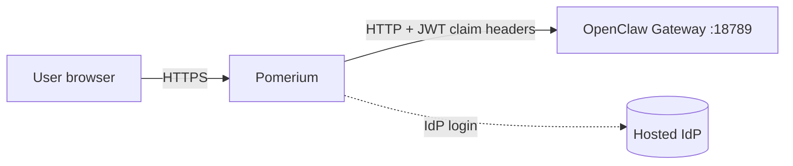
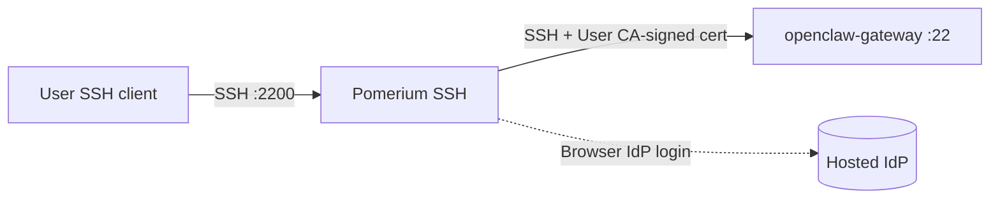

# Harden Access to OpenClaw with Pomerium

This guide shows you how to add authentication and authorization to [OpenClaw](https://openclaw.ai) (formerly Clawdbot/Moltbot) using Pomerium as an identity-aware access proxy. OpenClaw is an open-source personal AI assistant with persistent memory, file and shell access, browser automation, and multi-platform chat integrations.

The setup is automated by an install script. One `curl | bash` command pulls the OpenClaw guide code from the Pomerium documentation repository, collects three credentials and auto-selects your Pomerium Zero cluster, then provisions everything: Pomerium policy, SSH route, web route, cluster SSH config, JWT claim header mapping, and OpenClaw's trusted-proxy auth configuration.

This guide is for anyone hosting their own OpenClaw, whether that's an individual on a homelab, a team running it for shared use, or an org standing it up for a department. The setup uses Docker Compose on a single host, which fits most single-server deployments. If you need to run OpenClaw across multiple nodes or in Kubernetes, this isn't the right starting point. And because OpenClaw itself is still maturing, the sweet spot is single-team or small-group use rather than large multi-tenant production.

:::caution Security Scope

OpenClaw is not production-ready software and has known security limitations. **This guide secures access to OpenClaw** (SSH and gateway portal) using Pomerium's identity-aware proxy, but **does not address OpenClaw's internal security model**. For details, see the [OpenClaw Gateway Security documentation](https://docs.openclaw.ai/gateway/security).

**What Pomerium secures:**

- User authentication and identity verification
- Access control to SSH and gateway endpoints
- Network-level protection

**What this guide does NOT secure:**

- OpenClaw's internal operations and tool execution
- Code or commands run by authenticated users

:::

## What You'll Build

By the end of this guide you'll have:

- **Pomerium + OpenClaw** running in Docker on your deployment host
- **Identity-aware web route** at `https://openclaw.<your-cluster-domain>` with WebSocket support and the `operator.admin` [OpenClaw scope](https://docs.openclaw.ai/gateway/operator-scopes) injected for the authorized user
- **SSH route** at `ssh://openclaw@<your-cluster-domain>:2200` to reach the OpenClaw container
- **OpenClaw configured with trusted-proxy auth mode**, with Pomerium as the trusted proxy
- **Persistent storage** for OpenClaw configuration and workspace data in `./pomclaw/openclaw-data/`

## How It Works

The web route and the SSH route authenticate the same user against the same identity provider, but they hand off to OpenClaw in very different ways.

### Web route



Pomerium authenticates the user against the hosted identity provider, signs a JWT, and forwards three headers to OpenClaw:

- `X-Pomerium-Jwt-Assertion`: a signed assertion proving the request came through Pomerium
- `X-Pomerium-Claim-Email`: the authenticated user's email, mapped via the cluster's `jwtClaimsHeaders` setting
- `X-Openclaw-Scopes`: the OpenClaw scope granted to the authorized user (`operator.admin`), injected as a route-level request header

OpenClaw runs in **trusted-proxy auth mode**: it trusts the configured upstream IP (Pomerium's container IP) and treats the email header as the authenticated user. The container is not exposed to the internet; all traffic flows through Pomerium.

For more on JWT claim headers, see [Getting the user's identity](/docs/capabilities/getting-users-identity).

### SSH route



Pomerium's native SSH listener terminates the user's SSH session on port 2200 and prompts them to authenticate via browser against the same Identity Provider (IdP). Once authorized, Pomerium opens a fresh SSH connection to `openclaw-gateway:22` and authenticates with a short-lived certificate signed by the Pomerium User CA, whose public key is mounted into the OpenClaw container. The user lands in the container as the `claw` user. No JWT or HTTP headers are involved on this path.

For more on Pomerium's SSH proxy, see [Pomerium Native SSH Access](/docs/capabilities/native-ssh-access).

## Before You Start

You'll need:

- A [Pomerium Zero](https://www.pomerium.com/docs/get-started/quickstart) account (free)
- A **deployment host** (VPS, bare-metal server, or local machine) with:
  - [Docker](https://docs.docker.com/install/) and [Docker Compose](https://docs.docker.com/compose/install/)
  - `git` and `ssh-keygen` (both pre-installed on macOS and most Linux distributions)
  - Ports 443 and 2200 reachable from the internet (see [Network Requirements](#network-requirements) below)

The script uses `curl` and `jq` _inside_ the OpenClaw container for its Pomerium Zero API calls, so you don't need them on the host.

### Network Requirements

- **Port 443 inbound**: users connect to Pomerium on HTTPS
- **Port 2200 inbound**: Pomerium's native SSH listener (configurable; avoid 22 to keep the host's standard SSH port free for direct administration)
- **Outbound to `console.pomerium.app`**: required to reach the managed control plane and the Pomerium Zero API

If you're on a cloud provider, make sure the security group or firewall allows inbound 443 and 2200.

## Step 1: Set Up Pomerium Zero

If you don't already have a Pomerium Zero cluster:

1. Create an account at [pomerium.com](https://www.pomerium.com/docs/get-started/quickstart) and follow the onboarding wizard.
2. When the wizard offers a deployment method, you can pick **Docker** (or any option). The install script doesn't use the docker-compose file the wizard hands you; you only need the cluster to exist.
3. Save the **POMERIUM_ZERO_TOKEN** the wizard shows you. You'll paste it into the install script.

:::tip Your cluster comes with a free `*.pomerium.app` domain

You can [configure a custom domain](https://www.pomerium.com/docs/capabilities/custom-domains) later if preferred.

:::

### Generate a Pomerium Zero API Token

The install script uses the Pomerium Zero management API to create routes, policies, and cluster settings on your behalf. Generate an API user token:

1. Go to [console.pomerium.app/app/management/api-tokens](https://console.pomerium.app/app/management/api-tokens).
2. Create a token and copy it. You'll paste it into the install script.

:::tip Forgot to save a token?

Both the cluster bootstrap token (`POMERIUM_ZERO_TOKEN`) and the API user token (`POMERIUM_ZERO_API_TOKEN`) can be rotated at any time from the Pomerium Zero console. If you didn't capture one during the wizard, just generate a fresh one and use that.

:::

:::note API token is bootstrap-only

The API token is only needed during install. When the script finishes it offers to remove the token from your local `.env` file. You should then revoke it in the Pomerium Zero console. Generate a fresh one if you ever re-run the script.

:::

## Step 2: Run the Install Script

On your deployment host, run:

```bash
curl -fsSL https://pomerium.com/docs/guides/code/openclaw/install.sh | bash
```

This clones the guide code into `./pomclaw` and hands off to `bootstrap.sh`. To install somewhere else, pass a path:

```bash
curl -fsSL https://pomerium.com/docs/guides/code/openclaw/install.sh | bash -s -- ~/openclaw
```

:::tip Inspect before running

If you'd rather review the scripts first, the source lives in [`content/docs/guides/code/openclaw`](https://github.com/pomerium/documentation/tree/main/content/docs/guides/code/openclaw). Clone the documentation repository and run `./bootstrap.sh` from that directory. The prompts work the same way.

:::

The script collects three credentials and selects your cluster:

| Prompt | What to enter |
| --- | --- |
| Pomerium Zero Token | Cluster bootstrap token from the Pomerium Zero onboarding wizard |
| Pomerium Zero API Token | API user token from [the API tokens page](https://console.pomerium.app/app/management/api-tokens) |
| Cluster selection | Auto-selected if you have one cluster; otherwise a numbered picker with the most recent cluster as the default |
| Email | The IdP email you sign in with, used to allow you in the route policy |

The values are written to `./pomclaw/.env` (mode 600). From there the script:

1. Generates SSH host keys and the Pomerium User CA key
2. Builds the bespoke OpenClaw Docker image (`openclaw:<version>`)
3. Starts the `openclaw-gateway` and `pomerium` containers
4. Pushes SSH cluster settings (`sshAddress`, `sshHostKeys`, `sshUserCaKey`) and `jwtClaimsHeaders` (`x-pomerium-claim-email: email`) to Pomerium Zero
5. Creates an allow-by-email policy for your `OPERATOR_EMAIL`
6. Creates the SSH route `ssh://openclaw` → `ssh://openclaw-gateway:22`
7. Creates the web route `https://openclaw.<your-cluster-domain>` → `http://openclaw-gateway:18789` with WebSocket support and the `x-openclaw-scopes: operator.admin` request header (the [OpenClaw scope](https://docs.openclaw.ai/gateway/operator-scopes) that grants the authorized user admin privileges)
8. Configures OpenClaw for [trusted-proxy auth mode](https://docs.openclaw.ai/gateway/trusted-proxy-auth)
9. Brings up the rest of the stack
10. Offers to remove the API token from `.env` so you can revoke it in the Pomerium Zero console

The script is idempotent; re-running picks up from the current state.

When the script finishes, it prints the SSH command and web URL you'll use to reach OpenClaw.

## Step 3: Revoke the API Token

The Pomerium Zero API token is no longer needed once the install script finishes. For least privilege:

1. When the script prompts `Remove API token from .env? [y/N]:`, type `y`.
2. Open [console.pomerium.app/app/management/api-tokens](https://console.pomerium.app/app/management/api-tokens) and revoke the token.

Adding or removing operator emails is done in the [Pomerium Zero console](https://console.pomerium.app), not by re-running the script. If you ever do need to re-run `bootstrap.sh` (for example to regenerate keys), generate a fresh API token at the same URL.

## Step 4: Verify the Install

When the install script finished it printed two things to try:

- A **web URL** like `https://openclaw.<your-cluster-domain>`. Open it in a browser, sign in with your `OPERATOR_EMAIL`, and you should land on the OpenClaw UI.
- An **SSH command** like `ssh claw@openclaw@<your-cluster-domain> -p 2200`. Run it; Pomerium will prompt you to authenticate via browser before dropping you into the OpenClaw container.

If either doesn't work as expected, head to [Troubleshooting](#troubleshooting) for diagnostic checks (stack health, logs, route verification, etc.).

## Step 5: Configure a Model

OpenClaw needs a model configured before it can respond to prompts. From the `pomclaw` directory, list available models and set one:

```bash
# list available models
docker compose exec openclaw-gateway openclaw models list

# set model from one in the list
docker compose exec openclaw-gateway openclaw models set <provider>/<model>
```

See the [OpenClaw Models CLI documentation](https://docs.openclaw.ai/concepts/models#cli-commands) for provider IDs, fallback models, and auth options.

## Step 6: Upgrade OpenClaw (Optional, Recommended)

OpenClaw is pinned to a specific version in `.env` (e.g. `OPENCLAW_VERSION=2026.6.5`) so installs are reproducible. Staying on a recent version is recommended for security and bug fixes, but OpenClaw is still maturing and upstream releases can introduce breaking changes, so **always check the OpenClaw release notes before bumping the version**.

To upgrade:

1. Review the OpenClaw release notes for the target version.
2. Edit `OPENCLAW_VERSION` in `./pomclaw/.env`.
3. Run:

   ```bash
   docker compose down
   docker compose up -d
   ```

The new image will build and the gateway will come back online.

## Operations

### Manage access

Once the install script has finished, day-to-day access changes (adding or removing operator emails, tightening the policy, adjusting route headers) are done directly in the [Pomerium Zero console](https://console.pomerium.app). You don't need to re-run `bootstrap.sh` or hold onto an API token for routine policy edits.

### Backup

Persistent data lives in `./pomclaw/openclaw-data/`:

- `config/`: OpenClaw configuration
- `workspace/`: agent workspace (mounted at `/home/claw/workspace`)
- `pomerium-ssh/`: Pomerium User CA public key

Back this directory up regularly to prevent data loss.

### Tear down

To remove the deployment completely:

1. Stop the containers and delete their volumes:

   ```bash
   cd ./pomclaw
   docker compose down -v
   ```

2. In the [Pomerium Zero console](https://console.pomerium.app), delete the `openclaw users` policy and the two routes (`ssh://openclaw` and the web route). The cluster-level SSH and `jwtClaimsHeaders` settings can stay if you plan to use Pomerium Zero for other routes; otherwise clear them under **Manage → Settings**.
3. Optionally remove the local install directory and its persisted data:

   ```bash
   rm -rf ./pomclaw
   ```

## Troubleshooting

### Verify the stack is running

```bash
cd ./pomclaw
docker compose ps
```

You should see three services running:

- `pomerium`: the authentication proxy
- `openclaw-gateway`: OpenClaw running in trusted-proxy mode
- `verify`: Pomerium's identity verification service (used for testing auth)

### Check the logs

When something isn't working, the next move is almost always to tail the logs. The Pomerium container will show auth/policy decisions and any proxy errors; the OpenClaw container will show what (if anything) it received from Pomerium.

```bash
docker compose logs -f pomerium
docker compose logs -f openclaw-gateway
```

### Verify the web route

Open `https://openclaw.<your-cluster-domain>` in your browser. Pomerium will redirect you to your identity provider; sign in with the email you configured as `OPERATOR_EMAIL`. After authenticating you should land on the OpenClaw web UI.

### Verify the SSH route

```bash
ssh claw@openclaw@<your-cluster-domain> -p 2200
```

Note the double-`@` syntax: `claw` is the container user, `openclaw` is the Pomerium SSH route name, and `<your-cluster-domain>` is the Pomerium host. Pomerium will prompt you to authenticate via browser, then drop you into the OpenClaw container.

### Verify auth mode

From inside the container:

```bash
openclaw config get gateway.auth.mode
```

This should print `"trusted-proxy"`. From the host you can also run `./bootstrap.sh status` (from the `pomclaw` directory) for the same information plus whether the `trustedProxy` block is configured.

### Reset

If something goes sideways and you need to start over without re-running the full bootstrap:

```bash
./bootstrap.sh reset
```

This is **destructive**: it clears OpenClaw's paired devices and flips the gateway back to token mode. **Pomerium Zero routes and policies are left in place**. Re-run `./bootstrap.sh` to bring the gateway back to trusted-proxy mode.

### Install script aborts: target directory already exists

The install script refuses to overwrite an existing directory. If you already have a `./pomclaw` (or whatever path you passed), the right move is:

```bash
cd ./pomclaw
./bootstrap.sh
```

`bootstrap.sh` is idempotent and picks up where the last run left off.

### Install script aborts: no controlling TTY

If you're piping `curl | bash` from a non-interactive shell (CI job, automation), `bootstrap.sh` can't prompt for the required values. Either:

- Run the install from an interactive shell, or
- Clone the documentation repository, copy the files from `content/docs/guides/code/openclaw`, populate `./pomclaw/.env` manually, then run `./bootstrap.sh` directly.

### Pomerium Zero API token authentication fails

The script prints `API token authentication failed (HTTP <code>)`. The API token is either expired, revoked, or copied incorrectly. Generate a fresh one at [console.pomerium.app/app/management/api-tokens](https://console.pomerium.app/app/management/api-tokens) and re-run.

### Web route returns 403 / "Access denied"

Pomerium authenticated you, but the route policy doesn't include your email. Check the `OPERATOR_EMAIL` value in `./pomclaw/.env` matches the address your IdP returns. If they don't match (for example you signed in with a different work account), edit the policy named `openclaw users` in the Pomerium Zero console or re-run `./bootstrap.sh` after correcting `OPERATOR_EMAIL`.

### OpenClaw web UI loads but fails to connect

The web route needs WebSocket support enabled; the install script does this by default. If you've manually edited the route since, check that **Advanced → Timeouts → Allow WebSockets** is still enabled. See the [Pomerium timeouts documentation](/docs/reference/routes/timeouts).

### Gateway rejects requests with `trusted_proxy_user_missing`

OpenClaw is in trusted-proxy mode but isn't seeing the `x-pomerium-claim-email` header. Two things to check:

1. The cluster's `jwtClaimsHeaders` setting maps `email` to `x-pomerium-claim-email`. The script sets this; you can confirm it under **Manage → Settings → Headers** in the Pomerium Zero console.
2. The web route has **Pass Identity Headers** enabled. Set by the script as `passIdentityHeaders: true`.

### SSH connection fails

- Confirm port 2200 is open inbound on your firewall and cloud security group.
- Test with verbose SSH for protocol-level debug output: `ssh -vvv claw@openclaw@<your-cluster-domain> -p 2200`.
- Check the User CA public key is in `./pomclaw/openclaw-data/pomerium-ssh/`.
- For more SSH-specific debugging see [Pomerium Native SSH Access](/docs/capabilities/native-ssh-access).

## Security Considerations

- **Don't commit `.env`.** It contains your Pomerium Zero cluster token. The `.gitignore` in the repo excludes it, and the script writes it as mode 600.
- **Revoke the Pomerium Zero API token** after install. The script offers to strip it from `.env`; revoking it in the console fully invalidates it server-side. Generate a fresh token only when you need to re-run bootstrap.
- **Trusted-proxy auth keys on container IPs.** OpenClaw trusts the Pomerium container's IP to inject identity headers. Don't attach untrusted containers to the `pomclaw_main` Docker network, since any container on that network with the same IP could forge identity. Two defenses are layered: requiring the signed `X-Pomerium-Jwt-Assertion` header means an attacker on the network would still need to mint a Pomerium-signed JWT, and the policy on the route gates which authenticated identity can reach the gateway at all.
- **OpenClaw runs commands on behalf of authorized users.** Pomerium controls _who_ can reach OpenClaw; it does not constrain what OpenClaw does once authorized. Treat the operator email as a privileged credential.

## Next Steps

- Configure [advanced policies](/docs/internals/ppl) for granular access control (groups, device posture, time-of-day, etc.)
- Set up a [custom domain](/docs/capabilities/custom-domains) instead of `*.pomerium.app`
- Explore [OpenClaw documentation](https://docs.openclaw.ai) for advanced features
- Read about [trusted-proxy auth in OpenClaw](https://docs.openclaw.ai/gateway/trusted-proxy-auth)

## Additional Resources

- [OpenClaw guide source code](https://github.com/pomerium/documentation/tree/main/content/docs/guides/code/openclaw): install and bootstrap scripts
- [Pomerium Native SSH Access](/docs/capabilities/native-ssh-access)
- [Pomerium Zero Native SSH Configuration Guide](/docs/guides/zero-ssh)
- [Pomerium Policy Language (PPL)](/docs/internals/ppl)
- [Getting the user's identity](/docs/capabilities/getting-users-identity)
- [OpenClaw](https://openclaw.ai)
