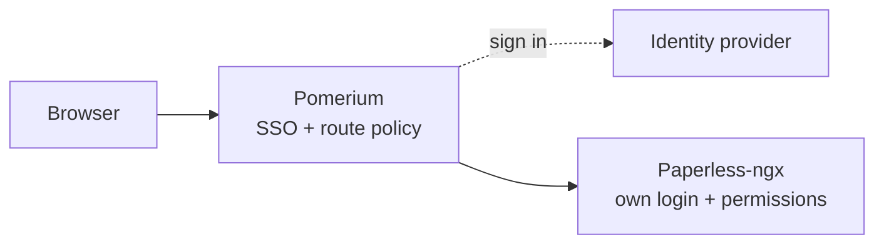

import TabItem from '@theme/TabItem';
import Tabs from '@theme/Tabs';

import Config from '/content/examples/guides/paperless-ngx/config.yaml.md';
import Compose from '/content/examples/guides/paperless-ngx/docker-compose.yaml.md';

# Secure Paperless-ngx with Pomerium

## What this guide does

Put a self-hosted [Paperless-ngx](https://docs.paperless-ngx.com/) instance behind Pomerium so every request is authenticated against your identity provider (IdP) and checked against the route policy before it reaches Paperless-ngx; unauthenticated requests are blocked at the front door. You get single sign-on (SSO), group-based policy, and an audit log of who reached the route. Paperless-ngx keeps its own login and per-user document permissions on top.



Paperless-ngx is a document management system that stores scanned and digitized records, often a household's or a company's most sensitive paperwork: tax filings, contracts, medical records, and IDs. That makes it a high-value target to keep off the open internet.

## When to use this guide

Use it when you run self-hosted Paperless-ngx and want only people from your organization to reach it. This guide layers Pomerium in front of Paperless-ngx's stock login; if you want Pomerium to sign users into Paperless-ngx directly, Paperless-ngx supports trusted-header SSO natively (see [Next steps](#next-steps)).

## Prerequisites

- [Docker](https://docs.docker.com/install/) and [Docker Compose](https://docs.docker.com/compose/install/)
- For the Pomerium Zero path: a [Pomerium Zero](https://console.pomerium.app) account with its Pomerium instance running locally via the [Quickstart](/docs/get-started/quickstart) Compose file; the route uses the starter domain that comes with it
- For the Pomerium Core path: a domain you control for the route (this guide uses `paperless.yourdomain.com`), with DNS pointed at the host running Pomerium and ports 80 and 443 reachable so `autocert` can provision certificates; the Compose file below runs Pomerium itself

This guide was last tested with Paperless-ngx 2.18.4 and Pomerium 0.32.7.

:::tip Prefer to self-host the identity provider?

This guide uses the hosted authenticate service so you don't have to run an IdP. To run your own instead, follow [Keycloak + Pomerium](/docs/integrations/user-identity/oidc) and swap the `authenticate_service_url` / `idp_*` settings into the config below.

:::

## Configure Pomerium

<Tabs queryString="type">
<TabItem value="zero" label="Pomerium Zero" default>

In the [Zero Console](https://console.pomerium.app):

1. Create a **Route**. In **From**, enter `https://paperless.<your-starter-domain>`; in **To**, enter `http://paperless:8000`.
2. On the route's settings, enable **Preserve Host Header**. Paperless-ngx is a Django application that validates the incoming `Host` against its `ALLOWED_HOSTS` (derived from `PAPERLESS_URL`) and uses it for cross-site request forgery (CSRF) checks, so the original host must reach Paperless-ngx unchanged.
3. Set the policy to scope access to who should reach Paperless-ngx (for example, **Any Authenticated User** or a specific group or domain).

</TabItem>
<TabItem value="core" label="Pomerium Core">

Create a `config.yaml`. It routes `paperless.yourdomain.com` to the Paperless-ngx container and preserves the host header so Django's `ALLOWED_HOSTS` and CSRF checks pass.

<Config />

Replace `paperless.yourdomain.com` with your domain and `you@example.com` with the email (or switch to a group or domain match) that should be allowed through.

</TabItem>
</Tabs>

## Configure Paperless-ngx

Paperless-ngx runs as a Django application backed by PostgreSQL and Redis. Pomerium terminates TLS at the front door, so Paperless-ngx serves plain HTTP on the internal Docker network. The key settings in the Compose file below:

- `PAPERLESS_URL: https://paperless.yourdomain.com`: Paperless-ngx derives Django's `ALLOWED_HOSTS` and `CSRF_TRUSTED_ORIGINS` from this. It must equal the public route host, or Django answers `HTTP 400` to every request that arrives behind the proxy.
- `PAPERLESS_REDIS` and the `PAPERLESS_DB*` values: point Paperless-ngx at the Redis broker and PostgreSQL database that ship in the same Compose file.
- `PAPERLESS_SECRET_KEY`: Django's signing key. Generate your own with `openssl rand -base64 48`; never reuse the placeholder.
- `PAPERLESS_ADMIN_USER` / `PAPERLESS_ADMIN_PASSWORD`: bootstrap the first superuser on first startup.

The Compose file runs Pomerium Core alongside Paperless-ngx, PostgreSQL, and Redis. For Zero, drop the Core `pomerium` service, keep `paperless`, `db`, and `redis` on `paperless-internal`, and attach your Zero `pomerium` service (the [Quickstart](/docs/get-started/quickstart) Compose service with your `POMERIUM_ZERO_TOKEN`) to `paperless-internal` so it can resolve `paperless` by name. On the Zero path, also set `PAPERLESS_URL` to the route's **From** URL, `https://paperless.<your-starter-domain>`, so Django's host and CSRF checks accept the proxied requests.

<Compose />

## Run the stack

Start the stack:

```bash
docker compose up -d
```

Paperless-ngx runs database migrations and builds its search index on first boot, so the container can take a couple of minutes before it answers requests. Watch `docker compose logs -f paperless` until it reports that the web server is listening.

## Verify the setup

1. **The route requires authentication.** In a fresh browser, open `https://paperless.yourdomain.com`. You should be redirected to sign in through Pomerium, not straight to Paperless-ngx.
2. **An allowed user reaches Paperless-ngx.** Sign in with a user your policy allows. Pomerium redirects you back and Paperless-ngx's own sign-in page loads.


3. **Sign in to Paperless-ngx.** Use the admin account you bootstrapped. Paperless-ngx authenticates you and lands you on its document dashboard, served through Pomerium.
4. **A request that bypasses Pomerium fails.** In the Compose file above, Paperless-ngx sits on an internal-only Docker network with no published host ports, so a direct probe of the upstream cannot resolve or connect; the only path in is through Pomerium.

When you're done testing, stop the stack with `docker compose down`. Add `-v` only if you mean to delete the database, media, Redis, and credential volumes.

## What Pomerium protects — and what it doesn't

Everything in this guide lives on one host behind one route, so Pomerium's SSO and policy stand in front of every way into Paperless-ngx:

| Access channel | What gates it | Credential the client presents |
| --- | --- | --- |
| Web interface in a browser | Pomerium route policy, then Paperless-ngx's login | Pomerium SSO session, then a Paperless-ngx login |
| REST API | The same Pomerium route; API clients can't complete browser SSO, so the route blocks them | Paperless-ngx API token, on a path you deliberately provide |
| Mobile scanner apps | The same Pomerium route, with the same constraint as the API | Stored Paperless-ngx credentials or API token |

API clients and scanner apps authenticate to Paperless-ngx directly and can't complete browser SSO, so they don't work through this route. If you need them, the options are a separate [public access](/docs/reference/routes/public-access) route (not identity-protected, so Paperless-ngx's own auth becomes the only control), [a TCP tunnel](/docs/capabilities/non-http), or access over the private network. API clients that can send custom headers have one more option on Pomerium Zero or Enterprise: authenticate to this protected route with a [Pomerium service account](/docs/capabilities/service-accounts) token, with Paperless-ngx's API token authorizing the call as usual.

## Common failure modes

- **`HTTP 400 Bad Request` on every page.** `PAPERLESS_URL` doesn't match the public route host, so Django rejects the host. Set `PAPERLESS_URL` to exactly `https://paperless.yourdomain.com` and make sure `preserve_host_header` is enabled on the route.
- **Redirects or links point at the container name or the wrong host.** `preserve_host_header` isn't set, so Paperless-ngx sees `paperless:8000` instead of the public name. Enable it on the route.
- **`502` or `503` right after `docker compose up`.** Paperless-ngx hasn't finished its first-boot migrations and search-index build yet. Wait until `docker compose logs -f paperless` shows the web server listening; first boot routinely takes a couple of minutes.
- **CSRF verification failures when signing in or uploading.** The browser's `Origin` doesn't match Django's `CSRF_TRUSTED_ORIGINS`. This is the same root cause as the `400` above: keep `PAPERLESS_URL` and the route host identical, over HTTPS.

## Security considerations

- **Don't expose Paperless-ngx directly**: only Pomerium should reach `paperless:8000`. The Compose file keeps Paperless-ngx (and its PostgreSQL and Redis) on an internal-only Docker network with no published host ports, so the only path in is through Pomerium and the policy can't be bypassed.
- Scope the route policy (group or domain) to who should have any access to Paperless-ngx at all. Paperless-ngx's per-user document permissions still apply on top of that.
- Paperless-ngx exposes an API and admin interface under the same host as the web interface. Because the whole host sits behind Pomerium, those surfaces inherit the same SSO and policy; don't add a second public route that bypasses them.
- Generate a unique `PAPERLESS_SECRET_KEY` and strong database and admin passwords. The placeholders in this guide are examples, not safe defaults.

## Next steps

- **Let Pomerium sign users in.** Paperless-ngx supports trusted-header SSO ([`PAPERLESS_ENABLE_HTTP_REMOTE_USER`](https://docs.paperless-ngx.com/configuration/)). Set `pass_identity_headers: true` on the route so Pomerium forwards the verified identity as an `X-Pomerium-Claim-*` header, then point `PAPERLESS_HTTP_REMOTE_USER_HEADER_NAME` at that header so Paperless-ngx logs the user in directly instead of keeping a separate login. Only do this when Pomerium is the sole path in and strips any client-supplied copy of that header.
- [Build policies](/docs/get-started/fundamentals/zero/zero-build-policies)
- [Custom domains](/docs/capabilities/custom-domains)
- [Self-host the identity provider](/docs/integrations/user-identity/oidc)
