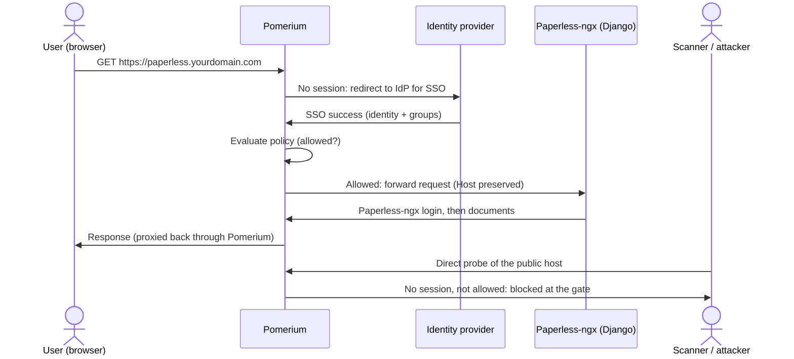
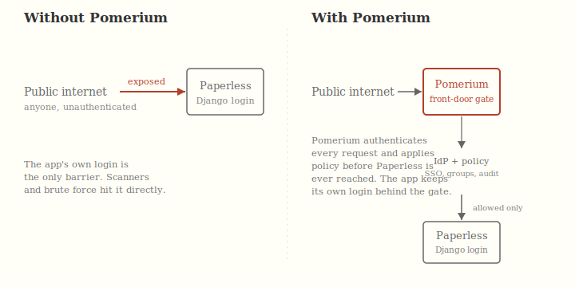
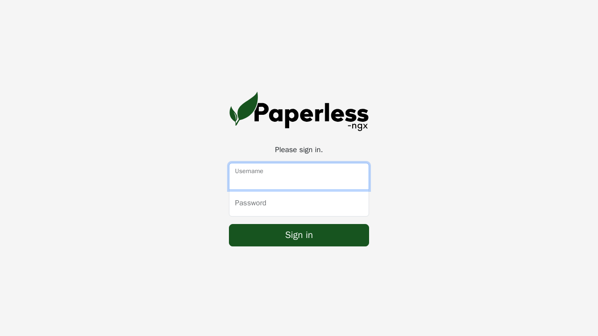

import TabItem from '@theme/TabItem';
import Tabs from '@theme/Tabs';

import Config from '/content/examples/guides/paperless-ngx/config.yaml.md';
import Compose from '/content/examples/guides/paperless-ngx/docker-compose.yaml.md';

# Secure Paperless-ngx with Pomerium

## What this guide does

You'll put a self-hosted [Paperless-ngx](https://docs.paperless-ngx.com/) instance behind Pomerium so that Pomerium becomes the single front door: every request is authenticated against your identity provider (IdP) and checked against your policy before it ever reaches Paperless-ngx. Paperless-ngx keeps running its own login and per-user document permissions on top, so Pomerium acts as an additional gate rather than replacing Paperless-ngx's accounts.

Paperless-ngx is a document management system that stores scanned and digitized records, often a household's or a company's most sensitive paperwork: tax filings, contracts, medical records, and IDs. That makes it a high-value target to keep off the open internet.

## When to use this guide

Use it when you run self-hosted Paperless-ngx and want to make sure only people from your organization can even reach it, without exposing its web interface directly to the internet. Pomerium handles the network-level access decision through centralized single sign-on (SSO), group-based policy, and an audit trail of who reached the route; Paperless-ngx continues to manage documents, tags, and its own user sessions behind that gate.

The value here is not "add a second login." Paperless-ngx already has a login. The value is moving the access decision to a single, centrally managed front door so you can enforce SSO and group policy, get an audit log of access, and shrink the attack surface that faces the internet.



## Prerequisites

This guide assumes you've completed the [Quickstart](/docs/get-started/quickstart), so you already have Pomerium running and signing users in through the hosted authenticate service.

You also need:

- [Docker](https://docs.docker.com/install/) and [Docker Compose](https://docs.docker.com/compose/install/)
- A domain you control for the Paperless-ngx route (this guide uses `paperless.yourdomain.com`)

This guide was last tested with Paperless-ngx 2.18.4 and Pomerium 0.32.7.

:::tip Prefer to self-host the identity provider?

This guide uses the hosted authenticate service so you don't have to run an IdP. To run your own instead, follow [Keycloak + Pomerium](/docs/integrations/user-identity/oidc) and swap the `authenticate_service_url` / `idp_*` settings into the config below.

:::

## Configure Pomerium

<Tabs queryString="type">
<TabItem value="zero" label="Pomerium Zero" default>

In the [Zero Console](https://console.pomerium.app):

1. Create a **Route**. In **From**, enter `https://paperless.<your-starter-domain>`; in **To**, enter `http://paperless:8000`.
2. On the route's settings, enable **Preserve Host Header**. Paperless-ngx is a Django application that validates the incoming `Host` against its `ALLOWED_HOSTS` (derived from `PAPERLESS_URL`) and uses it for cross-site request forgery (CSRF) checks, so the original host must reach Paperless-ngx unchanged.
3. Set the policy to scope access to who should reach Paperless-ngx (for example, **Any Authenticated User** or a specific group or domain).

</TabItem>
<TabItem value="core" label="Pomerium Core">

Create a `config.yaml`. It routes `paperless.yourdomain.com` to the Paperless-ngx container and preserves the host header so Django's `ALLOWED_HOSTS` and CSRF checks pass.

<Config />

Replace `paperless.yourdomain.com` with your domain and `you@example.com` with the email (or switch to a group or domain match) that should be allowed through.

</TabItem>
</Tabs>

## Configure Paperless-ngx

Paperless-ngx runs as a Django application backed by PostgreSQL and Redis. Pomerium terminates TLS at the front door, so Paperless-ngx serves plain HTTP on the internal Docker network. The key settings in the Compose file below:

- `PAPERLESS_URL: https://paperless.yourdomain.com`: Paperless-ngx derives Django's `ALLOWED_HOSTS` and `CSRF_TRUSTED_ORIGINS` from this. It **must** equal the public route host, or Django answers `HTTP 400` to every request that arrives behind the proxy.
- `PAPERLESS_REDIS` and the `PAPERLESS_DB*` values: point Paperless-ngx at the Redis broker and PostgreSQL database that ship in the same Compose file.
- `PAPERLESS_SECRET_KEY`: Django's signing key. Generate your own with `openssl rand -base64 48`; never reuse the placeholder.
- `PAPERLESS_ADMIN_USER` / `PAPERLESS_ADMIN_PASSWORD`: bootstrap the first superuser on the very first startup.

Paperless-ngx keeps its own login. The first time you reach it, sign in with the admin user you bootstrapped above.

The request surface is the whole point of putting it behind Pomerium:



## Run the stack

The Compose file runs Pomerium Core alongside Paperless-ngx, PostgreSQL, and Redis (for Zero, drop the `pomerium` service and use the `compose.yaml` from the Quickstart with your `POMERIUM_ZERO_TOKEN`, keeping the `paperless`, `db`, and `redis` services below, on the same Docker network as the Quickstart's `pomerium` service (the Quickstart names it `main`) so Pomerium can resolve `paperless` by name):

<Compose />

Start it:

```bash
docker compose up -d
```

Paperless-ngx runs database migrations and builds its search index on first boot, so the container can take a couple of minutes before it answers requests. Watch `docker compose logs -f paperless` until it reports that the web server is listening.

## Verify the setup

1. **The route requires authentication.** In a fresh browser, open `https://paperless.yourdomain.com`. You should be redirected to sign in through Pomerium, not straight to Paperless-ngx.
2. **An allowed user reaches Paperless-ngx.** Sign in with a user your policy allows. Pomerium redirects you back and Paperless-ngx's own sign-in page loads behind the gate.



3. **Sign in to Paperless-ngx.** Use the admin account you bootstrapped. Paperless-ngx authenticates you and lands you on its document dashboard, served through Pomerium.
4. **A request that skips the gate is blocked.** In the Compose file above, Paperless-ngx sits on an internal-only Docker network with no published host ports, so a direct probe of the upstream cannot even resolve or connect; the only path in is through Pomerium.

Pomerium gates the route; Paperless-ngx runs its own login on top. The admin account and first-run setup are Paperless-ngx's concern, not Pomerium's.

When you're done testing, tear the stack down with `docker compose down -v` (the `-v` also removes the database, media, and credential volumes).

## Common failure modes

- **`HTTP 400 Bad Request` on every page.** `PAPERLESS_URL` doesn't match the public route host, so Django rejects the host. Set `PAPERLESS_URL` to exactly `https://paperless.yourdomain.com` and make sure `preserve_host_header` is enabled on the route.
- **Redirects or links point at the container name or the wrong host.** `preserve_host_header` isn't set, so Paperless-ngx sees `paperless:8000` instead of the public name. Enable it on the route.
- **`502` or `503` right after `docker compose up`.** Paperless-ngx hasn't finished its first-boot migrations and search-index build yet. Wait until `docker compose logs -f paperless` shows the web server listening; first boot routinely takes a couple of minutes.
- **CSRF verification failures when signing in or uploading.** The browser's `Origin` doesn't match Django's `CSRF_TRUSTED_ORIGINS`. This is the same root cause as the `400` above: keep `PAPERLESS_URL` and the route host identical, over HTTPS.

## Security considerations

- Paperless-ngx runs its own authentication, so Pomerium here is a front-door gate, not a header-trust integration. Even so, **don't expose Paperless-ngx directly**: only Pomerium should reach `paperless:8000`. The Compose file keeps Paperless-ngx (and its PostgreSQL and Redis) on an internal-only Docker network with no published host ports, so the only path in is through Pomerium and the policy can't be bypassed.
- Scope the route policy (group or domain) to who should have any access to Paperless-ngx at all. Paperless-ngx's per-user document permissions still apply on top of that.
- Paperless-ngx holds sensitive documents and exposes an API and admin interface under the same host. Because the whole host sits behind Pomerium, those surfaces inherit the same SSO and policy gate; don't add a second public route that bypasses it.
- Generate a unique `PAPERLESS_SECRET_KEY` and strong database and admin passwords. The placeholders in this guide are examples, not safe defaults.

## Next steps

- [Build policies](/docs/get-started/fundamentals/zero/zero-build-policies)
- [Custom domains](/docs/capabilities/custom-domains)
- [Self-host the identity provider](/docs/integrations/user-identity/oidc)
