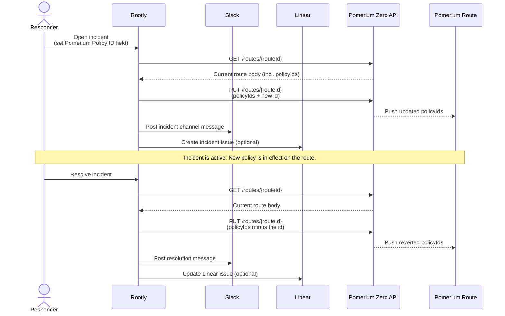

---
# cSpell:ignore Rootly rootly Liquid liquid policyIds namespaceId tlsSkipVerify allowSpdy allowWebsockets preserveHostHeader passIdentityHeaders showErrorDetails enableGoogleCloudServerlessAuthentication tlsUpstreamAllowRenegotiation Pomerium pomerium maisonlab homelab Slyfox slyfox lemu cheerful 2f8e 9b2276e5 b18a 4e18 ba42 c117b bSrhhXrzzSVZnfxMPGvcsBHrpMv bzGHWJGPzxwXGBpZWNxGKBwXFPb bKvswBsvFxVgMXVxnSFKrQspKBv

title: 'Automate Pomerium Zero Policies from Rootly Workflows'
sidebar_label: 'Rootly Incident Policies'
lang: en-US
description: 'Use Rootly incident workflows to attach a Pomerium Zero policy to a route when an incident opens and remove it when the incident resolves, with Slack notifications and optional Linear action items.'
keywords:
  [
    pomerium,
    pomerium zero,
    rootly,
    incident response,
    on-call,
    slack,
    linear,
    workflow automation,
    grafana,
    policy,
    route,
    just in time access,
  ]
---

# Automate Pomerium Zero Policies from Rootly Workflows

This guide walks through wiring [Rootly](https://rootly.com) incident workflows to the Pomerium Zero API so that opening an incident attaches an extra policy to a route (typically to widen access for the on-call responders) and resolving the incident removes it. The same scaffolding doubles as a paved path for posting incident updates to Slack and tracking action items in Linear.

The example route used throughout is the Grafana route you stood up in [Secure Grafana with Pomerium Zero](/docs/guides/grafana). Substitute any other Pomerium Zero route you want to flip access on for during an incident.

## What this guide does

By the end you will have:

- A Pomerium Zero custom policy that you want to apply only during active incidents (for example, a wider on-call group, or a break-glass policy that pulls in a paging team).
- A Rootly **Incident** custom field holding the Pomerium policy ID to attach.
- A `Create Incident` Rootly workflow that calls the Pomerium Zero API to append that policy ID to the route's `policyIds` array.
- An `Incident Resolved` Rootly workflow that calls the Pomerium Zero API to remove the same policy ID from the route's `policyIds` array.
- A Slack notification step inside each workflow so the right channel is told what just changed.
- (Optional) Linear automation that creates a parent issue per incident and a subtask per action item.

The illustrative endpoint is `grafana.cheerful-lemu23.pomerium.app`. Replace the cluster subdomain with your own.

## When to use this guide

Use this pattern when:

- Your Pomerium Zero routes are largely closed by default and you want to grant short-lived, audited access during an incident without editing routes by hand at 3am.
- You already use Rootly to drive incident lifecycle and want Pomerium policy changes to ride on top of the same workflows that already page, post to Slack, and create Linear issues.
- You want a uniform rollback path: resolving the incident removes the temporary policy. There is no separate cleanup step that an operator can forget.

Use a different pattern when:

| What you're trying to do | Use this instead |
| --- | --- |
| Manage Pomerium Zero objects from a Git repository under code review | [Build a Production-Grade Homelab Deployment Pipeline](/docs/guides/homelab-pipeline) covers the Terraform + GitOps approach |
| Grant time-bounded access to a single user without an incident | Use a [Pomerium Policy Language (PPL)](/docs/internals/ppl) policy with date or time conditions on the route directly |
| Front Rootly itself with Pomerium so on-call signs in via single sign-on (SSO) | Same recipe as the [Grafana guide](/docs/guides/grafana), pointed at your Rootly UI URL |

## Who this is for

Platform, security, or DevOps engineers who already operate a Pomerium Zero cluster, already use Rootly for incident response, and want to script policy changes from incident events. Familiarity with Rootly workflows, Liquid templating, and basic REST API calls is assumed.

End users (on-call responders) do not need to know any of this. They open and resolve incidents in Rootly the way they always do.

## Prerequisites

Before you start, confirm all of the following:

- **A working Pomerium Zero cluster.** This guide uses `cheerful-lemu23.pomerium.app` as the example cluster hostname; substitute your own. If you don't have a cluster yet, follow the [Pomerium Zero Quickstart](/docs/get-started/quickstart?type=zero) first.
- **A Pomerium Zero route already protected by Pomerium.** This guide uses the Grafana route from [Secure Grafana with Pomerium Zero](/docs/guides/grafana) as the worked example. Any existing Pomerium Zero route works.
- **A Pomerium Zero API token.** Create one in the Zero Console under your **Account → API Tokens** menu (the same path the [Pomerium Zero API getting-started guide](/docs/internals/management-api-zero) uses). The token must have permission to read and update routes in the organization that owns the route. See the [Pomerium Zero API reference](/docs/api) for the full surface.
- **A Rootly account** with permission to create secrets, custom incident fields, and workflows. Secrets live at [`rootly.com/account/secrets`](https://rootly.com/account/secrets) and incident form fields live at [`rootly.com/account/form-fields`](https://rootly.com/account/form-fields).
- **A Rootly API key.** Required if you want a workflow to write back into a custom incident field (used in [Step 4](#step-4-update-the-policy-id-field-on-incident-create-optional) below). Create one in your Rootly user settings.
- **Slack and Linear already connected to Rootly** (only if you want the Slack notification and Linear action item steps). The Rootly Slack and Linear integrations are configured at the workspace level and are out of scope here. If they aren't connected yet, see Rootly's [integrations documentation](https://docs.rootly.com).
- **A Pomerium Zero policy you want to attach during incidents.** Build it with the [PPL editor](/docs/internals/ppl) in **Manage → Policies**. Note its policy ID. You can find the ID in the Zero Console URL when you have the policy open in the editor.

:::warning Treat this as a privileged automation surface

The Rootly secret holding your Pomerium Zero API token grants full read or write over your Pomerium Zero configuration. Anyone who can edit Rootly workflows can mint requests against that token. Restrict workflow edit access in Rootly the same way you restrict access to your Pomerium admin console. See [Security considerations](#security-considerations).

:::

## Architecture and request flow

Rootly is the trigger; Pomerium Zero is the system being changed. The Rootly secret store holds the Pomerium Zero API token. A custom incident field holds the policy ID to attach.



Two important properties of this design:

- **The Pomerium Zero API has no PATCH endpoint for routes.** Adding or removing one policy requires a `GET` to fetch the full route body, mutating `policyIds` in [Liquid](https://shopify.github.io/liquid/), then a `PUT` of the full body back. Both workflows follow this read-modify-write shape.
- **The custom incident field is the source of truth for which policy to attach.** Different incident types can pre-fill different policy IDs through Rootly incident types or form defaults, so one workflow handles every incident class without branching logic.

## Step-by-step implementation

### Step 1: Store the Pomerium Zero API token as a Rootly secret

In Rootly, go to [Account → Secrets](https://rootly.com/account/secrets) and create a secret. The name you give it is what you'll reference in workflow templates.

| Field | Value                                              |
| ----- | -------------------------------------------------- |
| Name  | `pomerium_api_token`                               |
| Value | The Pomerium Zero API token from your Zero Console |

Save it. You'll reference this secret in every HTTP action below as `{{ secrets.pomerium_api_token }}`.

:::tip Place to put screenshot

Capture the Rootly secrets page with the new `pomerium_api_token` row visible (value masked) and save to `content/docs/guides/img/rootly-incident-policy/secrets-page.png`.

:::

### Step 2: Add a custom incident field for the policy ID

In Rootly, go to [Account → Form Fields](https://rootly.com/account/form-fields) and create a new field.

| Field | Value |
| --- | --- |
| Name | `Pomerium Policy ID` |
| Description | The ID associated with the named Pomerium policy for the given incident. |
| Field type | `Text` |
| Default value | (leave empty) |
| Enabled | On |
| Display this field in the incident details | On |

Save the field. After it saves, open the field again and copy its **ID** from the Attributes panel at the top. The ID is a UUID, for example `9b2276e5-b18a-4e18-ba42-2f8e845c117b`. You'll use this UUID inside Liquid templates when reading the field back in workflows. Rootly templates always read custom fields by ID, not by name.

:::tip Place to put screenshot

Capture the Edit Form Field dialog in Rootly with the Pomerium Policy ID field configuration visible and the field ID highlighted at the top. Save it to `content/docs/guides/img/rootly-incident-policy/custom-field-edit.png` and replace this admonition with an inline image.

:::

:::note Why ID and not name

Custom field labels can be renamed without breaking integrations. Rootly's Liquid filter `find: 'custom_field.id', '<uuid>'` resolves a field by its immutable UUID, so workflows keep working even if a teammate edits the label later.

:::

### Step 3: Find the route ID and organization ID

You need two opaque IDs from Pomerium Zero to address a single route via the API:

- The **organization ID**.
- The **route ID** for the route you want to mutate.

Open the route in the Zero Console under **Manage → Routes → (your route)**. Both IDs are in the URL. The shape of the URL is:

```
https://console.pomerium.app/app/{organizationId}/routes/{routeId}
```

Copy both values. You'll paste them into the workflow URLs in Step 4 and Step 5.

You can also fetch the route once with `curl` to confirm the token, route ID, and organization ID line up before you wire up the workflow:

```bash
curl -sS \
  -H "Authorization: Bearer $POMERIUM_API_TOKEN" \
  -H "Content-Type: application/json" \
  https://console.pomerium.app/api/v0/organizations/{organizationId}/routes/{routeId}
```

The response body is the full route, including `policyIds`. A response such as the following confirms the wiring:

```json
{
  "id": "bSrhhXrzzSVZnfxMPGvcsBHrpMv",
  "name": "grafana",
  "from": "https://grafana.cheerful-lemu23.pomerium.app",
  "to": ["http://grafana.homelab.svc.cluster.local:3000"],
  "policyIds": ["bzGHWJGPzxwXGBpZWNxGKBwXFPb"],
  "namespaceId": "bKvswBsvFxVgMXVxnSFKrQspKBv",
  "allowSpdy": false,
  "allowWebsockets": true,
  "enableGoogleCloudServerlessAuthentication": false,
  "preserveHostHeader": true,
  "passIdentityHeaders": true,
  "showErrorDetails": false,
  "tlsSkipVerify": false,
  "tlsUpstreamAllowRenegotiation": false
}
```

### Step 4: Build the `Create Incident` workflow (add policy)

In Rootly, go to **Workflows → New Workflow**. Set the trigger to **Incident → Created**. Name it `Create Incident Workflow`.

Add three actions, in order.

#### 4a. HTTP action: GET the current route

This is a read-only step. Its output feeds the `PUT` body in 4b.

| Field | Value |
| --- | --- |
| Action type | HTTP Request |
| Slug | `get-grafana-pomerium-route` |
| Method | `GET` |
| URL | `https://console.pomerium.app/api/v0/organizations/{organizationId}/routes/{routeId}` |
| Headers | `Authorization: Bearer {{ secrets.pomerium_api_token }}` and `Content-Type: application/json` |
| Body | (empty) |

Subsequent steps reference this action's response as `{{ tasks.get-grafana-pomerium-route.output.response.body }}`.

#### 4b. HTTP action: PUT the route with the appended policy ID

| Field | Value |
| --- | --- |
| Action type | HTTP Request |
| Slug | `update-grafana-pomerium-route-add` |
| Method | `PUT` |
| URL | `https://console.pomerium.app/api/v0/organizations/{organizationId}/routes/{routeId}` |
| Headers | `Authorization: Bearer {{ secrets.pomerium_api_token }}` and `Content-Type: application/json` |

Set the **Body** to the Liquid template below. Replace `9b2276e5-b18a-4e18-ba42-2f8e845c117b` with the custom field ID you copied in Step 2.

```liquid



{
  "namespaceId": "{{ tasks.get-grafana-pomerium-route.output.response.body.namespaceId }}",
  "name": "{{ tasks.get-grafana-pomerium-route.output.response.body.name }}",
  "from": "{{ tasks.get-grafana-pomerium-route.output.response.body.from }}",
  "to": {{ tasks.get-grafana-pomerium-route.output.response.body.to | to_json }},
  "allowSpdy": {{ tasks.get-grafana-pomerium-route.output.response.body.allowSpdy }},
  "allowWebsockets": {{ tasks.get-grafana-pomerium-route.output.response.body.allowWebsockets }},
  "enableGoogleCloudServerlessAuthentication": {{ tasks.get-grafana-pomerium-route.output.response.body.enableGoogleCloudServerlessAuthentication }},
  "preserveHostHeader": {{ tasks.get-grafana-pomerium-route.output.response.body.preserveHostHeader }},
  "passIdentityHeaders": {{ tasks.get-grafana-pomerium-route.output.response.body.passIdentityHeaders }},
  "showErrorDetails": {{ tasks.get-grafana-pomerium-route.output.response.body.showErrorDetails }},
  "tlsSkipVerify": {{ tasks.get-grafana-pomerium-route.output.response.body.tlsSkipVerify }},
  "tlsUpstreamAllowRenegotiation": {{ tasks.get-grafana-pomerium-route.output.response.body.tlsUpstreamAllowRenegotiation }},
  "policyIds": {{ updated_policy_ids }}
}
```

:::warning Do not wrap `policyIds` in quotes or run it through `to_json`

Liquid renders an array variable natively as `["id1","id2"]`, which is already valid JSON. Wrapping the expression in quotes turns it into a string. Running it through `to_json` does the same thing in a different way. Either rejection looks like `value must be an array` from the API.

:::

#### 4c. Slack action: notify the incident channel

Add a **Send Slack Message** action after 4b. Point it at your incident channel (Rootly's default is the channel created for the incident). A short body works:

```text
Pomerium policy {{ incident.custom_fields | find: 'custom_field.id', '9b2276e5-b18a-4e18-ba42-2f8e845c117b' | get: 'value' }} attached to the {{ tasks.get-grafana-pomerium-route.output.response.body.name }} route for the duration of this incident.
```

Save the workflow. Toggle it on.

### Step 5: Build the `Incident Resolved` workflow (remove policy)

Same recipe, but the trigger is **Incident → Resolved** and the body filters the policy ID out instead of appending it.

Create a new workflow named `Incident Resolved Workflow`. Reuse the `get-grafana-pomerium-route` HTTP action from Step 4a verbatim (slug, method, URL, headers all the same).

For the second action, slug it `update-grafana-pomerium-route-remove`, method `PUT`, same URL and headers, and set the body to:

```liquid




  
    
      
    
      
    
  

{
  "namespaceId": "{{ tasks.get-grafana-pomerium-route.output.response.body.namespaceId }}",
  "name": "{{ tasks.get-grafana-pomerium-route.output.response.body.name }}",
  "from": "{{ tasks.get-grafana-pomerium-route.output.response.body.from }}",
  "to": {{ tasks.get-grafana-pomerium-route.output.response.body.to | to_json }},
  "allowSpdy": {{ tasks.get-grafana-pomerium-route.output.response.body.allowSpdy }},
  "allowWebsockets": {{ tasks.get-grafana-pomerium-route.output.response.body.allowWebsockets }},
  "enableGoogleCloudServerlessAuthentication": {{ tasks.get-grafana-pomerium-route.output.response.body.enableGoogleCloudServerlessAuthentication }},
  "preserveHostHeader": {{ tasks.get-grafana-pomerium-route.output.response.body.preserveHostHeader }},
  "passIdentityHeaders": {{ tasks.get-grafana-pomerium-route.output.response.body.passIdentityHeaders }},
  "showErrorDetails": {{ tasks.get-grafana-pomerium-route.output.response.body.showErrorDetails }},
  "tlsSkipVerify": {{ tasks.get-grafana-pomerium-route.output.response.body.tlsSkipVerify }},
  "tlsUpstreamAllowRenegotiation": {{ tasks.get-grafana-pomerium-route.output.response.body.tlsUpstreamAllowRenegotiation }},
  
  "policyIds": []
  
  "policyIds": ["{{ updated_policy_ids }}"]
  
}
```

The `for` loop with `unless` filters out the policy ID to remove. The terminal `if` block sends `[]` when every policy has been stripped, so the API doesn't reject `[""]` as an invalid array.

:::note Why a `for` loop and not `reject`

Liquid in Rootly does not implement the `reject` filter, and `concat` requires an array argument so it cannot append a single string. The `for` plus `unless` pattern is the simplest combination of supported filters that handles both the "remove one" case and the "remove the only one" case.

:::

Add a Slack notification step the same way as in 4c, with a body that says the policy was removed. Save and toggle the workflow on.

### Step 6 (optional): Update the policy ID field on incident create

If your incident types pre-fill the Pomerium Policy ID field, skip this step. If responders set the field manually in the incident form, you can also have the `Create Incident` workflow write a default into the field so subsequent workflow steps can rely on it being populated.

This is the only place you need a Rootly API key (the Pomerium API token is not enough to update Rootly's own resources). Add the Rootly key as a second secret named `rootly_api_key`, then add an HTTP Request action to the workflow:

| Field | Value |
| --- | --- |
| Method | `PUT` |
| URL | `https://api.rootly.com/v1/incidents/{{ incident.id }}` |
| Headers | `Authorization: Bearer {{ secrets.rootly_api_key }}` and `Content-Type: application/vnd.api+json` |
| Body | A JSON:API document that updates the `custom_fields` attribute. See [Rootly's incidents API reference](https://rootly.com/api#tag/Incidents) for the exact shape. |

This is one path. The other is to put the default into the incident type's custom field defaults in Rootly settings, with no API call required. Pick whichever fits your incident taxonomy.

### Step 7 (optional): Linear action item workflows

Rootly's Action Items concept maps cleanly to Linear subtasks. If you also want each incident to land in Linear with one parent issue and a subtask per action item, add three more workflows. The first two only run if you want one Linear issue per incident:

| Workflow name | Trigger | Type | What it does |
| --- | --- | --- | --- |
| `Update Linear Issue` | Incident → Updated, Resolved | Incident | Calls Linear's GraphQL API to keep the parent Linear issue's title and description in sync with the incident |
| `Create a Linear Subtask Issue` | Action Item → Created | Action Item | Creates a Linear sub-issue under the incident's parent Linear issue |
| `Update Linear Subtask` | Action Item → Updated | Action Item | Mirrors action item field changes back to the Linear sub-issue |

Each of these is a thin Linear GraphQL call wrapped in an HTTP Request action. They do not touch Pomerium Zero, so they are independent of the policy attach and detach workflows above and can be added at any time. The reference Linear workflows in Rootly's marketplace are a reasonable starting point.

## Verify the setup

Run these checks in order. Each one has a specific expected result. If any check fails, jump to [Common failure modes](#common-failure-modes).

### Checkpoint 1: GET against the route succeeds

From your laptop:

```bash
curl -sS -H "Authorization: Bearer $POMERIUM_API_TOKEN" \
  https://console.pomerium.app/api/v0/organizations/{organizationId}/routes/{routeId} | jq '.policyIds'
```

Expected: a JSON array of policy IDs, including the policy you intend to attach as the "currently active without an incident" set. If you see `401`, the API token is missing or wrong. If you see `404`, the route ID or organization ID is wrong.

### Checkpoint 2: Create a test incident, watch policyIds grow

Open a low-stakes incident in Rootly and set the Pomerium Policy ID field to a real policy ID that is not currently in the route's `policyIds`. Wait for the workflow to run, then re-run the curl command from Checkpoint 1.

Expected: the array now contains the new policy ID. The route should reflect the new policy in the Zero Console under **Manage → Routes → (route) → Policies**.

### Checkpoint 3: Resolve the incident, watch policyIds shrink

Resolve the test incident. Wait for the resolution workflow, then run the curl from Checkpoint 1 again.

Expected: the array no longer contains the policy ID. If the policy was the only one on the route, the array should be `[]`, not `[""]`.

### Checkpoint 4: Slack received both messages

In the incident channel, you should see two messages: one when the incident was created (policy attached) and one when it was resolved (policy removed). If you don't see them, the Slack action ran before the HTTP action completed or the Slack integration is misconfigured. Reorder the actions so the Slack notification runs after the successful PUT.

## Common failure modes

| Symptom | Likely cause | What to check | Fix |
| --- | --- | --- | --- |
| `value must be an array` from the PUT | `policyIds` in the Liquid body was wrapped in quotes or run through `to_json`, serializing the array to a string | The body of the `update-grafana-pomerium-route-add` action: confirm `"policyIds": {{ updated_policy_ids }}` has no surrounding quotes and no `\| to_json` filter | Remove the quotes and the filter. Liquid renders an array natively as JSON. |
| `value must be an array` after the last policy is removed | The remove-policy template emitted `["{{ updated_policy_ids }}"]` with `updated_policy_ids` empty, which serializes to `[""]` | The `if updated_policy_ids == ""` branch in the body | Confirm the branch sends `[]` literally when the variable is empty. |
| Workflow runs but `policyIds` does not change | The HTTP action returned a `4xx` or `5xx` and the workflow continued anyway | Rootly **Workflow Runs → (run) → HTTP action output**: status code and response body | Make the response code an explicit success condition on the action, or chain a conditional retry. Common causes are an expired Pomerium token, a stale route ID, or the route having been deleted. |
| Workflow run output shows `new_policy_id` is empty | The Liquid `find` filter is reading the field by name, the wrong UUID, or before the field has been populated | Run a temporary **Add Timeline Event** action that prints `existing: {{ existing_policy_ids \| to_json }}` and `new id: {{ new_policy_id }}` so you can read the rendered values | Confirm the UUID in the `find` filter matches the field's Attributes panel ID, and that the incident was created with the field set. |
| Slack message posts before the route is updated | The Slack action runs in parallel with, or before, the HTTP action | Order of actions in the workflow editor | Drag the Slack action below the PUT action so it runs sequentially. |
| Test incident leaves the policy attached after resolution | The resolution workflow is disabled, or its trigger condition does not match the incident's status transition | Workflow toggle and trigger configuration | Toggle the workflow on. Confirm the trigger fires on the exact `Resolved` status your team uses (Rootly supports custom statuses). |
| Wrong route is mutated | URL in the HTTP action references the wrong route ID | The URL in both `get-grafana-pomerium-route` and the matching update action | Re-copy the route ID from the Zero Console URL and paste it into both actions. The two actions must reference the same route. |

## Security considerations

- **The Pomerium Zero API token is a privileged secret.** A token with route write access can change any route in the organization, not just the one this guide manages. Scope the token to the minimum role Pomerium Zero supports for your organization. Restrict who in Rootly can edit workflows or create new HTTP actions, since anyone who can edit a workflow can read or rebroadcast that secret. Rotate the token on a schedule and immediately if a Rootly admin offboards.
- **Custom incident fields can leak sensitive context.** The Pomerium Policy ID itself is an opaque ID and is not Personally Identifiable Information (PII), but the incident around it often is. Disable Rootly's debug logging of full HTTP request bodies for these workflows in production. Slack messages posted by the workflow inherit the channel's audience, so think before pasting incident summaries that mention end-user identifiers into a wide channel.
- **The route's `from` URL reveals an externally accessible endpoint.** Putting `grafana.cheerful-lemu23.pomerium.app` into Rootly Slack messages tells anyone in that channel where the protected service lives. That alone is not a vulnerability, but a least-privilege channel scope still applies.
- **The route's `to` URL reveals internal topology.** Avoid logging the full route body to a Slack channel or a low-trust audit destination. The example response in [Step 3](#step-3-find-the-route-id-and-organization-id) shows internal cluster DNS that you do not want pasted into a public channel.
- **Policy attach during an incident widens access. Audit it.** The whole point of the workflow is to broaden who can reach the route. Send the Pomerium [authorize log](/docs/capabilities/audit-logs) for the affected route to a Security Information and Event Management (SIEM) destination, and review who actually used the elevated access during incidents. If responders never use it, the policy is an unnecessary standing risk.
- **Rootly's automation surface itself is in-scope for review.** Workflow edit access is effectively edit access to your Pomerium routes for the routes covered by this pattern. Apply the same change-management scrutiny to Rootly workflow edits that you apply to direct Pomerium policy edits.
- **Plan for a PATCH endpoint.** When the Pomerium Zero API gains a `PATCH` method for routes, you can collapse the read-modify-write pair into a single conditional update and reduce the risk of a stale read causing a partial overwrite. Track that change against this guide.

## Operations, rollback, and cleanup

This guide configures only the Pomerium Zero managed control plane and Rootly workflow definitions. There are no long-lived artifacts to maintain on disk or in a chart. Rollback is just disabling the two workflows in Rootly and removing the appended policy from the route in the Zero Console (or letting the next resolution event do it for you).

To remove the integration entirely:

1. Toggle off the `Create Incident Workflow` and `Incident Resolved Workflow` in Rootly.
2. Open the affected Pomerium Zero route and remove any temporarily-attached policy IDs from `policyIds`.
3. Delete the Rootly secret `pomerium_api_token`.
4. Optionally delete the `Pomerium Policy ID` custom incident field. Keep it if any in-flight incidents still reference it.

## Next steps and related guides

- [Secure Grafana with Pomerium Zero](/docs/guides/grafana): the worked-example route this guide mutates.
- [Build a Production-Grade Homelab Deployment Pipeline](/docs/guides/homelab-pipeline): manage Pomerium Zero objects from Terraform under code review when an incident workflow isn't the right fit.
- [PPL reference](/docs/internals/ppl): the policy language used by the policies you attach and detach during incidents.
- [Pomerium Zero API reference](/docs/api) and [Pomerium Zero API getting started](/docs/internals/management-api-zero): full surface of the API the Rootly workflows call.
- [Audit logs](/docs/capabilities/audit-logs): wire the elevated-access events into your SIEM so the policy attach is reviewable after the incident closes.
