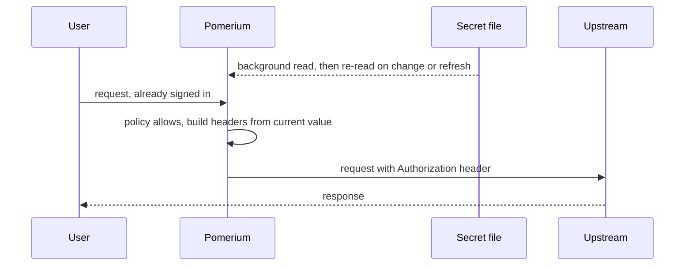

import Config from '/content/examples/guides/secrets/config.yaml.md';
import Compose from '/content/examples/guides/secrets/docker-compose.yaml.md';

# Inject a Rotating Credential into Upstream Requests

## What this guide does

Many upstream services accept only a static credential: an API token, a shared basic-auth password, or an admin key. The usual way to front such a service with Pomerium is to write the credential straight into the route's [`set_request_headers`](/docs/reference/routes/headers#set-request-headers). That works, but the credential then lives in your Pomerium configuration, and every rotation becomes a configuration change.

In this guide you move that credential out of the configuration. You put it in a file, name it with a [secret binding](/docs/reference/secrets#bindings), and reference the binding from the route. Pomerium reads the file in the background and substitutes the value on each request. You will then rotate the credential while the stack keeps running, and watch Pomerium reject requests when the credential is gone, instead of forwarding them without it.

The stack is Pomerium Core plus a small echo service that stands in for your API and shows you exactly which headers it received.

## When to use this guide

Use it when an upstream credential is rotated by something other than you editing Pomerium's configuration: a secret manager syncing to disk, a Kubernetes `Secret` mounted into the container, a cron job, or an operator writing a new token. Use it also when you simply do not want the credential stored in the same file as your routes and policies.

If the credential never changes and your configuration file is already the trusted place for it, a static header value is enough. Compare with the [AdGuard guide](/docs/guides/ad-guard), which injects a fixed basic-auth credential from the configuration file.

The binding table is a Pomerium Core setting written in the configuration file. It is not available as an Ingress annotation, and the Pomerium Zero Console does not expose it.

## How it works

Pomerium's Authorize service builds the request headers while it evaluates the policy. It keeps the current value of each binding in memory, so injection adds no reads on the request path.



Two properties matter for the rest of this guide:

- **Rotation needs no reload.** Pomerium re-reads the file on a timer and also watches it for changes.
- **Injection fails closed.** If the value cannot be read, Pomerium answers `503 Service Unavailable` rather than sending the request without the header.

The full behavior is described in the [Secrets reference](/docs/reference/secrets).

## Prerequisites

This guide assumes you've completed the [Quickstart](/docs/get-started/quickstart), so you already have Pomerium running and signing users in through the hosted authenticate service.

You also need:

- [Docker](https://docs.docker.com/install/) and [Docker Compose](https://docs.docker.com/compose/install/)
- A domain you control for the route (this guide uses `api.yourdomain.com`), with DNS pointing at the host
- Ports 80 and 443 reachable on that host, so `autocert` can obtain a certificate
- A credential to inject. Any string works for the walkthrough.

The Compose file uses the `pomerium/pomerium:main` image tag, because secret injection is newer than the latest pinned release. Pin a released tag once one includes it.

## Step 1: create the credential file

Make a directory for credentials and write the token into it. Use `printf`, not `echo -n`, for predictable output:

```bash
mkdir -p secrets
printf 'token-v1' > secrets/upstream-api-token
chmod 0600 secrets/upstream-api-token
```

Mode `0600` keeps the file private to its owner while still letting you rewrite it later in this guide. Pomerium only reads it.

Pomerium removes exactly one trailing newline from the file, so a value written by `echo` or by a text editor works too. Any other whitespace is part of the value.

## Step 2: configure Pomerium

Create `config.yaml` next to the `secrets` directory:

<Config />

Replace `api.yourdomain.com` with your domain and `you@example.com` with your email.

Three parts work together:

- `secrets.bindings` gives the credential an ID, `upstream-api-token`, and a `file://` URL with an absolute path inside the container.
- `secrets.defaults` sets how often Pomerium re-reads the file (`refresh`) and how long it keeps using the last good value while re-reads fail (`stale_grace`).
- The route's `set_request_headers` references the binding as `${secret.upstream-api-token}`.

The `stale_grace` of `5m` is short so that you can observe the fail-closed path later in this guide. For production, the [default of 30 minutes](/docs/reference/secrets#defaults) rides out a longer outage of whatever writes the file.

## Step 3: define the stack

Create `docker-compose.yaml`:

<Compose />

Note the mount: the `secrets` **directory** is mounted, not the single file. A single-file bind mount is bound to one inode. When a tool replaces the credential, which is how most secret managers write files, the container keeps pointing at the old inode: the path inside the container stops resolving, Pomerium reports the secret as missing, and requests fail closed once the grace window ends. Mounting the directory avoids this.

## Step 4: start the stack

```bash
docker compose up -d
```

Wait for the certificate to be issued, then confirm Pomerium read the credential:

```bash
docker compose logs pomerium | grep secret
```

Expected output:

```json
{
  "level": "info",
  "ref": "file:///etc/pomerium/secrets/upstream-api-token",
  "label": "upstream-api-token",
  "state": "fresh",
  "message": "secret resolved"
}
```

Pomerium does not wait for this read at startup. If it fails, Pomerium still serves every other route, and only requests that need this credential are rejected.

## Verify the setup

1. **The route requires authentication.** In a fresh browser, open `https://api.yourdomain.com`. You are redirected to sign in.
2. **The credential reaches the upstream.** Sign in. The echo service returns the request it received. In the `headers` object you see:

   ```text
   "authorization": "Bearer token-v1"
   ```

   The value came from the file, not from `config.yaml`.

3. **Pomerium reports a healthy binding.** Metrics confirm the same thing without a browser:

   ```bash
   curl -s http://127.0.0.1:9090/metrics | grep pomerium_secrets
   ```

   ```text
   pomerium_secrets_cache_state{ref_label="upstream-api-token",state="fresh"} 1
   pomerium_secrets_fetches_total{outcome="success",provider="file"} 1
   pomerium_secrets_header_inject_total{outcome="injected",route_id="..."} 1
   ```

   Your output also carries a `hostname` label on each series. `state="fresh"` means the last read succeeded, and `outcome="injected"` counts headers that were built with a credential. See [Secrets metrics](/docs/reference/metrics#secrets) for the full list.

## Rotate the credential

Now replace the value the way a secret manager would, by writing a new file and moving it into place:

```bash
printf 'token-v2' > secrets/.upstream-api-token.new
chmod 0600 secrets/.upstream-api-token.new
mv secrets/.upstream-api-token.new secrets/upstream-api-token
```

Reload `https://api.yourdomain.com`. The echo service now reports:

```text
"authorization": "Bearer token-v2"
```

The new value is usually visible about a second after the move. There is no configuration change, no `docker compose restart`, and no dropped request: requests during the switch carry either the old value or the new one, never an empty header.

An in-place rewrite (`printf 'token-v3' > secrets/upstream-api-token`) works the same way. An atomic move is still the safer habit, because a reader can never observe a half-written file.

## Confirm the fail-closed behavior

Delete the credential and watch what Pomerium does:

```bash
rm secrets/upstream-api-token
```

For roughly the next five minutes, the `stale_grace` window from your configuration, requests still succeed with the last good value, and Pomerium warns on the state change:

```json
{
  "level": "warn",
  "ref": "file:///etc/pomerium/secrets/upstream-api-token",
  "label": "upstream-api-token",
  "state": "stale",
  "error_class": "not_found",
  "message": "secret serving stale"
}
```

Then the value is dropped and the route starts answering `503 Service Unavailable`. Two details make the exact moment approximate: the window runs from the last successful read, which was up to one `refresh` interval before you deleted the file, and the drop happens on the next failed read attempt, which for a missing file is within 30 seconds. Expect the switch between about four and five and a half minutes after the deletion.

Reload `https://api.yourdomain.com` in the browser where you are still signed in. Pomerium's error page reports `503 Service Unavailable`, with no detail about the credential. Check it from your signed-in session, not with a plain `curl`: an unauthenticated request is redirected to sign in as usual, because the policy decision comes first.

The Pomerium log names the binding and the header that could not be filled:

```json
{
  "level": "warn",
  "binding": "upstream-api-token",
  "header": "authorization",
  "route": "https://api.yourdomain.com → http://upstream:8080",
  "message": "authorize: secret unavailable, denying request"
}
```

This is the behavior to expect during a bad rotation. Pomerium does not forward the request with the header missing, which would look to the upstream like an anonymous call.

Put the credential back and the route recovers with no restart:

```bash
printf 'token-v2' > secrets/upstream-api-token
chmod 0600 secrets/upstream-api-token
```

Recovery takes up to `negative_ttl`, 30 seconds by default, because Pomerium stops reading a missing secret for that long after each failed attempt. This is slower than the rotation earlier in this guide, where the file was never missing. Recovery is logged as `secret recovered`.

## Troubleshooting

| Symptom | Likely cause | What to check | Fix |
| --- | --- | --- | --- |
| Pomerium exits at startup with `validation error ... unknown secret "..."` | A route references a binding ID that is not in the table | Compare the ID in `set_request_headers` with the keys under `secrets.bindings` | Correct the ID. IDs are case-sensitive and cannot contain dots |
| Every request to the route returns `503`, and the log says `secret unavailable` | Pomerium never read the file | `docker compose logs pomerium \| grep secret`. A missing file logs `secret not found; negative-caching`, which names the URL it tried to read | Check that the `url` path matches the container path in the volume mount, for example `./secrets:/etc/pomerium/secrets:ro` with `file:///etc/pomerium/secrets/upstream-api-token` |
| `503`, but the log shows no secret state change at all | The file exists and cannot be read, usually a permissions problem | `curl -s http://127.0.0.1:9090/metrics \| grep -E 'cache_state\|fetches_total'`. `cache_state{state="failed"}` means the binding has never been read; a growing `fetches_total{outcome="error"}` confirms a read error | Make the file readable by the user Pomerium runs as. Only state changes are logged, and a binding that never succeeds has no state change to log |
| Requests start failing right after a rotation, and the log says `secret not found` | The single file was bind-mounted instead of the directory, so replacing it left the container pointing at the old inode | The `volumes` entry in `docker-compose.yaml` | Mount the directory (`./secrets:/etc/pomerium/secrets:ro`) and recreate the container |
| The upstream returns `401` while Pomerium injects the header | The value carries characters you did not intend | `xxd secrets/upstream-api-token \| tail -2`. Pomerium strips one trailing newline, and nothing else | Rewrite the file with `printf '%s' "$TOKEN"`. A value containing a carriage return, a line feed, or a null byte is rejected when the header is built, so those requests get `503` instead |
| Only some routes return `503` | Expected. Rejection is per binding | Which bindings the failing routes reference | Fix the affected binding. Routes that reference healthy bindings are unaffected |

The Pomerium image is distroless and has no shell, so `docker compose exec pomerium ls` will not work. Inspect the host directory and the volume definition instead.

## Security notes

- **The file is the boundary now.** Anyone who can read `secrets/upstream-api-token` on the host, or read the container's filesystem, has the credential. Keep it owned by a single user with a restrictive mode, and keep it out of version control and out of image builds.
- **The upstream still trusts the credential, not the user.** Any client that can present the token to the upstream directly bypasses Pomerium. Keep it off published ports and on an internal Docker network shared with Pomerium alone, as the Compose file does.
- **A route decides which binding it injects.** Bindings do not restrict which upstream receives a credential, so treat write access to routes as write access to the credential's use. The binding table is the only place a credential location is written, so a route can never point at a file of its own.
- **Binding metadata is not secret.** IDs, URLs, and timing values appear in logs and configuration dumps. Credential values never do, in logs, error messages, or metric labels.

## Operations

**Rollback.** Secret injection is confined to the `secrets` block and the header value. To go back to a static credential, replace the reference with a literal value and remove the block:

```yaml
set_request_headers:
  Authorization: 'Bearer token-v2'
```

Pomerium watches the mounted `config.yaml` and reloads it, so saving the file is enough. `docker compose up -d` will not recreate the container for a content change alone. To force a reload, restart the service:

```bash
docker compose restart pomerium
```

A route that still references a binding you removed is a configuration error, so a partial rollback fails loudly and the old configuration stays in effect rather than failing at request time.

**Change the tuning without downtime.** Editing `refresh` or `stale_grace` is picked up by the same reload. Values already in memory are kept, and Pomerium re-reads only bindings whose URL changed.

**Cleanup.** Remove the stack and the credential:

```bash
docker compose down -v
rm -rf secrets
```

`-v` also removes the `pomerium-cache` volume, which holds the Let's Encrypt certificate cache, so a rebuilt stack requests a new certificate. Then revoke the token at whatever issued it: deleting the file stops Pomerium from sending the credential, but does not make it invalid.

## Next steps

- [Secrets reference](/docs/reference/secrets) for every field, the failure matrix, and the JSON field selector for credentials stored in a JSON file
- [Headers Settings](/docs/reference/routes/headers#set-request-headers) for the other substitutions available in request headers
- [Metrics](/docs/reference/metrics#secrets) for the instruments to alert on
