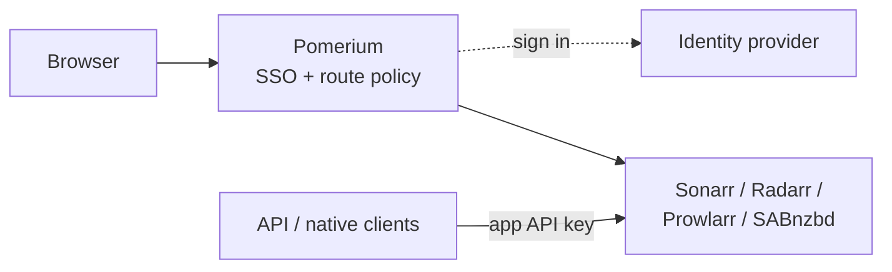

---
# cSpell:ignore servarr Sonarr Radarr Prowlarr SABnzbd usenet linuxserver Servarr
title: Secure Sonarr, Radarr, Prowlarr, and SABnzbd with Pomerium
sidebar_label: Servarr
lang: en-US
keywords:
  [
    pomerium,
    servarr,
    sonarr,
    radarr,
    prowlarr,
    sabnzbd,
    media automation,
    sso,
    oidc,
    identity aware proxy,
    self-hosted,
  ]
description: Put a Servarr media-automation suite (Sonarr, Radarr, Prowlarr, SABnzbd) behind one Pomerium front door so every web request is authenticated and authorized before it reaches an app.
---

import TabItem from '@theme/TabItem';
import Tabs from '@theme/Tabs';

import Config from '/content/examples/guides/servarr/config.yaml.md';
import Compose from '/content/examples/guides/servarr/docker-compose.yaml.md';

# Secure Sonarr, Radarr, Prowlarr, and SABnzbd with Pomerium

## What this guide does

The "Servarr" apps are a family of self-hosted media-automation tools that are almost always run together: [Sonarr](https://sonarr.tv/) (TV), [Radarr](https://radarr.video/) (movies), [Prowlarr](https://prowlarr.com/) (indexer management), and a download client like [SABnzbd](https://sabnzbd.org/) (usenet). Each ships its own web interface and HTTP API on its own port, and none of them speak single sign-on (SSO), the [OpenID Connect (OIDC)](https://openid.net/developers/how-connect-works/) protocol, or any header-based identity. Their built-in access control is per-app web UI authentication plus a static API key for HTTP API and inter-app calls.

You'll put the whole suite behind one Pomerium so that Pomerium becomes the single front door for every app's web interface: each request is authenticated against your identity provider (IdP) and checked against your policy before it ever reaches Sonarr, Radarr, Prowlarr, or SABnzbd. The apps keep their own API keys for programmatic and inter-app calls; Pomerium protects browser access to all of them.

## When to use this guide

Use it when you run a Servarr stack and want one identity-aware front door for the whole suite instead of exposing four separate web UIs, each with its own local login and separate API key for automation. In a typical home or lab deployment these apps run on a separate host or network-attached storage (NAS) box and are only meant to be reached over your private network; Pomerium lets you reach them from anywhere with your existing identity, while keeping their ports off the public internet.

You get centralized SSO, group-based policy, an audit trail of who reached which app, and a single authenticated entry point instead of four exposed ports. The trade-off: the apps consume no identity from Pomerium, so this is a front-door gate, and each app's API key remains a separate credential you still have to protect.

### What Pomerium protects, and what it doesn't

A Servarr stack is reached through three channels, and Pomerium sits in front of only one of them. The same model applies to all four apps:

| Access channel | What gates it | Credential the client presents |
| --- | --- | --- |
| Web UI (browser) | Pomerium route policy (SSO and a policy check) before any request reaches an app | Pomerium SSO session |
| HTTP API, including Prowlarr's calls into Sonarr and Radarr | The app itself, independent of any Pomerium session; keep these calls on the internal network (see [Security considerations](#security-considerations)) | The app's API key |
| Native or mobile clients | The app itself: these clients can't run a browser SSO flow and need a separate path, such as a virtual private network (VPN) or a [TCP tunnel](/docs/capabilities/non-http) on a device that can run Pomerium CLI | The app's API key |



Inter-app calls (Prowlarr into Sonarr and Radarr) happen on the internal Docker network with nothing but an API key, and any client that can reach an app's port is authorized the same way. Keep the app ports off published interfaces and reachable only through Pomerium, or the API key becomes the whole security model.

## Prerequisites

- [Docker](https://docs.docker.com/install/) and [Docker Compose](https://docs.docker.com/compose/install/)
- For the Pomerium Zero path: a [Pomerium Zero](https://console.pomerium.app) account with its Pomerium instance running locally via the [Quickstart](/docs/get-started/quickstart) Compose file; the routes use the starter domain that comes with it
- For the Pomerium Core path: a domain you control for the routes (this guide uses `sonarr.yourdomain.com`, `radarr.yourdomain.com`, `prowlarr.yourdomain.com`, and `sabnzbd.yourdomain.com`), with DNS pointed at the host running Pomerium and ports 80 and 443 reachable so `autocert` can provision certificates; the Compose file below runs Pomerium itself

:::tip Prefer to self-host the identity provider?

This guide uses the hosted authenticate service so you don't have to run your own IdP. To run your own instead, follow [Keycloak + Pomerium](/docs/integrations/user-identity/oidc) and swap the `authenticate_service_url` / `idp_*` settings into the config below.

:::

## Configure Pomerium

You'll create one route per app. Each route does the same thing: Pomerium authenticates the user, checks policy, and proxies the request through without injecting any identity, because the apps have no header or token identity to consume.

<Tabs queryString="type">
<TabItem value="zero" label="Pomerium Zero" default>

In the [Zero Console](https://console.pomerium.app), create one **Route** per app:

1. **Sonarr:** **From** `https://sonarr.<your-starter-domain>`, **To** `http://sonarr:8989`.
2. **Radarr:** **From** `https://radarr.<your-starter-domain>`, **To** `http://radarr:7878`.
3. **Prowlarr:** **From** `https://prowlarr.<your-starter-domain>`, **To** `http://prowlarr:9696`.
4. **SABnzbd:** **From** `https://sabnzbd.<your-starter-domain>`, **To** `http://sabnzbd:8080`. On this route, enable **Preserve Host Header**: SABnzbd checks the incoming host against its `host_whitelist`, so it must see the public name.

Set each route's policy to scope access to who should reach the suite (for example, **Any Authenticated User** or a specific group). Zero manages the routes' TLS certificates behind your starter domain.

</TabItem>
<TabItem value="core" label="Pomerium Core">

Create a `config.yaml`. It defines one route per app and allows a single authorized user. SABnzbd preserves the host header so its `host_whitelist` check passes.

<Config />

Replace each `*.yourdomain.com` host with your domain and `you@example.com` with the email (or switch to a group or domain match) that should be allowed through. Restart Pomerium after saving.

</TabItem>
</Tabs>

## Configure the Servarr apps

The [LinuxServer.io](https://www.linuxserver.io/) images for these apps generate their config on first start, so there is little to set by hand. The two things that matter for running behind Pomerium:

- **Authentication method.** For Sonarr, Radarr, and Prowlarr, `External` is configured in `config.xml`, not from the normal settings UI. Stop each container, edit its `/config/config.xml` so the top-level auth entries are `<AuthenticationMethod>External</AuthenticationMethod>` and `<AuthenticationRequired>DisabledForLocalAddresses</AuthenticationRequired>`, then restart. This tells the app to skip its own web-UI login for requests that arrive from a local/private network address, on the assumption that a reverse proxy already authenticated the user. The app does not validate a Pomerium identity or a signed header; it trusts the network position. Pomerium is that reverse proxy, so the app ports must be reachable only through Pomerium (see [Security considerations](#security-considerations)). The API key still guards API calls regardless of this setting.
- **API keys.** Each app shows its API key under **Settings > General**. Prowlarr uses these keys to push indexer config into Sonarr and Radarr, and any external client uses them too. Treat each key like a password.

For SABnzbd, note its API key under **Config > General**, and add your public SABnzbd host to **Config > Special > host_whitelist** so it accepts the host Pomerium forwards.

:::caution The API key is a separate credential from your SSO identity

Signing in through Pomerium does not authenticate you to an app's API. The API key is the app's own credential and is not derived from your Pomerium session. Anyone who can present a valid API key to an app, and reach its port, is authorized by that app; that's why the next sections keep the app ports off the network.

:::

## Run the stack

The Compose file runs Pomerium Core and all four apps together. Pomerium publishes ports 80 and 443; the app containers publish no host ports, so their web ports are reachable only through Pomerium, while the apps keep outbound access so Sonarr, Radarr, and Prowlarr can reach indexers and metadata providers and SABnzbd can reach Usenet servers. For Zero, drop the `pomerium` service and use the `compose.yaml` from the Quickstart with your `POMERIUM_ZERO_TOKEN`, keeping the four app services and the `servarr-internal` network below, and attach the Quickstart's `pomerium` service to `servarr-internal` so it can resolve the apps by name.

<Compose />

Start it:

```bash
docker compose up -d
```

The apps take a moment to migrate their databases on first start; watch `docker compose ps` until each reports `Up`, then check the app logs for the listening message if a page is not ready yet. When you're done testing, stop the stack:

```bash
docker compose down
```

Add `-v` only if you mean to delete the named volumes, including each app's config and API keys.

## Verify the setup

1. **The route requires authentication.** In a fresh browser, open `https://sonarr.yourdomain.com`. You should be redirected to sign in through Pomerium, not straight into Sonarr. Repeat for `radarr`, `prowlarr`, and `sabnzbd` to confirm every app is gated.
2. **An allowed user reaches each app.** Sign in with a user your policy allows. Pomerium redirects you back and the app's own dashboard loads.


3. **The API answers its own key, not your session.** Pomerium still gates the route, so reach these from your signed-in browser. For Pomerium Zero or Enterprise routes, you can also use a [Pomerium service account](/docs/capabilities/service-accounts) token that your route policy allows; for self-managed Core without service accounts, use an interactive browser session. A plain `curl` with no Pomerium session is redirected to sign in. Once you're signed in, each app's status API responds to its own API key. The path differs by app (Sonarr and Radarr use `/api/v3`, Prowlarr uses `/api/v1`, and SABnzbd uses its `mode` query):

```bash
export POMERIUM_SERVICE_ACCOUNT_JWT='raw-service-account-jwt'

curl -H "Authorization: Bearer Pomerium-${POMERIUM_SERVICE_ACCOUNT_JWT}" \
  -H "X-Api-Key: YOUR_SONARR_KEY" \
  "https://sonarr.yourdomain.com/api/v3/system/status"
curl -H "Authorization: Bearer Pomerium-${POMERIUM_SERVICE_ACCOUNT_JWT}" \
  -H "X-Api-Key: YOUR_RADARR_KEY" \
  "https://radarr.yourdomain.com/api/v3/system/status"
curl -H "Authorization: Bearer Pomerium-${POMERIUM_SERVICE_ACCOUNT_JWT}" \
  -H "X-Api-Key: YOUR_PROWLARR_KEY" \
  "https://prowlarr.yourdomain.com/api/v1/system/status"
curl -H "Authorization: Bearer Pomerium-${POMERIUM_SERVICE_ACCOUNT_JWT}" \
  "https://sabnzbd.yourdomain.com/api?mode=queue&output=json&apikey=YOUR_SABNZBD_KEY"
```

Pomerium protects browser access; the apps keep their own API keys behind it. If you leave Forms or Basic auth enabled instead of `External`, that local login remains as an additional prompt. First-run setup is each app's concern, not Pomerium's.

## Common failure modes

- **`421 Misdirected Request` or a host error from SABnzbd.** SABnzbd's `host_whitelist` doesn't include the host Pomerium forwards. Add `sabnzbd.yourdomain.com` to the whitelist and make sure the route sets `preserve_host_header`.
- **An \*arr app shows its own login prompt after you sign in to Pomerium.** Its authentication method is still set to a local form login. Stop the container, edit `/config/config.xml` to use `<AuthenticationMethod>External</AuthenticationMethod>` and `<AuthenticationRequired>DisabledForLocalAddresses</AuthenticationRequired>`, then restart. Or leave a form login in place if you want the app's password as a second prompt.
- **`404` from a status API.** You used the wrong API version for that app. Prowlarr is `/api/v1`; Sonarr and Radarr are `/api/v3`; SABnzbd uses `/api?mode=...`.
- **Redirect loop or certificate errors.** Make sure DNS for each host points at Pomerium and that Pomerium can obtain a TLS certificate. On the Core path, `autocert` needs ports 80 and 443 reachable for Let's Encrypt; Zero manages certificates for you.

## Security considerations

- **Network isolation is the real boundary.** With **External** auth set to **Disabled for Local Addresses**, each app serves its web UI to anything that reaches it from a local network address, and its API authorizes any caller that presents the key. The app trusts the network position, not a verified identity, so the whole model depends on Pomerium being the only thing on that network path. Keep the apps off published host ports on a Docker network shared with Pomerium, as the Compose file does, so the only way in is through Pomerium. The inbound isolation comes from not publishing host ports, not from cutting the network off entirely; these apps still need outbound access to reach indexers and Usenet, so the network stays egress-capable. If an app is reachable on its own port, a caller from that network skips the web-UI login outright, and anyone who learns the API key bypasses Pomerium entirely. In production these apps often live on a separate host or NAS; reach them only through Pomerium, never by exposing their ports.
- **Treat each API key like a password.** The keys live in the apps' config and are passed between them (Prowlarr to Sonarr and Radarr) and to any external client. They are not tied to your Pomerium session, so rotate them if leaked. Prefer the `X-Api-Key` header for Sonarr, Radarr, and Prowlarr instead of putting keys in URLs you'd paste into a shared channel.
- **Scope the route policy.** Limit each route to the users or groups who should reach the suite rather than allowing every authenticated user. The apps have no per-user roles of their own, so Pomerium's policy is your only place to express who gets in.
- **Front-door gate, not identity injection.** Unlike apps that accept a signed header or JWT from Pomerium, the \*arr apps gain no per-user identity from this setup. If you need the upstream to know which user acted, these apps can't consume that today; Pomerium's audit log is where that record lives.

## Next steps

- [Secure Transmission with Pomerium](/docs/guides/transmission): the same front-door pattern for a BitTorrent download client, including its RPC host-whitelist mechanics.
- [Build policies](/docs/get-started/fundamentals/zero/zero-build-policies)
- [Non-HTTP (TCP) routes](/docs/capabilities/non-http) for native or mobile clients that can't run a browser SSO flow.
- [Custom domains](/docs/capabilities/custom-domains)
