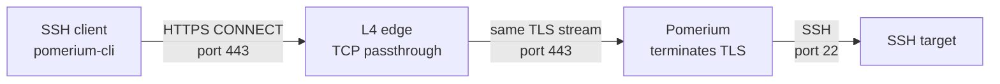

import NginxConf from '!!raw-loader!@site/content/examples/ssh-tcp-l4-passthrough/nginx/nginx.conf';

import CodeBlock from '@theme/CodeBlock';

{/* cSpell:ignore sshpass testuser */}

# SSH over port 443 through an L4 edge

This guide shows how to tunnel SSH through Pomerium when users can only make outbound connections on port 443 and Pomerium sits behind a reverse proxy, WAF, or load balancer.

For most SSH deployments, [Native SSH Access](/docs/capabilities/native-ssh-access) provides a better user experience with OAuth login, ephemeral certificates, and SSH-aware access controls. Use this TCP tunneling pattern when SSH must travel over the same HTTPS port as other Pomerium traffic, when you cannot change SSH server configuration, or when you need the same pattern for other TCP protocols.

The key configuration detail is that the port in `from: tcp+https://HOST:PORT` is the **route-match port** carried in the HTTP CONNECT authority. It is not the user's network egress port. For a normal SSH destination, use `:22` in the TCP route and let `pomerium-cli` reach Pomerium over HTTPS on port 443.

## Recommended architecture



Use L4/TCP passthrough between the public edge and Pomerium. The edge forwards the TCP byte stream to Pomerium unchanged, Pomerium terminates TLS, and Pomerium receives the CONNECT request from `pomerium-cli`.

If the fronting layer includes a WAF, either create an L4 passthrough exception for this hostname or use an L7 mode that explicitly supports CONNECT tunneling and preserves the CONNECT authority. HTTP WAFs generally cannot inspect this tunnel and preserve it at the same time; use a separate L4 path for SSH TCP routes.

If Pomerium is exposed directly on port 443, drop the L4 edge from the diagram. The TCP route and SSH client configuration stay the same.

## Production route and SSH config

Use the destination service port in the TCP route `from` URL:

```yaml
routes:
  - from: tcp+https://ssh.example.com:22
    to: tcp://target.internal.example.com:22
    policy:
      - allow:
          and:
            - authenticated_user: true
            # Add group, device, MFA, or claim requirements here.
```

See [Pomerium Policy Language](/docs/internals/ppl) for full policy syntax.

Use the same destination in SSH:

```ssh-config
Host ssh-prod
  HostName ssh.example.com
  Port 22
  User testuser
  ProxyCommand pomerium-cli tcp --listen - %h:%p
```

With this configuration:

- `%h:%p` becomes `ssh.example.com:22`.
- `pomerium-cli` connects to Pomerium over HTTPS on port 443 and sends `CONNECT ssh.example.com:22`.
- Pomerium matches `from: tcp+https://ssh.example.com:22`.
- Pomerium connects to `target.internal.example.com:22`.

Pass `--pomerium-url https://pomerium.example.com` if Pomerium is not reachable at the SSH hostname on port 443. The URL should point to the Pomerium edge endpoint that accepts the TCP route.

:::note Route-match port

The route-match port can be `:443` if your SSH client intentionally requests `ssh.example.com:443`, for example with `ssh -p 443`. Do not use `:443` only because the user's outbound firewall allows port 443. Most SSH configurations should keep `Port 22` and `from: tcp+https://ssh.example.com:22`.

:::

## Prerequisites

For the local example, install:

- Docker Compose v2
- OpenSSL
- Git

## Run the local example

The runnable example lives in [`content/examples/ssh-tcp-l4-passthrough`](https://github.com/pomerium/documentation/tree/main/content/examples/ssh-tcp-l4-passthrough). It runs NGINX in TCP passthrough mode, Pomerium, an SSH target, and a client container with `pomerium-cli`.

The Compose file uses Docker network aliases so `ssh.localhost.pomerium.io` resolves to the NGINX L4 edge inside the example network. In production, point your real DNS name at the L4 edge.

1. Clone the docs repository and enter the example directory.

   ```bash
   git clone https://github.com/pomerium/documentation
   cd documentation/content/examples/ssh-tcp-l4-passthrough
   ```

1. Generate a demo CA and server certificate.

   ```bash
   ./gen-certs.sh
   ```

   The script writes a local demo CA and a server certificate for `ssh.localhost.pomerium.io`, then deletes the CA private key. In production, use a publicly trusted certificate or your organization's managed trust chain.

1. Review the demo TCP route in `config/pomerium.yaml`.

   ```yaml
   routes:
     - from: tcp+https://ssh.localhost.pomerium.io:22
       to: tcp://sshd:2222
       allow_public_unauthenticated_access: true
   ```

   The route is public in this example because we're mainly interested in demonstrating connectivity over port 443. In production, you'll want to configure a real IdP and policy rules.

1. Start the stack.

   ```bash
   docker compose up -d --build
   docker compose ps
   ```

1. Start a local `pomerium-cli` listener in the client container.

   ```bash
   docker compose exec -d client sh -lc \
     'pomerium-cli tcp ssh.localhost.pomerium.io:22 \
       --alternate-ca-path /certs/ca.crt \
       --browser-cmd /bin/true \
       --listen 127.0.0.1:2222 \
       >/tmp/pomerium-cli.log 2>&1'
   ```

   `--browser-cmd /bin/true` suppresses browser launch in the headless client container. Do not copy it into production commands that need interactive login. Production SSH `ProxyCommand` configuration usually uses `--listen -` instead.

   In this local stack, `pomerium-cli` dials `ssh.localhost.pomerium.io:443`, and Docker resolves that hostname to the `nginx` L4 edge.

1. Run an SSH command through the tunnel.

   ```bash
   docker compose exec client sh -lc \
     "sshpass -p demo-password ssh \
       -o StrictHostKeyChecking=no \
       -o LogLevel=ERROR \
       -p 2222 demo@127.0.0.1 \
       'hostname; whoami; uname -srm'"
   ```

   Expected output:

   ```text
   sshd
   demo
   Linux 6.19.13-orbstack-gbd1dc07b8cf4 aarch64
   ```

   The kernel version will vary by Docker host.

   Inside the client container, this is plain SSH to the local listener on `127.0.0.1:2222`. `pomerium-cli` carries that connection to Pomerium over HTTPS on port 443.

## Verify the path

Check the Pomerium authorization log. This shows the CONNECT authority Pomerium used to match the route:

```bash
docker compose logs --tail=100 pomerium \
  | grep '"service":"authorize"' \
  | grep '"method":"CONNECT"'
```

Look for these fields:

```json
"host":"ssh.localhost.pomerium.io:22"
"allow":true
```

Check the Pomerium access log for the successful tunnel:

```bash
docker compose logs --tail=100 pomerium \
  | grep '"method":"CONNECT"' \
  | grep '"response-code":200'
```

Check that bytes crossed the L4 edge:

```bash
docker compose logs --tail=100 nginx \
  | grep -E 'bytes_sent=[0-9]{3,} bytes_received=[0-9]{3,}'
```

For log field definitions, see [Authorize Log Fields](/docs/reference/authorize-log-fields) and [Access Log Fields](/docs/reference/access-log-fields).

## Configure the L4 edge

For NGINX, use `stream {}` for L4 passthrough:

<CodeBlock language="nginx" title="nginx/nginx.conf">
  {NginxConf}
</CodeBlock>

NGINX OSS `stream`, NGINX Plus TCP/UDP load balancing, HAProxy `mode tcp`, AWS Network Load Balancer, Google Cloud passthrough Network Load Balancer, and F5 LTM FastL4 are examples of this pattern.

Set the TCP proxy timeout long enough for idle SSH sessions in your environment. The example uses `proxy_timeout 1h;`; production deployments may need a longer or shorter value.

In dynamic environments, make sure your L4 edge follows your platform's normal service-discovery behavior if the Pomerium upstream address changes.

### Preserve client IP

If your L4 edge supports PROXY protocol and you need the original client IP in Pomerium logs or policy decisions, enable it on both sides:

```nginx
stream {
    server {
        listen 443;
        proxy_pass pomerium:443;
        proxy_protocol on;
    }
}
```

Then enable Pomerium's [`use_proxy_protocol`](/docs/reference/use-proxy-protocol) setting:

```yaml
use_proxy_protocol: true
```

Only enable this when every connection to the Pomerium listener comes from a PROXY-protocol-speaking edge. Direct clients that do not send the PROXY header will fail.

## Troubleshoot `route_not_found`

If Pomerium logs a CONNECT request with `response-code-details="route_not_found"`, the tunnel reached Pomerium but no TCP route matched the CONNECT authority.

This route:

```yaml
from: tcp+https://ssh.example.com:443
to: tcp://target.internal.example.com:22
```

matches:

```text
CONNECT ssh.example.com:443
```

It does not match:

```text
CONNECT ssh.example.com:22
```

For a normal SSH destination, the fix is to use `:22` in both the TCP route `from` URL and the SSH destination, while keeping the Pomerium HTTPS transport on port 443. The same logic applies to any other route-match port, such as `:10443`.

## Clean up

```bash
docker compose down -v
rm -f certs/ca.crt certs/ca.key certs/ca.srl certs/pomerium.crt certs/pomerium.csr certs/pomerium.key
```

## More resources

- [TCP over HTTP support](/docs/capabilities/non-http/tcp)
- [Tunneled SSH Connections](/docs/capabilities/non-http/examples/ssh)
- [Native SSH Access](/docs/capabilities/native-ssh-access)
