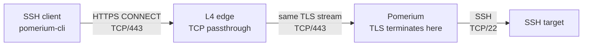

{/* cSpell:ignore Acreateserial extfile nslookup sshpass testuser */}

# SSH over TCP/443 through an L4 edge

This guide shows how to tunnel SSH through Pomerium when users can only make outbound connections on TCP/443 and Pomerium sits behind a reverse proxy, WAF, or load balancer.

For most SSH deployments, [Native SSH Access](/docs/capabilities/native-ssh-access) provides a better user experience with OAuth login, ephemeral certificates, and SSH-aware access controls. Use this TCP tunneling pattern when you need SSH to travel over the same HTTPS/TCP 443 path as other Pomerium traffic, cannot change SSH server configuration, or need the same pattern for other TCP protocols.

The key configuration detail is that the port in `from: tcp+https://HOST:PORT` is the **route-match port** carried in the HTTP CONNECT authority. It is not the user's network egress port. For SSH, use `:22` in the TCP route and let `pomerium-cli` reach Pomerium over HTTPS/TCP 443.

## Recommended architecture



Use L4/TCP passthrough between the public edge and Pomerium. The edge forwards the TCP byte stream to Pomerium unchanged, Pomerium terminates TLS, and Pomerium receives the CONNECT request from `pomerium-cli`.

If the fronting layer includes a WAF, either create an L4 passthrough exception for this hostname or use an L7 mode that explicitly supports CONNECT tunneling and preserves the CONNECT authority. HTTP WAFs generally cannot inspect this tunnel and preserve it at the same time; use a separate L4 path for SSH TCP routes.

If Pomerium is exposed directly on TCP/443, drop the L4 edge from the diagram. The TCP route and SSH client configuration stay the same.

## Prerequisites

For the local verification stack, install:

- Docker Compose v2
- OpenSSL
- Git

The example does not require a host Pomerium CLI, a host SSH key, `/etc/hosts` changes, or a local IdP. The client container includes `pomerium-cli` and the SSH client.

The example uses floating `latest` container tags so the verification follows current releases. For production deployments, pin images according to your normal release process.

This guide was verified on May 14, 2026 with `pomerium/pomerium:v0.32.7` and `pomerium/cli:v0.32.2`.

## Run the local verification stack

The runnable example lives in [`static/examples/ssh-tcp-l4-passthrough`](https://github.com/pomerium/documentation/tree/main/static/examples/ssh-tcp-l4-passthrough). It keeps the Pomerium and NGINX configuration in normal files so each piece is easy to inspect.

1. Clone the docs repository and enter the example directory.

   ```bash
   git clone https://github.com/pomerium/documentation
   cd documentation/static/examples/ssh-tcp-l4-passthrough
   ```

1. Generate a demo CA and server certificate.

   ```bash
   mkdir -p certs

   openssl genrsa -out certs/ca.key 4096
   openssl req -x509 -new -nodes -days 365 \
     -key certs/ca.key \
     -out certs/ca.crt \
     -subj "/CN=localhost.pomerium.io demo CA"

   openssl genrsa -out certs/pomerium.key 2048
   openssl req -new \
     -key certs/pomerium.key \
     -out certs/pomerium.csr \
     -config certs/openssl.cnf

   openssl x509 -req -days 365 \
     -in certs/pomerium.csr \
     -CA certs/ca.crt \
     -CAkey certs/ca.key \
     -CAcreateserial \
     -out certs/pomerium.crt \
     -extensions v3_req \
     -extfile certs/openssl.cnf

   rm certs/ca.key certs/ca.srl certs/pomerium.csr
   ```

   The CA is only for this local demo. In production, use a publicly trusted certificate or your organization's managed trust chain. If you revisit the example after the certificate expires, rerun this step.

1. Review the demo TCP route in `config/pomerium.yaml`.

   ```yaml
   routes:
     - from: tcp+https://ssh.localhost.pomerium.io:22
       to: tcp://sshd:2222
       allow_public_unauthenticated_access: true
   ```

   The route is public so the stack can verify the TCP/443 transport, CONNECT request, route match, L4 passthrough, and SSH tunnel without an external IdP. The demo `authenticate_service_url` loops back into this local stack and is safe only because the route is public. If you remove `allow_public_unauthenticated_access` without adding a real IdP, login will fail. Use normal Pomerium authentication and policy for production.

1. Start the stack.

   ```bash
   docker compose up -d --build
   docker compose ps
   ```

1. Confirm that the client resolves the SSH hostname to the L4 edge and can reach it on TCP/443.

   ```bash
   docker compose exec -T client \
     nslookup ssh.localhost.pomerium.io

   docker compose exec -T client \
     nc -z ssh.localhost.pomerium.io 443
   ```

   `nslookup` should return the `nginx` container's IP on the Compose network. The `nc` command should exit successfully with no output.

1. Start a local `pomerium-cli` listener in the client container.

   ```bash
   docker compose exec -d client sh -lc \
     'pomerium-cli tcp ssh.localhost.pomerium.io:22 \
       --alternate-ca-path /certs/ca.crt \
       --browser-cmd /bin/true \
       --listen 127.0.0.1:2222 \
       >/tmp/pomerium-cli.log 2>&1'
   ```

   The demo uses a long-lived listener because the commands run one at a time. `--browser-cmd /bin/true` suppresses browser launch in the headless client container; do not copy it into production commands that need interactive login. Production SSH `ProxyCommand` configuration usually uses `--listen -` instead.

   In this local stack, `pomerium-cli` dials `ssh.localhost.pomerium.io:443`, and Docker resolves that hostname to the `nginx` L4 edge. In production, use `--pomerium-url` when the SSH hostname and the Pomerium edge hostname are different.

1. Wait for the listener, then SSH through the tunnel.

   ```bash
   docker compose exec -T client sh -lc \
     'for i in $(seq 1 100); do
        nc -z 127.0.0.1 2222 && exit 0
        sleep 0.2
      done
      cat /tmp/pomerium-cli.log
      exit 1'

   docker compose exec -T client sh -lc \
     "sshpass -p demo-password ssh \
       -o StrictHostKeyChecking=no \
       -o UserKnownHostsFile=/dev/null \
       -o LogLevel=ERROR \
       -p 2222 demo@127.0.0.1 \
       'echo TUNNEL-OK; whoami; uname -srm'"
   ```

   Expected output:

   ```text
   TUNNEL-OK
   demo
   Linux ...
   ```

## Verify the path

Check the Pomerium authorization log. This shows the CONNECT authority Pomerium used to match the route:

```bash
docker compose logs --tail=100 pomerium \
  | grep '"service":"authorize"' \
  | grep '"method":"CONNECT"'
```

Look for these fields:

```json
"host":"ssh.localhost.pomerium.io:22"
"allow":true
```

Check the Pomerium access log for the successful tunnel:

```bash
docker compose logs --tail=100 pomerium \
  | grep '"method":"CONNECT"' \
  | grep '"response-code":200'
```

Check that bytes crossed the L4 edge:

```bash
docker compose logs --tail=100 nginx \
  | grep -E 'bytes_sent=[0-9]{3,} bytes_received=[0-9]{3,}'
```

You might also see an unrelated `GET` from `pomerium-cli` with `"response-code":404`. Ignore that entry; the successful proof is the `CONNECT` log.

For log field definitions, see [Authorize Log Fields](/docs/reference/authorize-log-fields) and [Access Log Fields](/docs/reference/access-log-fields).

## Apply the pattern to production

Use the destination service port in the TCP route `from` URL:

```yaml
routes:
  - from: tcp+https://ssh.example.com:22
    to: tcp://target.internal.example.com:22
    policy:
      - allow:
          and:
            - authenticated_user: true
```

The `and` block is shown so you can add group, device, MFA, or claim requirements under the same policy. See [Pomerium Policy Language](/docs/internals/ppl) for full policy syntax.

Use the same destination in SSH:

```ssh-config
Host ssh-prod
  HostName ssh.example.com
  Port 22
  User testuser
  ProxyCommand pomerium-cli tcp --listen - %h:%p --pomerium-url https://pomerium.example.com
```

With this configuration:

- `%h:%p` becomes `ssh.example.com:22`.
- `pomerium-cli` sends `CONNECT ssh.example.com:22`.
- `--pomerium-url https://pomerium.example.com` tells the CLI which Pomerium edge endpoint to dial. With no explicit port, HTTPS uses TCP/443.
- Pomerium matches `from: tcp+https://ssh.example.com:22`.
- Pomerium connects to `target.internal.example.com:22`.

If `ssh.example.com` resolves directly to the Pomerium edge on TCP/443 and the edge serves a certificate valid for `ssh.example.com`, the `--pomerium-url` override is optional. Keep it when the SSH destination hostname and the Pomerium edge hostname are different.

Do not set the SSH `Port` to `443` just to satisfy an outbound firewall rule. SSH `Port` becomes the CONNECT authority and therefore the Pomerium route-match port. The outbound firewall requirement is satisfied by the Pomerium HTTPS URL, which defaults to TCP/443.

## Fronting proxy example

For NGINX, use `stream {}` for L4 passthrough:

```nginx
events {}

stream {
    server {
        listen 443;
        proxy_pass pomerium:443;
        proxy_timeout 1h;
    }
}
```

NGINX OSS `stream`, NGINX Plus TCP/UDP load balancing, HAProxy `mode tcp`, AWS Network Load Balancer, Google Cloud passthrough Network Load Balancer, and F5 LTM FastL4 are examples of this pattern.

Set the TCP proxy timeout long enough for idle SSH sessions in your environment. The example uses `proxy_timeout 1h;`; production deployments may need a longer or shorter value.

In dynamic environments, make sure your L4 edge follows your platform's normal service-discovery behavior if the Pomerium upstream address changes.

### Preserve client IP

If your L4 edge supports PROXY protocol and you need the original client IP in Pomerium logs or policy decisions, enable it on both sides:

```nginx
stream {
    server {
        listen 443;
        proxy_pass pomerium:443;
        proxy_protocol on;
    }
}
```

Then enable Pomerium's bootstrap [`use_proxy_protocol`](/docs/reference/use-proxy-protocol) setting:

```yaml
use_proxy_protocol: true
```

Only enable this when every connection to the Pomerium listener comes from a PROXY-protocol-speaking edge. Direct clients that do not send the PROXY header will fail.

## Why `:443` in `from` does not work for SSH

This route:

```yaml
from: tcp+https://ssh.example.com:443
to: tcp://target.internal.example.com:22
```

matches:

```text
CONNECT ssh.example.com:443
```

It does not match:

```text
CONNECT ssh.example.com:22
```

For SSH, the fix is to use `:22` in both the TCP route `from` URL and the SSH destination, while keeping the Pomerium HTTPS transport on TCP/443. The same logic applies to any other non-`:22` route-match port, such as `:10443`.

## Clean up

```bash
docker compose down -v
rm -f certs/ca.crt certs/ca.key certs/ca.srl certs/pomerium.crt certs/pomerium.csr certs/pomerium.key
```

## More resources

- [TCP over HTTP support](/docs/capabilities/non-http/tcp)
- [Tunneled SSH Connections](/docs/capabilities/non-http/examples/ssh)
- [Native SSH Access](/docs/capabilities/native-ssh-access)
