# Secure Synology NAS with Pomerium

## What this guide does

You'll run Pomerium in Docker on a [Synology](https://www.synology.com/en-us/dsm) network attached storage (NAS) device so the self-hosted apps on that NAS sit behind single sign-on and per-route authorization. Pomerium authenticates every request against your identity provider (IdP) before it reaches an app, which lets you expose services to the internet by subdomain (for example `httpbin.int.nas.example`) without a VPN and without relying on each app's own login.

Pomerium is lightweight: a single instance typically uses well under 50 MB of memory and very little CPU, so it runs comfortably alongside your other containers on the NAS.

## When to use this guide

Use it when you have a [Docker-capable Synology](https://www.synology.com/en-us/dsm/packages/Docker) NAS and want one authenticated front door for its web apps. Synology is its own deployment environment: DiskStation Manager (DSM), Synology's operating system, terminates TLS with its built-in nginx and forwards traffic to Pomerium, and you control internet exposure with a port-forward on your router. That hardware and router setup can't be reproduced in a generic Docker host, so this guide is written as a single Synology-specific path rather than the usual Zero/Core tabs.

## Prerequisites

This guide assumes you understand the basics of running Pomerium. If you're new, start with the [Quickstart](/docs/get-started/quickstart).

You also need:

- A [Docker-capable Synology](https://www.synology.com/en-us/dsm/packages/Docker) product with DSM.
- A configured [identity provider](/docs/integrations/user-identity/identity-providers). This guide uses Google, but any supported provider works.
- A subdomain you control for each app (for example `httpbin.int.nas.example`) plus an `authenticate.<your-domain>` subdomain for Pomerium's own authenticate service, all with DNS pointing at your NAS.
- A wildcard [TLS certificate](/docs/internals/certificates-and-tls) covering those subdomains. DSM's built-in Let's Encrypt support does not issue wildcard certificates (those need DNS validation), so generate one separately if you don't already have it.

:::tip Prefer to self-host the identity provider?

This guide uses your IdP's hosted endpoints so you don't have to run one yourself. To run your own instead, follow [Keycloak + Pomerium](/docs/integrations/user-identity/oidc) and use those `idp_*` values below.

:::

## Configure the router

Forward inbound HTTPS traffic from port `443` on your router to a high port on the NAS (this guide uses `8443`). DSM will listen on that port and hand requests to Pomerium. The exact screens vary by router model.

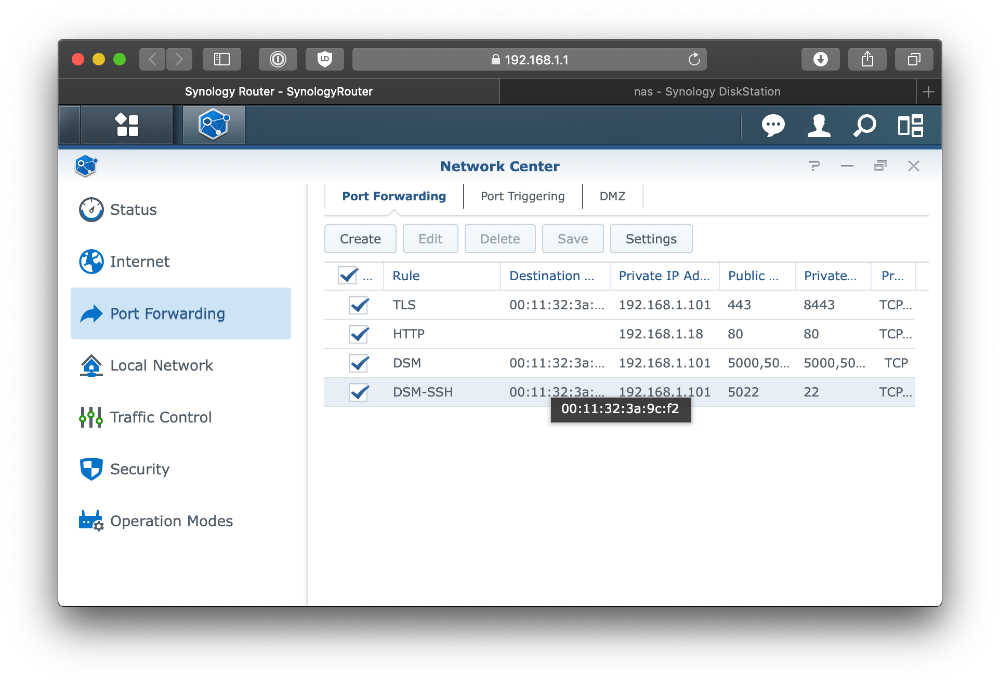

## Configure DSM

DSM uses nginx under the hood to proxy incoming requests. Configure it to terminate TLS and forward to the port Pomerium will listen on.

### Reverse proxy

Go to **Control Panel** > **Application Portal** > **Reverse Proxy** and click **Create**. Set these rules:

| Field                | Value     |
| -------------------- | --------- |
| Description          | pomerium  |
| Source Protocol      | HTTPS     |
| Source Hostname      | \*        |
| Source Port          | 8443      |
| HTTP/2               | Enabled   |
| HSTS                 | Enabled   |
| Destination Protocol | HTTP      |
| Destination Hostname | localhost |
| Destination Port     | 32443     |

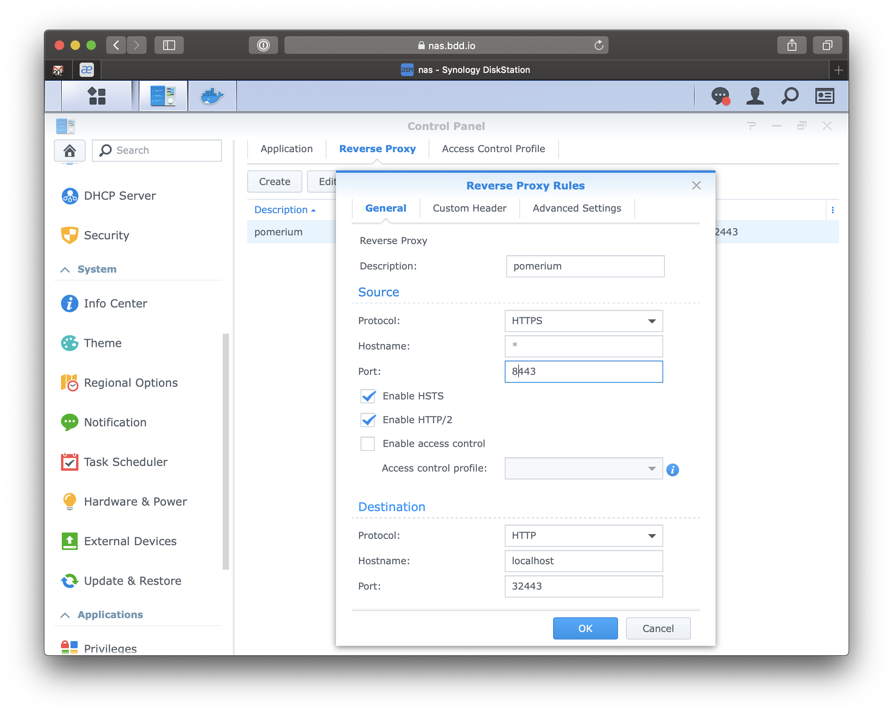

This forwards incoming HTTPS traffic to the Pomerium container, which you'll publish on port `32443` later.

### Certificate

Go to **Control Panel** > **Security** > **Certificate**, then **Add** > **Import certificate** and import your wildcard certificate chain. Once it appears in the list, click **Configure** and assign it to the reverse-proxy service so DSM uses it for traffic on `8443`:

| Service | Certificate         |
| ------- | ------------------- |
| \*:8443 | `*.int.nas.example` |

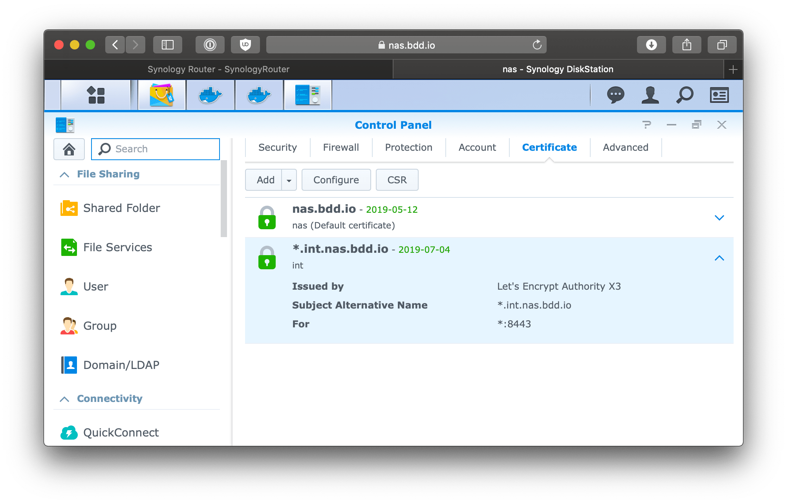

## Configure the upstream app

Pick any app on your NAS to protect. This guide uses [httpbin](https://httpbin.org), a small test server, but it could be any [self-hosted app](https://github.com/awesome-selfhosted/awesome-selfhosted): a wiki, a download client, Plex, and so on.

In the DSM **Container Manager** (formerly **Docker**), open the **Registry**, search for `kennethreitz/httpbin`, and download it. Then go to **Image**, select it, and launch a container named `httpbin`, keeping the defaults. This runs a small web server on port `80`; the container name becomes the network alias Pomerium routes to.

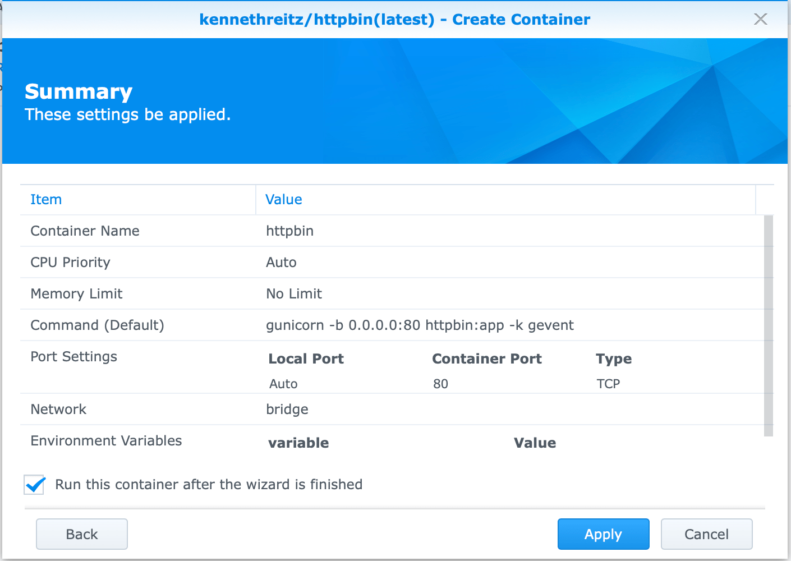

## Configure Pomerium

Download the official `pomerium/pomerium` image from the DSM **Registry**.

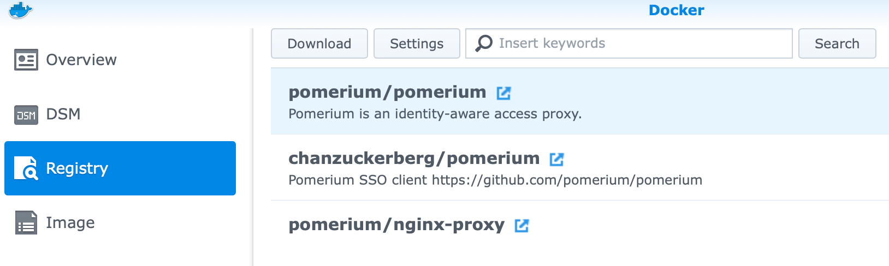

### Write the route policy

Create a `route.yaml` on your workstation. This routes `httpbin.int.nas.example` to the `httpbin` container and allows a single user; everyone else is denied and any other host returns a `404`. Replace the host with your subdomain and the email with your own.

```yaml
# route.yaml
- from: https://httpbin.int.nas.example
  to: http://httpbin
  pass_identity_headers: true
  policy:
    - allow:
        or:
          - email:
              is: you@example.com
```

`from` is the public subdomain DSM forwards to Pomerium; `to` is the container alias on the Docker network. `pass_identity_headers: true` forwards the authenticated user's identity to the app so it can read who is signed in. The file is a bare list because the `ROUTES` environment variable is the base64-encoded value of the `routes` key (if you mount a config file instead, wrap the same list under a top-level `routes:` key).

### Launch the container

In **Image**, select **pomerium/pomerium** and click **Launch**, naming the container `pomerium`. Open **Advanced Settings** and configure:

- **Port Settings:** map local port `32443` to container port `443` (TCP). This is the port DSM's reverse proxy forwards to.

  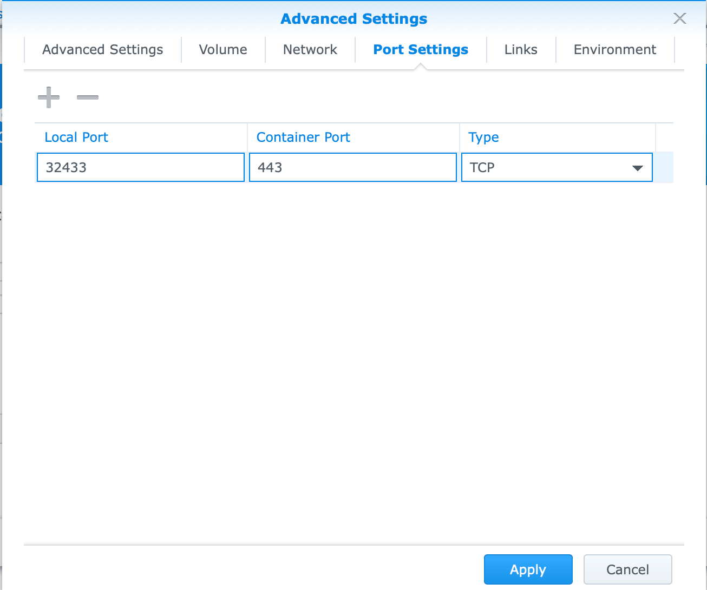

- **Links:** add a link to the `httpbin` container with the alias `httpbin`.

  :::caution

  The alias must match the host in your route's `to` value, or Pomerium can't reach the app.

  :::

  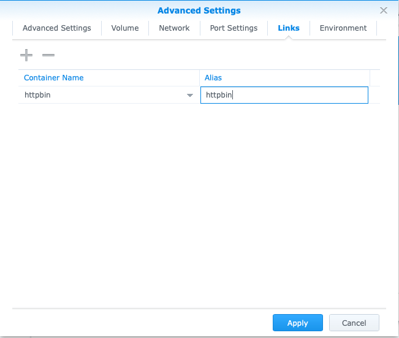

- **Environment:** set the variables below.

  | Variable | Value |
  | --- | --- |
  | `ROUTES` | single-line base64 of your route file, from `base64 -w0 route.yaml` (on macOS, `base64 -i route.yaml` is already one line) |
  | `INSECURE_SERVER` | `TRUE` (routing inside the Docker network is not re-encrypted) |
  | `AUTHENTICATE_SERVICE_URL` | `https://authenticate.int.nas.example` |
  | `IDP_PROVIDER` | your provider, e.g. `google` |
  | `IDP_CLIENT_ID` | from your [identity provider](/docs/integrations/user-identity/identity-providers) |
  | `IDP_CLIENT_SECRET` | from your [identity provider](/docs/integrations/user-identity/identity-providers) |
  | `COOKIE_SECRET` | output of `head -c32 /dev/urandom \| base64` |
  | `SHARED_SECRET` | output of `head -c32 /dev/urandom \| base64` |

The `ROUTES` value must be a single line, so use `-w0` on GNU systems to avoid the line wrapping that breaks pasting into the DSM environment field. These are the minimum settings for this deployment. For every option, see the [configuration reference](/docs/reference). Settings can also be supplied via a mounted config file instead of environment variables.

Click **Launch**. If everything is configured correctly the container starts and stays running; if not, check the container's **Log** tab.

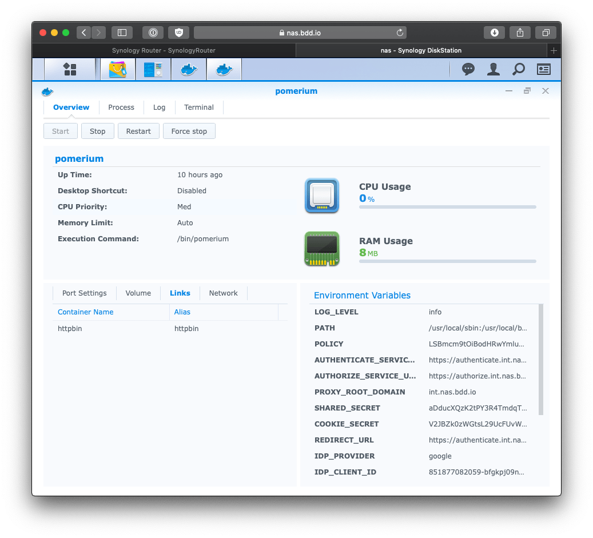

## Verify the setup

1. **The route requires authentication.** In a fresh browser, open `https://httpbin.int.nas.example`. You should be redirected to your identity provider, not straight into the app.

   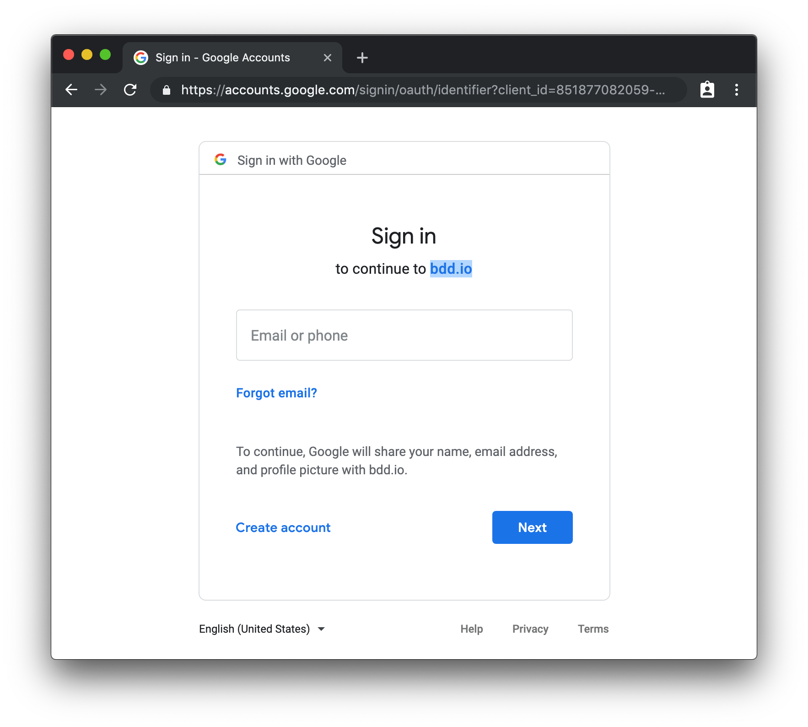

2. **An allowed user gets in.** Sign in (completing multi-factor authentication if your IdP requires it). Pomerium redirects you back to httpbin.

   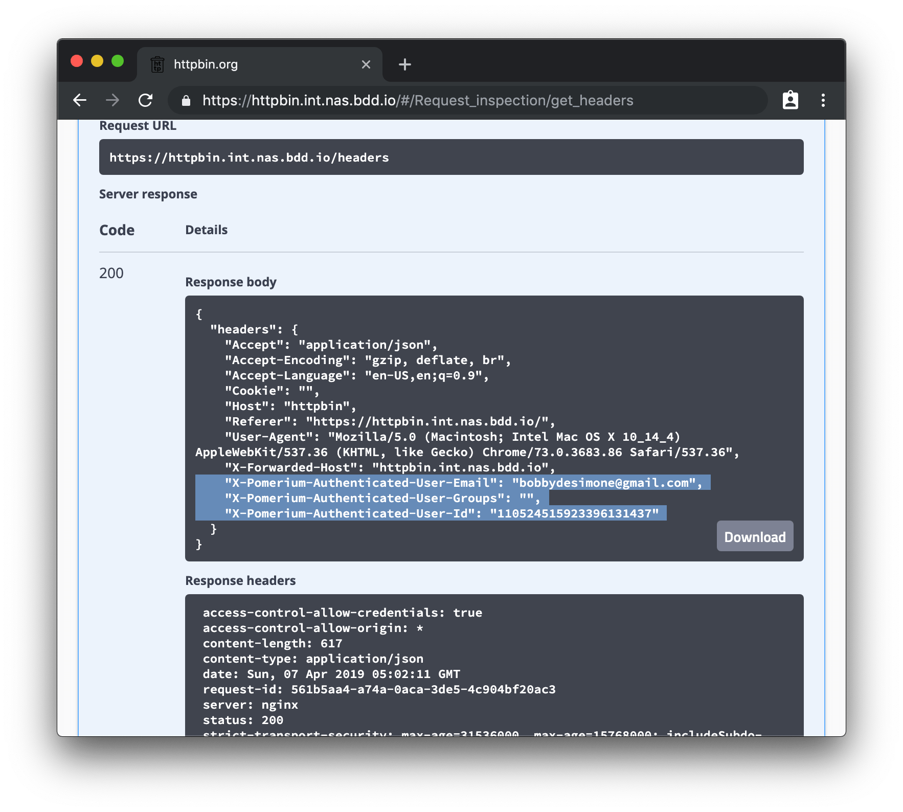

3. **Identity is available.** Open `https://httpbin.int.nas.example/.pomerium/` to see the signed-in user Pomerium is forwarding.

   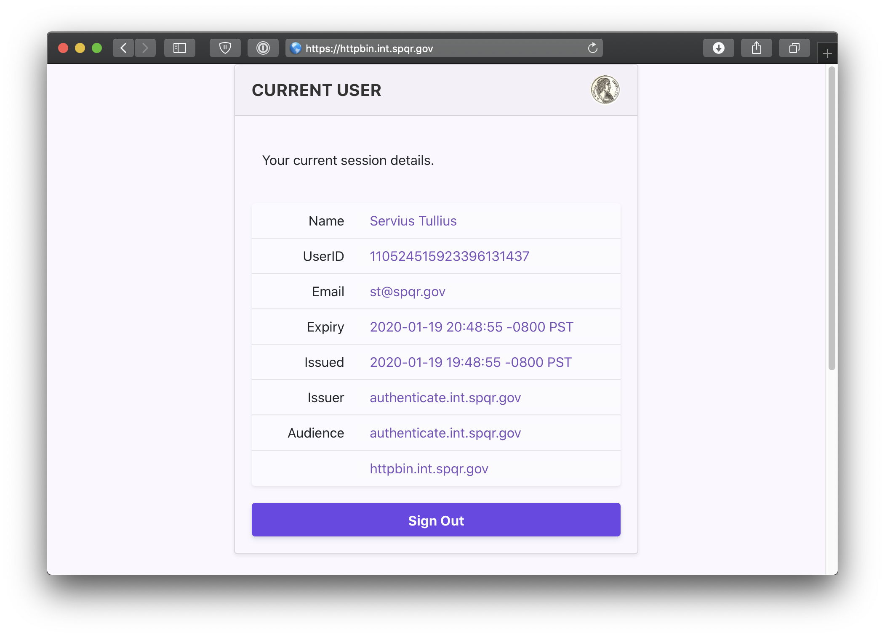

4. **An unauthorized user is denied.** Sign in with an account your policy doesn't allow. You should get a `403`.

   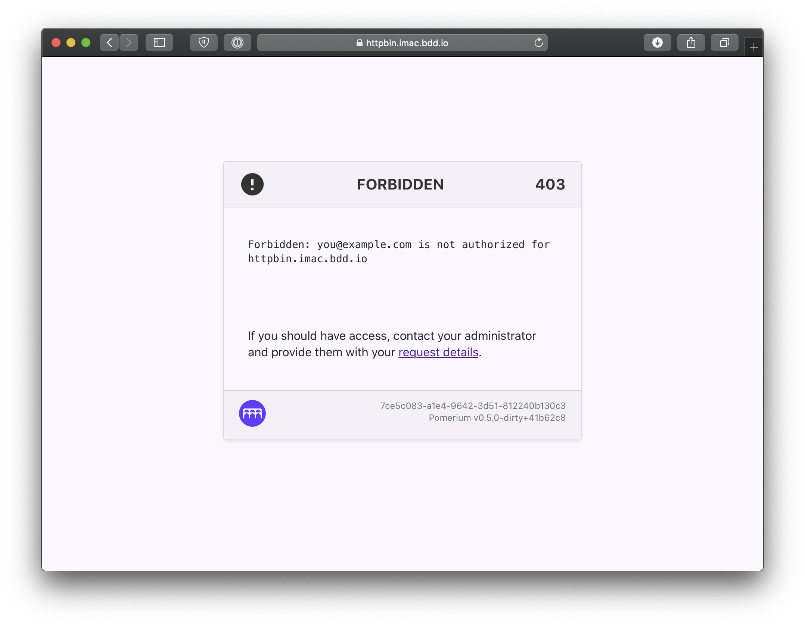

## Common failure modes

- **Certificate or TLS errors in the browser.** DSM must serve your wildcard certificate on `8443`. Confirm the certificate is imported and assigned to the `*:8443` service, and that DNS for the subdomain resolves to your NAS.
- **`502` or connection refused after login.** Pomerium can't reach the upstream. Check the **Links** alias matches the `to` host in `route.yaml` and that the app container is running.
- **Redirect loop or `authenticate` errors.** `AUTHENTICATE_SERVICE_URL` must be a hostname covered by your wildcard certificate and reachable through the same DSM reverse proxy.
- **Everything returns `404`.** The requested host doesn't match any route's `from`. Verify the subdomain and the base64-encoded `ROUTES` value.

## Security considerations

- With `pass_identity_headers` enabled, the upstream app trusts the identity Pomerium forwards, so the app **must not be reachable except through Pomerium**. Keep the upstream container off published NAS ports and only link it to Pomerium on the internal Docker network. The only port exposed to the router should be the one DSM forwards to Pomerium.
- Scope each route's policy to the specific users, groups, or domain that should have access. The example allows a single email; widen it deliberately, not by default.
- `INSECURE_SERVER=TRUE` only disables re-encryption inside the Docker network on the NAS. External traffic is still TLS-terminated by DSM, so don't expose the `32443` container port to the internet.

## Operations

- **Pin the image.** Launch a specific `pomerium/pomerium` tag rather than `latest` so a registry update can't change your proxy out from under you. Update on your own schedule by pulling the new tag and recreating the container.
- **Update a route.** Edit `route.yaml`, regenerate the base64 value, and update the container's `ROUTES` environment variable; DSM recreates the container with the new policy.
- **Rotate secrets.** Rotating `COOKIE_SECRET` invalidates existing sessions and forces every user to sign in again. Rotate `SHARED_SECRET` and `COOKIE_SECRET` together if either may be exposed.
- **Tear down.** Stop and remove the `pomerium` and `httpbin` containers in Container Manager, then delete the DSM reverse-proxy rule and the router port-forward to stop exposing the service.

## Validation

This guide is hardware-specific. It depends on Synology DSM, its built-in nginx reverse proxy, the DSM certificate store, and a physical router port-forward, none of which can run in the sealed Docker validation harness the other guides use. It is validated manually on a DSM device, and `content/examples/guides/synology/validate/SKIP` records why there is no automated fixture.

## Next steps

- [Build policies](/docs/get-started/fundamentals/core/build-policies)
- [Pass identity headers](/docs/reference/routes/pass-identity-headers-per-route)
- [Identity providers](/docs/integrations/user-identity/identity-providers)
