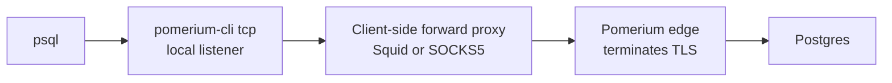

import ComposeFile from '!!raw-loader!@site/content/examples/tcp-forward-proxy/docker-compose.yml';
import SquidConf from '!!raw-loader!@site/content/examples/tcp-forward-proxy/squid/squid.conf';

import CodeBlock from '@theme/CodeBlock';

# Connect through a client-side forward proxy

This guide shows how to use `pomerium-cli tcp` from a network whose only outbound path is an HTTP or SOCKS5 forward proxy, such as a corporate egress proxy. The `--forward-proxy` flag routes the tunnel through that proxy to reach Pomerium. The local example tunnels to a Postgres database and runs `psql` over the tunnel.

This is about the client's egress path. It is different from [Proxy chaining support](/docs/capabilities/non-http/tcp#proxy-chaining-support), which puts a second proxy behind Pomerium.

## How it works



The forward proxy connects `pomerium-cli` to the Pomerium edge, not to the upstream service. Write proxy allowlists and `NO_PROXY` entries for the Pomerium edge hostname, not for the database. For flag and environment-variable precedence and the supported proxy URL forms, see [Connect through a client-side forward proxy](/docs/capabilities/non-http/tcp#forward-proxy) in the TCP reference.

:::info Requires pomerium-cli vX.Y or later

Proxy-aware tunneling was added to `pomerium-cli` in vX.Y. Check your client with `pomerium-cli tcp --help | grep forward-proxy` and upgrade if `--forward-proxy` is not listed.

:::

## Prerequisites

- Docker Compose v2
- OpenSSL
- Git

## Run the local example

The runnable example lives in [`content/examples/tcp-forward-proxy`](https://github.com/pomerium/documentation/tree/main/content/examples/tcp-forward-proxy). It runs Postgres, Pomerium, a [Squid](http://www.squid-cache.org/) HTTP proxy, a SOCKS5 proxy, and a client container with `pomerium-cli` and `psql`. The client reaches a proxy by name, and the proxy reaches the Pomerium edge by its Docker network alias.

1. Clone the docs repository and enter the example directory.

   ```bash
   git clone https://github.com/pomerium/documentation
   cd documentation/content/examples/tcp-forward-proxy
   ```

1. Generate a self-signed certificate for the demo hostnames.

   ```bash
   ./gen-certs.sh
   ```

   The script writes a self-signed certificate for `*.localhost.pomerium.io` that `pomerium-cli` trusts with `--alternate-ca-path`. In production, use a publicly trusted certificate or your organization's managed trust chain.

1. Review the routes in `config/pomerium.yaml`. One public route demonstrates the tunnel; one policy-gated route demonstrates enforcement.

   ```yaml
   routes:
     - from: tcp+https://pgsql.localhost.pomerium.io:5432
       to: tcp://postgres:5432
       allow_public_unauthenticated_access: true
     - from: tcp+https://secure.localhost.pomerium.io:5432
       to: tcp://postgres:5432
       policy:
         - allow:
             and:
               - authenticated_user: true
   ```

   :::caution Lab-only public route

   The first route is public so the lab needs no identity provider. Do not use `allow_public_unauthenticated_access` for production TCP services. See [Require authentication in production](#require-authentication-in-production).

   :::

1. Start the stack.

   ```bash
   docker compose up -d --build
   docker compose ps
   ```

1. Open the tunnel through the HTTP proxy.

   ```bash
   docker compose exec -d client sh -lc \
     'pomerium-cli tcp pgsql.localhost.pomerium.io:5432 \
       --pomerium-url https://proxy.localhost.pomerium.io \
       --alternate-ca-path /certs/pomerium.crt \
       --forward-proxy http://squid:3128 \
       --browser-cmd /bin/true \
       --listen 127.0.0.1:5432 \
       >/tmp/pomerium-cli.log 2>&1'
   ```

   `--browser-cmd /bin/true` suppresses the browser launch in the headless client container; drop it for interactive use. The public lab route never triggers a login.

1. Run a query through the tunnel. `PGPASSWORD` is fine for this throwaway lab; prefer `~/.pgpass` or a prompt elsewhere.

   ```bash
   docker compose exec client sh -lc \
     'PGPASSWORD=postgres psql -h 127.0.0.1 -p 5432 -U postgres <<SQL
   create table demo (id int primary key, note text);
   insert into demo values (1, '\''through pomerium-cli and a forward proxy'\'');
   select * from demo;
   drop table demo;
   SQL'
   ```

   ```text
   CREATE TABLE
   INSERT 0 1
    id |                   note
   ----+------------------------------------------
     1 | through pomerium-cli and a forward proxy
   (1 row)

   DROP TABLE
   ```

   The round-trip confirms the tunnel reached Postgres through the proxy.

### Use a SOCKS5 proxy instead

The same tunnel works through a SOCKS5 proxy. Point `--forward-proxy` at the `socks5://` URL (or set `ALL_PROXY`):

```bash
docker compose exec -d client sh -lc \
  'pomerium-cli tcp pgsql.localhost.pomerium.io:5432 \
    --pomerium-url https://proxy.localhost.pomerium.io \
    --alternate-ca-path /certs/pomerium.crt \
    --forward-proxy socks5://socks5:1080 \
    --browser-cmd /bin/true \
    --listen 127.0.0.1:5433 \
    >/tmp/pomerium-cli-socks5.log 2>&1'

docker compose exec client sh -lc \
  'PGPASSWORD=postgres psql -h 127.0.0.1 -p 5433 -U postgres -c "select 1;"'
```

## Verify the path

Confirm the tunnel traversed Squid. The CONNECT target is the Pomerium edge, not the upstream:

```bash
docker compose exec squid grep CONNECT /var/log/squid/access.log
```

```text
... CONNECT proxy.localhost.pomerium.io:443 ...
```

Check Pomerium's access log for the tunnel:

```bash
docker compose logs pomerium | grep '"method":"CONNECT"'
```

Look for the route-match host and a successful response:

```json
"host":"pgsql.localhost.pomerium.io:5432"
"response-code":200
```

For log field definitions, see [Access Log Fields](/docs/reference/access-log-fields).

## Confirm Pomerium enforces access

The proxy gets you to Pomerium, but Pomerium still decides who reaches the upstream. Open a tunnel to the policy-gated route with no credentials:

```bash
docker compose exec -d client sh -lc \
  'pomerium-cli tcp secure.localhost.pomerium.io:5432 \
    --pomerium-url https://proxy.localhost.pomerium.io \
    --alternate-ca-path /certs/pomerium.crt \
    --forward-proxy http://squid:3128 \
    --browser-cmd /bin/true \
    --listen 127.0.0.1:5499 \
    >/tmp/pomerium-cli-secure.log 2>&1'

docker compose exec client sh -lc \
  'PGCONNECT_TIMEOUT=8 PGPASSWORD=postgres psql -h 127.0.0.1 -p 5499 -U postgres -c "select 1;"'
```

The connection fails: Pomerium requires authentication before it will open the tunnel, so `psql` never reaches Postgres. The authorize log shows the denial:

```bash
docker compose logs pomerium | grep secure.localhost.pomerium.io
```

```json
"host":"secure.localhost.pomerium.io:5432"
"allow":false
"allow-why-false":["user-unauthenticated"]
```

## Require authentication in production

The first lab route is public to keep the example self-contained. In production, drop `allow_public_unauthenticated_access` and attach a policy, as the `secure` route above does:

```yaml
routes:
  - from: tcp+https://pgsql.example.com:5432
    to: tcp://postgres.internal:5432
    policy:
      - allow:
          and:
            - email:
                is: data-team@example.com
```

You also need an identity provider. To avoid running your own, point `authenticate_service_url` at Pomerium's hosted authenticate service (`https://authenticate.pomerium.app`), as the [Get Started guide](/docs/get-started/fundamentals/core/get-started) does, or use [Pomerium Zero](/docs/get-started/fundamentals/zero/zero-build-routes). The first time `pomerium-cli` opens a protected tunnel it runs the OIDC login flow, and that login uses the same `--forward-proxy` as the tunnel. For non-interactive access, [Pomerium Zero and Enterprise](/docs/capabilities/service-accounts) issue service-account tokens you pass with `--service-account-file`.

## Tunnel SSH instead

The same pattern works for SSH. Use `pomerium-cli` as an SSH `ProxyCommand` and add the proxy with `--forward-proxy` (or `HTTPS_PROXY`):

```ssh-config
Host db-bastion
  HostName ssh.example.com
  Port 22
  ProxyCommand pomerium-cli tcp --listen - %h:%p --pomerium-url https://pomerium.example.com --forward-proxy http://proxy.internal:3128
```

For SSH-specific networking, including running Pomerium behind an L4 edge, see [SSH over port 443 through an L4 edge](/docs/guides/ssh-tcp-l4-passthrough).

## Troubleshoot

| Symptom | Likely cause | Fix |
| --- | --- | --- |
| No `CONNECT` line in the Squid log | No proxy was selected, or `NO_PROXY` matched the edge host | Check `--forward-proxy`, `HTTPS_PROXY`, and `NO_PROXY`. |
| `proxy CONNECT failed: 407` | The proxy requires authentication | Add credentials to the proxy URL, URL-encoding special characters. |
| TLS error reaching Pomerium | The edge certificate is not trusted | Pass `--alternate-ca-path`, or install the CA. |
| TLS error reaching an `https://` proxy | The proxy certificate is not trusted by the OS | Install the proxy CA into the system trust store; `--alternate-ca-path` does not affect the proxy hop. |
| `pomerium-cli udp` ignores the proxy | Expected | This feature applies to `pomerium-cli tcp` only. |

## Clean up

```bash
docker compose down -v
rm -f certs/pomerium.crt certs/pomerium.key
```

## Reference

The full Compose file and Squid config:

<CodeBlock language="yaml" title="docker-compose.yml">
  {ComposeFile}
</CodeBlock>

<CodeBlock language="squid" title="squid/squid.conf">
  {SquidConf}
</CodeBlock>

## More resources

- [TCP support](/docs/capabilities/non-http/tcp)
- [PostgreSQL over TCP](/docs/capabilities/non-http/examples/postgres)
- [Pomerium Policy Language](/docs/internals/ppl)
- [Access Log Fields](/docs/reference/access-log-fields)
